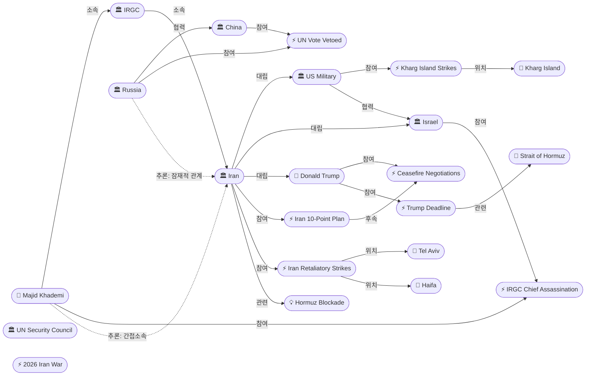
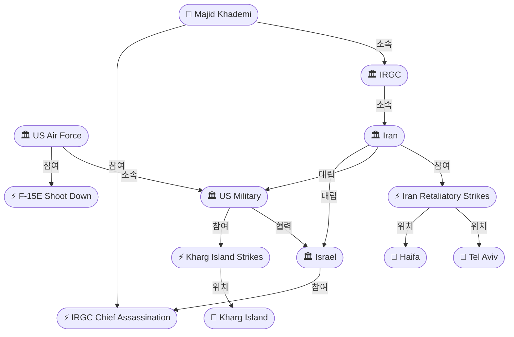
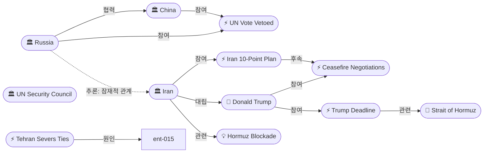

# 2026-04-07 2026 Iran War OSINT 일일 보고서

## 요약

전쟁 39일차, 미군이 이란 최대 원유 수출 거점인 하르그섬에 50개 이상 군사 목표를 공습했으며, 이스라엘은 IRGC 정보수장 Majid Khademi를 사살했다. 트럼프 대통령은 4월 8일 20:00 ET까지 호르무즈 해협을 개방하지 않으면 이란의 모든 교량과 발전소를 파괴하겠다고 최후통첩을 발표했다. 이란은 45일 임시 휴전안을 거부하고 10개항 평화안으로 맞대응했으나 트럼프는 "not good enough"로 일축했다. 러시아와 중국이 UN 안보리에서 호르무즈 재개방 결의안에 거부권을 행사하면서 국제사회의 분열이 심화되고 있다.

## 주요 뉴스

### 1. 미군, 하르그섬 군사시설 대규모 공습
- **출처:** [NBC News](https://www.nbcnews.com/world/iran/live-blog/live-updates-iran-war-trump-deadline-hormuz-infrastructure-ceasefire-rcna267039)
- **일시:** 2026-04-07
- **내용:** 미군이 이란 원유 수출의 90%를 처리하는 하르그섬에서 50개 이상 군사 목표를 타격했다. 미 당국은 석유 시설은 공격 대상이 아니었다고 밝혔으나, 이란 혁명수비대(IRGC)는 "미국과 동맹의 지역 석유·가스를 수년간 차단하겠다"고 경고했다.
- **상태:** 신규
- **관련 엔티티:** US Military, Iran, IRGC, Kharg Island

### 2. 트럼프, 호르무즈 해협 최후통첩 — "전체 문명이 오늘 밤 죽을 수 있다"
- **출처:** [CNN](https://www.cnn.com/2026/04/07/world/live-news/iran-war-trump-us-israel)
- **일시:** 2026-04-07
- **내용:** 트럼프 대통령은 이란이 4월 8일 20:00 ET까지 호르무즈 해협을 재개방하지 않으면 이란의 모든 교량과 발전소를 자정까지 파괴하겠다고 선언했다. "whole civilization will die tonight"이라는 극단적 표현을 사용하며 이란에 압박을 가했다.
- **상태:** 신규
- **관련 엔티티:** Donald Trump, Iran, Strait of Hormuz

### 3. IRGC 정보수장 Majid Khademi 사살
- **출처:** [Al Jazeera](https://www.aljazeera.com/news/2026/4/7/iran-war-what-is-happening-on-day-39-of-us-israeli-attacks)
- **일시:** 2026-04-07
- **내용:** 이스라엘의 새벽 공습으로 IRGC 정보 부서 수장인 Majid Khademi 소장이 사살되었다. 이란은 이에 대한 보복으로 석유 인프라에 대한 자제력이 더 이상 적용되지 않는다고 선언했다.
- **상태:** 신규
- **관련 엔티티:** Israel, IRGC, Majid Khademi

### 4. 이란 10개항 평화안 — 트럼프 "not good enough"
- **출처:** [Axios](https://www.axios.com/2026/04/06/iran-trump-peace-plan-ceasefire)
- **일시:** 2026-04-06
- **내용:** 이란이 미국의 45일 임시 휴전 제안을 거부하고 영구 전쟁 종결을 요구하는 10개항 평화안을 제출했다. 미 관리는 이를 "maximalist"(최대주의적)라고 평가했으며, 트럼프는 "significant하지만 not good enough"라고 논평했다. 2단계 구조(45일 휴전 → 전면 합의)로의 협상이 논의 중이나 전망은 어둡다.
- **상태:** 신규
- **관련 엔티티:** Iran, Donald Trump, Ceasefire Negotiations

### 5. 러시아·중국, UN 안보리 호르무즈 결의안 거부권 행사
- **출처:** [PBS](https://www.pbs.org/newshour/world/russia-and-china-veto-watered-down-un-resolution-aimed-at-reopening-the-strait-of-hormuz)
- **일시:** 2026-04-07
- **내용:** 러시아와 중국이 호르무즈 해협 재개방을 촉구하는 '완화된' UN 안보리 결의안에도 거부권을 행사했다. 이로써 호르무즈 봉쇄에 대한 국제사회의 대응이 사실상 마비된 상태다.
- **상태:** 신규
- **관련 엔티티:** Russia, China, UN Security Council, Strait of Hormuz

### 6. 이란, 이스라엘·걸프 석유시설 보복 공격
- **출처:** [Bloomberg](https://www.bloomberg.com/news/articles/2026-04-07/iran-keeps-up-attacks-before-us-deadline-dimming-peace-chances)
- **일시:** 2026-04-07
- **내용:** 이란이 텔아비브, 하이파, 걸프 지역 석유 정제시설에 미사일과 드론 공격을 감행했다. IRGC는 아랍에미리트 가스 시설과 바레인 석유화학 공장도 공격했다고 발표했다.
- **상태:** 신규
- **관련 엔티티:** Iran, IRGC, Tel Aviv, Haifa

### 7. 이란, 미국과 잔여 외교관계 단절
- **출처:** [Republic World](https://www.republicworld.com/world-news/iran-war-live-tehran-rejects-trumps-tuesday-deadline-on-strait-of-hormuz-trump-vows-strikes-on-irans-infrastructure-live-news)
- **일시:** 2026-04-07
- **내용:** 이란 정부가 미국과의 잔여 외교 채널을 공식 단절했다. 이는 휴전 협상의 직접 소통 경로가 차단됨을 의미하며, 제3국 중재에 전적으로 의존하게 될 전망이다.
- **상태:** 신규
- **관련 엔티티:** Iran, United States

### 8. F-15E 조종사 구출 작전 완료
- **출처:** [CNN](https://www.cnn.com/2026/04/05/world/live-news/iran-war-us-trump-oil)
- **일시:** 2026-04-05
- **내용:** 4월 3일 이란 상공에서 격추된 미 공군 F-15E 스트라이크 이글 전투기의 조종사가 40시간 만에 구출되었다. 무장관제사에 대한 수색은 계속 진행 중이다.
- **상태:** 신규
- **관련 엔티티:** US Air Force, Iran

### 9. 민간인 사망자 3,500명 돌파
- **출처:** [MBC](https://imnews.imbc.com/replay/2026/nwdesk/article/6813078_37004.html)
- **일시:** 2026-04-07
- **내용:** 이란 내 사망자가 3,500명(어린이 최소 244명 포함)을 넘었으며, 주변 걸프 국가 피해자까지 합산하면 약 5,000명에 이를 것으로 추산된다. 민간 시설 추가 공격 시 더 큰 보복을 경고했다.
- **상태:** 신규
- **관련 엔티티:** Iran

### 10. 중국 "호르무즈 막힌 건 미국 때문"
- **출처:** [MBC](https://imnews.imbc.com/replay/2026/nwdesk/article/6812270_37004.html)
- **일시:** 2026-04-07
- **내용:** 중국이 공식적으로 호르무즈 해협 봉쇄의 책임을 미국에 돌렸다. 이는 안보리 거부권 행사와 함께 중국이 이란 편에 가까운 입장을 취하고 있음을 시사한다.
- **상태:** 신규
- **관련 엔티티:** China, United States, Iran, Strait of Hormuz

## 지식그래프

### 오늘의 주요 관계

1. **미국-이스라엘 군사 협력 강화:** US Military와 Israel이 이란에 대한 공동 작전을 계속 수행 중 (하르그섬 공습 + IRGC 수장 사살)
2. **러시아-중국 공조:** UN 안보리에서 공동 거부권 행사로 이란의 호르무즈 봉쇄를 간접 지원
3. **이란의 보복 확대:** 석유 인프라에 대한 자제력 철회 선언, 텔아비브/하이파/걸프 시설 공격
4. **협상 교착:** 이란 10개항 평화안 → 트럼프 거부 → 외교 채널 단절 → 협상 공간 급격히 축소

### 전체 지식그래프 시각화

### 군사 작전 세부 그래프

### 외교/협상 세부 그래프

## 온톨로지 변경

| 변경 유형 | 대상 | 근거 |
|----------|------|------|
| 스키마 초기화 | 5개 클래스, 9개 관계 유형 | config seed로부터 첫 실행 초기화 |
| 새 엔티티 | 26개 (인물 2, 조직 9, 사건 10, 장소 5, 개념 2) | 금일 수집 소스에서 추출 |
| 스키마 확장 | 없음 | 기존 seed 클래스/관계로 충분히 표현 가능 |

## 추론 결과

| 추론 | 신뢰도 | 근거 |
|------|--------|------|
| Majid Khademi → 간접소속 → Iran | 0.855 | Khademi→IRGC, IRGC→Iran 소속 체인 |
| Trump ↔ Iran 잠재적 관계 | 0.80 | 양측 모두 휴전 협상에 참여 (대립적 맥락) |
| Russia → Iran 잠재적 관계 | 0.75 | 안보리 거부권으로 이란 호르무즈 봉쇄 간접 지원 |

## 분석 및 평가

전쟁 6주차에 접어들면서 양측의 에스컬레이션이 가속화되고 있다. 미국은 하르그섬 군사 목표를 집중 타격하며 이란의 핵심 전력 거점을 압박하는 동시에, 트럼프 대통령은 민간 인프라(교량, 발전소)까지 공격 범위를 확대하겠다는 최후통첩을 발표했다. 이스라엘의 IRGC 정보수장 사살은 이란의 지휘 체계에 타격을 가했으나, 이란은 이를 계기로 석유 인프라에 대한 자제력 철회를 선언하며 보복 범위를 확대했다.

외교적으로는 교착 상태가 심화되고 있다. 이란이 영구 종전을 요구하는 10개항 평화안을 제시했으나 트럼프가 이를 거부했고, 이란은 미국과의 잔여 외교 채널마저 단절했다. 러시아-중국의 안보리 거부권 행사는 서방의 다자적 대응을 사실상 봉쇄하면서, 호르무즈 해협 봉쇄의 장기화 가능성을 높이고 있다.

에너지 시장에 대한 충격도 지속되고 있다. 미국 휘발유 가격은 $4.14/갤런으로 전쟁 전 대비 39% 상승했으며, 이란의 걸프 석유시설 보복 공격은 글로벌 에너지 공급에 대한 추가 위협이 되고 있다. 4월 8일 트럼프의 마감시한이 핵심 변수로, 이란이 호르무즈를 개방하지 않을 경우 전면적 인프라 공격으로의 에스컬레이션이 현실화될 수 있다.

## 추적 항목

| 항목 | 최초 보고 | 상태 | 최신 업데이트 |
|------|----------|------|-------------|
| 트럼프 호르무즈 최후통첩 (4/8 20:00 ET) | 2026-04-07 | 활성 | 이란 거부, 마감 임박 |
| 이란 10개항 평화안 | 2026-04-07 | 활성 | 트럼프 "not good enough" |
| 호르무즈 해협 봉쇄 | 2026-04-07 | 활성 | 러시아/중국 안보리 거부권, 봉쇄 지속 |
| IRGC 정보수장 사살 후 보복 | 2026-04-07 | 활성 | 이란 석유 인프라 자제력 철회 선언 |
| F-15E 무장관제사 수색 | 2026-04-07 | 활성 | 조종사 구출 완료, 무장관제사 수색 중 |
| 민간인 피해 (3,500명+) | 2026-04-07 | 활성 | 사망자 증가 추세 |
| 이란-미국 외교 단절 | 2026-04-07 | 활성 | 직접 소통 채널 차단 |

## 동향 요약

| 분류 | 상태 | 비고 |
|------|------|------|
| 군사 작전 | 에스컬레이션 | 하르그섬 공습, IRGC 수장 사살, 이란 보복 공격 |
| 휴전 협상 | 교착 | 양측 조건 괴리, 외교 채널 단절 |
| 호르무즈 봉쇄 | 지속 | 안보리 거부권, 이란 봉쇄 유지 강행 |
| 에너지 시장 | 위기 심화 | 유가 상승, 걸프 석유시설 공격 |
| 국제 정세 | 분열 | 러시아·중국 vs 미국·이스라엘 구도 |
| 인도주의 | 악화 | 사망자 3,500명+, 인프라 파괴 위협 |

## 출처 목록

1. [Iran war: What is happening on day 39 of US-Israeli attacks?](https://www.aljazeera.com/news/2026/4/7/iran-war-what-is-happening-on-day-39-of-us-israeli-attacks) - Al Jazeera, 2026-04-07
2. [Live updates: Iran war; Trump warns 'entire country' could be taken out](https://www.cnn.com/2026/04/07/world/live-news/iran-war-trump-us-israel) - CNN, 2026-04-07
3. [Iran war updates: Ceasefire response 'not good enough', says Trump](https://www.aljazeera.com/news/liveblog/2026/4/6/iran-war-live-tehran-rejects-trumps-tuesday-deadline-on-strait-of-hormuz) - Al Jazeera, 2026-04-06
4. [Iran rejects a U.S. ceasefire plan as Trump again threatens to bomb its infrastructure](https://www.npr.org/2026/04/06/nx-s1-5775383/iran-war-updates) - NPR, 2026-04-06
5. [Day 38 of Middle East conflict](https://www.cnn.com/2026/04/06/world/live-news/iran-war-us-trump-oil) - CNN, 2026-04-06
6. [Trump warns of 'critical period' in Iran war](https://www.cbsnews.com/live-updates/iran-war-trump-deadline-power-plants-bridges-ceasefire-push-air-force-rescue/) - CBS News, 2026-04-06
7. [U.S. strikes Kharg Island](https://www.nbcnews.com/world/iran/live-blog/live-updates-iran-war-trump-deadline-hormuz-infrastructure-ceasefire-rcna267039) - NBC News, 2026-04-07
8. [Trump says Iran could be 'taken out in one night'](https://www.cnn.com/2026/04/05/middleeast/iran-us-israel-war-what-we-know-week-6-intl-hnk) - CNN, 2026-04-05
9. [Iran sends 'maximalist' peace plan response](https://www.axios.com/2026/04/06/iran-trump-peace-plan-ceasefire) - Axios, 2026-04-06
10. [What's Iran's 10-point peace plan?](https://www.aljazeera.com/news/2026/4/7/whats-irans-10-point-peace-plan-that-trump-says-is-not-good-enough) - Al Jazeera, 2026-04-07
11. [Iran Launches New Attacks as Trump's Ceasefire Deadline Approaches](https://www.bloomberg.com/news/articles/2026-04-07/iran-keeps-up-attacks-before-us-deadline-dimming-peace-chances) - Bloomberg, 2026-04-07
12. [Russia and China veto UN resolution on Hormuz](https://www.pbs.org/newshour/world/russia-and-china-veto-watered-down-un-resolution-aimed-at-reopening-the-strait-of-hormuz) - PBS, 2026-04-07
13. [Iran defiant on eve of Trump's ceasefire deadline](https://www.al-monitor.com/originals/2026/04/iran-defiant-eve-trumps-ceasefire-deadline) - Al-Monitor, 2026-04-07
14. [US has struck Iranian military targets on Kharg Island](https://www.cnn.com/2026/04/07/middleeast/kharg-island-us-assault-risk-trump-intl) - CNN, 2026-04-07
15. [Tehran Severs Remaining Diplomatic Ties With US](https://www.republicworld.com/world-news/iran-war-live-tehran-rejects-trumps-tuesday-deadline-on-strait-of-hormuz-trump-vows-strikes-on-irans-infrastructure-live-news) - Republic World, 2026-04-07
16. [US forces rescue crew member from F-15 jet shot down over Iran](https://www.cnn.com/2026/04/05/world/live-news/iran-war-us-trump-oil) - CNN, 2026-04-05
17. [미국·이란, 필사적인 조종사 수색 작전](https://www.ytn.co.kr/_ln/0104_202604051056213990) - YTN, 2026-04-05
18. [미군, 이란 하르그섬 군시설 공격](https://imnews.imbc.com/news/2026/world/article/6813396_36925.html) - MBC, 2026-04-07
19. [이란, 일시적 휴전 거부…호르무즈 해협 봉쇄 유지 강행](https://www.g-enews.com/article/Global-Biz/2026/04/202604061812022772e250e8e188_1) - 글로벌이코노믹, 2026-04-06
20. [전쟁 5주째 완강한 이란…'미국이 밀리고 있다'](https://www.mindlenews.com/news/articleView.html?idxno=19346) - 민들레, 2026-04-05
21. [美 정보당국 '이란 호르무즈 봉쇄 해제 가능성 낮다'](https://www.seoul.co.kr/news/international/USA-amrica/2026/04/04/20260404500024) - 서울신문, 2026-04-04
22. [민간 시설 또 공격하면 더 큰 보복](https://imnews.imbc.com/replay/2026/nwdesk/article/6813078_37004.html) - MBC, 2026-04-07
23. ['Every Bridge in Iran Will Be Decimated'](https://time.com/article/2026/04/06/iran-rejects-ceasefire-as-trump-deadline-looms-and-strikes-escalate/) - Time, 2026-04-06
24. [중국 '호르무즈 막힌 건 미국 때문'](https://imnews.imbc.com/replay/2026/nwdesk/article/6812270_37004.html) - MBC, 2026-04-07
25. [이란, 걸프국 빅테크 기업 공격](https://www.ytn.co.kr/_ln/0104_202604031542172077) - YTN, 2026-04-03
