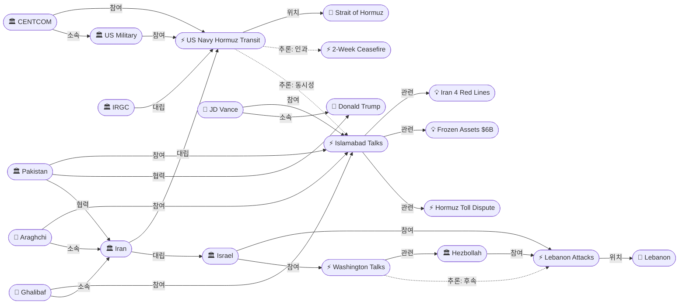
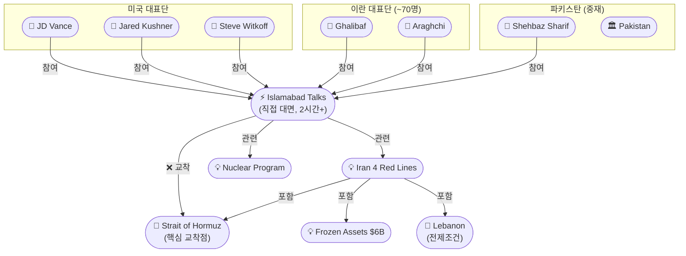
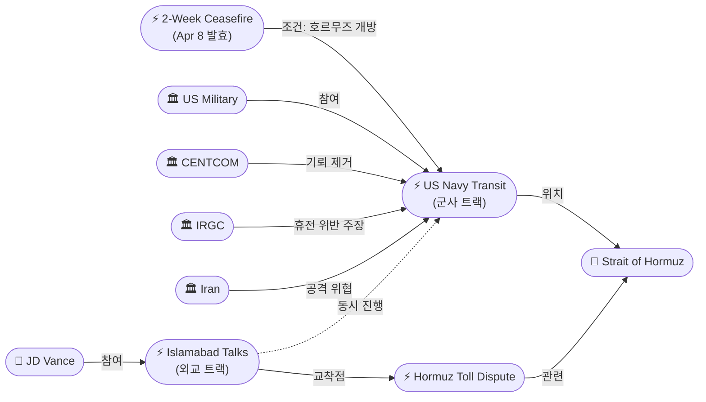

# 2026-04-11 2026 Iran War OSINT 일일 보고서

## 요약

전쟁 43일차(휴전 4일차), 이슬라마바드에서 1979년 이슬람 혁명 이후 47년 만에 미국과 이란의 최초 직접 대면 평화회담이 시작되었다. 밴스 부통령과 갈리바프·아라그치가 이끄는 이란 대표단이 수시간에 걸친 협상에 돌입했으나, 호르무즈 해협이 핵심 교착점으로 부상했다. 동시에 미해군 구축함 2척이 전쟁 이래 최초로 호르무즈 해협을 통과하며 기뢰 제거 작전을 개시했고, 이란은 이를 휴전 위반으로 규정했다. 레바논에서는 이스라엘이 헤즈볼라 휴전을 공식 거부하면서 4월 11일에도 10명이 추가 사망했으며, 4월 8일 공습 사망자 수는 357명으로 상향 조정되었다.

## 주요 뉴스

### 1. 이슬라마바드 협상 개시 — 47년 만의 미-이란 최초 직접 대면
- **출처:** [Al Jazeera](https://www.aljazeera.com/news/2026/4/11/us-iran-talks-on-ending-war-begin-in-pakistan), [CNN](https://www.cnn.com/2026/04/11/world/live-news/iran-us-war-talks), [NPR](https://www.npr.org/2026/04/11/nx-s1-5781760/pakistan-hosts-peace-talks-us-iran)
- **일시:** 2026-04-11
- **내용:** JD 밴스 미국 부통령, 윗코프 중동특사, 쿠슈너가 이끄는 미국 대표단과 갈리바프 의회의장, 아라그치 외무장관이 이끄는 약 70명의 이란 대표단이 이슬라마바드 세레나 호텔에서 직접 대면 협상을 개시했다. 당초 '근접 협상(proximate talks)' 형식이었으나 파키스탄 중재단이 동석한 가운데 직접 대면으로 전환되었다. 첫 라운드는 약 2시간 진행 후 휴식에 들어갔고, 협상은 일요일 새벽까지 계속되었다. 파키스탄 소식통에 따르면 전체적인 톤은 긍정적이나 호르무즈 해협 통제권에서 교착 상태가 지속되고 있다. 트럼프 대통령은 "매우 깊은(very deep) 협상 중"이라며 "결과가 어떻든 우리가 이긴다"고 밝혔다. 이란 매체는 "구체적 실무 논의 단계에 접어들었다"며 하루 연장 가능성을 시사했다.
- **상태:** 업데이트 ← 2026-04-10 "이슬라마바드 평화회담 개시"
- **관련 엔티티:** JD Vance, Abbas Araghchi, Mohammad Bagher Ghalibaf, Jared Kushner, Steve Witkoff, Pakistan, Shehbaz Sharif, Donald Trump

### 2. 이란, 4대 레드라인 공식 제시 — 호르무즈 주권, 동결자산, 배상금, 지역 휴전
- **출처:** [Times of Israel](https://www.timesofisrael.com/us-iran-talks-begin-in-pakistan-tehran-demands-control-of-hormuz-truce-in-lebanon/), [헤럴드경제](https://biz.heraldcorp.com/article/10715063)
- **일시:** 2026-04-11
- **내용:** 이란은 협상 개시에 앞서 파키스탄 총리에게 4대 레드라인을 전달했다: (1) 호르무즈 해협 주권/통제권, (2) 동결 자산 60억 달러 해제, (3) 전쟁 배상금, (4) 레바논을 포함한 지역 전면 휴전. 이란 Press TV는 이 레드라인이 협상의 전제조건이라고 보도했다. 이란 측 소식통은 미국이 호르무즈와 여러 쟁점에서 "수용 불가한 요구(unacceptable demands)"를 했다고 밝혔다.
- **상태:** 신규
- **관련 엔티티:** Iran, Strait of Hormuz, Frozen Assets ($6B), Lebanon, Iran 4 Red Lines

### 3. 미해군 구축함 2척, 전쟁 이래 최초로 호르무즈 해협 통과 — 기뢰 제거 개시
- **출처:** [Axios](https://www.axios.com/2026/04/11/us-iran-navy-strait-of-hormuz), [Al Jazeera](https://www.aljazeera.com/news/2026/4/11/us-says-two-naval-ships-transited-strait-of-hormuz-for-mine-clearing), [USNI News](https://news.usni.org/2026/04/11/two-u-s-warships-sail-through-strait-of-hormuz-to-establish-new-route-for-merchant-ships)
- **일시:** 2026-04-11
- **내용:** 알리 버크급 유도미사일 구축함 USS Frank E. Peterson과 USS Michael Murphy가 전쟁 시작(2월 28일) 이래 최초로 호르무즈 해협을 통과했다. CENTCOM(미 중부사령부)은 "기뢰 제거 조건 설정을 위한 작전"이라고 발표하고, 수중 드론 등 추가 전력이 투입될 예정이라고 밝혔다. 그러나 이란 정부는 이를 휴전 위반으로 규정하고 선박에 대한 공격을 위협했다. 한편 Fortune은 지역 정보 소식통을 인용해 두 구축함이 IRGC의 위협에 직면해 회항했다는 상반된 보도를 전했다.
- **상태:** 신규
- **관련 엔티티:** US Military, CENTCOM, IRGC, Strait of Hormuz

### 4. 이스라엘, 헤즈볼라 휴전 공식 거부 — 레바논 공격 계속, 4/11 10명 추가 사망
- **출처:** [Al Jazeera](https://www.aljazeera.com/news/2026/4/11/israel-rejects-ceasefire-with-hezbollah-ahead-of-lebanon-talks-next-week)
- **일시:** 2026-04-11
- **내용:** 이스라엘은 다음 주 워싱턴에서 열릴 레바논 회담에 앞서 헤즈볼라와의 휴전을 공식 거부했다. 4월 11일에도 레바논 남부에서 최소 10명이 이스라엘 공격으로 사망했으며, 그중 3명은 응급대원이었다. 4월 8일 '검은 수요일(Black Wednesday)' 공습의 사망자 수는 기존 254명에서 357명으로 상향 조정되었다. 이스라엘과 레바논 대사는 금요일 밤 워싱턴 국무부에서 화요일(4/15) 회담을 위한 사전 협의를 진행했다.
- **상태:** 업데이트 ← 2026-04-10 "이스라엘 레바논 공습"
- **관련 엔티티:** Israel, Hezbollah, Lebanon, Israel-Lebanon Washington Talks

### 5. 호르무즈 해협, 이슬라마바드 협상의 핵심 교착점으로 확인
- **출처:** [Haaretz](https://www.haaretz.com/israel-news/israel-security/2026-04-11/ty-article-live/report-iran-still-has-thousands-of-missiles-launchers-in-underground-sites/0000019d-7a72-de10-afdf-7a7e24580000), [CBS News](https://www.cbsnews.com/live-updates/iran-war-trump-strait-of-hormuz-israel-ceasefire-talks/)
- **일시:** 2026-04-11
- **내용:** 하레츠는 호르무즈 해협이 이슬라마바드 협상에서 "심각한 이견(serious disagreement)"의 핵심이라고 보도했다. 이란은 해협에 대한 "완전한 주권"을 주장하며 선박 통행료 징수 권리를 요구하고 있고, 미국은 "무제한, 통행료 없는" 개방을 요구하고 있다. 별도 보도에 따르면 이란은 여전히 지하 시설에 수천 개의 미사일과 발사대를 보유하고 있다.
- **상태:** 업데이트 ← 2026-04-10 "호르무즈 통행료 분쟁"
- **관련 엔티티:** Strait of Hormuz, Iran, Islamabad Peace Talks, Hormuz Toll Dispute

## 지식그래프

### 오늘의 주요 관계

1. **47년 만의 직접 대면:** Vance(US) ↔ Ghalibaf·Araghchi(Iran) — 1979년 이후 최초, 직접 대면으로 전환
2. **외교-군사 이중 트랙:** 이슬라마바드 협상 ↔ 미해군 호르무즈 통과 — 동시 진행
3. **이란 4대 레드라인:** 호르무즈 주권, 동결자산 $6B, 배상금, 지역 전면 휴전
4. **레바논 = 해결 불가 난제:** 이스라엘 휴전 거부 → 4/11 추가 사망 → 이란 전제조건 충족 불가
5. **호르무즈 교착 확인:** 협상의 "serious disagreement" — 양측 입장 평행선

### 전체 지식그래프 시각화

### 이슬라마바드 협상 — 의제와 교착점

### 호르무즈 이중 트랙 — 외교 + 군사

## 온톨로지 변경

| 변경 유형 | 대상 | 근거 |
|----------|------|------|
| 새 엔티티 (사건) | US Navy Hormuz Transit (Apr 11) | 전쟁 이래 최초 미해군 호르무즈 통과 — 기뢰 제거 및 상선 항로 개척 |
| 새 엔티티 (조직) | CENTCOM (US Central Command) | 호르무즈 작전 지휘 주체 |
| 새 엔티티 (사건) | Israel-Lebanon Washington Talks (planned) | 4/15 워싱턴 국무부 회담 예고 |
| 새 엔티티 (개념) | Iran 4 Red Lines | 이슬라마바드 협상의 이란측 전제조건 4개 항 |
| 새 엔티티 (개념) | Frozen Assets ($6B) | 이란 요구사항 — 60억 달러 동결자산 해제 |
| 기존 업데이트 | Israel Lebanon Attacks | 사망자 수 254 → 357명 상향, 4/11 추가 10명 사망 |
| 기존 업데이트 | Islamabad Peace Talks | "예정" → "진행 중", 직접 대면 확인, 호르무즈 교착 |
| 스키마 확장 | 없음 | 기존 클래스/관계로 충분히 표현 가능 |

## 추론 결과

| 추론 | 신뢰도 | 근거 |
|------|--------|------|
| US Navy Transit ← 2-Week Ceasefire (인과) | 0.80 | 휴전 조건(호르무즈 개방) 이행을 위한 군사적 실행 |
| US Navy Transit ↔ Islamabad Talks (동시성) | 0.75 | 외교 협상과 군사 작전의 이중 트랙 병행 |
| CENTCOM → Trump 간접 소속 | 0.81 | CENTCOM → US Military → 대통령 통수권 체인 |
| Washington Talks → Lebanon Attacks (후속) | 0.78 | 4/8 레바논 공습의 외교적 후속 조치 |

## 분석 및 평가

4월 11일은 전쟁의 가장 중요한 전환점이다. 세 가지 동시 진행 중인 드라마가 향후 전쟁의 방향을 결정할 것이다.

**전환점 — 47년 만의 대면:** 1979년 이슬람 혁명 이후 최초로 미국과 이란이 직접 대면 협상에 들어갔다. 밴스 부통령급, 갈리바프 의회의장급이라는 높은 격의 대표단 구성은 양측 모두 이 협상을 진지하게 접근하고 있음을 보여준다. 이란이 70명 규모의 대표단(기술 전문가, 중앙은행 총재 포함)을 파견한 것은 군사뿐 아니라 경제 의제까지 포괄하려는 의지다. 이란 매체가 "구체적 실무 논의 단계"를 언급하고 연장 가능성을 시사한 것은 협상이 최소한 완전한 결렬은 아님을 뜻한다.

**위기 — 호르무즈 이중 트랙:** 가장 주목할 만한 것은 미국의 이중 트랙 전략이다. 밴스가 이슬라마바드에서 이란과 호르무즈 개방을 논의하는 바로 그 시간에, 약 2,000마일 떨어진 호르무즈에서 미해군 구축함 2척이 전쟁 이래 처음으로 해협을 통과하며 기뢰 제거를 시작했다. 이것은 "협상이 실패하면 군사적으로 해협을 열겠다"는 메시지이자, 이란의 해협 주권 주장에 대한 직접적 도전이다. 이란이 이를 "휴전 위반"으로 규정한 것은 호르무즈가 단순 협상 의제가 아니라 양측의 핵심 전략적 이해가 충돌하는 지점임을 확인해준다.

**위기 지속 — 레바논 블랙홀:** 이스라엘이 헤즈볼라 휴전을 공식 거부하고 4월 11일에도 레바논에서 10명을 추가로 살해한 것은 이란의 4대 레드라인 중 하나(지역 전면 휴전)를 정면으로 충돌시킨다. 4/8 사망자가 357명으로 상향 조정된 것은 공격의 규모가 당초 알려진 것보다 컸음을 보여준다. 이스라엘이 워싱턴에서 레바논과 회담(4/15)에 합의하면서도 군사 작전은 중단하지 않는 이중 전략은, 이란-미국 이슬라마바드 협상의 성공 가능성을 근본적으로 제약한다.

**핵심 전망:** 이슬라마바드 협상은 일요일로 연장될 가능성이 있다. 이란의 4대 레드라인과 미국의 요구(호르무즈 무조건 개방, 핵 포기) 사이의 간극이 좁혀지지 않으면, 2주 휴전 만료(4/22) 전에 추가 위기가 발생할 수 있다. 미해군의 호르무즈 통과는 휴전이 유지되더라도 해협의 통제권 다툼이 군사적 충돌로 비화할 수 있음을 시사한다.

## 추적 항목

| 항목 | 최초 보고 | 상태 | 최신 업데이트 |
|------|----------|------|-------------|
| **이슬라마바드 평화회담** | 2026-04-10 | **활성 — 진행 중** | 47년 만 직접 대면 확인, 2시간+ 첫 라운드, 호르무즈 교착, 일요일 연장 가능 |
| **미해군 호르무즈 통과** | 2026-04-11 | **신규 — 핵심** | 구축함 2척 최초 통과, 기뢰 제거 개시, 이란 "휴전 위반" 주장 |
| **이란 4대 레드라인** | 2026-04-11 | **신규 — 핵심** | 호르무즈 주권, 동결자산 $6B, 배상금, 지역 전면 휴전 |
| **이스라엘 레바논 공습** | 2026-04-10 | **활성 — 악화** | 4/8 사망자 357명 상향, 4/11 추가 10명 사망, 헤즈볼라 휴전 공식 거부 |
| **이스라엘-레바논 워싱턴 회담** | 2026-04-11 | **신규** | 4/15 국무부 회담 예정, 대사급 사전 협의 완료 |
| **호르무즈 통행료 분쟁** | 2026-04-10 | **활성 — 교착** | 이슬라마바드에서 "심각한 이견" 확인, 이란 주권 vs 미국 무조건 개방 |
| 2주 휴전 합의 | 2026-04-07 | 활성 — 위기 | 미해군 통과를 이란이 위반으로 규정, 레바논 공격 계속 |
| 파키스탄 중재 역할 | 2026-04-07 | 활성 — 격상 | 이슬라마바드 회담 공식 개최, 중재 성공 |
| 이란 10개항 평화안 | 2026-04-07 | 활성 | 4대 레드라인으로 구체화 |
| 이란-미국 외교 단절 | 2026-04-07 | **해소 중** | 47년 만 직접 대면 달성 |
| 민간인 피해 | 2026-04-07 | 악화 | 레바논 357명+ (수정치) + 4/11 추가 10명 |

## 동향 요약

| 분류 | 상태 | 비고 |
|------|------|------|
| 군사 작전 | 휴전 중 + 호르무즈 작전 + 레바논 공격 | 이란 대상 공격 중단, 미해군 호르무즈 기뢰 제거, 이스라엘 레바논 계속 |
| 휴전 이행 | **위기 심화** | 미해군 통과에 이란 "위반" 주장, 레바논 공격 계속, 호르무즈 미개방 |
| 외교 | **역사적 전환점** | 47년 만 직접 대면, 긍정적 톤이나 호르무즈 교착 |
| 호르무즈 봉쇄 | **이중 트랙** | 외교(이슬라마바드) + 군사(기뢰 제거) 동시 진행 |
| 에너지 시장 | 위기 지속 | 호르무즈 교착, 한국 선박 26척 발묶임, 상선 항로 미확보 |
| 국제 정세 | 외교 집중 | 이슬라마바드 협상에 세계 주목 |
| 인도주의 | 악화 | 레바논 357명+(수정) + 4/11 10명 추가, 응급대원 3명 사망 |

## 출처 목록

1. [US-Iran direct talks on ending war under way in Pakistan](https://www.aljazeera.com/news/2026/4/11/us-iran-talks-on-ending-war-begin-in-pakistan) - Al Jazeera, 2026-04-11
2. [Live updates: Iran war news as Vance and Iranian officials meet](https://www.cnn.com/2026/04/11/world/live-news/iran-us-war-talks) - CNN, 2026-04-11
3. [Live Updates: Vance in high-stakes talks as Navy ships cross Hormuz](https://www.cbsnews.com/live-updates/iran-war-trump-strait-of-hormuz-israel-ceasefire-talks/) - CBS News, 2026-04-11
4. [U.S.-Iran talks underway in Islamabad after delegations arrive](https://www.cnbc.com/2026/04/11/us-iran-talks-set-to-begin-in-islamabad-after-delegations-arrive.html) - CNBC, 2026-04-11
5. [U.S.-Iran peace talks underway in Islamabad](https://www.npr.org/2026/04/11/nx-s1-5781760/pakistan-hosts-peace-talks-us-iran) - NPR, 2026-04-11
6. [U.S. warships cross Strait of Hormuz for first time since Iran war began](https://www.axios.com/2026/04/11/us-iran-navy-strait-of-hormuz) - Axios, 2026-04-11
7. [US says two naval ships transited Strait of Hormuz for mine-clearing](https://www.aljazeera.com/news/2026/4/11/us-says-two-naval-ships-transited-strait-of-hormuz-for-mine-clearing) - Al Jazeera, 2026-04-11
8. [U.S. Navy attempts to cross Hormuz; accounts differ](https://fortune.com/2026/04/11/us-navy-ships-strait-of-hormuz-crossing-ceasefire-talks-pakistan/) - Fortune, 2026-04-11
9. [Two U.S. Warships Sail Through Hormuz to Establish Merchant Route](https://news.usni.org/2026/04/11/two-u-s-warships-sail-through-strait-of-hormuz-to-establish-new-route-for-merchant-ships) - USNI News, 2026-04-11
10. [Israel rejects ceasefire with Hezbollah before Lebanon talks next week](https://www.aljazeera.com/news/2026/4/11/israel-rejects-ceasefire-with-hezbollah-ahead-of-lebanon-talks-next-week) - Al Jazeera, 2026-04-11
11. [US, Iran hold direct talks; Tehran demands Hormuz control, Lebanon truce](https://www.timesofisrael.com/us-iran-talks-begin-in-pakistan-tehran-demands-control-of-hormuz-truce-in-lebanon/) - Times of Israel, 2026-04-11
12. [Iran war live: Trump says US in 'very deep' negotiations](https://www.aljazeera.com/news/liveblog/2026/4/11/iran-war-live-us-negotiators-due-to-arrive-in-pakistan-for-ceasefire-talks) - Al Jazeera, 2026-04-11
13. [U.S., Iran seek path to end war in Islamabad talks](https://www.washingtonpost.com/world/2026/04/11/us-iran-islamabad-hormuz-ceasefire/) - Washington Post, 2026-04-11
14. [Hormuz 'serious disagreement' in Islamabad Talks](https://www.haaretz.com/israel-news/israel-security/2026-04-11/ty-article-live/report-iran-still-has-thousands-of-missiles-launchers-in-underground-sites/0000019d-7a72-de10-afdf-7a7e24580000) - Haaretz, 2026-04-11
15. [미·이란, 47년 만의 대면‥'이슬라마바드 협상' 곧 시작](https://imnews.imbc.com/replay/2026/nwdesk/article/6814452_37004.html) - MBC, 2026-04-11
16. [美-이란, 개전 43일 만에 첫 담판…종전 협상 개시](https://www.seoul.co.kr/news/international/2026/04/11/20260411500049) - 서울신문, 2026-04-11
17. [[속보] 美·이란, 협상 개시…이란 4대 레드라인 제시](https://biz.heraldcorp.com/article/10715063) - 헤럴드경제, 2026-04-11
18. [이란 "美와 협상, 구체적 실무 논의 단계…하루 연장될 수도"](https://www.news1.kr/world/middleeast-africa/6133305) - 뉴스1, 2026-04-11
19. [US says warships transit Hormuz in mine clearance op](https://www.al-monitor.com/originals/2026/04/us-says-warships-transit-strait-hormuz-mine-clearance-op) - Al-Monitor, 2026-04-11
20. [US Navy Ships Crossed Hormuz on Saturday](https://www.bloomberg.com/news/articles/2026-04-11/us-navy-ships-crossed-strait-of-hormuz-on-saturday-axios-says) - Bloomberg, 2026-04-11
