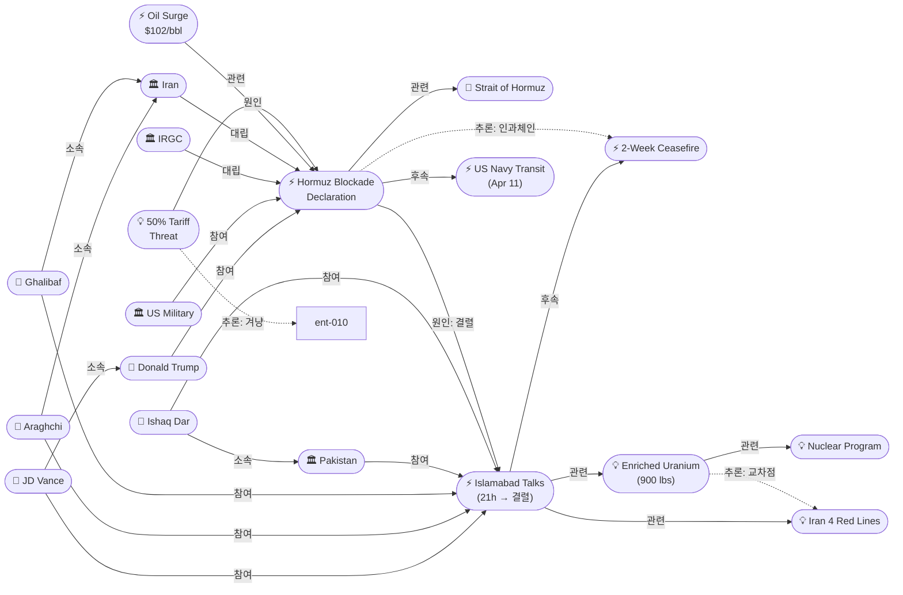
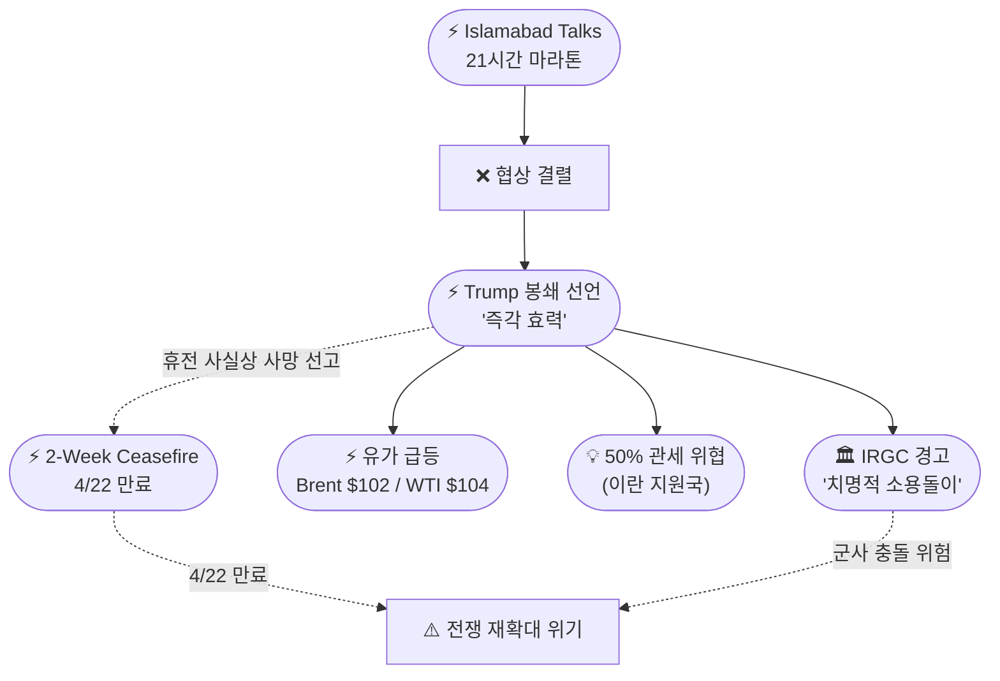
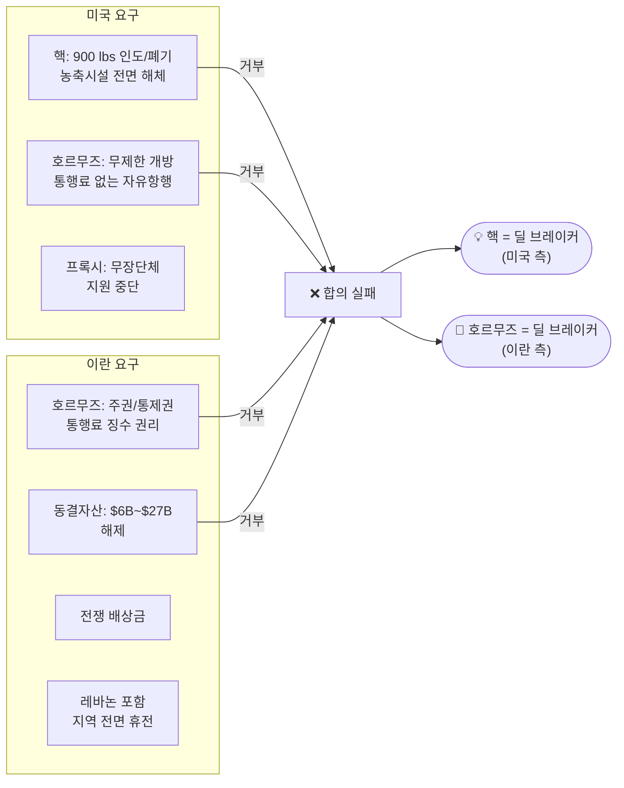

# 2026-04-12 2026 Iran War OSINT 일일 보고서

## 요약

전쟁 44일차(휴전 5일차), 이슬라마바드에서 21시간에 걸친 마라톤 협상이 합의 없이 결렬되었다. 밴스 부통령은 이란이 핵무기 포기 약속을 거부했다고 발표했고, 이란은 호르무즈 해협과 여러 쟁점에서 미국의 요구가 "수용 불가"했다고 반박했다. 협상 결렬 수시간 후 트럼프 대통령은 트루스소셜을 통해 호르무즈 해협에 대한 즉각적이고 전면적인 해상 봉쇄를 선언했으며, 이란에 통행료를 납부한 선박의 차단과 이란 지원국에 대한 50% 관세 부과를 예고했다. IRGC는 "미군 함정을 치명적 소용돌이에 빠뜨리겠다"고 경고했고, 유가는 브렌트 $102(+8%), WTI $104(+8%)로 급등했다. 파키스탄 이샤크 다르 외무장관은 추가 대화를 촉구하며 중재 의지를 재확인했다.

## 주요 뉴스

### 1. 이슬라마바드 21시간 마라톤 협상 결렬 — 47년 만의 대면, 합의 없이 종료
- **출처:** [Al Jazeera](https://www.aljazeera.com/news/2026/4/12/us-and-iran-fail-to-reach-peace-deal-after-marathon-talks-in-pakistan), [NPR](https://www.npr.org/2026/04/12/nx-s1-5782538/u-s-iran-peace-talks-islamabad-collapse), [Time](https://time.com/article/2026/04/11/strait-of-hormuz-iran-peace-talks/)
- **일시:** 2026-04-12 (일요일 새벽 종료)
- **내용:** 4월 11일 오후부터 12일 새벽까지 21시간에 걸친 마라톤 협상이 합의 없이 끝났다. 밴스 부통령은 "이란이 미국의 평화 조건을 거부했다"며, 핵심 쟁점은 핵이라고 밝혔다. 트럼프는 "대부분의 포인트에서 합의했지만, 유일하게 중요한 포인트인 핵(NUCLEAR)에서는 합의하지 못했다"고 소셜미디어에 게시했다. 미국은 이스파한에 보관 중인 약 900파운드(400kg)의 고농축 우라늄 인도 또는 폐기, 모든 농축 시설 해체를 요구했으나 이란이 거부했다. 갈리바프 의회의장은 이란이 "전향적(forward-looking) 이니셔티브"를 제시했으나 미국이 신뢰를 얻지 못했다고 반박했다. 이란 외무부 대변인 바가에이는 "일부 사안에서는 합의에 도달했지만, 호르무즈 해협 등 핵심 쟁점에서 간극이 남아 있다"고 밝혔다.
- **상태:** 업데이트 ← 2026-04-11 "이슬라마바드 협상 개시"
- **관련 엔티티:** JD Vance, Mohammad Bagher Ghalibaf, Abbas Araghchi, Donald Trump, Esmail Baghaei, Pakistan, Islamabad Peace Talks

### 2. 트럼프, 호르무즈 해상 봉쇄 즉각 선언 — "모든 선박 차단, 기뢰 제거, 이란 지원국 50% 관세"
- **출처:** [Axios](https://www.axios.com/2026/04/12/trump-naval-blockade-iran-strait-hormuz-peace-talks), [CNBC](https://www.cnbc.com/2026/04/12/trump-iran-war-strait-of-hormuz.html), [Al Jazeera](https://www.aljazeera.com/news/2026/4/12/trump-announces-strait-of-hormuz-blockade-after-us-iran-peace-talks-end)
- **일시:** 2026-04-12
- **내용:** 협상 결렬 수시간 후 트럼프 대통령은 트루스소셜에 "효력 즉시, 미 해군은 호르무즈 해협에 진입하거나 떠나려는 일체의 선박에 대해 봉쇄를 개시할 것"이라고 게시했다. "완전한 봉쇄, 전부 아니면 전무(all or none)"이며 이란이 굴복할 때까지 어떤 선박도 통과시키지 않겠다고 밝혔다. 동시에 해군에 "이란에 통행료를 지불한 모든 선박을 국제 해역에서 수색·차단"하도록 지시했고, 이란이 해협에 부설한 기뢰 제거를 명령했다. 또한 이란을 지원하는 모든 국가(중국 포함 가능성)에 50% 관세를 부과하겠다고 위협했다.
- **상태:** 신규
- **관련 엔티티:** Donald Trump, US Military, Strait of Hormuz, Iran, 50% Tariff Threat

### 3. 3대 핵심 쟁점 확인 — 핵(농축 우라늄 400kg), 호르무즈 통제, 동결자산
- **출처:** [Al Jazeera](https://www.aljazeera.com/news/2026/4/12/us-iran-ceasefire-talks-what-are-the-key-sticking-points), [PBS](https://www.pbs.org/newshour/world/failed-u-s-iran-negotiations-in-pakistan-raise-questions-about-fragile-ceasefire), [파이낸셜뉴스](https://www.fnnews.com/news/202604121827386366)
- **일시:** 2026-04-12
- **내용:** 21시간 협상의 최종 교착 지점이 구체적으로 드러났다. (1) **핵**: 미국은 이스파한의 약 900파운드(400kg) 고농축 우라늄 인도/폐기와 모든 농축 시설 해체를 요구, 이란은 민간용 핵 프로그램 권리를 주장하며 거부. (2) **호르무즈**: 미국은 "무제한, 통행료 없는" 개방을, 이란은 해협 주권과 통행료 징수권을 주장. (3) **동결자산**: 이란은 약 60억~270억 달러(보도에 따라 차이) 규모의 해외 동결자산 해제를 요구. 흥미롭게도 양측이 결렬의 핵심 사유를 다르게 프레이밍했다 — 미국은 "핵", 이란은 "호르무즈"를 지목했다.
- **상태:** 신규
- **관련 엔티티:** Nuclear Program, Enriched Uranium Issue, Strait of Hormuz, Frozen Assets ($6B), Iran 4 Red Lines

### 4. IRGC, "치명적 소용돌이에 빠뜨리겠다" — 미군 봉쇄에 강경 경고
- **출처:** [Al Jazeera](https://www.aljazeera.com/news/liveblog/2026/4/12/iran-war-live-historic-face-to-face-talks-with-us-continue-in-islamabad), [NBC News](https://www.nbcnews.com/world/iran/live-blog/live-updates-us-iran-fail-reach-deal-peace-talks-day-negotiations-rcna315918)
- **일시:** 2026-04-12
- **내용:** IRGC 해군은 트럼프의 봉쇄 선언 직후 "잘못된 움직임은 적을 해협의 치명적 소용돌이(deadly currents)에 빠뜨릴 것"이라고 경고했다. IRGC는 호르무즈 해협이 민간 선박에는 개방되어 있으나, 군사 선박에는 "가혹하고 단호한(harshly and decisively) 대응"을 할 것이라고 밝혔다. 이란 협상단의 수장은 "트럼프의 위협은 아무것도 아니다. 우리는 미국에 새로운 교훈을 줄 준비가 되어 있다"고 말했다. IRGC는 호르무즈 해협 감시 영상도 공개했다.
- **상태:** 신규
- **관련 엔티티:** IRGC, US Military, Strait of Hormuz, Trump Hormuz Naval Blockade Declaration

### 5. 유가 급등 — 브렌트 $102(+8%), WTI $104(+8%), 미국 휘발유 $4.12
- **출처:** [Bloomberg](https://www.bloomberg.com/news/articles/2026-04-12/oil-surges-us-futures-drop-on-hormuz-blockade-markets-wrap), [CNN](https://www.cnn.com/2026/04/12/world/live-news/iran-us-war-talks-trump)
- **일시:** 2026-04-12
- **내용:** 트럼프의 봉쇄 선언 직후 국제 유가가 급등했다. 브렌트유는 약 $102(+8%), WTI는 약 $104(+8%)로 다시 배럴당 $100을 돌파했다. 미국 내 휘발유 평균 가격은 갤런당 $4.12로, 전쟁 개시 이래 38% 상승했다. 미국 주식선물지수도 하락했다. 봉쇄가 실제로 이행될 경우 글로벌 에너지 시장의 추가 충격이 불가피하다.
- **상태:** 신규
- **관련 엔티티:** Oil Price Surge (Apr 12), Trump Hormuz Naval Blockade Declaration, Strait of Hormuz

### 6. 파키스탄, "협상은 끝나지 않았다" — 이샤크 다르, 추가 대화 촉구
- **출처:** [ProPakistani](https://propakistani.pk/2026/04/12/ishaq-dar-says-pakistan-keeping-talks-alive-after-us-declares-negotiations-failed/), [PBS](https://www.pbs.org/newshour/world/failed-u-s-iran-negotiations-in-pakistan-raise-questions-about-fragile-ceasefire)
- **일시:** 2026-04-12
- **내용:** 파키스탄 부총리 겸 외무장관 이샤크 다르는 미국이 협상 실패를 선언한 직후 "양측이 휴전 약속을 계속 이행하는 것이 필수적"이라고 밝혔다. 다르는 파키스탄이 새로운 대화를 주선할 것이며, "외교적 노력은 결코 끝나지 않았다"고 강조했다. 양국 대표단 모두 4월 22일 휴전 만료 전에 추가 협상을 배제하지 않았다는 보도도 있었다.
- **상태:** 신규
- **관련 엔티티:** Ishaq Dar, Pakistan, Islamabad Peace Talks, 2-Week Ceasefire Agreement

## 지식그래프

### 오늘의 주요 관계

1. **21시간 → 결렬:** 이슬라마바드 협상 21시간 마라톤 끝에 합의 없이 종료
2. **결렬 → 봉쇄:** 협상 결렬 수시간 후 트럼프 즉각 봉쇄 선언 (명백한 인과)
3. **핵 = 딜 브레이커:** 트럼프 "유일하게 중요한 포인트 NUCLEAR" — 이전까지 호르무즈가 핵심이었으나 핵이 최종 결렬 사유로 부상
4. **IRGC ↔ 봉쇄:** IRGC "치명적 소용돌이" 경고, 민간 vs 군사 선박 구분 대응
5. **봉쇄 → 유가 급등:** 브렌트 $102, WTI $104 — $100 재돌파
6. **파키스탄 중재 계속:** 이샤크 다르 "외교는 끝나지 않았다" — 추가 대화 추진

### 전체 지식그래프 시각화

### 협상 결렬 → 봉쇄 에스컬레이션 체인

### 3대 쟁점과 양측 입장

## 온톨로지 변경

| 변경 유형 | 대상 | 근거 |
|----------|------|------|
| 새 엔티티 (사건) | Trump Hormuz Naval Blockade Declaration | 협상 결렬 후 트럼프의 즉각 해상 봉쇄 선언 |
| 새 엔티티 (개념) | Enriched Uranium Issue (900 lbs at Isfahan) | 핵이 최종 결렬 사유로 부상 — 400kg 고농축 우라늄 인도 요구 |
| 새 엔티티 (인물) | Ishaq Dar | 파키스탄 부총리/외무장관, 협상 결렬 후 후속 중재 주도 |
| 새 엔티티 (인물) | Esmail Baghaei | 이란 외무부 대변인, 결렬 후 이란 측 입장 발표 |
| 새 엔티티 (사건) | Oil Price Surge (Apr 12) | 봉쇄 선언 직후 브렌트 $102, WTI $104 급등 |
| 새 엔티티 (개념) | 50% Tariff Threat | 이란 지원국(중국 포함)에 대한 관세 위협 |
| 기존 업데이트 | Islamabad Peace Talks | "진행 중" → "21시간 마라톤 후 결렬, 합의 없음" |
| 기존 업데이트 | Nuclear Program | 간접 언급 → 최종 딜 브레이커로 격상 |
| 스키마 확장 | 없음 | 기존 클래스/관계로 충분히 표현 가능 |

## 추론 결과

| 추론 | 신뢰도 | 근거 |
|------|--------|------|
| 봉쇄 선언 → 2주 휴전 인과 체인 (사실상 사망 선고) | 0.76 | 협상 결렬 → 봉쇄 → 휴전 조건(호르무즈 개방) 불이행 |
| 봉쇄 선언 → 협상 결렬 직접 후속 | 0.95 | 결렬 발표 수시간 후 트루스소셜에서 선언 |
| Ishaq Dar → Shehbaz Sharif 간접 소속 | 0.81 | 같은 파키스탄 정부 내 부총리/외무장관과 총리 |
| 핵(농축 우라늄) ↔ 이란 4대 레드라인 교차 | 0.85 | 이란 레드라인에는 핵 미포함, 미국의 핵심 요구가 핵 — 비대칭 쟁점 구조 |
| 50% 관세 → 중국 겨냥 | 0.75 | 이란 원유 최대 수입국이자 UN 안보리 거부권 행사국 |

## 분석 및 평가

4월 12일은 전쟁 발발 이래 가장 위험한 전환점이다. 47년 만의 역사적 대면이 21시간 만에 결렬되었고, 그 직후 트럼프는 전쟁의 핵심 전장인 호르무즈 해협에 대한 전면 해상 봉쇄를 선언했다.

**핵 = 숨겨진 딜 브레이커:** 지난 일주일간 호르무즈 통제권이 최대 쟁점이었으나, 최종적으로 협상을 깨뜨린 것은 핵 문제였다. 트럼프는 "유일하게 중요한 포인트, NUCLEAR"이라고 명시했다. 미국은 이스파한의 900파운드(400kg) 고농축 우라늄 인도와 농축 시설 전면 해체를 요구했다. 이란으로서는 이것은 오바마 시절 JCPOA보다도 훨씬 가혹한 조건이다. 흥미로운 것은 이란의 4대 레드라인(호르무즈, 동결자산, 배상금, 레바논 휴전)에 핵이 포함되지 않았다는 점이다 — 양측이 완전히 다른 우선순위를 가지고 협상에 임했음을 보여준다.

**봉쇄의 의미:** 트럼프의 봉쇄 선언은 단순한 위협이 아니라 전쟁의 새로운 국면을 열 수 있다. "완전한 봉쇄, 전부 아니면 전무"라는 표현은 미국이 호르무즈를 군사적으로 통제하겠다는 의지를 명확히 한 것이다. 4월 11일 미해군 구축함 2척의 호르무즈 통과가 이미 이란의 격렬한 반발을 불러일으켰는데, 전면 봉쇄는 군사 충돌의 직접적 도화선이 될 수 있다. IRGC의 "치명적 소용돌이" 경고는 수사적 위협이 아니라 실질적 교전 의지를 시사한다.

**2주 휴전의 위기:** 협상 결렬과 봉쇄 선언은 4월 8일 발효된 2주 휴전의 사실상 사망 선고다. 휴전의 핵심 조건이었던 호르무즈 개방이 달성되지 못한 데다, 미국이 역으로 봉쇄를 선언함으로써 양측의 입장은 이전보다 더 벌어졌다. 4월 22일 휴전 만료까지 10일, 전쟁 재개 가능성이 급격히 높아졌다.

**50% 관세 — 중국 겨냥:** 트럼프의 "이란 지원국 50% 관세" 위협은 분쟁을 중동 너머로 확대할 수 있는 카드다. 사실상 이란산 원유의 최대 수입국인 중국을 겨냥한 것으로, 미-중 무역 갈등과 이란 전쟁이 연결되는 새로운 전선이 열릴 수 있다.

**유일한 희망 — 파키스탄 중재:** 이샤크 다르의 "외교는 끝나지 않았다" 선언과, 양측 대표단이 4월 22일 전 추가 협상 가능성을 배제하지 않았다는 보도는 완전한 결렬보다는 "일시 중단"에 가까운 상황일 수 있음을 시사한다. 그러나 트럼프의 봉쇄 선언이 이란의 협상 복귀를 더 어렵게 만들 것이다.

## 추적 항목

| 항목 | 최초 보고 | 상태 | 최신 업데이트 |
|------|----------|------|-------------|
| **이슬라마바드 평화회담** | 2026-04-10 | **결렬** | 21시간 마라톤 후 합의 없이 종료, 핵/호르무즈 교착 |
| **호르무즈 해상 봉쇄** | 2026-04-12 | **신규 — 최고 위험** | 트럼프 즉각 전면 봉쇄 선언, 통행료 선박 차단, 기뢰 제거 |
| **핵 쟁점 (농축 우라늄)** | 2026-04-12 | **신규 — 핵심** | 900 lbs 고농축 우라늄 인도/폐기 요구 → 이란 거부 = 최종 결렬 사유 |
| **IRGC 군사 경고** | 2026-04-12 | **신규 — 위험** | "치명적 소용돌이", 군사 선박에 "가혹한 대응" 경고 |
| **유가 급등** | 2026-04-12 | **신규** | 브렌트 $102(+8%), WTI $104(+8%), 미국 휘발유 $4.12 |
| 2주 휴전 합의 | 2026-04-07 | **위기 — 사실상 사망 선고** | 협상 결렬 + 봉쇄 선언으로 핵심 조건 불이행 |
| 이스라엘 레바논 공습 | 2026-04-10 | 활성 — 악화 | 이스라엘 휴전 거부 지속, 4/15 워싱턴 회담 예정 |
| 이스라엘-레바논 워싱턴 회담 | 2026-04-11 | 활성 | 4/15 국무부 회담 예정 — 불확실성 증가 |
| 파키스탄 중재 역할 | 2026-04-07 | **활성 — 후속 중재** | 이샤크 다르 "외교는 끝나지 않았다", 추가 대화 추진 |
| 이란 4대 레드라인 | 2026-04-11 | 활성 — 미충족 | 호르무즈/동결자산/배상금/레바논 — 미국 핵 요구와 비대칭 |
| 50% 관세 위협 | 2026-04-12 | **신규** | 이란 지원국(중국 포함)에 50% 관세 — 분쟁 확대 카드 |

## 동향 요약

| 분류 | 상태 | 비고 |
|------|------|------|
| 군사 작전 | **에스컬레이션** | 트럼프 호르무즈 전면 봉쇄 선언, IRGC 군사 경고 |
| 휴전 이행 | **사실상 붕괴** | 협상 결렬 + 봉쇄로 핵심 조건 불이행, 4/22 만료 위기 |
| 외교 | **결렬 — 일시 중단?** | 21시간 마라톤 실패, 파키스탄 추가 중재 시도 |
| 호르무즈 봉쇄 | **쌍방 봉쇄** | 이란(통행 제한) + 미국(전면 봉쇄) — 전례 없는 이중 봉쇄 |
| 에너지 시장 | **위기 심화** | 브렌트 $102, WTI $104, 미국 휘발유 +38% |
| 핵 문제 | **전면 부상** | 900 lbs 고농축 우라늄이 최종 딜 브레이커로 확인 |
| 국제 정세 | **긴장 확대** | 50% 관세 위협으로 중국 등 제3국 연루 가능 |
| 인도주의 | 악화 지속 | 레바논 공격 계속, 호르무즈 봉쇄로 에너지 위기 심화 |

## 출처 목록

1. [US and Iran fail to reach a deal after marathon talks in Pakistan](https://www.aljazeera.com/news/2026/4/12/us-and-iran-fail-to-reach-peace-deal-after-marathon-talks-in-pakistan) - Al Jazeera, 2026-04-12
2. [The U.S. military says it will blockade Iranian ports as Iran peace talks collapse](https://www.npr.org/2026/04/12/nx-s1-5782538/u-s-iran-peace-talks-islamabad-collapse) - NPR, 2026-04-12
3. [Live updates: Trump says US will blockade Strait of Hormuz after Iran talks end without a deal](https://www.cnn.com/2026/04/12/world/live-news/iran-us-war-talks-trump) - CNN, 2026-04-12
4. [Iran war live updates: Trump says U.S. will blockade Strait of Hormuz after peace talks fail](https://www.nbcnews.com/world/iran/live-blog/live-updates-us-iran-fail-reach-deal-peace-talks-day-negotiations-rcna315918) - NBC News, 2026-04-12
5. [Trump announces naval blockade on Iran after peace talks collapse](https://www.axios.com/2026/04/12/trump-naval-blockade-iran-strait-hormuz-peace-talks) - Axios, 2026-04-12
6. [Trump says U.S. will blockade Strait of Hormuz after Iran peace talks fail](https://www.cnbc.com/2026/04/12/trump-iran-war-strait-of-hormuz.html) - CNBC, 2026-04-12
7. ['Blown to hell': Trump orders Hormuz blockade after US-Iran peace talks end](https://www.aljazeera.com/news/2026/4/12/trump-announces-strait-of-hormuz-blockade-after-us-iran-peace-talks-end) - Al Jazeera, 2026-04-12
8. [Trump says U.S. will blockade Strait of Hormuz and intercept ships that paid tolls to Iran](https://www.cbsnews.com/news/trump-strait-of-hormuz-blockade-iran/) - CBS News, 2026-04-12
9. [U.S. and Iran Fail To Reach Deal on Ending War After Marathon Talks](https://time.com/article/2026/04/11/strait-of-hormuz-iran-peace-talks/) - Time, 2026-04-12
10. [Oil Surges, US Futures Drop on Hormuz Blockade: Markets Wrap](https://www.bloomberg.com/news/articles/2026-04-12/oil-surges-us-futures-drop-on-hormuz-blockade-markets-wrap) - Bloomberg, 2026-04-12
11. [Iran war live: Trump says US to blockade Hormuz, IRGC insists strait open](https://www.aljazeera.com/news/liveblog/2026/4/12/iran-war-live-historic-face-to-face-talks-with-us-continue-in-islamabad) - Al Jazeera, 2026-04-12
12. [Here's how a U.S. naval blockade of the Strait of Hormuz could work](https://fortune.com/2026/04/12/us-naval-blockade-strait-of-hormuz-number-warships-oil-exports-iran-economy/) - Fortune, 2026-04-12
13. [Failed U.S.-Iran negotiations in Pakistan raise questions about fragile ceasefire](https://www.pbs.org/newshour/world/failed-u-s-iran-negotiations-in-pakistan-raise-questions-about-fragile-ceasefire) - PBS, 2026-04-12
14. [US-Iran ceasefire talks: What are the key sticking points?](https://www.aljazeera.com/news/2026/4/12/us-iran-ceasefire-talks-what-are-the-key-sticking-points) - Al Jazeera, 2026-04-12
15. [Vance says no agreement reached with Iran after marathon talks in Islamabad](https://abcnews.com/Politics/high-stakes-us-iran-peace-talks-led-vance/story?id=131924414) - ABC News, 2026-04-12
16. [Trump threatens US 'blockade' of Strait of Hormuz after Iran ceasefire talks in Pakistan fail](https://www.euronews.com/2026/04/12/us-and-iran-end-peace-and-ceasefire-talks-in-pakistan-without-agreement) - Euronews, 2026-04-12
17. [Ishaq Dar Says Pakistan Keeping Talks Alive After US Declares Negotiations Failed](https://propakistani.pk/2026/04/12/ishaq-dar-says-pakistan-keeping-talks-alive-after-us-declares-negotiations-failed/) - ProPakistani, 2026-04-12
18. [US, Iran end ceasefire talks, Vance heads home without an agreement](https://www.bostonglobe.com/2026/04/12/world/us-iran-end-ceasefire-talks-vance-heads-home-without-an-agreement/) - Boston Globe, 2026-04-12
19. [21시간 협상 결렬…트럼프, 전쟁 재개 vs 장기 협상 기로](https://www.newsis.com/view/NISX20260412_0003587679) - 뉴시스, 2026-04-12
20. [美는 "핵 때문" 이란은 "호르무즈 이견"… 결렬 이유 온도차](https://www.fnnews.com/news/202604121827386366) - 파이낸셜뉴스, 2026-04-12
21. [미-이란 협상 결렬… 핵·호르무즈 입장차 못 좁혔다](https://www.kmib.co.kr/article/view.asp?arcid=1775985784&code=11141400&sid1=int) - 국민일보, 2026-04-12
22. [트럼프 "이란에 통행료 낸 선박 차단"…미국도 호르무즈 봉쇄](https://www.khan.co.kr/article/202604122027005/) - 경향신문, 2026-04-12
23. [협상 결렬에 '對 이란 해상 봉쇄' 예고한 트럼프…2주 휴전 무산 위기](https://biz.heraldcorp.com/article/10715374) - 헤럴드경제, 2026-04-12
24. [미국-이란 종전 협상 결렬‥이 시각 이슬라마바드](https://imnews.imbc.com/replay/2026/nw1200/article/6814557_36967.html) - MBC, 2026-04-12
