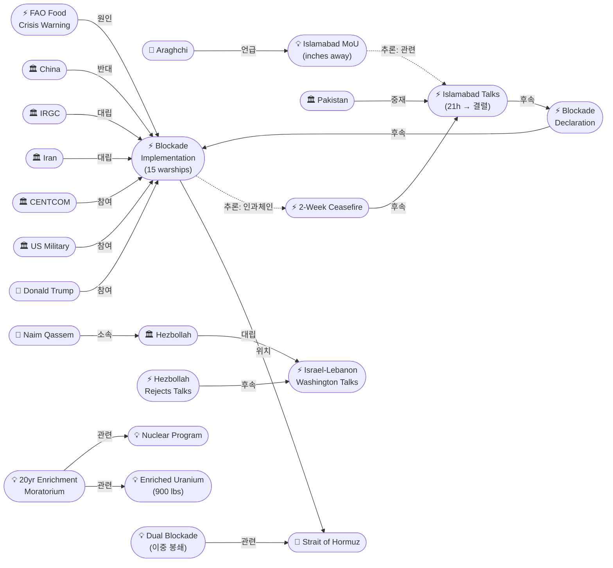
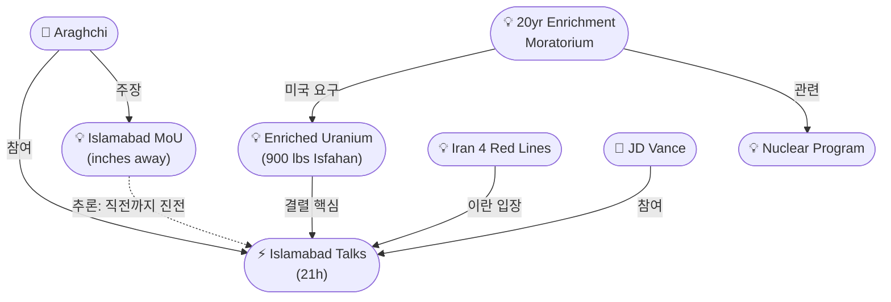
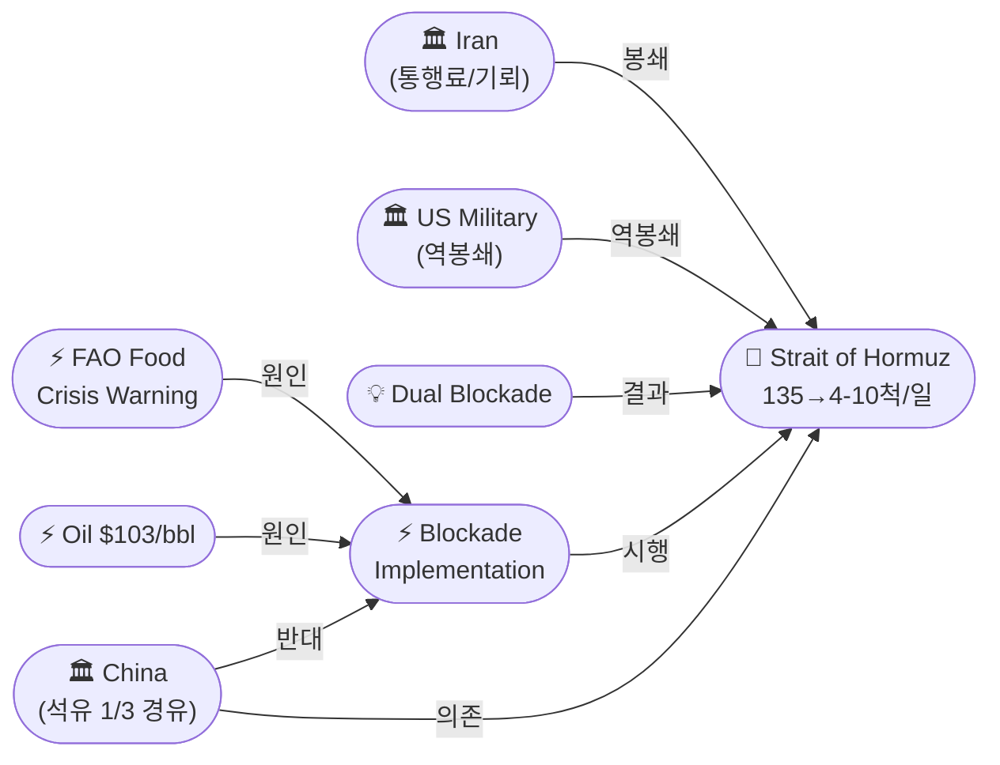

# 2026-04-13 2026 Iran War OSINT 일일 보고서

## 요약

전쟁 45일차(휴전 6일차), 미 중부사령부(CENTCOM)가 미 동부시간 오전 10시(한국시간 23시)부터 이란 항구 출입 선박에 대한 해상 봉쇄를 공식 시행했다. 군함 15척이 배치되어 미승인 선박에 대해 차단·회항·나포 프로토콜을 적용한다. 트럼프 대통령은 "이란 고속 공격정이 봉쇄에 접근하면 즉각 제거(ELIMINATED)될 것"이라고 경고했고, 이란군은 봉쇄를 "해적 행위(piracy)"로 규정하며 "페르시아만과 아라비아해의 어떤 항구도 안전하지 않을 것"이라고 반격했다. 한편 이란 외무장관 아라그치는 이슬라마바드 협상이 양해각서(MoU) 서명 직전까지 갔다고 주장했고, Axios는 미국이 20년간 우라늄 농축 모라토리엄을 요구했다고 보도했다. 레바논 전선에서는 헤즈볼라가 4월 15일 예정된 이스라엘-레바논 워싱턴 회담을 공개 거부했다. 유가는 브렌트 $103(+7%), WTI $104(+7.8%)로 추가 상승했으며, UN FAO가 호르무즈 정상화 없이는 글로벌 식량 위기가 발생할 수 있다고 경고했다.

## 주요 뉴스

### 1. 미 해군, 호르무즈 봉쇄 공식 시행 — 군함 15척, "차단·회항·나포"
- **출처:** [CNN](https://www.cnn.com/2026/04/13/world/live-news/iran-us-war-trump-hormuz), [CNBC](https://www.cnbc.com/2026/04/13/trump-iran-war-strait-of-hormuz-blockade.html), [파이낸셜뉴스](https://www.fnnews.com/news/202604140515446417)
- **일시:** 2026-04-13 10:00 AM ET
- **내용:** CENTCOM이 트럼프의 4/12 포고령에 따라 호르무즈 해협 봉쇄를 시행했다. 대상은 이란 항구를 출발지 또는 목적지로 하는 모든 선박이며, 이란과 무관한 제3국 선박의 해협 통과는 허용된다. 미 해군은 15척의 군함을 배치하여 미승인 선박에 대해 차단(interception)·회항(diversion)·나포(capture) 프로토콜을 적용한다. 봉쇄 시행 직후 미국이 2025년 제재한 유조선 엘피스(Elpis)호가 해협을 통과했고, 보츠와나 국적 유조선 오스트리아(Ostria)호는 오만으로 향하던 중 41분 만에 항로를 UAE로 변경하며 회항했다.
- **상태:** 신규
- **관련 엔티티:** US Military, CENTCOM, Strait of Hormuz, Donald Trump, Iran, IRGC

### 2. 트럼프 "이란 함정 접근 시 즉각 제거" — 이란군 "봉쇄는 해적 행위, 걸프 전역 위험"
- **출처:** [NPR](https://www.npr.org/2026/04/13/nx-s1-5783445/iran-war-updates), [Al Jazeera](https://www.aljazeera.com/news/2026/4/13/irans-army-says-us-plans-to-blockade-hormuz-amounts-to-piracy)
- **일시:** 2026-04-13
- **내용:** 트럼프 대통령은 "이란 고속 공격정이 봉쇄에 접근하면 즉각 제거될 것"이라고 경고하며, "어떤 나라도 세계를 협박하거나 갈취하게 두지 않겠다"고 밝혔다. 이에 이란군은 공식 성명을 통해 봉쇄를 "해적 행위(piracy)"로 규정하고, "이란 항구의 안전이 위협받으면 페르시아만과 아라비아해의 어떤 항구도 안전하지 않을 것"이라고 경고했다. IRGC 해군은 "잘못된 움직임은 적을 해협의 치명적 소용돌이에 빠뜨릴 것"이라고 반복 경고했으며, 민간 선박은 허용하되 군사 선박에는 "단호하고 가혹한" 대응을 하겠다고 밝혔다.
- **상태:** 신규
- **관련 엔티티:** Donald Trump, Iran, IRGC, US Military, Strait of Hormuz

### 3. 이란 "이슬라마바드 MoU 서명 직전이었다" — 아라그치, 미국 '극단적 요구' 비난
- **출처:** [Global Village Space](https://www.globalvillagespace.com/iran-says-islamabad-mou-was-within-reach-before-us-talks-collapsed/), [파이낸셜뉴스](https://www.fnnews.com/news/202604131045374743), [Express Tribune](https://tribune.com.pk/story/2602525/iran-accuses-us-of-derailing-islamabad-talks-after-near-agreement)
- **일시:** 2026-04-13
- **내용:** 이란 외무장관 압바스 아라그치는 이슬라마바드 협상이 양해각서(MoU) 서명 "인치 단위(inches away)"까지 도달했다고 주장했다. 아라그치는 "양해각서 체결 직전, 우리는 미국의 극단적 요구(maximalism), 변덕스러운 목표 설정(shifting goalposts), 그리고 봉쇄에 직면했다"고 밝혔다. 이는 양측이 공식 합의에 이전 공개보다 훨씬 가까웠다는 최초 공개 시인이다. 이란측은 밴스 부통령의 결렬 기자회견에 "기습당했다(caught off guard)"고 주장했다.
- **상태:** 신규
- **관련 엔티티:** Abbas Araghchi, Islamabad Peace Talks, Islamabad MoU, Iran, Donald Trump

### 4. 미국, 20년간 우라늄 농축 모라토리엄 요구 — 이란은 '모니터링된 다운블렌딩' 역제안
- **출처:** [Axios](https://www.axios.com/2026/04/13/iran-uranium-enrichment-moratorium-talks-vance), [Time](https://time.com/article/2026/04/13/iran-US-peace-talks-islamabad-war-nuclear/)
- **일시:** 2026-04-13
- **내용:** Axios 보도에 따르면, 미국은 이슬라마바드 협상에서 이란에 20년간 모든 우라늄 농축을 동결하고, 모든 고농축 우라늄을 국외 반출하며, 주요 농축 시설을 해체할 것을 요구했다. 이란은 이를 거부하고 기존 고농축 우라늄 재고의 '모니터링된 다운블렌딩(monitored down-blending)' 프로세스를 역제안했다. 이란측은 일요일 아침까지 초기 합의에 근접했다고 판단했으나, 밴스의 기자회견에서 합의 근접 신호가 전혀 없었던 것에 기습당했다고 전해진다.
- **상태:** 신규
- **관련 엔티티:** Nuclear Program, Enriched Uranium Issue, 20-Year Moratorium, JD Vance, Islamabad Peace Talks

### 5. 헤즈볼라, 이스라엘-레바논 워싱턴 회담 공개 거부 — "적과의 협상 결과에 관심 없다"
- **출처:** [Military.com/AP](https://www.military.com/daily-news/2026/04/13/hezbollah-official-says-group-wont-abide-any-agreements-lebanon-israel-talks-us.html), [Al Jazeera](https://www.aljazeera.com/video/newsfeed/2026/4/13/hezbollah-rejects-lebanons-direct-negotiations-with-israel), [Time](https://time.com/article/2026/04/13/the-key-obstacles-to-israel-lebanon-talks-over-hezbollah/)
- **일시:** 2026-04-13
- **내용:** 헤즈볼라 정치평의회 고위 인사 와피크 사파(Wafiq Safa)가 AP 통신에 "레바논과 이스라엘 적국 간 협상의 결과에 대해 우리는 전혀 관심도 없고 관여하지도 않을 것"이라고 밝혔다. 헤즈볼라 사무총장 나임 카셈(Naim Qassem)도 레바논 정부에 4월 15일 워싱턴 회담을 취소할 것을 요구하며 회담은 "무의미하다(pointless)"고 규정했다. 3월 2일 전쟁 발발 이후 레바논에서 2,000명 이상이 사망하고 100만 명 이상이 실향했다.
- **상태:** 신규
- **관련 엔티티:** Hezbollah, Wafiq Safa, Naim Qassem, Israel, Lebanon, Israel-Lebanon Washington Talks

### 6. 유가 $103 돌파 + FAO "글로벌 식량 위기 가능" — 이중 봉쇄로 호르무즈 마비
- **출처:** [Al Jazeera](https://www.aljazeera.com/economy/2026/4/13/oil-prices-surge-past-103-a-barrel-after-us-announces-blockade-of-iran), [CNN](https://www.cnn.com/2026/04/13/business/oil-prices-us-blockade-hormuz-intl), [Al Jazeera](https://www.aljazeera.com/news/2026/4/13/us-blockade-of-iran-would-worsen-global-energy-crisis-analysts-say)
- **일시:** 2026-04-13
- **내용:** 봉쇄 시행일 국제 유가가 추가 상승하여 브렌트유 $103/bbl(+7%), WTI $104/bbl(+7.8%)를 기록했다. 전쟁 개시 대비 브렌트유는 40%, WTI는 50% 이상 상승했다. UN 식량농업기구(FAO)는 호르무즈 정상 통항이 재개되지 않으면 글로벌 식량 위기가 발생할 수 있다고 경고했다. 현재 호르무즈는 이란 봉쇄(통행료/기뢰)와 미국 역봉쇄(이란 항구 차단)가 겹치는 '이중 봉쇄' 상태로, 선박 통항이 전쟁 전 하루 135척에서 4~10척으로 급감하며 사실상 해상 마비 상태다. 갈리바프 이란 의회의장은 "소위 봉쇄가 곧 미국인들이 $4~5 휘발유를 그리워하게 만들 것"이라고 경고했다.
- **상태:** 업데이트 ← 2026-04-12 "유가 급등"
- **관련 엔티티:** Oil Price Surge, Strait of Hormuz, Dual Blockade, FAO Food Crisis Warning, Ghalibaf

### 7. 중국, 자제 촉구 — "근본 원인은 군사 충돌, 호르무즈 개방이 글로벌 이익에 필수"
- **출처:** [Bloomberg](https://www.bloomberg.com/news/articles/2026-04-13/china-urges-restraint-as-trump-threatens-to-blockade-hormuz), [South China Morning Post](https://www.scmp.com/news/china/diplomacy/article/3349929/china-says-open-strait-hormuz-crucial-global-interests-trump-threatens-blockade)
- **일시:** 2026-04-13
- **내용:** 중국 외교부는 "호르무즈 혼란의 근본 원인은 군사 충돌이며, 분쟁이 즉각 중단되어야 한다"고 밝히며 "모든 당사자가 냉정과 자제를 유지해야 한다"고 촉구했다. 중국은 석유 수입의 1/3을 호르무즈 경유로 확보하고 있으며, 약 10억 배럴의 전략비축유를 보유하고 있다. 분석가들은 미국의 봉쇄가 이란산 원유의 최대 수입국인 중국 및 인도의 반발을 초래할 수 있다고 지적했다.
- **상태:** 신규
- **관련 엔티티:** China, Strait of Hormuz, Donald Trump, Iran

### 8. 파키스탄, 2차 협상 재가동 모색 — 휴전 만료까지 8일
- **출처:** [Al Jazeera](https://www.aljazeera.com/news/2026/4/13/pakistan-eyes-narrow-window-to-resuscitate-us-iran-talks-after-breakdown)
- **일시:** 2026-04-13
- **내용:** 파키스탄이 미-이란 2차 협상 재가동을 위해 물밑 외교에 나섰다. 4월 22일 2주 휴전 만료까지 8일이 남은 상황에서, 중동 지역 국가들도 수일 내 2차 대화를 성사시키기 위해 양측과 접촉 중이다. 그러나 트럼프 대통령이 새 협상에 미온적 태도를 보이면서 전망은 불투명하다.
- **상태:** 신규
- **관련 엔티티:** Pakistan, Ishaq Dar, Islamabad Peace Talks, 2-Week Ceasefire

## 지식그래프

### 오늘의 주요 관계

1. **선언 → 시행:** 봉쇄 선언(4/12) → 봉쇄 시행(4/13, 15척 군함, CENTCOM) — 군사 작전 단계 전환
2. **미국 ↔ 이란 직접 대치:** Trump "즉각 제거" vs 이란군 "해적 행위, 걸프 전역 위협" — 해상 군사 충돌 임계점
3. **이중 봉쇄:** 이란 봉쇄(통행료/기뢰) + 미국 역봉쇄(이란 항구 차단) → 호르무즈 사실상 마비(135→4-10척/일)
4. **MoU 직전 결렬:** 아라그치 "인치 단위로 가까웠다" — 합의 근접 최초 시인
5. **핵 구체화:** 미국 20년 농축 모라토리엄 요구 vs 이란 모니터링된 다운블렌딩 역제안
6. **레바논 교착:** 헤즈볼라 4/15 워싱턴 회담 거부 — 다전선 동시 해결 불가 확인

### 전체 지식그래프 시각화

### 주제별 세부 그래프: 핵 협상 교착

### 주제별 세부 그래프: 호르무즈 이중 봉쇄

## 온톨로지 변경

| 변경 유형 | 대상 | 근거 |
|----------|------|------|
| 새 엔티티 | ent-069: US Hormuz Blockade Implementation | CENTCOM 10 AM ET 봉쇄 시행, 15척 군함, 차단/회항/나포 프로토콜 |
| 새 엔티티 | ent-070: Islamabad MoU | 아라그치 "인치 단위로 가까웠다" — 합의 근접 최초 시인 |
| 새 엔티티 | ent-071: 20-Year Enrichment Moratorium | 미국의 구체적 핵 요구사항 최초 공개 (Axios 독점) |
| 새 엔티티 | ent-072: Wafiq Safa | 헤즈볼라 정치평의회 고위 인사, 워싱턴 회담 거부 공개 발언 |
| 새 엔티티 | ent-073: Naim Qassem | 헤즈볼라 사무총장, 워싱턴 회담 취소 요구 |
| 새 엔티티 | ent-074: Hezbollah Rejects Washington Talks | 4/15 워싱턴 회담 전날 공개 거부 |
| 새 엔티티 | ent-075: Dual Blockade (이중 봉쇄) | 이란 + 미국 이중 봉쇄, 호르무즈 사실상 마비 |
| 새 엔티티 | ent-076: FAO Food Crisis Warning | 호르무즈 정상화 없이 글로벌 식량 위기 가능 |

## 추론 결과

| 추론 | 신뢰도 | 근거 |
|------|--------|------|
| 봉쇄 시행 ← 선언 ← 협상 결렬 ← 휴전 (인과 체인) | 0.72 | 4단계 체인: 휴전 → 이슬라마바드 → 결렬 → 선언 → 시행 |
| 헤즈볼라 회담 거부 ↔ 이스라엘 레바논 공습 | 0.78 | 4/8 블랙웬즈데이 → 4/13 회담 거부 — 공습이 대화 거부 원인 |
| 사파 → 헤즈볼라 → 이란 (간접 소속) | 0.81 | 저항 축 네트워크를 통한 이란 간접 연결 |
| 카셈 → 헤즈볼라 → 이란 (간접 소속) | 0.81 | 사무총장으로서 워싱턴 거부 결정은 이란 조율 가능성 |
| FAO 식량 위기 ↔ 이중 봉쇄 | 0.80 | 이란+미국 이중 봉쇄 → 호르무즈 마비 → 농산물 수송 차질 |

## 분석 및 평가

**봉쇄 시행: 선언에서 군사 작전으로의 전환.** 12일 트루스소셜 게시에서 13일 CENTCOM 공식 시행으로 전환됨에 따라, 호르무즈 위기가 수사(rhetoric)에서 실전(operations)으로 격상되었다. 15척 군함 배치와 차단·회항·나포 프로토콜은 미 해군이 이란 항구 왕래 선박에 대해 실력 행사를 할 의지와 능력이 있음을 보여준다. 동시에 비이란 통항을 허용한 것은 국제 에너지 시장 충격 최소화와 국제법적 정당성 확보를 위한 설계.

**이중 봉쇄의 역설.** 이란은 호르무즈를 통제하여 레버리지로 사용하고, 미국은 이란 항구를 봉쇄하여 이란의 자금줄을 끊으려 한다. 결과적으로 양측 모두 호르무즈를 막고 있는 셈이며, 피해는 제3국(한국, 일본, 인도, 중국, 유럽)에 집중된다. 선박 통항 135→4-10척 급감은 역사상 최대 규모의 해상 교역 차질이다.

**이슬라마바드 MoU 직전 주장의 의미.** 아라그치의 발언은 양측이 공개적으로 인정한 것보다 합의에 훨씬 가까웠음을 시사한다. 이는 2차 협상 가능성을 높이는 요인이지만, 동시에 핵(20년 모라토리엄)과 호르무즈의 근본적 이견은 해소되지 않았다. 미국은 핵을, 이란은 호르무즈를 결렬의 원인으로 지목하는 프레이밍 전쟁이 계속되고 있다.

**레바논 전선의 교착.** 헤즈볼라의 공개적 회담 거부는 이스라엘-레바논 문제가 이란-미국 협상과 분리 해결될 수 없음을 재확인한다. 이란은 4대 레드라인에 '지역 전체 휴전(레바논 포함)'을 포함했고, 헤즈볼라는 이를 뒷받침하는 형태로 움직이고 있다.

## 추적 항목

| 항목 | 최초 보고 | 상태 | 최신 업데이트 |
|------|----------|------|-------------|
| 2주 휴전 (4/22 만료) | 2026-04-07 | 위기 — 봉쇄 시행으로 사실상 무력화 | 8일 남음. 파키스탄 2차 협상 모색 중이나 트럼프 미온적 |
| 이슬라마바드 협상 | 2026-04-10 | 결렬 → 후속 MoU 직전 주장 | 이란: 인치 단위 근접. 미국: 20년 모라토리엄 요구 공개 |
| 호르무즈 봉쇄/통제 | 2026-04-07 | 이중 봉쇄 단계 — 이란+미국 동시 봉쇄 | 135→4-10척/일. FAO 식량 위기 경고 |
| 핵 문제 | 2026-04-12 | 심화 — 구체적 요구/역제안 공개 | 미: 20년 모라토리엄+HEU 국외반출. 이란: 다운블렌딩 |
| 이스라엘-레바논 | 2026-04-10 | 교착 — 헤즈볼라 회담 거부 | 4/15 워싱턴 회담 불참 선언. 레바논 사망 2000+, 실향 100만+ |
| 유가/에너지 | 2026-04-07 | 지속 상승 | 브렌트 $103(전쟁 이래 +40%), WTI $104(+50%) |
| 중국 대응 | 2026-04-07 | 자제 촉구 → 반발 가능성 | 석유 1/3 호르무즈 경유. 봉쇄 반대 공식 표명 |

## 동향 요약

| 분류 | 상태 | 비고 |
|------|------|------|
| 군사 | 에스컬레이션 | 봉쇄 선언 → 시행. 미-이란 해상 직접 대치. 충돌 임계점 |
| 외교 | 교착 | 이슬라마바드 결렬. 헤즈볼라 워싱턴 거부. 파키스탄 2차 모색 |
| 경제 | 위기 심화 | 이중 봉쇄. 유가 $103. FAO 식량 위기 경고 |
| 핵 | 진전 없음 | 20년 모라토리엄 vs 다운블렌딩 — 근본적 이견 |
| 휴전 | 풍전등화 | 만료까지 8일. 봉쇄로 사실상 무력화 |

## 출처 목록

1. [Live updates: Trump warns Iran as US military blockade on Iranian ports takes effect](https://www.cnn.com/2026/04/13/world/live-news/iran-us-war-trump-hormuz) - CNN, 2026-04-13
2. [Trump vows to sink Iranian ships approaching a U.S. blockade of Strait of Hormuz](https://www.npr.org/2026/04/13/nx-s1-5783445/iran-war-updates) - NPR, 2026-04-13
3. [Iran's army says US plan to blockade Hormuz 'amounts to piracy'](https://www.aljazeera.com/news/2026/4/13/irans-army-says-us-plans-to-blockade-hormuz-amounts-to-piracy) - Al Jazeera, 2026-04-13
4. [Iran says 'Islamabad MoU' was within reach before US talks collapsed](https://www.globalvillagespace.com/iran-says-islamabad-mou-was-within-reach-before-us-talks-collapsed/) - Global Village Space, 2026-04-13
5. [U.S. asked Iran to freeze uranium enrichment for 20 years, sources say](https://www.axios.com/2026/04/13/iran-uranium-enrichment-moratorium-talks-vance) - Axios, 2026-04-13
6. [Hezbollah official says the group won't abide by any agreements from Lebanon-Israel talks in the US](https://www.military.com/daily-news/2026/04/13/hezbollah-official-says-group-wont-abide-any-agreements-lebanon-israel-talks-us.html) - Military.com/AP, 2026-04-13
7. [Oil prices surge past $103 a barrel after US announces blockade of Iran](https://www.aljazeera.com/economy/2026/4/13/oil-prices-surge-past-103-a-barrel-after-us-announces-blockade-of-iran) - Al Jazeera, 2026-04-13
8. [China Urges Restraint as Trump Threatens to Blockade Hormuz](https://www.bloomberg.com/news/articles/2026-04-13/china-urges-restraint-as-trump-threatens-to-blockade-hormuz) - Bloomberg, 2026-04-13
9. [Pakistan eyes narrow window to resuscitate US-Iran talks after breakdown](https://www.aljazeera.com/news/2026/4/13/pakistan-eyes-narrow-window-to-resuscitate-us-iran-talks-after-breakdown) - Al Jazeera, 2026-04-13
10. [US blockade of Iran would worsen global energy crisis, analysts say](https://www.aljazeera.com/news/2026/4/13/us-blockade-of-iran-would-worsen-global-energy-crisis-analysts-say) - Al Jazeera, 2026-04-13
11. [Why the Iran-U.S. Peace Talks Failed](https://time.com/article/2026/04/13/iran-US-peace-talks-islamabad-war-nuclear/) - Time, 2026-04-13
12. [U.S. begins blockade in Strait of Hormuz; Trump warns Iran 'attack ships' to stay away](https://www.cnbc.com/2026/04/13/trump-iran-war-strait-of-hormuz-blockade.html) - CNBC, 2026-04-13
13. [Iran accuses US of derailing Islamabad talks after near agreement](https://tribune.com.pk/story/2602525/iran-accuses-us-of-derailing-islamabad-talks-after-near-agreement) - Express Tribune, 2026-04-13
14. [Hezbollah rejects Lebanon's direct negotiations with Israel](https://www.aljazeera.com/video/newsfeed/2026/4/13/hezbollah-rejects-lebanons-direct-negotiations-with-israel) - Al Jazeera, 2026-04-13
15. [The Key Obstacles to Israel-Lebanon Talks Over Hezbollah](https://time.com/article/2026/04/13/the-key-obstacles-to-israel-lebanon-talks-over-hezbollah/) - Time, 2026-04-13
16. [China says open Strait of Hormuz crucial for global interests](https://www.scmp.com/news/china/diplomacy/article/3349929/china-says-open-strait-hormuz-crucial-global-interests-trump-threatens-blockade) - SCMP, 2026-04-13
17. [Hormuz blockade could deepen world's worst energy crisis](https://www.cnbc.com/2026/04/13/trump-hormuz-blockade-oil-shock-china-iran-india-vessels-peace-talks.html) - CNBC, 2026-04-13
18. [Analysis: Trump's strait blockade risks another serious blow to global economy](https://www.cnn.com/2026/04/13/politics/trump-strait-blockade-hormuz-iran-war-analysis) - CNN, 2026-04-13
19. [이란 '협상, 양해각서 체결 직전까지 진전…美 극단적 요구 결렬'](https://www.fnnews.com/news/202604131045374743) - 파이낸셜뉴스, 2026-04-13
20. [협상 결렬 후 '호르무즈 역봉쇄'‥미국 내에서도 '도저히 이해 불가'](https://imnews.imbc.com/replay/2026/nwdesk/article/6814890_37004.html) - MBC뉴스, 2026-04-13
21. [美, 군함 15척 동원해 호르무즈 '역봉쇄' 시작…휴전 붕괴위기](https://www.fnnews.com/news/202604140515446417) - 파이낸셜뉴스, 2026-04-13
22. [호르무즈 이중 봉쇄… 이란 돈줄 끊으려다 세계경제 숨통 끊나](https://www.mt.co.kr/world/2026/04/14/2026041320095976321) - 머니투데이, 2026-04-13
23. ['역봉쇄'에 호르무즈 일촉즉발.. 국제유가 다시 100달러 돌파](https://www.fnnews.com/news/202604131830040601) - 파이낸셜뉴스, 2026-04-13
24. [2주 휴전 '풍전등화'…종료직전 회담 가능성](https://biz.heraldcorp.com/article/10715792) - 헤럴드경제, 2026-04-13
