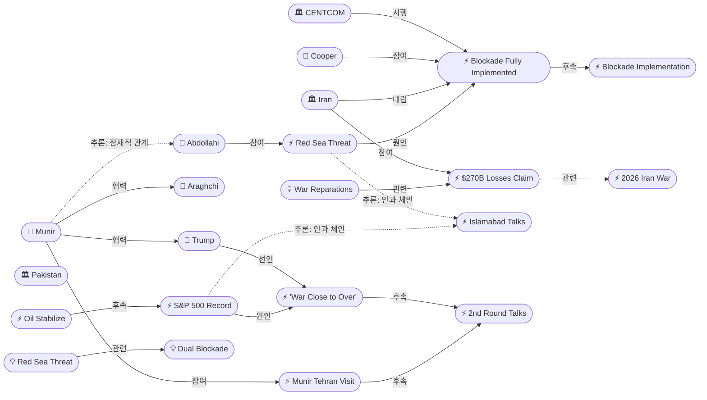
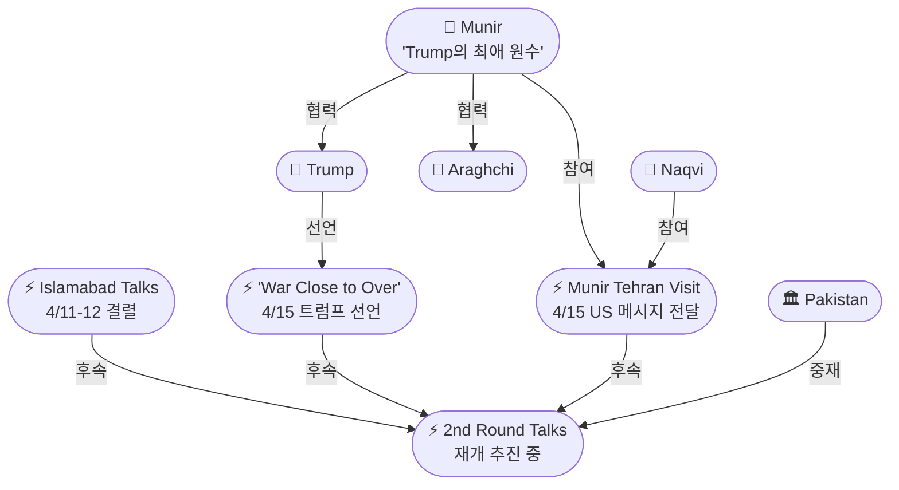
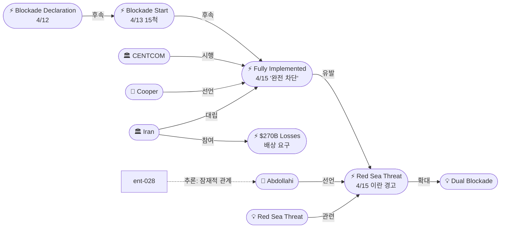

# 2026-04-15 2026 Iran War OSINT 일일 보고서

## 요약

전쟁 47일차(휴전 8일차), 봉쇄와 외교가 동시에 가속화되는 역설적 국면이 전개됐다. 트럼프 대통령이 폭스비즈니스 인터뷰에서 전쟁이 "very close to over(거의 끝났다)"고 선언하며 역대 가장 강한 종전 시사를 보냈고, 파키스탄 아심 무니르 육군참모총장이 미국 메시지를 휴대하고 테헤란에 도착하여 아라그치 외무장관과 면담했다. 한편 CENTCOM은 봉쇄가 36시간 만에 "fully implemented(완전 시행)"되어 이란의 해상 경제 무역을 "완전히 차단(completely halted)"했다고 공식 선언했다. 이에 이란군 하탐 알안비야 중앙군사본부 알리 압돌라히 사령관은 미국이 봉쇄를 해제하지 않으면 페르시아만, 오만해, 그리고 **홍해**까지 모든 무역을 차단하겠다고 위협했다 — 이란이 공식적으로 홍해 봉쇄를 언급한 것은 이번이 처음이다. S&P 500은 7,005.78로 전쟁 이후 최초 사상 최고가를 기록하며 전쟁 관련 손실을 모두 회복했다. 이란은 전쟁 피해를 $270B(약 360조원)으로 추산하며 미국·이스라엘과 5개 아랍국가에 배상을 요구했다.

## 주요 뉴스

### 1. 트럼프 "전쟁 거의 끝났다" — 역대 가장 강한 종전 시사
- **출처:** [CNBC](https://www.cnbc.com/2026/04/15/iran-war-trump-peace-deal-us-talks-stock-market-oil-prices-.html), [NPR](https://www.npr.org/2026/04/15/nx-s1-5786034/iran-middle-east-updates), [서울신문](https://seoul.co.kr/news/international/2026/04/15/20260415500216), [파이낸셜뉴스](https://www.fnnews.com/news/202604151205168441), [세계일보](https://segye.com/newsView/20260415512836), [국민일보](https://www.kmib.co.kr/article/view.asp?arcid=0029684910&code=61131111&sid1=int)
- **일시:** 2026-04-15
- **내용:** 트럼프 대통령이 폭스비즈니스와의 인터뷰에서 "전쟁이 종료되는 상태에 매우 근접했다고 본다(I think it's very close to over)"고 밝히며 "주식시장이 폭등할 것(stock market is going to boom)"이라고 예고했다. 뉴욕포스트에는 "파키스탄에 머물러라, 이틀 안에 뭔가 일어날 수 있다(stay in Pakistan, something could be happening over the next two days)"고 말했다. CNN은 밴스 부통령, 윗코프 특사, 쿠슈너가 2차 협상에 참여할 예정이라고 보도했다. 4월 21~22일 휴전 만료까지 6일이 남았으며, 양측은 휴전 연장도 검토 중이다.
- **상태:** 신규
- **관련 엔티티:** Donald Trump, Iran, Pakistan, JD Vance, Islamabad Peace Talks

### 2. 파키스탄 무니르 육참총장, 테헤란 도착 — 미국 메시지 전달, 2차 협상 중재
- **출처:** [Bloomberg](https://www.bloomberg.com/news/articles/2026-04-15/pakistan-army-chief-lands-in-tehran-for-us-iran-mediation-talks), [Al Jazeera](https://www.aljazeera.com/news/2026/4/15/pakistan-army-chief-in-tehran-to-advance-next-round-of-us-iran-talks), [Middle East Monitor](https://www.middleeastmonitor.com/20260415-pakistan-army-chief-in-tehran-for-talks-with-iranian-foreign-minister-ahead-of-expected-fresh-us-talks/), [파이낸셜뉴스](https://www.fnnews.com/news/202604151205168441)
- **일시:** 2026-04-15
- **내용:** 파키스탄 아심 무니르(Asim Munir) 육군참모총장이 모신 나크비(Mohsin Naqvi) 내무장관과 함께 테헤란에 도착했다. 파키스탄 군부 성명에 따르면 "지속적인 중재 노력의 일환"이며, 무니르는 미국의 새 메시지를 전달하고 이란을 협상 테이블로 복귀시키기 위한 2차 회담 조율에 나섰다. 무니르는 아라그치 외무장관과 면담했다. 트럼프가 "내가 가장 좋아하는 야전원수(my favorite field marshal)"라고 부르는 무니르는 과거 파키스탄 군사정보부장을 역임하며 IRGC 지도부와도 인맥이 있어 양측을 모두 아는 유일한 중재자로 부상하고 있다.
- **상태:** 신규
- **관련 엔티티:** Asim Munir, Mohsin Naqvi, Abbas Araghchi, Pakistan, Iran, Donald Trump

### 3. CENTCOM "봉쇄 완전 시행" — 이란 해상무역 완전 차단 선언
- **출처:** [Al Jazeera](https://www.aljazeera.com/economy/2026/4/15/us-military-says-blockade-of-iran-ports-completely-halts-economic-trade), [CNN](https://www.cnn.com/2026/04/15/middleeast/iran-blockade-explainer-analysis-intl-hnk-ml), [CNBC](https://www.cnbc.com/2026/04/15/us-strait-of-hormuz-blockade-navy-iran-seaborne-trade-oil-trump.html)
- **일시:** 2026-04-15
- **내용:** CENTCOM 사령관 브래드 쿠퍼(Brad Cooper) 제독이 봉쇄가 시행 36시간 만에 "fully implemented(완전 시행)"되었으며, 이란의 해상 경제 무역을 "완전히 차단(completely halted)"했다고 선언했다. 10,000명 이상의 해군·해병대·공군 병력이 작전에 참여하고 있으며, 시행 첫 24시간에 6척의 상선이 미 해군 명령에 따라 이란 항구로 회항했다. CENTCOM은 "봉쇄가 시행된 이후 어떤 선박도 봉쇄선을 통과하지 못했다"고 주장했다. 이란 경제의 약 90%가 해상 무역에 의존한다.
- **상태:** 신규
- **관련 엔티티:** CENTCOM, Brad Cooper, Strait of Hormuz, Trump Hormuz Naval Blockade

### 4. 이란, 홍해까지 봉쇄 위협 — 질적 에스컬레이션
- **출처:** [NBC News](https://www.nbcnews.com/world/iran/live-blog/live-updates-us-blockade-iran-hormuz-trump-peace-talks-rcna331890), [Newsweek](https://www.newsweek.com/iran-new-threat-destabilize-global-trade-red-sea-11833027), [Middle East Eye](https://www.middleeasteye.net/live-blog/live-blog-update/iran-military-warns-will-block-red-sea-if-us-naval-blockade-continues), [서울신문](https://m.seoul.co.kr/news/international/2026/04/15/20260415500271), [파이낸셜뉴스](https://www.fnnews.com/news/202604151820457791), [글로벌이코노믹](https://www.g-enews.com/article/Global-Biz/2026/04/20260415204101812435e857d010_1)
- **일시:** 2026-04-15
- **내용:** 이란군 통합지휘체계인 하탐 알안비야(Khatam al-Anbiya) 중앙군사본부의 알리 압돌라히(Ali Abdollahi) 사령관이 "미국이 불법적 해상 봉쇄를 지속하며 이란 상선과 유조선의 안전을 위협한다면, 이란 강군은 페르시아만, 오만해, 그리고 홍해를 통과하는 어떠한 수출입 활동도 용납하지 않을 것"이라고 경고했다. **이란이 공식적으로 홍해 봉쇄를 언급한 것은 전쟁 발발 이후 처음**이다. 이는 분쟁 영역을 호르무즈 해협에서 글로벌 핵심 해운 항로(홍해-수에즈)로 확대하겠다는 질적 에스컬레이션 신호다.
- **상태:** 신규
- **관련 엔티티:** Ali Abdollahi, Iran, IRGC, Khatam al-Anbiya Central HQ, Red Sea Blockade Threat, Dual Blockade

### 5. 이란, 전쟁 피해 $270B 추산 — 5개 아랍국가에도 배상 요구
- **출처:** [Al Jazeera](https://www.aljazeera.com/news/2026/4/15/iran-says-270bn-war-loss-must-be-compensated-as-fresh-talks-with-us-loom), [Epoch Times](https://www.theepochtimes.com/world/iran-demands-war-reparations-from-5-arab-states-6011657), [IranWire](https://iranwire.com/en/news/151197-iran-puts-war-losses-at-270-billion-demands-reparations-from-gulf-countries/)
- **일시:** 2026-04-15
- **내용:** 이란 정부가 전쟁 총 피해를 약 $270B(약 360조원, 잠정 추산)로 발표했다. 물리적 파괴와 경제 활동 손실을 포함한 수치다. 이란의 유엔 대사는 바레인, 사우디아라비아, 카타르, UAE, 요르단 등 5개 아랍국가가 자국 영토에서 미군 공격을 허용한 것은 국제법 위반이라며 배상을 요구했다. 이 배상 요구는 향후 협상에서 이란의 새로운 카드가 될 가능성이 크다.
- **상태:** 신규
- **관련 엔티티:** Iran, UAE, Bahrain, Iran War Reparations Demand, 2026 Iran War

### 6. S&P 500 사상 최고가 — 전쟁 이후 최초, 모든 손실 회복
- **출처:** [Invezz](https://invezz.com/news/2026/04/15/sp-500-hits-record-high-as-iran-peace-hopes-lift-markets/), [BNN Bloomberg](https://www.bnnbloomberg.ca/business/2026/04/15/sp-500-hits-first-intraday-record-high-since-us-iran-war/), [Bloomberg](https://www.bloomberg.com/news/articles/2026-04-15/s-p-500-on-pace-for-record-close-as-ceasefire-rally-continues)
- **일시:** 2026-04-15
- **내용:** S&P 500이 7,005.78포인트를 기록하며 1월 28일 전고점(7,002.28)을 돌파했다. 전쟁 발발(2월 28일) 이후 최초의 장중 사상 최고가다. 3월 30일 이후 9.8% 상승하며 3주 연속 상승세를 이어갔다. 나스닥은 +2%, 다우존스는 +0.7% 상승했다. 시장 분석가들은 트럼프의 '전쟁 거의 끝' 발언과 2차 협상 기대감이 랠리를 이끌었다고 분석했다. 투자자들이 물리적 봉쇄의 현실보다 외교적 해결 가능성에 베팅하는 구도다.
- **상태:** 신규
- **관련 엔티티:** S&P 500 Record High, Trump 'War Close to Over' Declaration, 2026 Iran War

### 7. 유가 안정세 — WTI $91.29, 현물-선물 괴리 지속
- **출처:** [Euronews](https://www.euronews.com/business/2026/04/15/oil-prices-fall-as-renewed-hopes-for-peace-talks-feed-a-stock-market-rally), [CNBC](https://www.cnbc.com/2026/04/15/oil-price-us-iran-talks-hormuz-trump.html)
- **일시:** 2026-04-15
- **내용:** WTI 5월물 $91.29/bbl, 브렌트 6월물 $94.93~95.27/bbl로 전일 급락 후 안정세를 보였다. 유가는 4월 12일 $102~104 급등에서 14~15일 $91~95로 하락했으나, IEA에 따르면 물리적 현물 가격은 여전히 $150/bbl 근처로 선물시장과의 괴리가 심화되고 있다. 선물 유가 하락은 협상 재개 기대감에 따른 심리적 요인이지, 구조적 공급 부족의 해소를 의미하지 않는다.
- **상태:** 신규
- **관련 엔티티:** Oil Prices Stabilize, Strait of Hormuz, Trump Hormuz Naval Blockade

### 8. 2차 협상 준비 가속화 — 화이트하우스 "합의 전망 긍정적"
- **출처:** [CNN](https://www.cnn.com/2026/04/15/world/live-news/iran-war-blockade-us-trump), [Al Jazeera](https://www.aljazeera.com/news/2026/4/15/us-iran-talks-whats-the-latest-on-mediation-efforts), [이투데이](https://www.etoday.co.kr/news/view/2576005)
- **일시:** 2026-04-15
- **내용:** 화이트하우스 관계자가 "합의 전망에 대해 긍정적으로 본다(feel good about prospects of a deal)"고 밝혔다. 미국과 이란은 공식 회담 이후에도 파키스탄을 통해 비공식 접촉을 이어가고 있으며, 2차 대면 협상이 휴전 만료(4/21~22) 전에 열릴 가능성이 높아지고 있다. 핵 문제에서 미국의 20년 모라토리엄 요구와 이란의 3~5년 역제안 간 간극이 핵심 쟁점으로 남아있다. 양측은 휴전을 2주 추가 연장하는 방안도 검토 중이다.
- **상태:** 업데이트 ← 2026-04-14 "Trump hints at 2nd round talks"
- **관련 엔티티:** Donald Trump, Iran, Pakistan, Asim Munir, Abbas Araghchi, 20-Year Enrichment Moratorium

## 지식그래프

### 오늘의 주요 관계
- **봉쇄와 외교의 역설:** CENTCOM이 봉쇄 "완전 시행"(ent-095)을 선언한 같은 날 트럼프가 "전쟁 거의 끝"(ent-094)을 시사. 봉쇄를 최대 레버리지로 활용한 후 협상으로 전환하려는 전략 구도. 무니르(ent-028)가 테헤란에서 이란에 미국 메시지를 전달하며 중재 가속화.
- **이란의 이중 대응:** 한편으로 무니르와 외교적 접촉(ent-097)을 유지하면서, 동시에 압돌라히(ent-091)를 통해 홍해 봉쇄 위협(ent-096)이라는 에스컬레이션 카드를 꺼냄. '대화하면서 위협하는' 전형적 위기 외교 패턴.
- **시장의 과감한 베팅:** S&P 500 사상 최고가(ent-099)는 시장이 봉쇄와 홍해 위협이라는 악재에도 불구하고 단기 종전에 강하게 베팅하고 있음을 시사. 유가는 안정(ent-100)이지만 현물-선물 $60 괴리는 구조적 리스크.
- **배상이라는 새 카드:** 이란의 $270B 배상 요구(ent-098)는 5개 아랍국가까지 확대되어 지역 외교 구도를 복잡하게 만들 가능성.

### 전체 지식그래프 시각화

### 외교/중재 세부 그래프

### 봉쇄/에스컬레이션 세부 그래프

## 온톨로지 변경

| 변경 유형 | 대상 | 근거 |
|----------|------|------|
| 엔티티 업데이트 | ent-028 (Asim Munir) | 테헤란 직접 방문, 'Trump의 최애 원수' 정보 추가 |
| 새 엔티티 (Person) | ent-091 Ali Abdollahi | 이란 하탐 알안비야 군사본부 사령관, 홍해 봉쇄 위협 |
| 새 엔티티 (Person) | ent-092 Mohsin Naqvi | 파키스탄 내무장관, 무니르와 테헤란 동행 |
| 새 엔티티 (Person) | ent-093 Brad Cooper | CENTCOM 사령관 제독, 봉쇄 완전 시행 선언 |
| 새 엔티티 (Event) | ent-094 Trump 'War Close to Over' | 역대 가장 강한 종전 시사 발언 |
| 새 엔티티 (Event) | ent-095 CENTCOM Blockade Fully Implemented | 36시간 만에 이란 해상무역 완전 차단 |
| 새 엔티티 (Event) | ent-096 Iran Red Sea Blockade Threat | 최초의 홍해 봉쇄 공식 위협, 질적 에스컬레이션 |
| 새 엔티티 (Event) | ent-097 Asim Munir Tehran Visit | US 메시지 전달, 2차 협상 중재 |
| 새 엔티티 (Event) | ent-098 Iran $270B War Losses Claim | 전쟁 피해 추산, 7개국 배상 요구 |
| 새 엔티티 (Event) | ent-099~ent-100 | S&P 500 전쟁 후 최초 신고가, 유가 안정화 |
| 새 엔티티 (Concept) | ent-101~ent-103 | 전쟁 배상 $270B, 홍해 봉쇄 위협, 사망자 ~6,000명 |

## 추론 결과

| # | 추론 | 규칙 | 신뢰도 | 근거 |
|---|------|------|--------|------|
| 32 | Cooper → 간접소속 → Trump | transitivity | 0.81 | CENTCOM 사령관 → US Military → 대통령 지휘 체계 |
| 33 | Abdollahi → 간접소속 → IRGC | transitivity | 0.81 | 하탐 알안비야 → 이란군 → IRGC 병렬 지휘 |
| 34 | Red Sea Threat ← 인과 체인 ← Islamabad | event_chain | 0.72 | 결렬 → 봉쇄 선언 → 봉쇄 시행 → 완전 차단 → 홍해 위협 (4단계) |
| 35 | Munir ↔ Abdollahi 잠재적 관계 | co_participation | 0.75 | 같은 날 테헤란에서 '당근(중재)'과 '채찍(위협)' 동시 작동 |
| 36 | S&P Record ← 인과 체인 ← Islamabad | event_chain | 0.72 | 결렬 → 봉쇄 → 종전 시사 → S&P 신고가 (역설적 인과) |

## 분석 및 평가

### 봉쇄와 외교의 동시 가속: '최대 압박, 최대 외교' 전략
4월 15일은 미국의 대이란 전략이 '최대 압박(maximum pressure)'과 '최대 외교(maximum diplomacy)'를 동시에 구사하는 이중 전략으로 수렴한 날이다. CENTCOM은 봉쇄가 이란의 해상 경제 무역을 "완전히 차단"했다고 선언하며 경제적 압박을 극대화했고, 같은 날 트럼프는 "전쟁이 거의 끝났다"고 공언하며 외교적 출구를 제시했다. 파키스탄 무니르 원수의 테헤란 방문은 이 이중 전략의 실행부다 — 미국의 메시지(압박)를 전달하면서 동시에 이란의 협상 복귀(외교)를 설득한다. 이는 이슬라마바드 1차 협상 결렬이 '실패'가 아니라 '봉쇄 레버리지 확보'를 위한 계산된 과정이었을 가능성을 시사한다.

### 이란의 홍해 카드 — 질적 에스컬레이션의 의미
이란이 처음으로 홍해 봉쇄를 공식 언급한 것은 단순한 수사가 아닌 질적 에스컬레이션이다. 호르무즈 해협은 페르시아만 내 지역적 병목이지만, 홍해-수에즈 운하는 유럽-아시아 간 글로벌 무역의 핵심 항로다. 이란이 이 위협을 실행하면 2025~26년 후티 공격으로 이미 타격받은 홍해 해운이 전면 마비될 수 있다. 그러나 이란의 실제 홍해 투사 능력(자국 해군 범위 밖)은 제한적이며, 이 위협은 호르무즈에서의 협상 카드를 극대화하기 위한 '허세(bluff)' 가능성도 있다. 같은 날 무니르를 만난 점은 이란이 위협과 대화를 동시에 운용하고 있음을 보여준다.

### 시장의 역설적 베팅과 구조적 리스크
S&P 500이 전쟁 이후 최초로 사상 최고가를 기록한 것은 시장이 단기 종전에 강하게 베팅하고 있음을 보여준다. 그러나 이는 봉쇄가 완전 시행되고 이란이 홍해 위협을 발한 날에 나온 신고가라는 점에서 구조적 괴리가 있다. IEA가 경고한 물리적 현물 $150/bbl과 선물 $91/bbl의 $60 괴리는 시장이 '최선의 시나리오(외교 해결)'에만 가격을 맞추고 있다는 뜻이다. 협상이 불발되면 시장 충격이 클 수 있다.

### $270B 배상 요구의 전략적 함의
이란의 $270B 배상 요구 자체는 즉시 실현 불가능하지만, 5개 아랍국가(바레인, 사우디, 카타르, UAE, 요르단)를 배상 대상에 포함시킨 것은 전략적이다. 이는 걸프 아랍국들에 "미군 기지 허용의 대가"를 인식시키고, 향후 미국과의 동맹 구조에 쐐기를 박으려는 시도로 해석된다. 또한 이 요구는 2차 협상에서 이란의 새로운 의제(동결자산 $6B 반환을 넘어서는 배상)로 부상할 가능성이 있다.

## 추적 항목

| 항목 | 최초 보고 | 상태 | 최신 업데이트 |
|------|----------|------|-------------|
| 2주 휴전 (4/21~22 만료) | 2026-04-07 | 위기 — 6일 남음 | 연장 검토 중, 2차 협상이 관건 |
| 미-이란 종전 협상 | 2026-04-07 | 활성 — 2차 재개 가속 | 트럼프 "거의 끝", 무니르 테헤란 방문 |
| 호르무즈 봉쇄 | 2026-04-12 | 시행 3일차 — 완전 차단 | CENTCOM "fully implemented", 10,000+ 병력 |
| 이란 홍해 위협 | 2026-04-15 | 신규 — 질적 에스컬레이션 | 최초 공식 홍해 봉쇄 위협 |
| 이스라엘-레바논 회담 | 2026-04-11 | 진행 중 — 추가 협상 합의 | 4/14 워싱턴 회담 완료, 차기 일정 미정 |
| 핵 문제 (농축 우라늄) | 2026-04-12 | 교착 — 간극 존재 | 미국 20년 vs 이란 3~5년 모라토리엄 |
| 유가 동향 | 2026-04-12 | 안정 — 현물-선물 괴리 지속 | WTI $91, 현물 $150, 괴리 $60 |
| 글로벌 경제 영향 | 2026-04-13 | 심화 → 시장 역설 | S&P 500 사상 최고가 vs IEA "최대 위협" |
| 이란 배상 요구 | 2026-04-15 | 신규 | $270B 추산, 7개국 대상 |

## 동향 요약

| 분류 | 상태 | 비고 |
|------|------|------|
| 군사 | 봉쇄 완전 시행 3일차 | CENTCOM "완전 차단", 10,000+ 병력 투입 |
| 에스컬레이션 | 이란 홍해 위협 (신규) | 최초 공식 홍해 봉쇄 언급, 질적 변화 |
| 외교 (이란) | 2차 협상 가속 | 트럼프 "거의 끝", 무니르 테헤란 방문 |
| 외교 (레바논) | 대기 중 | 4/14 워싱턴 회담 완료, 차기 일정 미정 |
| 경제/시장 | S&P 500 사상 최고가 | 전쟁 손실 전량 회복, 단기 종전 베팅 |
| 유가 | WTI $91, 안정 | 현물 $150 괴리 지속, 구조적 리스크 |
| 핵 문제 | 교착 | 20년 vs 3~5년 모라토리엄 간극 |
| 배상 | 신규 의제 | 이란 $270B 요구, 5개 아랍국가 포함 |
| 휴전 | 6일 남음 | 연장 또는 2차 합의가 관건 |

## 출처 목록

1. [Iran war 'very close to over,' Trump says — stock market 'is going to boom'](https://www.cnbc.com/2026/04/15/iran-war-trump-peace-deal-us-talks-stock-market-oil-prices-.html) - CNBC, 2026-04-15
2. [Pakistan Army Chief Arrives in Tehran to Mediate Peace Talks](https://www.bloomberg.com/news/articles/2026-04-15/pakistan-army-chief-lands-in-tehran-for-us-iran-mediation-talks) - Bloomberg, 2026-04-15
3. [Pakistan army chief in Tehran to advance next round of US-Iran talks](https://www.aljazeera.com/news/2026/4/15/pakistan-army-chief-in-tehran-to-advance-next-round-of-us-iran-talks) - Al Jazeera, 2026-04-15
4. [US military says blockade of Iran ports 'completely' halts economic trade](https://www.aljazeera.com/economy/2026/4/15/us-military-says-blockade-of-iran-ports-completely-halts-economic-trade) - Al Jazeera, 2026-04-15
5. [Blockade completely halts Iran shipping, US military says](https://www.cnn.com/2026/04/15/middleeast/iran-blockade-explainer-analysis-intl-hnk-ml) - CNN, 2026-04-15
6. [Iran threatens shipping in Gulf, Red Sea](https://www.nbcnews.com/world/iran/live-blog/live-updates-us-blockade-iran-hormuz-trump-peace-talks-rcna331890) - NBC News, 2026-04-15
7. [Iran issues new threat to further destabilize global trade via Red Sea](https://www.newsweek.com/iran-new-threat-destabilize-global-trade-red-sea-11833027) - Newsweek, 2026-04-15
8. [Iran military warns will block Red Sea if US naval blockade continues](https://www.middleeasteye.net/live-blog/live-blog-update/iran-military-warns-will-block-red-sea-if-us-naval-blockade-continues) - Middle East Eye, 2026-04-15
9. [Iran says $270bn war loss must be compensated](https://www.aljazeera.com/news/2026/4/15/iran-says-270bn-war-loss-must-be-compensated-as-fresh-talks-with-us-loom) - Al Jazeera, 2026-04-15
10. [Iran Demands War Reparations From 5 Arab States](https://www.theepochtimes.com/world/iran-demands-war-reparations-from-5-arab-states-6011657) - Epoch Times, 2026-04-15
11. [Iran Puts War Losses at $270 Billion](https://iranwire.com/en/news/151197-iran-puts-war-losses-at-270-billion-demands-reparations-from-gulf-countries/) - IranWire, 2026-04-15
12. [S&P 500 hits record high as Iran peace hopes lift markets](https://invezz.com/news/2026/04/15/sp-500-hits-record-high-as-iran-peace-hopes-lift-markets/) - Invezz, 2026-04-15
13. [S&P 500 hits first intraday record high since U.S.-Iran war](https://www.bnnbloomberg.ca/business/2026/04/15/sp-500-hits-first-intraday-record-high-since-us-iran-war/) - BNN Bloomberg, 2026-04-15
14. [S&P 500 Nears Record Close as Ceasefire Optimism Lifts Stocks](https://www.bloomberg.com/news/articles/2026-04-15/s-p-500-on-pace-for-record-close-as-ceasefire-rally-continues) - Bloomberg, 2026-04-15
15. [Oil prices fall as renewed hopes for peace talks feed a stock market rally](https://www.euronews.com/business/2026/04/15/oil-prices-fall-as-renewed-hopes-for-peace-talks-feed-a-stock-market-rally) - Euronews, 2026-04-15
16. [Oil prices: Possible U.S.-Iran talks revive hopes](https://www.cnbc.com/2026/04/15/oil-price-us-iran-talks-hormuz-trump.html) - CNBC, 2026-04-15
17. [U.S. declares blockade 'fully implemented'](https://www.cnbc.com/2026/04/15/us-strait-of-hormuz-blockade-navy-iran-seaborne-trade-oil-trump.html) - CNBC, 2026-04-15
18. [White House optimistic about Iran deal](https://www.cnn.com/2026/04/15/world/live-news/iran-war-blockade-us-trump) - CNN, 2026-04-15
19. [US-Iran talks: What's the latest on mediation efforts?](https://www.aljazeera.com/news/2026/4/15/us-iran-talks-whats-the-latest-on-mediation-efforts) - Al Jazeera, 2026-04-15
20. [Trump says Iran talks could resume in days](https://www.npr.org/2026/04/15/nx-s1-5786034/iran-middle-east-updates) - NPR, 2026-04-15
21. [Pakistan army chief in Tehran for mediation](https://www.middleeastmonitor.com/20260415-pakistan-army-chief-in-tehran-for-talks-with-iranian-foreign-minister-ahead-of-expected-fresh-us-talks/) - Middle East Monitor, 2026-04-15
22. [협상 재개 시사한 트럼프 "전쟁 거의 끝나"](https://seoul.co.kr/news/international/2026/04/15/20260415500216) - 서울신문, 2026-04-15
23. [트럼프 "전쟁 곧 끝나"…'이슬라마바드 2차 회동' 급물살](https://www.fnnews.com/news/202604151205168441) - 파이낸셜뉴스, 2026-04-15
24. [트럼프 "4월 협상타결 가능"… 이란 '홍해 봉쇄' 경고](https://www.fnnews.com/news/202604151820457791) - 파이낸셜뉴스, 2026-04-15
25. [이란군 "美 해상봉쇄 계속하면 홍해 무역 차단 군사행동 나설 것"](https://m.seoul.co.kr/news/international/2026/04/15/20260415500271) - 서울신문, 2026-04-15
26. [이란군, 걸프만·홍해까지 해상 봉쇄 위협](https://www.g-enews.com/article/Global-Biz/2026/04/20260415204101812435e857d010_1) - 글로벌이코노믹, 2026-04-15
27. [세계일보: 이슬라마바드 2차 회동 급물살](https://segye.com/newsView/20260415512836) - 세계일보, 2026-04-15
28. [트럼프 "전쟁 거의 끝"… 4월 내 협상 타결 시사](https://www.kmib.co.kr/article/view.asp?arcid=0029684910&code=61131111&sid1=int) - 국민일보, 2026-04-15
