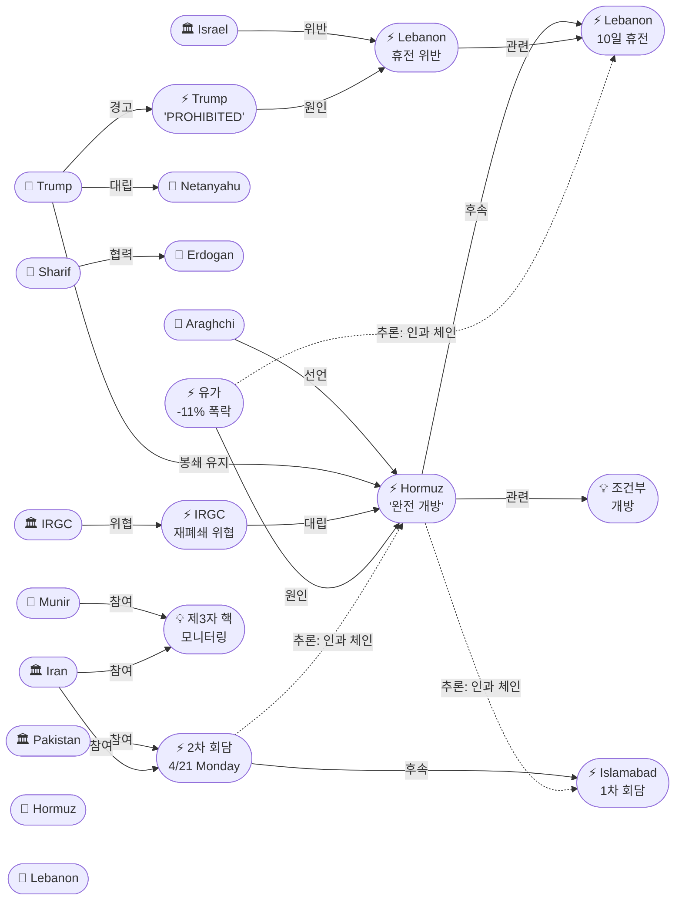
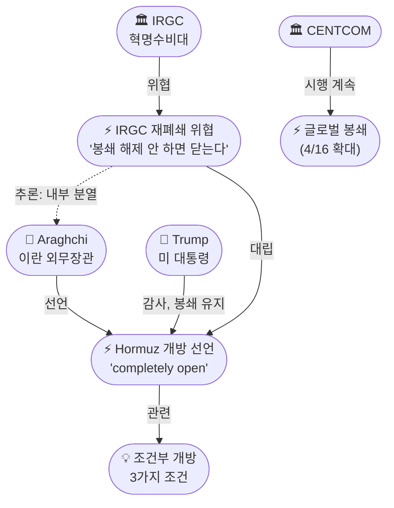
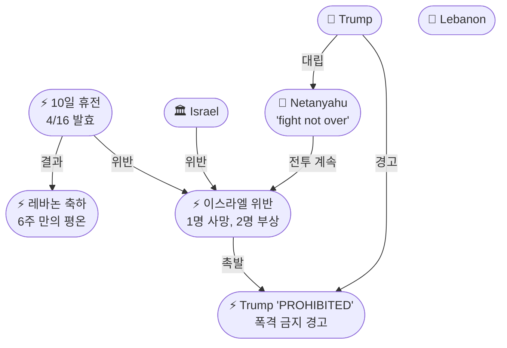

# 2026-04-17 2026 Iran War OSINT 일일 보고서

## 요약

전쟁 49일차(휴전 10일차, 봉쇄 5일차), 호르무즈 해협의 '삼중 현실'이 형성된 날이다. 이란 아라그치 외무장관이 레바논 휴전에 연계하여 호르무즈 해협을 상선에 "완전 개방(completely open)"한다고 선언했으나, 트럼프 대통령은 즉시 "이란에 대한 해군 봉쇄는 협상이 100% 완료될 때까지 전적으로 유지(will remain in full force)"된다고 응수했고, IRGC 계열 파르스통신은 같은 날 미국 봉쇄가 지속되면 호르무즈를 다시 닫겠다고 위협했다 — 이란 내부의 실용파(아라그치)와 강경파(IRGC)의 공개적 분열이다. 결정적으로 CNN이 이란 소식통을 인용해 **2차 미-이란 회담이 4월 21일 월요일 파키스탄에서 열린다**고 보도했으며, 이는 휴전 만료일과 정확히 겹친다. 핵 문제에서는 이란이 파키스탄 제안의 **제3자 모니터링(4개국+IAEA)**을 원칙적으로 수용했다는 가장 구체적인 타협 신호가 나왔다. 레바논 전선에서는 휴전 첫날 축하와 위반이 동시에 진행되었고, 트럼프는 네타냐후에게 이례적으로 이스라엘의 폭격을 "금지(PROHIBITED)"한다고 공개 경고했다. 유가는 호르무즈 개방 소식에 11% 이상 폭락하여 전쟁 이후 최대 일일 하락폭을 기록했다.

## 주요 뉴스

### 1. 이란 호르무즈 '완전 개방' 선언 — 조건부, 이란 지정 항로로
- **출처:** [Al Jazeera](https://www.aljazeera.com/news/2026/4/17/iran-foreign-minister-says-strait-of-hormuz-completely-open), [NBC News](https://www.nbcnews.com/world/iran/live-blog/live-updates-israel-lebanon-ceasefire-trump-iran-talks-hormuz-summit-rcna332294), [Bloomberg](https://www.bloomberg.com/news/articles/2026-04-17/iran-says-hormuz-to-open-during-lebanon-truce-in-boost-for-peace), [CBC News](https://www.cbc.ca/news/world/iran-foreign-minister-strait-of-hormuz-opens-9.7167808), [Military.com](https://www.military.com/daily-news/2026/04/17/iran-reopens-strait-of-hormuz-trump-says-blockade-iranian-ships-and-ports-will-stay-force.html), [헤럴드경제](https://biz.heraldcorp.com/article/10720043), [뉴시스](https://www.newsis.com/view/NISX20260417_0003596425), [이투데이](https://www.etoday.co.kr/news/view/2576869), [서울경제](https://www.sedaily.com/article/20034015), [파이낸셜뉴스](https://www.fnnews.com/news/202604172223145229)
- **일시:** 2026-04-17
- **내용:** 아바스 아라그치 이란 외무장관이 "레바논 휴전 상황을 반영하여 남은 휴전 기간 호르무즈 해협을 통과하는 모든 상선의 항해를 전면 허용한다(completely open for the remaining period of ceasefire)"고 발표했다. 단, 3가지 조건이 붙는다: (1) 상선만 허용, 군함 금지, (2) 선박과 화물이 '적대국'과 연결되지 않을 것, (3) 이란 항만해사청(Ports and Maritime Organisation)이 지정한 경로를 따를 것. 지정 경로는 기존의 오만 무산담 인근 항로가 아닌 이란 영해에 가까운 **라라크섬(Larak island) 인근**이다. 아라그치가 언급한 '휴전 기간'이 미-이란 휴전(4/21)인지 이스라엘-레바논 휴전(4/26)인지는 모호하다. 실제로 선주와 유조선 거래자들은 관망하며 **소수의 선박만이 통항**했다.
- **상태:** 신규
- **관련 엔티티:** Abbas Araghchi, Iran, Strait of Hormuz, Hormuz Conditional Opening

### 2. 트럼프: "이란 봉쇄 100% 유지" — 개방에 감사하되 봉쇄 지속
- **출처:** [NBC News](https://www.nbcnews.com/world/iran/live-blog/live-updates-israel-lebanon-ceasefire-trump-iran-talks-hormuz-summit-rcna332294), [세계일보](https://segye.com/newsView/20260417515143), [이투데이](https://www.etoday.co.kr/news/view/2576869), [파이낸셜뉴스](https://www.fnnews.com/news/202604172223145229)
- **일시:** 2026-04-17
- **내용:** 트럼프 대통령은 이란의 호르무즈 개방에 감사를 표하면서도 "이란과의 협상이 100% 완료될 때까지 이란에 대한 해군 봉쇄는 전적으로 유지될 것(will remain in full force)"이라고 밝혔다. 이는 호르무즈 '통과 개방'과 이란 '대상 봉쇄'가 공존하는 이중 현실(dual reality)을 만들었다 — 비이란 상선은 이론상 이란 지정 항로로 통과 가능하나, 이란-관련 선박은 여전히 미 해군에 의해 차단된다. 트럼프는 동시에 "며칠 내 합의를 기대한다(expects a peace deal in the coming days)"고 밝혀 외교적 낙관을 유지했다.
- **상태:** 신규
- **관련 엔티티:** Donald Trump, Strait of Hormuz, Trump Hormuz Naval Blockade, CENTCOM

### 3. IRGC 계열: "미 봉쇄 지속 시 호르무즈 재폐쇄" — 아라그치와 상충
- **출처:** [Iran International](https://www.iranintl.com/en/202604170620)
- **일시:** 2026-04-17
- **내용:** IRGC 계열 파르스통신이 최고국가안보회의(SNSC) 관계자를 인용해, 이란은 미국 해군 봉쇄의 지속을 **휴전 위반으로 간주**하며 봉쇄가 해제되지 않으면 호르무즈를 다시 닫겠다고 위협했다. IRGC 해군은 군함이 해협에 접근하면 "심각한 대응(severe response)"을 할 것이라고 경고했다. 이는 같은 날 아라그치의 '완전 개방' 선언과 정면으로 충돌하며, **이란 내부에서 실용파(외교부)와 강경파(IRGC/SNSC) 간의 공개적 분열**이 수면 위로 부상한 것이다. 호르무즈 개방의 지속 가능성에 근본적 의문을 던진다.
- **상태:** 신규
- **관련 엔티티:** IRGC, Iran, Strait of Hormuz

### 4. 2차 미-이란 회담, 4월 21일 월요일 파키스탄에서 — 휴전 만료일과 수렴
- **출처:** [CNN](https://edition.cnn.com/2026/04/17/world/live-news/iran-war-trump-lebanon-israel-ceasefire), [The Hill](https://thehill.com/policy/international/5833458-us-israel-iran-fragile-ceasefire/), [MBC](https://imnews.imbc.com/replay/2026/nwtoday/article/6815882_37012.html), [글로벌이코노믹](https://www.g-enews.com/article/Global-Biz/2026/04/2026041706023042032bd56fbc3c_1)
- **일시:** 2026-04-17 보도, 2026-04-21 회담 예정
- **내용:** CNN이 이란 소식통을 인용해 미국과 이란 대표단이 이번 주말 파키스탄에 도착하여 **4월 21일 월요일에 2차 직접 회담을 가질 것**이라고 보도했다. 트럼프도 금요일 기자들에게 "이번 주말 파키스탄에서 회담이 열릴 가능성이 높다(likely)"고 확인했다. 4월 21일은 2주 휴전 만료일과 정확히 겹쳐, **합의 압박이 최고조**에 달하는 시점이다. 이란 고위 관계자는 트럼프의 일부 주장(이란의 양보)에 의문을 제기하면서도 회담 참여 의지는 확인했다.
- **상태:** 신규
- **관련 엔티티:** 2nd Round Talks Monday Apr 21, Pakistan, Iran, Islamabad Peace Talks

### 5. 레바논 휴전 첫날: 축하와 위반이 동시에
- **출처:** [Al Jazeera (축하)](https://www.aljazeera.com/news/2026/4/17/celebrations-in-lebanon-as-10-day-ceasefire-with-israel-begins), [Tribune India (위반)](https://www.tribuneindia.com/news/world/lebanese-army-says-israeli-attacks-violate-ceasefire-urges-caution-in-south/), [UN News](https://news.un.org/en/story/2026/04/1167318)
- **일시:** 2026-04-17
- **내용:** 레바논에서는 6주 만의 첫 조용한 아침에 시민들이 거리로 나와 축하했다. 전쟁으로 2,196명이 사망하고 100만 명 이상이 실향민이 되었다. 그러나 레바논군은 **휴전 발효 수시간 만에 이스라엘군의 복수 위반**을 보고했다 — 나바티예 쿠닌(Kunin)에서 이슬람보건기구 소속 구급차에 기관총과 포격이 가해졌고, 쿠나인(Kounine)에서는 오토바이와 차량에 대한 공격으로 **1명이 사망하고 2명이 부상**했다. 이스라엘군은 주민들에게 리타니강 북쪽에 머물라는 "긴급 메시지"를 발령했다. 구테흐스 유엔 사무총장도 휴전 위반 중단을 촉구했다.
- **상태:** 신규
- **관련 엔티티:** Israel, Lebanon, Israel-Lebanon 10-Day Ceasefire, António Guterres

### 6. 트럼프: 이스라엘 레바논 폭격 "금지(PROHIBITED)" — 네타냐후 공개 견제
- **출처:** [Times of Israel](https://www.timesofisrael.com/liveblog-april-17-2026/)
- **일시:** 2026-04-17
- **내용:** 네타냐후 총리가 헤즈볼라와의 전투는 "끝나지 않았다(fight not over)"고 발언한 후, 트럼프는 이례적으로 공개 성명을 통해 이스라엘은 휴전 기간 레바논 폭격이 "금지(PROHIBITED)"된다고 선언했다. 미국 대통령이 동맹국 이스라엘을 이렇게 공개적으로 견제한 것은 극히 이례적이며, 트럼프가 레바논 휴전을 자신의 대이란 종전 전략의 핵심 요소로 보고 있고, 이를 이스라엘이 훼손하는 것을 용납하지 않겠다는 강력한 신호다.
- **상태:** 신규
- **관련 엔티티:** Donald Trump, Benjamin Netanyahu, Israel, Israel-Lebanon 10-Day Ceasefire

### 7. 핵 돌파구 구체화: 이란, 제3자 모니터링(4국+IAEA) 원칙적 수용
- **출처:** [Pakistan Today](https://www.pakistantoday.com.pk/2026/04/16/backchannel-diplomacy-intensifies-pakistan-pushes-us-iran-nuclear-breakthrough-as-gen-munir-holds-high-stakes-talks-in-tehran), [Daily Parliament Times](https://www.dailyparliamenttimes.com/2026/04/16/asim-munir-holds-key-talks-in-tehran-as-pakistan-pushes-breakthrough-on-iran-nuclear-issue/)
- **일시:** 2026-04-16~17 (추가 보도)
- **내용:** 이란이 파키스탄이 제안한 **제3자 핵 모니터링 체제(4개국+IAEA)**를 원칙적으로 수용하고, 이를 무니르 육참총장에게 전달했다. 이란이 보유한 440kg의 농축 우라늄 처리를 위한 옵션도 구체화되었다: (1) 제3국으로 이전, (2) 원래 형태(천연 우라늄) 또는 3%까지 다운블렌딩. 미국은 아직 공식 반응을 내놓지 않았다. 기술팀 간 지속적 메시지 교환이 진행 중이며, 무니르의 **워싱턴 직접 방문(트럼프 면담)**도 가능성이 보도되었다. 미국의 20년 모라토리엄과 이란의 3~5년 역제안 간 간극은 남아 있으나, 모니터링 프레임워크에서 접점이 만들어지고 있다.
- **상태:** 업데이트 ← 2026-04-16 "Nuclear Breakthrough Reports"
- **관련 엔티티:** Asim Munir, Iran, Pakistan, Iran Third-Party Nuclear Monitoring Proposal

### 8. 유가 11% 폭락 — 전쟁 이후 최대 일일 하락
- **출처:** [NBC News](https://www.nbcnews.com/business/markets/oil-prices-plunge-stocks-jump-hormuz-open-iran-war-rcna332321), [CNBC](https://www.cnbc.com/2026/04/17/oil-prices-wti-brent-israel-lebanon-ceasefire-trump.html), [Motley Fool](https://www.fool.com/coverage/stock-market-today/2026/04/17/stock-market-today-april-17-oil-stocks-drop-after-strait-of-hormuz-reopens/)
- **일시:** 2026-04-17
- **내용:** 이란의 호르무즈 개방 선언 직후 유가가 급락했다. WTI는 **-11.4%**로 $83.85/bbl(3월 10일 이후 최저), 브렌트는 **-9~11.5%**로 $87.94~$90.38까지 하락했다 — **전쟁 이후 최대 일일 하락폭**이다. S&P 500은 +1.2%(주간 +4.5%), 나스닥은 +1.5%(주간 +6.8%)로 **모두 사상 최고가를 갱신**했다. 시장은 레바논 휴전 + 호르무즈 개방 + 2차 회담 확정을 종전의 확실한 징후로 해석하고 있다. 다만 물리적 현물 원유는 여전히 고가이며, IRGC의 재폐쇄 위협과 미국의 봉쇄 지속이라는 꼬리 위험은 반영되지 않고 있다.
- **상태:** 신규
- **관련 엔티티:** Strait of Hormuz, Oil Price Crash (Apr 17), 2026 Iran War

### 9. 샤리프 안탈리아 외교포럼 — 4국 외무장관 회담
- **출처:** [Arab News](https://www.arabnews.com/node/2640209/pakistan), [Al Arabiya](https://english.alarabiya.net/News/middle-east/2026/04/15/erdogan-says-turkey-working-to-extend-iran-ceasefire-continue-talks)
- **일시:** 2026-04-17
- **내용:** 셰바즈 샤리프 파키스탄 총리가 사우디→카타르에 이어 터키 안탈리아에 도착하여 4일간 외교 순방의 마지막 구간을 마쳤다. 에르도안 대통령과 양자 회담을 가졌으며, **터키·파키스탄·사우디아라비아·이집트 4개국 외무장관이 포럼 사이드라인에서 만나** 전쟁과 호르무즈 봉쇄를 논의했다. 에르도안은 "주먹을 쥐고는 협상할 수 없다(no negotiating with clenched fists)"며 휴전 연장과 대화 유지를 위한 터키의 노력을 강조했다. 무니르의 테헤란 군사외교 + 샤리프의 걸프-터키 정치외교라는 파키스탄의 이중 트랙 중재가 지역 강국들의 지지를 확보하는 단계에 진입했다.
- **상태:** 업데이트 ← 2026-04-16 "Sharif Regional Tour"
- **관련 엔티티:** Shehbaz Sharif, Recep Tayyip Erdogan, Pakistan, Turkey

## 지식그래프

### 오늘의 주요 관계
- **호르무즈 삼중 현실:** 아라그치(ent-044)가 조건부 개방(ent-117)을 선언했으나, 트럼프(ent-001)는 봉쇄 유지로 대응했고, IRGC(ent-005)는 재폐쇄를 위협(ent-118)했다. 세 겹의 모순이 공존하는 호르무즈의 현실은 이란 내부(실용파 vs 강경파)와 미-이란 간(개방 vs 봉쇄) 이중 대립 구조를 보여준다.
- **휴전 만료일 수렴:** 2차 회담(ent-119)이 4/21 월요일로 확정되면서 휴전 만료일과 정확히 겹친다. 이슬라마바드 1차 회담(ent-054) → 결렬 → 봉쇄 → 레바논 휴전 → 호르무즈 개방 → 2차 회담이라는 인과 체인이 4/21에 수렴.
- **트럼프의 양면 압박:** 이란에는 "봉쇄 유지"로, 이스라엘에는 "폭격 금지(PROHIBITED)"로 양측 모두를 압박. 2차 회담 성공을 위해 양 전선을 통제하려는 전략.
- **핵 타협 구체화:** 제3자 모니터링(ent-125) 원칙적 수용은 20년 vs 3-5년 모라토리엄 간극을 우회하는 새로운 프레임워크. 440kg 처리 옵션의 구체화는 실무 수준 합의가 진행 중임을 시사.

### 전체 지식그래프 시각화

### 호르무즈 삼중 현실 세부 그래프

### 레바논 휴전 긴장 세부 그래프

## 온톨로지 변경

| 변경 유형 | 대상 | 근거 |
|----------|------|------|
| 새 엔티티 (Event) | ent-117 Iran Hormuz Opening Declaration | 아라그치 호르무즈 '완전 개방' 선언, 조건부 |
| 새 엔티티 (Event) | ent-118 IRGC Hormuz Re-closure Threat | IRGC/SNSC 재폐쇄 위협, 내부 분열 |
| 새 엔티티 (Event) | ent-119 2nd Round Talks Monday Apr 21 | CNN 이란 소식통: 4/21 월요일 파키스탄 |
| 새 엔티티 (Event) | ent-120 Lebanon Ceasefire Violations | 이스라엘 남부 포격, 구급차 공격, 1명 사망 |
| 새 엔티티 (Event) | ent-121 Trump PROHIBITED Warning | 이스라엘 폭격 금지, 네타냐후 공개 견제 |
| 새 엔티티 (Event) | ent-122 Oil Price Crash (Apr 17) | WTI -11.4% $83.85, 전쟁 이후 최대 일일 하락 |
| 새 엔티티 (Event) | ent-123 Lebanon Ceasefire Celebrations | 6주 만의 평온, 시민 축하 |
| 새 엔티티 (Event) | ent-124 Sharif Antalya Diplomacy Forum | 에르도안 양자, 4국 FM 회담 |
| 새 엔티티 (Concept) | ent-125 Third-Party Nuclear Monitoring | 4국+IAEA 모니터링, 이란 원칙적 수용 |
| 새 엔티티 (Concept) | ent-126 Hormuz Conditional Opening | 3가지 조건, 라라크섬 항로, 선주 관망 |
| 새 엔티티 (Person) | ent-127 Recep Tayyip Erdogan | 터키 대통령, 안탈리아 포럼 |
| 엔티티 업데이트 | ent-001 Trump | 봉쇄 100%, PROHIBITED, 며칠 내 합의 기대 |
| 엔티티 업데이트 | ent-044 Araghchi | 호르무즈 완전 개방 선언 |
| 엔티티 업데이트 | ent-008 Hormuz | 삼중 현실(개방/봉쇄/재폐쇄 위협) |
| 엔티티 업데이트 | ent-031 Netanyahu | "fight not over", 트럼프에 공개 견제당함 |
| 엔티티 업데이트 | ent-028 Munir | 이란 제3자 모니터링 수용 전달받음, 워싱턴 방문 가능 |
| 엔티티 업데이트 | ent-027 Sharif | 안탈리아 도착, 에르도안 양자, 4국 FM 회담 |
| 엔티티 업데이트 | ent-015 2026 Iran War | Day 49, 호르무즈 개방, 2차 회담 확정 |

## 추론 결과

| # | 추론 | 규칙 | 신뢰도 | 근거 |
|---|------|------|--------|------|
| 43 | IRGC 재폐쇄 ↔ 아라그치 개방 (내부 분열) | co_participation | 0.75 | 같은 날 상충된 선언 — 실용파 vs 강경파 |
| 44 | Hormuz Opening ← 인과 체인 ← Islamabad | event_chain | 0.72 | 결렬 → 봉쇄 → 최대 압박 → 레바논 휴전 → 개방 (5단계) |
| 45 | Oil Crash ← 인과 체인 ← Lebanon Ceasefire | event_chain | 0.72 | 레바논 휴전 → 호르무즈 개방 → 유가 폭락 |
| 46 | Erdogan → 간접소속 → Pakistan | transitivity | 0.81 | 에르도안 → 샤리프 협력 → 파키스탄 유일 중재자 |
| 47 | PROHIBITED ↔ Lebanon Ceasefire | co_participation | 0.75 | 트럼프가 중재한 휴전을 이스라엘이 위반 → 공개 견제 |
| 48 | 2nd Round Talks ← 인과 체인 ← Hormuz Opening | event_chain | 0.72 | 호르무즈 개방 → 2차 회담 확정 (상호 신호) |

## 분석 및 평가

### 호르무즈 삼중 현실의 전략적 의미
4월 17일 호르무즈 해협에는 세 겹의 현실이 동시에 작동한다. (1) 이란 외교부가 조건부 개방을 선언하여 "우리가 문을 열었다"는 외교적 선점을 시도하고, (2) 미국이 이란-관련 봉쇄를 유지하여 경제적 압박 레버리지를 유지하며, (3) IRGC가 재폐쇄를 위협하여 군사적 카드를 보존한다. 실제 통항은 극소수에 불과하여 '완전 개방'은 사실상 수사적이다. 그러나 이란이 레바논 휴전을 명분으로 호르무즈를 '자발적으로' 여는 프레이밍은 중요하다 — 미국의 봉쇄 압력에 굴복한 것이 아니라 선의의 제스처라는 서사를 구축하려는 시도다. 트럼프가 "감사하지만 봉쇄 유지"라고 응수한 것도 이 프레이밍 전쟁의 일부다. IRGC의 재폐쇄 위협은 외교적 유연성과 군사적 결의를 동시에 보여주려는 이란 내부의 '좋은 경찰/나쁜 경찰' 전술일 수도 있고, 진짜 내부 분열일 수도 있다.

### 4/21 수렴 — 최고조의 외교와 최대의 리스크
2차 회담이 휴전 만료일 4/21에 확정된 것은 이 전쟁의 외교적 전환점이 될 수 있다. 성공하면 포괄적 합의로 이어질 수 있고, 실패하면 4/22부터 전면전 재개의 위험이 현실화된다. 이란의 호르무즈 개방, 제3자 핵 모니터링 수용, 그리고 2차 회담 동의는 모두 같은 날 수렴하면서 이란이 포괄적 합의를 향해 움직이고 있다는 신호를 강화한다. 그러나 IRGC의 재폐쇄 위협과 네타냐후의 "전투 계속" 발언은 양측 모두에 스포일러가 존재함을 상기시킨다.

### 트럼프의 PROHIBITED — 미-이스라엘 관계의 새 역학
트럼프가 동맹국 이스라엘에 "폭격 금지"를 공개적으로 선언한 것은 이 전쟁에서 가장 이례적인 순간 중 하나다. 이는 트럼프가 레바논 휴전을 자신의 종전 전략의 핵심 요소로 보고 있으며, 이를 이스라엘이 훼손하는 것을 용납하지 않겠다는 명확한 신호다. 네타냐후로서는 미국의 지원 없이 전쟁을 지속할 수 없으므로, 이 경고는 실질적 구속력이 있다. 레바논 전선의 안정은 이란과의 2차 회담에서 이란이 '저항축 전체 휴전'을 요구할 명분을 줄이는 효과도 있다.

### 유가 11% 폭락의 함의와 리스크
전쟁 이후 최대 일일 하락은 시장이 종전을 거의 확실시하고 있음을 보여준다. WTI $83.85는 전쟁 초기 수준에 근접하고 있다. 그러나 IRGC가 같은 날 재폐쇄를 위협하고, 실제 통항이 극소수이며, 미국 봉쇄가 지속되는 상황에서 이 하락은 과도하다. 4/21 회담이 불발되면 시장 되돌림은 매우 가파를 수 있다.

## 추적 항목

| 항목 | 최초 보고 | 상태 | 최신 업데이트 |
|------|----------|------|-------------|
| 2주 휴전 (4/21~22 만료) | 2026-04-07 | **임박 — 4일 남음** | 2차 회담 4/21과 수렴. 양측 연장 부인. |
| 미-이란 종전 협상 | 2026-04-07 | **2차 회담 4/21 확정** | CNN: 이란 소식통 월요일 파키스탄. 주말 도착. |
| 호르무즈 해협 | 2026-04-07 | 삼중 현실 | 이란 조건부 개방 + 미 봉쇄 유지 + IRGC 재폐쇄 위협 |
| 이스라엘-레바논 | 2026-04-08 | 휴전 1일차 (취약) | 축하 + 이스라엘 위반(1사망) + Trump PROHIBITED |
| 핵 문제 (농축 우라늄) | 2026-04-12 | **제3자 모니터링 수용** | 4국+IAEA 모니터링 원칙적 수용. 440kg 옵션 구체화. |
| 유가 동향 | 2026-04-12 | 폭락 -11% | WTI $83.85 (3/10 이후 최저), 브렌트 $87.94 |
| 글로벌 경제 영향 | 2026-04-13 | 증시 사상 최고 | S&P 500 주간 +4.5%, 나스닥 +6.8%. 종전 확신. |
| 이란 내부 분열 | 2026-04-17 | **신규 추적** | 아라그치(개방) vs IRGC(재폐쇄) — 공개적 상충 |
| 파키스탄 중재 | 2026-04-07 | 이중 트랙 완성 | 무니르: 핵 타협 전달. 샤리프: 안탈리아 4국 FM. |
| 이란 배상 요구 | 2026-04-15 | 유지 | $270B, 3대 쟁점 중 하나 |
| 트럼프-네타냐후 긴장 | 2026-04-17 | **신규 추적** | PROHIBITED 경고 — 미-이스라엘 관계 새 역학 |

## 동향 요약

| 분류 | 상태 | 비고 |
|------|------|------|
| 호르무즈 | 삼중 현실 (봉쇄 5일차) | 이란 조건부 개방 / 미 봉쇄 유지 / IRGC 재폐쇄 위협 |
| 레바논 | 휴전 1일차 (취약) | 축하 + 이스라엘 위반 + Trump PROHIBITED |
| 외교 (이란) | **2차 회담 4/21 확정** | 휴전 만료일과 수렴. 이란 소식통 확인. |
| 외교 (핵) | 제3자 모니터링 수용 | 4국+IAEA, 440kg 옵션, 무니르 워싱턴 가능 |
| 외교 (지역) | 파키스탄 이중 트랙 완성 | 무니르: 테헤란 핵 타협. 샤리프: 안탈리아 4국 FM. |
| 미-이스라엘 | 긴장 (신규) | Netanyahu "fight not over" → Trump "PROHIBITED" |
| 이란 내부 | 분열 신호 (신규) | 아라그치(실용) vs IRGC(강경) 공개 상충 |
| 경제/시장 | 유가 폭락, 증시 최고 | WTI -11% $83.85, S&P/나스닥 사상 최고 |
| 휴전 | **4일 남음** | 2차 회담과 만료일 수렴 — 최고조 |

## 출처 목록

1. [Iran foreign minister says Strait of Hormuz 'completely open'](https://www.aljazeera.com/news/2026/4/17/iran-foreign-minister-says-strait-of-hormuz-completely-open) - Al Jazeera, 2026-04-17
2. [Iran declares Hormuz 'completely open'; Trump says blockade 'will remain in full force'](https://www.nbcnews.com/world/iran/live-blog/live-updates-israel-lebanon-ceasefire-trump-iran-talks-hormuz-summit-rcna332294) - NBC News, 2026-04-17
3. [Blockade on Iran will continue, Trump says](https://www.cbc.ca/news/world/iran-foreign-minister-strait-of-hormuz-opens-9.7167808) - CBC News, 2026-04-17
4. [Strait of Hormuz Reopens — US Still Blocking Iran Shipping](https://www.military.com/daily-news/2026/04/17/Hormuz-Reopens-US-Still-Blocking-Iran-Shipping) - Military.com, 2026-04-17
5. [Iran threatens to close Hormuz again if US blockade continues](https://www.iranintl.com/en/202604170620) - Iran International, 2026-04-17
6. [Shipowners and Oil Traders Wary as Iran Says Hormuz Fully Open](https://www.bloomberg.com/news/articles/2026-04-17/shipowners-and-oil-traders-wary-as-iran-says-hormuz-fully-open) - Bloomberg, 2026-04-17
7. [Strait of Hormuz Opens for Shipping During Truce](https://www.bloomberg.com/news/articles/2026-04-17/iran-says-hormuz-to-open-during-lebanon-truce-in-boost-for-peace) - Bloomberg, 2026-04-17
8. [Next round of US-Iran talks Monday in Pakistan](https://edition.cnn.com/2026/04/17/world/live-news/iran-war-trump-lebanon-israel-ceasefire) - CNN, 2026-04-17
9. [Where U.S.-Iran talks stand as ceasefire deadline looms](https://thehill.com/policy/international/5833458-us-israel-iran-fragile-ceasefire/) - The Hill, 2026-04-17
10. [Celebrations in Lebanon as 10-day ceasefire with Israel begins](https://www.aljazeera.com/news/2026/4/17/celebrations-in-lebanon-as-10-day-ceasefire-with-israel-begins) - Al Jazeera, 2026-04-17
11. [Lebanese army says Israeli attacks violate ceasefire](https://www.tribuneindia.com/news/world/lebanese-army-says-israeli-attacks-violate-ceasefire-urges-caution-in-south/) - Tribune India, 2026-04-17
12. [Trump says Israel 'PROHIBITED' from bombing Lebanon](https://www.timesofisrael.com/liveblog-april-17-2026/) - Times of Israel, 2026-04-17
13. [Oil prices plunge 11% after Iran says Hormuz open](https://www.nbcnews.com/business/markets/oil-prices-plunge-stocks-jump-hormuz-open-iran-war-rcna332321) - NBC News, 2026-04-17
14. [Oil prices tumble more than 10%](https://www.cnbc.com/2026/04/17/oil-prices-wti-brent-israel-lebanon-ceasefire-trump.html) - CNBC, 2026-04-17
15. [Stock Market Today, April 17](https://www.fool.com/coverage/stock-market-today/2026/04/17/stock-market-today-april-17-oil-stocks-drop-after-strait-of-hormuz-reopens/) - Motley Fool, 2026-04-17
16. [Pakistan PM in Türkiye after Saudi, Qatar visits](https://www.arabnews.com/node/2640209/pakistan) - Arab News, 2026-04-17
17. [Pakistan-US-Iran Nuclear Talks: Iran agrees to third-party monitoring](https://www.pakistantoday.com.pk/2026/04/16/backchannel-diplomacy-intensifies-pakistan-pushes-us-iran-nuclear-breakthrough-as-gen-munir-holds-high-stakes-talks-in-tehran) - Pakistan Today, 2026-04-16
18. [Asim Munir Holds Key Talks — Iran Nuclear Breakthrough](https://www.dailyparliamenttimes.com/2026/04/16/asim-munir-holds-key-talks-in-tehran-as-pakistan-pushes-breakthrough-on-iran-nuclear-issue/) - Daily Parliament Times, 2026-04-16
19. [US-Iran war: Guterres calls for continued talks, end to violations](https://news.un.org/en/story/2026/04/1167292) - UN News, 2026-04-17
20. [What we know about the Israel-Lebanon ceasefire](https://www.aljazeera.com/news/2026/4/17/what-we-know-about-the-israel-lebanon-ceasefire) - Al Jazeera, 2026-04-17
21. [Erdogan says Turkey working to extend Iran ceasefire](https://english.alarabiya.net/News/middle-east/2026/04/15/erdogan-says-turkey-working-to-extend-iran-ceasefire-continue-talks) - Al Arabiya, 2026-04-15
22. [이란 "호르무즈 개방" 선언했지만…트럼프 "이란 봉쇄 조치 100% 유지"](https://segye.com/newsView/20260417515143) - 세계일보, 2026-04-17
23. [이란 "레바논 휴전 기간 상선에 호르무즈 완전 개방"](https://biz.heraldcorp.com/article/10720043) - 헤럴드경제, 2026-04-17
24. [이란 "휴전 기간 호르무즈 개방"…트럼프 "감사하지만 해군 봉쇄는 유지"](https://www.etoday.co.kr/news/view/2576869) - 이투데이, 2026-04-17
25. [이란 "호르무즈 전면 개방"...트럼프 "고맙다. 봉쇄는 유지"](https://www.fnnews.com/news/202604172223145229) - 파이낸셜뉴스, 2026-04-17
26. [이란 "레바논 휴전 기간 호르무즈 '지정 항로' 완전 개방"](https://www.newsis.com/view/NISX20260417_0003596425) - 뉴시스, 2026-04-17
27. [이란 전쟁 휴전 시한 4일 앞 레바논 휴전 타결](https://www.g-enews.com/article/Global-Biz/2026/04/2026041706023042032bd56fbc3c_1) - 글로벌이코노믹, 2026-04-17
28. ["이르면 주말 2차 협상‥이스라엘·레바논 휴전"](https://imnews.imbc.com/replay/2026/nwtoday/article/6815882_37012.html) - MBC, 2026-04-17
29. [이란, 호르무즈 해협 상선에 다시 열었다](https://www.news1.kr/world/middleeast-africa/6140742) - 뉴스1, 2026-04-17
30. [서울경제: 이란 "레바논 휴전 기간 상선에 호르무즈 완전 개방"](https://www.sedaily.com/article/20034015) - 서울경제, 2026-04-17
