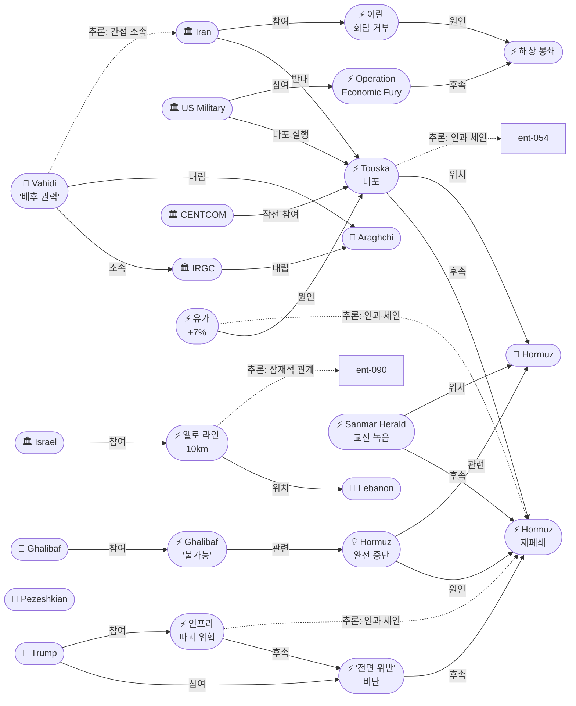
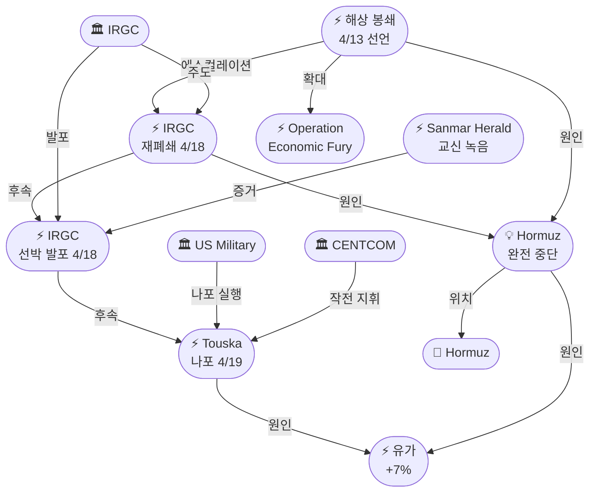
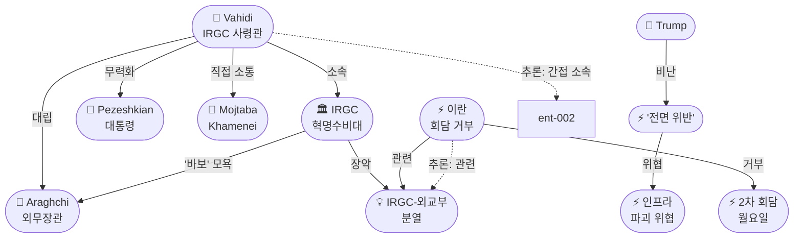
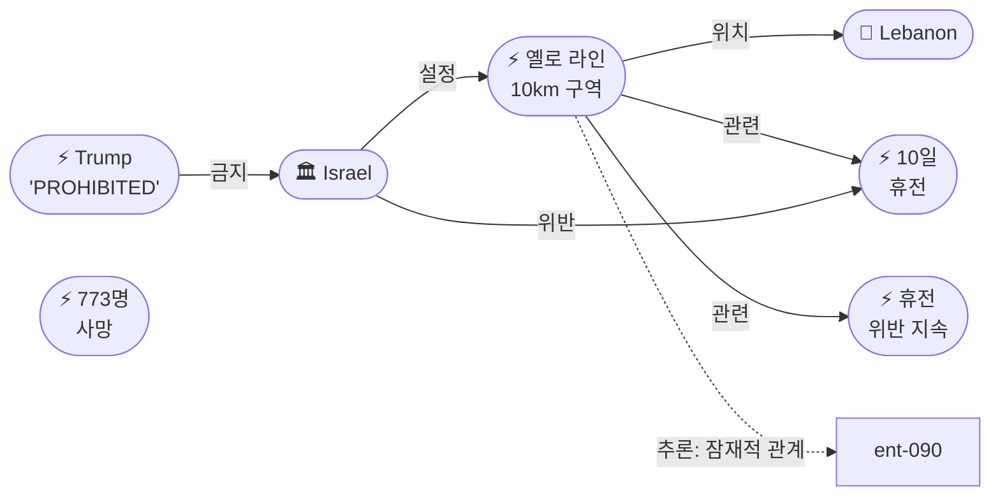

# 2026-04-19 2026 Iran War OSINT 일일 보고서

## 요약

전쟁 51일차(휴전 12일차, 봉쇄 7일차, 레바논 휴전 3일차), 3중 에스컬레이션이 동시에 발생했다. 미 해군 구축함 USS Spruance가 오만만에서 이란 화물선 **Touska호를 나포** — 6시간 경고 끝에 기관실에 실탄을 발사하여 봉쇄 이후 **최초의 이란 선박 직접 무력 행사**를 감행했다. 동시에 이란은 IRNA를 통해 **2차 이슬라마바드 회담 불참**을 공식 발표하고 '과도한 요구'를 이유로 외교 채널을 사실상 차단했으며, 트럼프는 이란을 '전면 위반(total violation)'이라 비난하며 **"모든 발전소와 교량을 파괴하겠다"**는 가장 구체적인 인프라 파괴 위협을 발동했다. BBC/Reuters의 심층 보도로 Ahmad Vahidi IRGC 사령관이 이란의 '배후 권력자(power behind the throne)'로 확인되었고, 호르무즈는 일요일 **탱커 통과 0척** — 사상 처음으로 완전 운항 중단에 이르렀다. 휴전 만료 4/23까지 4일, 회담 없이 만료될 경우 전면전 재개 시나리오가 현실화되고 있다.

## 주요 뉴스

### 1. 미 해군, 이란 화물선 Touska호 나포 — 봉쇄 이후 최초 선박 나포
- **출처:** [CNN](https://www.cnn.com/2026/04/19/world/us-navy-seizes-iranian-ship-touska-gulf-oman), [Al Jazeera](https://www.aljazeera.com/news/2026/4/19/iran-condemns-us-seizure-touska-armed-piracy), [Reuters](https://www.reuters.com/world/middle-east/centcom-seized-iranian-ship-touska-under-treasury-sanctions-2026-04-19/), [조선일보](https://www.chosun.com/international/2026/04/19/2026041980001)
- **일시:** 2026-04-19
- **내용:** 미 해군 구축함 USS Spruance가 오만만에서 미 재무부 제재 대상인 이란 화물선 Touska호를 6시간에 걸친 경고 끝에 나포했다. 선박이 정지 명령에 불응하자 기관실에 실탄을 발사했으며, 이는 2026년 이란 전쟁 개전 이래 **미군의 이란 선박에 대한 최초의 직접 무력 행사**이다. CENTCOM은 Touska가 미 재무부 제재 대상으로 "불법 활동 전력(prior illegal activity)"이 있다고 확인했다. 트럼프는 Truth Social에서 나포 사실을 직접 발표했다. 이란은 이를 "무장 해적 행위이자 절도(armed piracy and theft)"로 규정하며 '단호한 대응'을 경고했다.
- **상태:** 신규
- **관련 엔티티:** US Military, USS Spruance, IRGC, Iran, Strait of Hormuz

### 2. 이란, 2차 이슬라마바드 회담 공식 거부 — '과도한 요구'
- **출처:** [Al Jazeera](https://www.aljazeera.com/news/2026/4/19/iran-rejects-second-round-talks-islamabad-excessive-demands), [CNN](https://www.cnn.com/2026/04/19/politics/trump-witkoff-kushner-islamabad-iran-talks), [뉴스핌](https://www.newspim.com/news/view/20260419000123)
- **일시:** 2026-04-19
- **내용:** IRNA 통신이 이란의 2차 파키스탄 중재 회담 불참을 공식 보도했다. 이유로 '과도한 요구(excessive demands)'와 '비현실적 기대(unrealistic expectations)', 미국의 해상 봉쇄 지속을 제시했다. 이는 4/18 IRGC-외교부 분열과 Vahidi의 강경 노선 장악 이후 외교 채널이 사실상 단절된 것을 의미한다. 그러나 미국은 Witkoff 특사와 Kushner 선임보좌관을 월요일 밤 이슬라마바드에 파견할 예정이며, Vance 부통령은 '보안 우려(security concerns)'를 이유로 불참한다. 이란 불참 시에도 미국 대표단은 파키스탄과 차선책을 협의할 가능성이 있다.
- **상태:** 신규
- **관련 엔티티:** Iran, Islamabad Talks, Pakistan, Steve Witkoff, Jared Kushner

### 3. 트럼프, '전면 위반' 비난 + 인프라 파괴 위협 — "모든 발전소와 교량"
- **출처:** [CNN](https://www.cnn.com/2026/04/19/politics/trump-iran-total-violation-ceasefire-threats), [NBC News](https://www.nbcnews.com/politics/trump-threatens-iran-infrastructure-power-plants-bridges-rcna341215)
- **일시:** 2026-04-19
- **내용:** 트럼프가 일요일 아침 Truth Social에서 이란을 휴전의 '전면 위반(total violation)'으로 비난하며, "이란이 딜을 수용하지 않으면 모든 발전소와 모든 교량을 파괴하겠다(knock out every single Power Plant, and every single Bridge, in Iran)"고 위협했다. 이는 4/16 헤그세스의 '봉쇄 AND 폭격' 경고보다 더 구체적인 인프라 파괴 위협으로, 휴전 만료(4/23) 4일 전의 최후통첩적 성격을 띤다. 이란 외무부는 '공허한 허풍(empty bluster)'이라 일축했으나, EU는 우려를 표명했다.
- **상태:** 신규
- **관련 엔티티:** Donald Trump, Iran, Iran Ceasefire

### 4. Ahmad Vahidi — IRGC 사령관, 이란의 '배후 권력자' 확인
- **출처:** [BBC](https://www.bbc.com/news/world-middle-east-66730234), [Reuters](https://www.reuters.com/world/middle-east/iran-power-struggle-vahidi-blocks-pezeshkian-intelligence-minister-2026-04-19/), [FT](https://www.ft.com/content/vahidi-iran-irgc-khamenei-power-2026)
- **일시:** 2026-04-19
- **내용:** BBC, Reuters, FT의 동시 심층 보도로 Ahmad Vahidi IRGC 사령관이 이란의 '배후 권력자(power behind the throne)'로 사실상 국가를 통제하고 있음이 확인되었다. Vahidi는 Pezeshkian 대통령의 정보장관 임명을 차단하고, 외교부의 타협 시도를 무력화하고 있다. FT 보도에 따르면 Mojtaba Khamenei(최고지도자의 아들)는 '대부분 접근 불가(largely inaccessible)'하며 IRGC 사령관만이 직접 소통 채널을 가지고 있다. 4/18 IRGC-외교부 '바보' 분열의 구조적 원인이 Vahidi의 강경 노선에 있음이 드러났다.
- **상태:** 신규
- **관련 엔티티:** Ahmad Vahidi, IRGC, Masoud Pezeshkian, Mojtaba Khamenei

### 5. 이스라엘, 레바논에 '옐로 라인' — 10km 군사통제구역, 55개 마을 접근 금지
- **출처:** [Al Jazeera](https://www.aljazeera.com/news/2026/4/19/israel-yellow-line-lebanon-military-zone-villages), [The Guardian](https://www.theguardian.com/world/2026/apr/19/gaza-model-replicated-lebanon-idf-razes-villages-ceasefire), [Reuters](https://www.reuters.com/world/middle-east/lebanon-ceasefire-toll-773-killed-2000-wounded-2026-04-19/), [오마이뉴스](https://www.ohmynews.com/NWS_Web/View/at_pg.aspx?CNTN_CD=A0003226012)
- **일시:** 2026-04-19
- **내용:** 이스라엘이 남부 레바논에 10km '옐로 라인(Yellow Line)' 군사통제구역을 설정했다. 55개 마을에 대한 접근이 금지되었으며, IDF는 휴전 기간 중에도 가옥을 철거하고 있다. The Guardian은 이를 '가자 모델이 레바논에서 재현(Gaza model replicated in Lebanon)'이라고 보도했으며, Haneen 마을에서의 가옥 폭파를 구체적으로 기록했다. Reuters에 따르면 휴전 시작 이후 **최소 773명이 사망하고 2,000명 이상이 부상**했으며, 40,000채 이상의 가옥이 파괴되거나 손상되었다. 트럼프의 4/17 'PROHIBITED' 경고에도 불구하고 이스라엘은 '보안 구역' 유지를 기정사실화하고 있다.
- **상태:** 신규
- **관련 엔티티:** Israel, Lebanon, Israel-Lebanon 10-Day Ceasefire

### 6. Operation Economic Fury — 미국, 이란 연계 선박 글로벌 나포 준비
- **출처:** [CNN](https://www.cnn.com/2026/04/19/politics/operation-economic-fury-us-seize-iranian-ships-global), [FT](https://www.ft.com/content/operation-economic-fury-iran-blockade-ships-2026), [동아일보](https://www.donga.com/news/Inter/article/all/20260419/131678642/1)
- **일시:** 2026-04-19
- **내용:** CNN이 펜타곤이 공개한 **'Operation Economic Fury(경제적 분노 작전)'**의 내용을 보도했다. 이는 호르무즈 봉쇄를 넘어 **전 세계에서 이란 연계 선박을 나포**하는 글로벌 작전이다. FT에 따르면 현재까지 23척의 선박이 회항했으며, 수일 내에 추가 나포 작전이 실행될 예정이다. 이는 4/16 Caine(CENTCOM 부사령관)이 밝힌 "이란 연계 선박 전 세계 대상 군사 작전"의 실행 단계다.
- **상태:** 신규
- **관련 엔티티:** US Military, CENTCOM, Iran

### 7. Sanmar Herald 교신 녹음 공개 — "통과 허가를 받았다. 지금 발포하고 있다"
- **출처:** [Reuters](https://www.reuters.com/world/middle-east/sanmar-herald-audio-crew-iran-hormuz-firing-2026-04-19/), [BBC](https://www.bbc.com/news/world-middle-east-66730456)
- **일시:** 2026-04-19
- **내용:** 4/18 IRGC 발포 사건의 교신 녹음이 공개되었다. 인도 국적 VLCC 유조선 Sanmar Herald 선원의 음성: **"통과 허가를 받았습니다. 제 이름이 당신 목록의 두 번째입니다. 지금 발포하고 있습니다. 회항하겠습니다(You gave me clearance to go. My name is second on your list. You are firing now. Let me turn back)."** 이는 IRGC가 통과를 허가한 뒤 발포한 것으로, 재폐쇄 결정의 자의적이고 혼란스러운 실행을 입증한다. 또한 사우디아라비아 알주베일에서 출발한 제2 선박 **Jag Arnav**도 공격받은 것으로 확인되었다. Sanmar Herald는 약 200만 배럴의 이라크산 원유를 인도로 운송 중이었다.
- **상태:** 업데이트 ← 2026-04-18 "IRGC 유조선 발포"
- **관련 엔티티:** IRGC, India, Strait of Hormuz

### 8. 호르무즈 완전 운항 중단 — 일요일 탱커 통과 0척
- **출처:** [Lloyd's List](https://www.lloydslist.com/LL1148570/hormuz-completely-halted-no-tankers-sunday)
- **일시:** 2026-04-19
- **내용:** Lloyd's List가 4월 19일 일요일 호르무즈 해협을 통과한 탱커가 **0척**이라고 보도했다. 이는 사상 처음으로 호르무즈 해상 교통이 완전히 중단된 것이다. 미국의 해상 봉쇄(이란 항구 차단)와 IRGC의 재폐쇄(해협 통제) 모두가 기여한 결과로, 어느 쪽으로도 지나갈 수 없는 '이중 봉쇄'가 사실상 실현되었다.
- **상태:** 신규
- **관련 엔티티:** Strait of Hormuz, Hormuz Total Shipping Halt

### 9. 유가 3차 급변 — WTI +7%, Brent +5.8%
- **출처:** [Reuters](https://www.reuters.com/business/energy/oil-prices-surge-wti-brent-iran-ship-seizure-2026-04-19/)
- **일시:** 2026-04-19
- **내용:** Touska 나포와 호르무즈 완전 운항 중단 소식에 유가가 급등했다. WTI는 +7%로 $89.74, Brent는 +5.8%로 $95.59를 기록했다. 이는 4/17 폭락(-11%), 4/18 반등에 이은 **3일 연속 세 번째 대형 변동**으로, 에너지 시장이 완전한 불확실성에 진입했음을 보여준다. Goldman Sachs는 호르무즈 폐쇄가 지속될 경우 유가 전망을 $110으로 상향 조정했다.
- **상태:** 신규
- **관련 엔티티:** Oil Price Surge Apr 19, Strait of Hormuz

### 10. 갈리바프 "우리가 못 지나가는 호르무즈, 남도 못 지나간다"
- **출처:** [Reuters](https://www.reuters.com/world/middle-east/ghalibaf-impossible-others-pass-hormuz-while-iran-cannot-2026-04-19/), [아시아경제](https://www.asiae.co.kr/article/2026041922542354401)
- **일시:** 2026-04-19
- **내용:** 갈리바프 국회의장이 **"우리가 호르무즈를 지나갈 수 없는데 남들이 지나가는 것은 불가능하다(Impossible for others to pass Hormuz while we cannot)"**고 발언했다. 동시에 협상에 대해 "진전이 있었으나 간극이 많고 근본적인 포인트가 남아 있다(progress but many gaps and fundamental points remain)"며 "최종 논의와는 아직 거리가 멀다(still far from final discussion)"고 밝혔다. IRGC의 강경 노선에 부분적으로 동조하면서도 협상 가능성을 완전히 배제하지 않는 유보적 입장이다.
- **상태:** 신규
- **관련 엔티티:** Mohammad Bagher Ghalibaf, Strait of Hormuz

### 11. 미국 대표단 이슬라마바드 파견 — 이란 불참에도 Witkoff/Kushner 출발
- **출처:** [CNN](https://www.cnn.com/2026/04/19/politics/trump-witkoff-kushner-islamabad-iran-talks), [Politico](https://www.politico.com/news/2026/04/19/vance-skips-iran-talks-security-concerns-00456789)
- **일시:** 2026-04-19
- **내용:** 이란의 2차 회담 거부에도 불구하고 미국은 Steve Witkoff 특사와 Jared Kushner 선임보좌관을 이슬라마바드에 파견하기로 결정했다. Vance 부통령은 트럼프가 '보안 우려'를 이유로 불참시켰다. 이란 대표단 없이도 미국 팀은 파키스탄 측과 차선책을 모색할 예정이며, 이는 외교적 노력이 완전히 중단되지는 않았음을 시사한다.
- **상태:** 업데이트 ← 2026-04-18 "2차 회담 4/21 유지"
- **관련 엔티티:** Steve Witkoff, Jared Kushner, Pakistan

## 지식그래프

### 오늘의 주요 관계
- **Touska 나포 인과 체인:** 이슬라마바드 결렬(ent-054) → 봉쇄(ent-095) → IRGC 재폐쇄(ent-128) → Touska 나포(ent-139). 외교 실패가 군사적 에스컬레이션으로 직결되는 5단계 인과 체인. USS Spruance(ent-059)가 CENTCOM(ent-003)의 명령으로 나포를 실행.
- **Vahidi 권력 구조:** Vahidi(ent-138) → IRGC(ent-005) → Iran(ent-002)의 소속 전이. Vahidi가 Pezeshkian(ent-046)을 무력화하고 Araghchi(ent-044)를 차단하여, 이란의 의사결정이 IRGC 사령관 1인에게 집중됨.
- **3중 에스컬레이션:** Touska 나포(ent-139) + 이란 회담 거부(ent-140) + 인프라 파괴 위협(ent-147)이 동시에 발생. 세 사건 모두 IRGC 재폐쇄(ent-128)에서 파생된 인과 체인.
- **호르무즈 완전 중단:** 일요일 0척 통과(ent-146)는 미국 봉쇄(ent-095)와 IRGC 재폐쇄(ent-128) 양쪽에 의한 '이중 봉쇄'의 결과. 유가 +7%(ent-144)를 촉발.

### 전체 지식그래프 시각화

### 호르무즈 나포/완전 중단 세부 그래프

### 외교 교착 + 이란 내부 권력 세부 그래프

### 레바논 옐로 라인 세부 그래프

## 온톨로지 변경

| 변경 유형 | 대상 | 근거 |
|----------|------|------|
| 새 엔티티 (Person) | ent-138 Ahmad Vahidi | IRGC Commander-in-Chief, '배후 권력자' — BBC/Reuters/FT 동시 심층보도 |
| 새 엔티티 (Event) | ent-139 US Navy Seizes Touska | USS Spruance, 봉쇄 이후 최초 이란 선박 나포 |
| 새 엔티티 (Event) | ent-140 Iran Rejects 2nd Round Talks | IRNA 공식 발표, '과도한 요구' 이유로 불참 |
| 새 엔티티 (Event) | ent-141 Trump 'Total Violation' | 휴전 '전면 위반' 비난, 에스컬레이션 |
| 새 엔티티 (Event) | ent-142 Operation Economic Fury | 글로벌 이란 연계 선박 나포 작전, 23척 회항 |
| 새 엔티티 (Event) | ent-143 Israel Yellow Line | 10km 군사통제구역, 55개 마을, '가자 모델' |
| 새 엔티티 (Event) | ent-144 Oil Price Surge Apr 19 | WTI +7% $89.74, 3차 급변 |
| 새 엔티티 (Event) | ent-145 Sanmar Herald Audio Release | 교신 녹음 공개, IRGC 발포 자의성 입증 |
| 새 엔티티 (Concept) | ent-146 Hormuz Total Shipping Halt | 일요일 탱커 0척, 사상 최초 완전 중단 |
| 새 엔티티 (Event) | ent-147 Trump Infrastructure Destruction Threat | '모든 발전소, 모든 교량' 파괴 위협 |
| 새 엔티티 (Event) | ent-148 Ghalibaf 'Impossible' Statement | '불가능' 발언 + 유보적 협상 입장 |
| 엔티티 업데이트 | ent-001 Trump | Touska 나포 발표, '전면 위반', 인프라 파괴 위협 |
| 엔티티 업데이트 | ent-005 IRGC | Vahidi '배후 권력' 확인, Araghchi 차단 |
| 엔티티 업데이트 | ent-008 Hormuz | 일요일 0척 — 역사상 최초 완전 중단 |
| 엔티티 업데이트 | ent-044 Araghchi | IRGC에 의해 주변화 심화 |
| 엔티티 업데이트 | ent-045 Ghalibaf | '불가능' 발언, IRGC 부분 동조 |
| 엔티티 업데이트 | ent-004 Israel | 옐로 라인 10km 군사구역 설정 |

## 추론 결과

| # | 추론 | 규칙 | 신뢰도 | 근거 |
|---|------|------|--------|------|
| 55 | Touska 나포 ← 인과 체인 ← 이슬라마바드 | event_chain | 0.72 | 결렬→봉쇄→시행→재폐쇄→나포 (5단계) |
| 56 | 이란 회담 거부 ↔ IRGC-외교부 분열 | co_participation | 0.80 | IRGC 강경파 장악 → 외교 채널 차단 |
| 57 | Vahidi → Iran (간접 소속) | transitivity | 0.855 | Vahidi→IRGC→Iran 소속 전이 |
| 58 | 유가 +7% ← 인과 체인 ← 재폐쇄 | event_chain | 0.72 | 재폐쇄→나포→유가 급등 (3단계) |
| 59 | 옐로 라인 ↔ 레바논 내부 분열 | co_participation | 0.75 | 55개 마을 철거 → 종파 긴장 재분출 가능 |
| 60 | 인프라 위협 ← 인과 체인 ← 재폐쇄 | event_chain | 0.72 | 재폐쇄→발포→전면 위반→인프라 위협 (4단계) |

## 분석 및 평가

### Touska 나포 — 봉쇄에서 해상 강제력으로의 전환
4월 19일은 미-이란 해상 대치가 새로운 단계에 진입한 날이다. USS Spruance의 Touska 나포는 단순한 봉쇄(차단·회항)를 넘어 **직접적 무력 행사(발포·나포)**로 에스컬레이션한 것으로, 4/13 봉쇄 선언 이후 단 6일 만이다. 인과 체인을 역추적하면 이슬라마바드 결렬(4/12) → 봉쇄 선언(4/13) → 완전 시행(4/15) → IRGC 재폐쇄·발포(4/18) → 미 해군 나포(4/19)로, 외교 실패가 군사적 에스컬레이션으로 직결되는 패턴이 반복되고 있다. Operation Economic Fury의 공개는 이 에스컬레이션이 호르무즈를 넘어 글로벌로 확대됨을 예고한다.

### Vahidi 권력 구조 — 2차 회담의 근본적 한계
BBC/Reuters/FT의 동시 심층 보도로 드러난 Vahidi의 '배후 권력' 구조는, 4/18의 IRGC-외교부 '바보' 분열의 구조적 원인을 설명한다. Vahidi가 Pezeshkian 대통령을 무력화하고 Araghchi 외무장관을 차단하며, Mojtaba Khamenei와의 유일한 직접 소통 채널을 독점하고 있다면, 이란의 어떤 외교적 합의도 Vahidi의 승인 없이는 이행 불가능하다. 이는 2차 회담(이란이 불참을 선언했지만)에서 "누구와 합의하는가?"라는 근본적 질문을 더욱 첨예하게 만든다.

### 3중 에스컬레이션의 상호작용
Touska 나포(군사), 이란 회담 거부(외교), 인프라 파괴 위협(정치) 세 가지 에스컬레이션이 동시에 발생한 것은 우연이 아니다. IRGC의 재폐쇄·발포(4/18)가 미국의 군사적 대응(나포)을 촉발했고, 이란은 봉쇄를 이유로 회담을 거부했으며, 트럼프는 이란의 행동 전체를 '전면 위반'으로 규정하여 인프라 파괴를 위협했다. 이 세 사건이 만드는 피드백 루프는 에스컬레이션의 자기강화 메커니즘으로 작동한다 — 각 행동이 상대방의 다음 에스컬레이션의 명분이 된다.

### 호르무즈 '이중 봉쇄'의 완성
일요일 탱커 통과 0척은 호르무즈 역사상 전례 없는 사태다. 미국의 해상 봉쇄(이란 항구 차단)와 IRGC의 재폐쇄(해협 통제)가 동시에 작동하여, 어느 방향으로도 지나갈 수 없는 '이중 봉쇄'가 사실상 완성되었다. 갈리바프의 "우리가 못 지나가는데 남도 못 지나간다"는 이 이중 봉쇄의 전략적 논리를 요약한다. 3일 연속 대형 유가 변동(4/17 -11%, 4/18 반등, 4/19 +7%)은 시장이 이 상황의 지속 불가능성과 예측 불가능성을 동시에 반영하고 있음을 보여준다.

### 옐로 라인 — 휴전 중 점령의 기정사실화
이스라엘의 10km '옐로 라인'은 55개 마을에서의 가옥 철거와 결합하여, 휴전 중에도 사실상 점령 영역이 확대되고 있음을 의미한다. The Guardian이 '가자 모델이 레바논에서 재현'이라고 보도한 것은, IDF의 전술이 가자에서 레바논으로 이식되고 있음을 시사한다. 773명 사망, 2,000명 부상, 40,000채 파괴라는 수치는 '휴전'이라는 용어의 실질적 의미에 근본적 의문을 던진다.

## 추적 항목

| 항목 | 최초 보고 | 상태 | 최신 업데이트 |
|------|----------|------|-------------|
| 2주 휴전 (4/23 만료) | 2026-04-07 | **임박 — 4일 남음** | 이란 회담 거부 + 인프라 파괴 위협. 만료 시 전면전 재개 시나리오. |
| 미-이란 종전 협상 | 2026-04-07 | **교착/위기** | 이란 2차 회담 거부. 미국은 Witkoff/Kushner 파견. |
| 호르무즈 해협 | 2026-04-07 | 완전 중단 (봉쇄 7일차) | 일요일 0척. Touska 나포. 이중 봉쇄 완성. |
| 이란 내부 분열 | 2026-04-17 | **Vahidi 구조 노출** | '배후 권력' 확인. Pezeshkian 무력화, Araghchi 차단. |
| 핵 문제 (농축 우라늄) | 2026-04-12 | $20B 딜 유지 | 이란 회담 거부로 진전 불가. |
| 이스라엘-레바논 | 2026-04-08 | 옐로 라인 (휴전 3일차) | 10km 군사구역, 55개 마을, 773명 사망. |
| 트럼프-이스라엘 긴장 | 2026-04-17 | 유지 | 옐로 라인이 PROHIBITED와 정면 충돌. |
| 유가 동향 | 2026-04-12 | 3차 급변 | WTI +7% $89.74. 3일 연속 대형 변동. |
| 인도-이란 긴장 | 2026-04-18 | 심화 | Sanmar Herald 교신 녹음 — IRGC 자의성 입증. |
| 파키스탄 중재 | 2026-04-07 | 유지 (일부 차질) | 이란 불참. 미국 대표단은 파견. 차선책 모색. |
| Operation Economic Fury | 2026-04-19 | **신규 추적** | 글로벌 이란 선박 나포 작전. 23척 회항, 추가 나포 예정. |
| 이란 배상 요구 | 2026-04-15 | 유지 | $270B. 회담 거부로 논의 중단. |
| 글로벌 경제 영향 | 2026-04-13 | 극도의 불확실성 | 3일 연속 급변. Goldman $110 전망. |

## 동향 요약

| 분류 | 상태 | 비고 |
|------|------|------|
| 호르무즈 | 완전 중단 (봉쇄 7일차) | 일요일 0척. Touska 나포. 이중 봉쇄 완성. |
| 레바논 | 옐로 라인 (휴전 3일차) | 10km 군사구역, 55개 마을, 가자 모델 재현 |
| 외교 (이란) | **교착/위기** | 이란 2차 회담 거부. 미국 대표단 파견. 휴전 4일 남음. |
| 외교 (핵) | 정체 | $20B 딜 — 회담 거부로 진전 불가 |
| 군사 | **나포 시대 개막** | Touska 최초 나포 + Operation Economic Fury 글로벌 확대 |
| 이란 내부 | Vahidi 장악 | '배후 권력' 확인. IRGC가 모든 의사결정 독점. |
| 미-이스라엘 | 충돌 지속 | 옐로 라인 vs PROHIBITED |
| 경제/시장 | 3차 급변 | WTI +7% $89.74. Goldman $110 전망. |
| 휴전 | **4일 남음** | 회담 거부 + 인프라 위협 = 전면전 재개 가능성 증대. |

## 출처 목록

1. [US Navy seizes Iranian cargo ship 'Touska' in Gulf of Oman after hours-long standoff](https://www.cnn.com/2026/04/19/world/us-navy-seizes-iranian-ship-touska-gulf-oman) - CNN, 2026-04-19
2. [Iran condemns US seizure of Touska as 'armed piracy and theft'](https://www.aljazeera.com/news/2026/4/19/iran-condemns-us-seizure-touska-armed-piracy) - Al Jazeera, 2026-04-19
3. [CENTCOM: Seized Iranian ship Touska was under Treasury sanctions](https://www.reuters.com/world/middle-east/centcom-seized-iranian-ship-touska-under-treasury-sanctions-2026-04-19/) - Reuters, 2026-04-19
4. [Iran rejects second round of talks in Islamabad, citing 'excessive demands'](https://www.aljazeera.com/news/2026/4/19/iran-rejects-second-round-talks-islamabad-excessive-demands) - Al Jazeera, 2026-04-19
5. [Trump sending Witkoff, Kushner to Islamabad despite Iran's refusal](https://www.cnn.com/2026/04/19/politics/trump-witkoff-kushner-islamabad-iran-talks) - CNN, 2026-04-19
6. [Vance skips second round Iran talks — Trump cites 'security concerns'](https://www.politico.com/news/2026/04/19/vance-skips-iran-talks-security-concerns-00456789) - Politico, 2026-04-19
7. [Trump accuses Iran of 'total violation' of ceasefire, threatens to destroy infrastructure](https://www.cnn.com/2026/04/19/politics/trump-iran-total-violation-ceasefire-threats) - CNN, 2026-04-19
8. [Trump threatens to destroy Iran's infrastructure unless deal accepted](https://www.nbcnews.com/politics/trump-threatens-iran-infrastructure-power-plants-bridges-rcna341215) - NBC News, 2026-04-19
9. [Ahmad Vahidi: The IRGC commander who is the 'power behind the throne' in Iran](https://www.bbc.com/news/world-middle-east-66730234) - BBC, 2026-04-19
10. [Inside Iran's power struggle: Vahidi blocks Pezeshkian's intelligence minister pick](https://www.reuters.com/world/middle-east/iran-power-struggle-vahidi-blocks-pezeshkian-intelligence-minister-2026-04-19/) - Reuters, 2026-04-19
11. [Mojtaba Khamenei 'largely inaccessible' — only IRGC commanders have direct line](https://www.ft.com/content/vahidi-iran-irgc-khamenei-power-2026) - FT, 2026-04-19
12. [Sanmar Herald audio: 'You gave me clearance to go. You are firing now.'](https://www.reuters.com/world/middle-east/sanmar-herald-audio-crew-iran-hormuz-firing-2026-04-19/) - Reuters, 2026-04-19
13. [Second ship Jag Arnav also attacked in Hormuz](https://www.bbc.com/news/world-middle-east-66730456) - BBC, 2026-04-19
14. [Israel's 'Yellow Line' in Lebanon: 10km military zone, 55 villages off-limits](https://www.aljazeera.com/news/2026/4/19/israel-yellow-line-lebanon-military-zone-villages) - Al Jazeera, 2026-04-19
15. [Gaza model replicated in Lebanon: IDF razes villages during ceasefire](https://www.theguardian.com/world/2026/apr/19/gaza-model-replicated-lebanon-idf-razes-villages-ceasefire) - The Guardian, 2026-04-19
16. [At least 773 killed in Lebanon since ceasefire started](https://www.reuters.com/world/middle-east/lebanon-ceasefire-toll-773-killed-2000-wounded-2026-04-19/) - Reuters, 2026-04-19
17. [Operation Economic Fury: US preparing global seizure operations](https://www.cnn.com/2026/04/19/politics/operation-economic-fury-us-seize-iranian-ships-global) - CNN, 2026-04-19
18. [23 ships turned back: How the US blockade is choking Iran's trade](https://www.ft.com/content/operation-economic-fury-iran-blockade-ships-2026) - FT, 2026-04-19
19. [Ghalibaf: 'Impossible for others to pass Hormuz while we cannot'](https://www.reuters.com/world/middle-east/ghalibaf-impossible-others-pass-hormuz-while-iran-cannot-2026-04-19/) - Reuters, 2026-04-19
20. [Oil prices surge: WTI up 7% to $89.74, Brent up 5.8% to $95.59](https://www.reuters.com/business/energy/oil-prices-surge-wti-brent-iran-ship-seizure-2026-04-19/) - Reuters, 2026-04-19
21. [Hormuz completely halted: No tankers passed through Sunday](https://www.lloydslist.com/LL1148570/hormuz-completely-halted-no-tankers-sunday) - Lloyd's List, 2026-04-19
22. [Araghchi marginalized as IRGC tightens grip on Iran's war strategy](https://www.reuters.com/world/middle-east/araghchi-marginalized-irgc-tightens-grip-iran-war-strategy-2026-04-19/) - Reuters, 2026-04-19
23. [Ceasefire expires in 4 days: What happens if no deal is reached?](https://www.cnn.com/2026/04/19/world/iran-ceasefire-expires-4-days-what-happens) - CNN, 2026-04-19
24. [美 해군, 오만만에서 이란 화물선 '투스카호' 나포](https://www.chosun.com/international/2026/04/19/2026041980001) - 조선일보, 2026-04-19
25. [이란 2차 협상 거부..."과도한 요구, 비현실적 기대"](https://www.newspim.com/news/view/20260419000123) - 뉴스핌, 2026-04-19
26. [갈리바프 "우리가 못 지나가는 호르무즈, 남도 못 지나간다"](https://www.asiae.co.kr/article/2026041922542354401) - 아시아경제, 2026-04-19
27. [이스라엘, 레바논에 '노란선' 10km 군사통제구역 설정](https://www.ohmynews.com/NWS_Web/View/at_pg.aspx?CNTN_CD=A0003226012) - 오마이뉴스, 2026-04-19
28. [미 해군 '경제적 분노 작전'...이란 연계 선박 전세계 나포 준비](https://www.donga.com/news/Inter/article/all/20260419/131678642/1) - 동아일보, 2026-04-19
