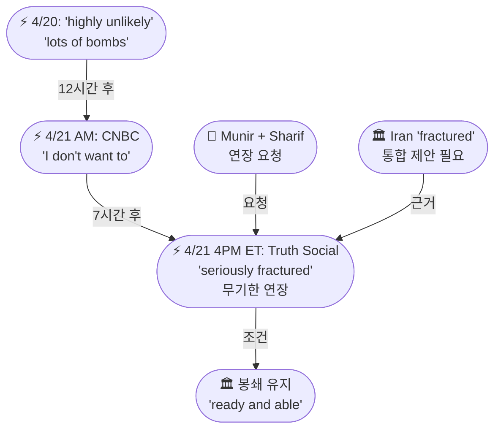
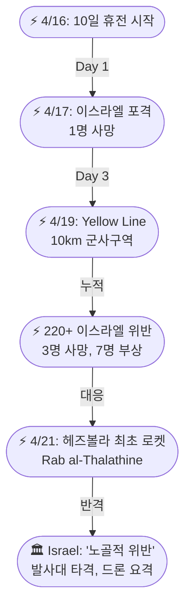

# 2026-04-21 2026 Iran War OSINT 일일 보고서

## 요약

전쟁 53일차(휴전 14일차, 봉쇄 9일차, 레바논 휴전 5일차), 트럼프가 **24시간 만에 180도 선회**하여 휴전을 **무기한 연장**했다. 전날 "연장 거의 불가능"이라던 트럼프는 오전 CNBC에서 "연장하고 싶지 않다(I don't want to)"고 말했으나, **장 마감 10분 후 Truth Social에서 이란 정부가 "심각하게 분열(seriously fractured)"되었다며 "통합 제안이 제출될 때까지" 휴전을 연장한다고 발표**했다. 파키스탄의 **무니르 원수와 샤리프 총리의 요청**을 직접 인용했으며, 해상 봉쇄는 유지한다고 못 박았다. 이란은 파키스탄 중개인을 통해 **협상은 "시간 낭비(waste of time)"**라고 공식 통보했고, IRGC는 휴전 연장을 **"미국 대통령의 우스꽝스러운 쇼(ridiculous spectacle)"**라고 일축했다. 레바논에서는 헤즈볼라가 **휴전 이후 최초로 이스라엘군에 로켓을 발사**하여 휴전 붕괴 신호를 보냈고, 이스라엘은 미국과 **전쟁 재개를 공동으로 준비**하고 있다는 보도가 나왔다.

## 주요 뉴스

### 1. 트럼프, 24시간 만에 180도 선회 — 휴전 무기한 연장

- **출처:** [CNN](https://www.cnn.com/2026/04/21/world/live-news/iran-war-us-trump-israel), [CNBC](https://www.cnbc.com/2026/04/21/trump-iran-war-ceasefire.html), [Axios](https://www.axios.com/2026/04/21/trump-iran-war-ceasefire-extension), [NBC News](https://www.nbcnews.com/world/iran/live-blog/live-updates-iran-war-trump-peace-talks-vance-ceasefire-ship-hormuz-rcna341149), [NPR](https://www.npr.org/2026/04/21/nx-s1-5793638/iran-middle-east-updates), [Al Jazeera](https://www.aljazeera.com/news/2026/4/21/trump-announces-extending-iran-ceasefire-but-says-blockade-remains), [Time](https://time.com/article/2026/04/21/iran-us-trump-war-ceasefire-talks-stalemate/), [CBS News](https://www.cbsnews.com/live-updates/us-iran-war-trump-ceasefire-pakistan-peace-talks-ultimatum/)
- **일시:** 2026-04-21
- **내용:** 트럼프의 입장은 24시간 내 세 차례 변화했다. (1) 4/20 Bloomberg·PBS: "연장 거의 불가능, 딜 없으면 폭탄" → (2) 4/21 오전 CNBC Squawk Box: "연장하고 싶지 않다(I don't want to)" → (3) 4/21 오후 ~4pm ET Truth Social: **무기한 연장 선언**. 장 마감 10분 후에 게시한 것은 시장 충격 관리로 해석된다. 핵심 문구: *"Based on the fact that the Government of Iran is seriously fractured, not unexpectedly so and, upon the request of Field Marshal Asim Munir, and Prime Minister Shehbaz Sharif, of Pakistan, we have been asked to hold our Attack on the Country of Iran."* 봉쇄는 유지("continue the Blockade and, in all other respects, remain ready and able").
- **상태:** 신규
- **관련 엔티티:** Donald Trump, Asim Munir, Shehbaz Sharif, Pakistan, Iran

### 2. 이란 공식 거부: 협상은 '시간 낭비' — IRGC '우스꽝스러운 쇼'

- **출처:** [Al Jazeera](https://www.aljazeera.com/news/2026/4/21/pakistan-races-against-time-to-get-iran-back-to-us-talks-as-truce-end-nears), [NPR](https://www.npr.org/2026/04/21/nx-s1-5793638/iran-middle-east-updates), [Times of Israel](https://www.timesofisrael.com/liveblog-april-21-2026/), [CNBC](https://www.cnbc.com/2026/04/21/new-cards-on-the-battlefield-us-iran-ratchet-up-rhetoric-with-peace-talks-in-limbo.html)
- **일시:** 2026-04-21
- **내용:** 이란은 파키스탄 중개인을 통해 **"협상은 시간 낭비"**라고 미국 측에 공식 전달했다. 3가지 거부 사유: (1) 레바논을 포함하지 않는 휴전, (2) 과도한 미국 요구, (3) 해상 봉쇄. 이란 외무부는 봉쇄를 **"전쟁 행위(act of war)"**로 규정했다. 갈리바프 국회의장 측근은 X에 **"트럼프의 휴전 연장은 아무 의미 없다, 패배한 쪽이 조건을 지시할 수 없다(the losing side cannot dictate terms)"**고 게시했다. IRGC는 **"이 나라의 적들에게 미국 대통령의 우스꽝스러운 쇼를 통해 해협이 열리지 않을 것(the strait will not be opened to the enemies of this nation through the ridiculous spectacle by the president of the US)"**이라고 일축했다. Tasnim 통신: "이란의 불참 결정에 변화 없음."
- **상태:** 업데이트 ← 2026-04-19 "이란 2차 회담 거부"
- **관련 엔티티:** Iran, IRGC, Mohammad Bagher Ghalibaf, Abbas Araghchi

### 3. 밴스 이슬라마바드행 무기한 연기 — 2차 회담 사실상 무산

- **출처:** [Axios](https://www.axios.com/2026/04/21/iran-us-war-peace-talks-vance-pakistan), [CNBC](https://www.cnbc.com/2026/04/21/trump-vance-iran-war-pakistan.html), [Euronews](https://www.euronews.com/2026/04/21/us-iran-ceasefire-on-brink-of-collapse-as-talks-stall-and-strait-of-hormuz-crisis-deepens), [NPR](https://www.npr.org/2026/04/21/nx-s1-5793638/iran-middle-east-updates)
- **일시:** 2026-04-21
- **내용:** 밴스 부통령이 화요일에도 워싱턴에 머물며 이슬라마바드로 출발하지 않았다. Axios는 **"무기한 연기(postponed indefinitely)"**라고 보도했다. 4/20 300명 대표단 이끌고 출발 확정 → 4/21 미출발. 이란이 회담을 보이콧함에 따라 2차 이슬라마바드 회담은 사실상 무기한 연기되었다. 이란은 "이슬라마바드에 수요일 참석하지 않을 것이며, 현재 협상 참여 전망도 없다(no prospect of participating)"고 전달했다. 파키스탄은 "이란을 협상 테이블로 복귀시키기 위해 시간과의 싸움(racing against time)"을 벌이고 있다.
- **상태:** 업데이트 ← 2026-04-20 "밴스 이슬라마바드 출발"
- **관련 엔티티:** JD Vance, Pakistan, Iran, Islamabad

### 4. 헤즈볼라, 레바논 휴전 이후 최초 이스라엘 공격 — 휴전 붕괴 신호

- **출처:** [The National](https://www.thenationalnews.com/news/mena/2026/04/21/hezbollah-fires-at-israeli-forces-for-first-time-since-lebanon-ceasefire/), [Israel Hayom](https://www.israelhayom.com/2026/04/21/hezbollah-violates-ceasefire-fires-at-idf-troops), [Times of Israel](https://www.timesofisrael.com/liveblog_entry/idf-says-hezbollah-breached-truce-by-launching-rockets-at-troops-drone-at-israel/), [Gulf News](https://gulfnews.com/world/mena/hezbollah-says-fired-rockets-towards-israel-in-response-to-violation-of-ceasefire-1.500500869), [Khaleej Times](https://www.khaleejtimes.com/world/mena/iran-us-israel-lebanon-war-ceasefire-day-14-live-updates), [Foreign Policy](https://foreignpolicy.com/2026/04/21/israel-lebanon-hezbollah-trump-iran-cease-fire-talks-beirut/)
- **일시:** 2026-04-21
- **내용:** 헤즈볼라가 4/16 10일 휴전 이후 **처음으로 이스라엘군에 공격**을 감행했다. 남부 레바논 이스라엘 보안구역 내 **라브 알-탈라틴(Rab al-Thalathine)**에 복수의 로켓을 발사하고, 이스라엘 영내를 향해 **드론**을 날렸다. 이스라엘군은 발사대를 타격하고 드론을 영공 진입 전 요격하면서 **"노골적 위반(blatant violations)"**이라고 규정했다. 헤즈볼라는 이스라엘의 **220건 이상의 휴전 위반**에 대한 대응이라고 주장했다. Legal Agenda에 따르면 **4/17-19간 이스라엘의 220회 위반으로 3명 사망, 7명 부상(구급대원 4명 포함)**이 발생했다.
- **상태:** 신규
- **관련 엔티티:** Hezbollah, Israel, Lebanon

### 5. 이스라엘, 미국과 전쟁 재개 공동 준비 — 이란 딜 회의론

- **출처:** [Times of Israel](https://www.timesofisrael.com/liveblog_entry/report-israel-doubts-prospects-of-iran-deal-coordinated-potential-attack-plans-with-us/)
- **일시:** 2026-04-21
- **내용:** Kan 방송이 이스라엘 고위 안보 관계자를 인용, **이스라엘이 이란과의 합의 가능성을 의심하며 워싱턴과 전쟁 재개를 공동으로 준비하고 있다**고 보도했다. "jointly preparing with Washington for the war's resumption"이라는 표현은 휴전 중에도 양국이 군사 옵션을 테이블 위에 올려놓고 있음을 보여준다. 이란의 공식 회담 거부와 결합하면, 외교 실패 시 군사적 전환이 신속히 이루어질 수 있는 구조가 마련되어 있다는 의미다.
- **상태:** 신규
- **관련 엔티티:** Israel, US Military, Iran

### 6. 유가: Brent $98.48 (+3%), 장 마감 후 휴전 연장에 하락

- **출처:** [CNBC](https://www.cnbc.com/2026/04/21/oil-price-iran-war-strait-hormuz-tanker-ceasefire-peace-talks.html), [TheStreet](https://www.thestreet.com/latest-news/stock-market-today-apr-21-2026-updates), [BNN Bloomberg](https://www.bnnbloomberg.ca/markets/dow-jones/2026/04/21/oil-prices-slip-and-world-shares-mostly-gain-as-us-iran-talks-still-in-doubt/)
- **일시:** 2026-04-21
- **내용:** Brent $98.48(+3%), WTI $92.13(+3%)로 장 마감. 밴스 미출발과 이란 보이콧이 가격을 끌어올렸다. 그러나 **장 마감 후 트럼프의 휴전 연장 발표에 WTI $88.60(-1.1%), Brent $94.89(-0.6%)로 하락**했다. 5일 연속 대형 변동이 지속되고 있다. S&P 500·Nasdaq·Dow 모두 **~0.6% 하락**으로 마감, 이란 불확실성이 시장 전반에 압박을 가했다.
- **상태:** 업데이트 ← 2026-04-20 "유가 $100 근접"
- **관련 엔티티:** Strait of Hormuz

## 지식그래프

### 오늘의 주요 관계

1. **트럼프 → 180도 선회 → 무기한 연장**: 파키스탄(Munir+Sharif) 요청 인용, "seriously fractured" 인식이 전략적 근거
2. **이란 → 공식 거부("waste of time") → 2차 회담 무산**: IRGC "ridiculous spectacle" + 갈리바프 "losing side" — 전방위 거부
3. **밴스 미출발 → 2차 이슬라마바드 무기한 연기**: 이란 보이콧의 직접적 결과
4. **헤즈볼라 → 최초 로켓 → 레바논 휴전 위기**: 220+ 이스라엘 위반에 대한 대응, 5일 만에 "threshold crossing"
5. **이스라엘 + 미국 → 전쟁 재개 공동 준비**: 이란 딜 회의론이 군사 옵션으로 직결

### 전체 지식그래프 시각화

```mermaid
graph LR
    ent-001(["👤 Trump"])
    ent-158(["⚡ 휴전 무기한 연장"])
    ent-028(["👤 Munir"])
    ent-027(["👤 Sharif"])
    ent-029(["🏛 Pakistan"])
    ent-002(["🏛 Iran"])
    ent-005(["🏛 IRGC"])
    ent-045(["👤 Ghalibaf"])
    ent-041(["👤 Vance"])
    ent-159(["⚡ 밴스 무기한 연기"])
    ent-160(["⚡ 이란 공식 거부"])
    ent-047(["🏛 Hezbollah"])
    ent-161(["⚡ 최초 로켓 발사"])
    ent-050(["📍 Lebanon"])
    ent-004(["🏛 Israel"])
    ent-003(["🏛 US Military"])
    ent-162(["⚡ 공동 공격 계획"])
    ent-008(["📍 Hormuz"])
    ent-163(["⚡ 유가 변동"])
    ent-119(["⚡ 2차 이슬라마바드"])

    ent-001 -->|선언| ent-158
    ent-028 -->|요청| ent-158
    ent-027 -->|요청| ent-158
    ent-029 -->|중재| ent-158
    ent-005 -->|"'ridiculous spectacle'"| ent-158
    ent-045 -->|"'losing side'"| ent-158
    ent-002 -->|"'act of war'"| ent-158
    ent-002 -->|"'waste of time'"| ent-160
    ent-160 -->|원인| ent-159
    ent-041 -->|연기| ent-159
    ent-159 -->|무산| ent-119
    ent-047 -->|최초 공격| ent-161
    ent-161 -->|위치| ent-050
    ent-004 -->|공동 준비| ent-162
    ent-003 -->|공동 준비| ent-162
    ent-162 -.->|"추론: 이란 거부→전쟁 준비"| ent-160
    ent-158 -->|봉쇄 유지| ent-008
    ent-163 -->|연동| ent-008
```

### 주제별 세부 그래프: 트럼프 180도 선회 타임라인

### 주제별 세부 그래프: 레바논 휴전 붕괴 경로

## 온톨로지 변경

| 변경 유형 | 대상 | 근거 |
|----------|------|------|
| 새 엔티티 | Trump Ceasefire Extension Indefinite (ent-158) | Truth Social 무기한 연장 선언, 24시간 3차 입장 변화 |
| 새 엔티티 | Vance Trip Postponed Indefinitely (ent-159) | Axios: 이슬라마바드행 무기한 연기 |
| 새 엔티티 | Iran Official Talk Refusal (ent-160) | 파키스탄 중개인 통해 "waste of time" 공식 전달 |
| 새 엔티티 | Hezbollah First Rocket Since Ceasefire (ent-161) | Rab al-Thalathine 로켓 + 드론 |
| 새 엔티티 | Israel-US Joint Attack Planning (ent-162) | Kan: 전쟁 재개 공동 준비 |
| 새 엔티티 | Oil Price Movements Apr 21 (ent-163) | Brent $98.48, WTI $92.13, 장후 하락 |
| 업데이트 | Trump (ent-001) | 오전 거부 → 오후 연장, "seriously fractured" |
| 업데이트 | Iran (ent-002) | "waste of time", "act of war" |
| 업데이트 | Vance (ent-041) | 출발 확정 → 미출발, 무기한 연기 |
| 업데이트 | Hezbollah (ent-047) | 조건부 수용 → 최초 로켓 발사 |
| 업데이트 | Israel (ent-004) | 미국과 공동 전쟁 재개 준비 |
| 업데이트 | Hormuz (ent-008) | Brent $98.48, 봉쇄 지속 확인 |

## 추론 결과

| 추론 | 신뢰도 | 근거 |
|------|--------|------|
| 휴전 연장 ← 이슬라마바드 결렬 인과체인 | 0.72 | Islamabad→봉쇄→완전시행→이란거부→연장 (5단계) |
| 헤즈볼라 로켓 ← 레바논 휴전 인과체인 | 0.72 | 휴전→위반→Yellow Line→220+위반→로켓 (4단계) |
| 이스라엘-미국 공격계획 ← 이슬라마바드 인과체인 | 0.72 | Islamabad→이란거부→공식거부→공동전쟁준비 (4단계) |
| 유가 변동 ← 호르무즈 재폐쇄 인과체인 | 0.72 | 재폐쇄→Touska→4/19급등→4/21변동 (4단계) |
| Israel ↔ US Military: 잠재적 관계 강화 | 0.85 | 공동 공격 계획 참여 — cooperatesWith 업그레이드 |
| Munir ↔ Sharif: 잠재적 관계 강화 | 0.85 | 트럼프가 양자 이름 동시 인용 — 이중 트랙 중재 확인 |

## 분석 및 평가

**휴전의 무기한 연장은 형식적 변화이나 구조적으로는 현상 유지.** 트럼프의 "seriously fractured" 발언은 IRGC-실용파 분열에 대한 정확한 인식에 기반한다. 전략적 계산은 단순하다: 시간이 지나면 봉쇄의 경제적 압박이 이란 내부의 힘의 균형을 타협파 쪽으로 이동시킬 것이라는 기대. 그러나 IRGC의 "ridiculous spectacle" 반응과 갈리바프의 "losing side" 발언은 이 기대가 현실화되기까지 상당한 시간이 필요함을 시사한다.

**이란의 "waste of time" 규정은 이전 거부보다 한 단계 강경.** 4/19 "no talks for now"에서 4/21 "waste of time"으로 격상된 것은 IRGC 강경파의 완전한 주도권을 재확인한다. 3가지 거부 사유 중 레바논 포함 요구는 새로운 조건으로, 이란이 협상 전제 조건을 확대하고 있음을 보여준다.

**레바논 전선이 독립적 위기로 진화.** 헤즈볼라의 최초 로켓 발사는 "임계점 돌파(threshold crossing)"다. 4/16 휴전 → 5일 만에 에스컬레이션은 레바논 10일 휴전(4/26 만료)이 예정 전에 붕괴될 수 있음을 의미한다. 이스라엘의 220+ 위반이 헤즈볼라의 대응을 촉발한 만큼, 양측 모두 휴전 유지 의지가 의문시된다.

**이스라엘-미국 공동 전쟁 준비는 "보험"이자 "신호".** 이란이 협상에 복귀하지 않으면 군사 옵션이 즉각 가동된다는 메시지다. 트럼프의 "in all other respects, remain ready and able"과 완벽히 일치한다. 휴전 연장이 군사적 이완이 아니라 "로드된 휴전(loaded ceasefire)"임을 보여준다.

**시장은 정치에 따라 진동.** 5일 연속 대형 변동(4/17 -11% → 4/18 반등 → 4/19 +7% → 4/20 +5.6% → 4/21 +3% 후 하락)은 에너지 시장이 완전히 뉴스 트레이딩 모드에 진입했음을 보여준다. Brent $98은 $100 심리적 저항선에 근접하며, 휴전 연장에도 봉쇄가 유지되는 한 구조적 공급 부족은 해소되지 않는다.

## 추적 항목

| 항목 | 최초 보고 | 상태 | 최신 업데이트 |
|------|----------|------|-------------|
| 2차 이슬라마바드 회담 | 2026-04-17 | 🔴 무기한 연기 | 밴스 미출발, 이란 "waste of time", 파키스탄 총력 중재 |
| 휴전 | 2026-04-07 | 🟡 무기한 연장 | 트럼프 180도 선회, "seriously fractured", 봉쇄 유지 |
| 호르무즈 봉쇄 | 2026-04-13 | 🔴 지속 | Brent $98.48, 봉쇄 무기한 지속 확인, 장후 하락 |
| IRGC 내부 장악 | 2026-04-18 | 🔴 완전 | "ridiculous spectacle", "waste of time" — 실용파 완전 소외 |
| 레바논 휴전 | 2026-04-16 | 🔴 붕괴 위기 | 헤즈볼라 최초 로켓 발사, 220+ 이스라엘 위반 |
| 이스라엘 독자 행동 | 2026-04-17 | 🔴 격상 | 미국과 공동 전쟁 재개 준비 (Kan 보도) |
| $20B 현금-우라늄 딜 | 2026-04-18 | 🟠 교착 | 이란 협상 거부로 논의 불가 |

## 동향 요약

| 분류 | 상태 | 비고 |
|------|------|------|
| 미-이란 협상 | 🔴 교착 | 휴전 무기한 연장이나 이란 전면 거부, 밴스 미출발 |
| 호르무즈 해협 | 🔴 위기 | 봉쇄 무기한 지속 확인, Brent $98 |
| 이란 내부 정치 | 🔴 강경 | IRGC 완전 통제, "seriously fractured" 미국 공식 인식 |
| 레바논 휴전 | 🔴 붕괴 위기 | 헤즈볼라 최초 로켓, 양측 위반, 4/26 만료 |
| 이스라엘-미국 군사 | 🔴 준비 | 전쟁 재개 공동 준비 보도 |
| 글로벌 경제 | 🟠 불안정 | 유가 $98, 주가 -0.6%, 5일 연속 대형 변동 |

## 출처 목록

1. [Trump extends Iran ceasefire indefinitely via Truth Social](https://www.cnn.com/2026/04/21/world/live-news/iran-war-us-trump-israel) - CNN, 2026-04-21
2. [Trump extends ceasefire, citing 'seriously fractured' Iranian government](https://www.cnbc.com/2026/04/21/trump-iran-war-ceasefire.html) - CNBC, 2026-04-21
3. [Trump extends Iran ceasefire, citing 'fractured' government](https://www.axios.com/2026/04/21/trump-iran-war-ceasefire-extension) - Axios, 2026-04-21
4. [Trump extends ceasefire, offering time for Iran's leadership to unify](https://www.nbcnews.com/world/iran/live-blog/live-updates-iran-war-trump-peace-talks-vance-ceasefire-ship-hormuz-rcna341149) - NBC News, 2026-04-21
5. [Trump extends ceasefire with Iran at Pakistan's request](https://www.npr.org/2026/04/21/nx-s1-5793638/iran-middle-east-updates) - NPR, 2026-04-21
6. [Trump announces Iran ceasefire extension but blockade remains](https://www.aljazeera.com/news/2026/4/21/trump-announces-extending-iran-ceasefire-but-says-blockade-remains) - Al Jazeera, 2026-04-21
7. [Trump Says U.S. Will Extend Ceasefire With Iran](https://time.com/article/2026/04/21/iran-us-trump-war-ceasefire-talks-stalemate/) - Time, 2026-04-21
8. [Trump extends ceasefire as uncertainty remains](https://www.cbsnews.com/live-updates/us-iran-war-trump-ceasefire-pakistan-peace-talks-ultimatum/) - CBS News, 2026-04-21
9. [Trump says he opposes extending Iran ceasefire amid talks uncertainty](https://www.aljazeera.com/news/2026/4/21/trump-says-he-opposes-extending-iran-ceasefire-amid-talks-uncertainty) - Al Jazeera, 2026-04-21
10. [Vance's Pakistan trip postponed indefinitely as Iran boycotts](https://www.axios.com/2026/04/21/iran-us-war-peace-talks-vance-pakistan) - Axios, 2026-04-21
11. [Vance trip to Pakistan for Iran talks on hold](https://www.cnbc.com/2026/04/21/trump-vance-iran-war-pakistan.html) - CNBC, 2026-04-21
12. [Vance trip on hold, US official says](https://www.euronews.com/2026/04/21/us-iran-ceasefire-on-brink-of-collapse-as-talks-stall-and-strait-of-hormuz-crisis-deepens) - Euronews, 2026-04-21
13. [Pakistan races against time to get Iran back to talks](https://www.aljazeera.com/news/2026/4/21/pakistan-races-against-time-to-get-iran-back-to-us-talks-as-truce-end-nears) - Al Jazeera, 2026-04-21
14. [Iran officially informs: negotiations 'waste of time'](https://www.timesofisrael.com/liveblog-april-21-2026/) - Times of Israel, 2026-04-21
15. ['New cards on the battlefield': US, Iran ratchet up rhetoric](https://www.cnbc.com/2026/04/21/new-cards-on-the-battlefield-us-iran-ratchet-up-rhetoric-with-peace-talks-in-limbo.html) - CNBC, 2026-04-21
16. [US, Iran exchange threats as ceasefire set to expire](https://www.aljazeera.com/news/2026/4/21/us-and-iran-exchange-threats-as-fragile-ceasefire-set-to-expire) - Al Jazeera, 2026-04-21
17. [U.S. delays negotiations as ceasefire deadline nears](https://www.pbs.org/newshour/world/u-s-and-iran-signal-new-ceasefire-talks-in-islamabad-as-fragile-truce-nears-end) - PBS, 2026-04-21
18. [Hezbollah fires at Israeli forces for first time since Lebanon ceasefire](https://www.thenationalnews.com/news/mena/2026/04/21/hezbollah-fires-at-israeli-forces-for-first-time-since-lebanon-ceasefire/) - The National, 2026-04-21
19. [Hezbollah violates ceasefire, fires at IDF troops](https://www.israelhayom.com/2026/04/21/hezbollah-violates-ceasefire-fires-at-idf-troops) - Israel Hayom, 2026-04-21
20. [IDF says Hezbollah breached truce with rockets and drone](https://www.timesofisrael.com/liveblog_entry/idf-says-hezbollah-breached-truce-by-launching-rockets-at-troops-drone-at-israel/) - Times of Israel, 2026-04-21
21. [Hezbollah fires rockets in response to ceasefire violations](https://gulfnews.com/world/mena/hezbollah-says-fired-rockets-towards-israel-in-response-to-violation-of-ceasefire-1.500500869) - Gulf News, 2026-04-21
22. [Iran accuses US of violations; Hezbollah fires at Israel](https://www.khaleejtimes.com/world/mena/iran-us-israel-lebanon-war-ceasefire-day-14-live-updates) - Khaleej Times, 2026-04-21
23. [Israel-Lebanon Talks Are a Moment of Reckoning](https://foreignpolicy.com/2026/04/21/israel-lebanon-hezbollah-trump-iran-cease-fire-talks-beirut/) - Foreign Policy, 2026-04-21
24. [Israel doubts Iran deal, coordinates attack plans with US](https://www.timesofisrael.com/liveblog_entry/report-israel-doubts-prospects-of-iran-deal-coordinated-potential-attack-plans-with-us/) - Times of Israel (Kan), 2026-04-21
25. [Oil prices: Brent $98.48, WTI $92.13, then after-hours drop](https://www.cnbc.com/2026/04/21/oil-price-iran-war-strait-hormuz-tanker-ceasefire-peace-talks.html) - CNBC, 2026-04-21
26. [Stock Market (Apr 21): Equities down ahead of ceasefire expiry](https://www.thestreet.com/latest-news/stock-market-today-apr-21-2026-updates) - TheStreet, 2026-04-21
27. [Stocks slip, oil rises on Iran uncertainty](https://www.bnnbloomberg.ca/markets/dow-jones/2026/04/21/oil-prices-slip-and-world-shares-mostly-gain-as-us-iran-talks-still-in-doubt/) - BNN Bloomberg, 2026-04-21
28. [Iran Is Running Out of Time and Options](https://www.realclearenergy.org/articles/2026/04/21/iran_is_running_out_of_time_and_options_1177839.html) - RealClearEnergy, 2026-04-21
29. [다시 막힌 호르무즈, 유가 7% 상승...종전협상에 촉각](https://www.mt.co.kr/world/2026/04/21/2026042104573084299) - 머니투데이, 2026-04-21
30. [유가 폭등 95달러 재돌파...이란 협상 거부·봉쇄 장기화](https://www.etnews.com/20260421000014) - 전자신문, 2026-04-21
31. [호르무즈 긴장 최고조...주초 협상-확전 기로](https://www.ytn.co.kr/_ln/0104_202604202152498927) - YTN, 2026-04-21
32. [Trump Extends Iran Blockade, Ceasefire As Negotiations In Limbo](https://dailycaller.com/2026/04/21/trump-extends-iran-blockade-ceasefire-negotiations-limbo/) - Daily Caller, 2026-04-21
33. [Trump extends Iran ceasefire, keeps blockade as Pakistan talks in disarray](https://www.aljazeera.com/news/liveblog/2026/4/21/iran-war-live-tehran-shuns-talks-trump-says-us-blockade-to-remain) - Al Jazeera, 2026-04-21
