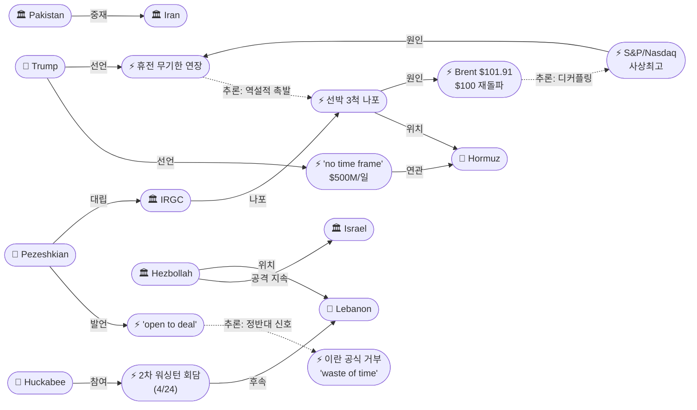
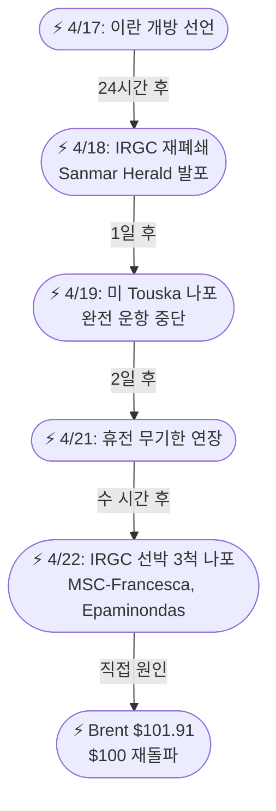
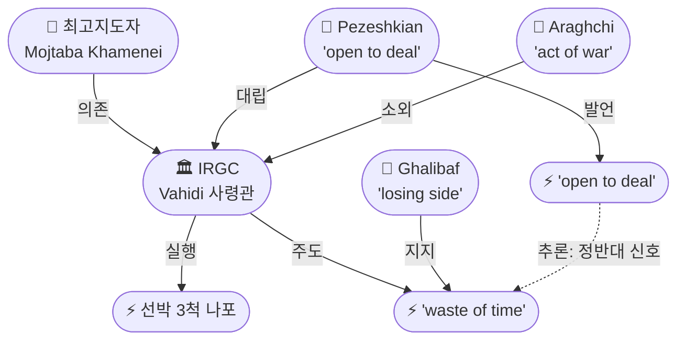

# 2026-04-22 2026 Iran War OSINT 일일 보고서

## 요약

전쟁 54일차(무기한 휴전 1일차, 봉쇄 10일차, 레바논 휴전 6일차), 이란 혁명수비대(IRGC)가 트럼프의 무기한 휴전 연장 발표 직후 **호르무즈 해협에서 선박 3척에 발포하고 2척을 나포**하며 전쟁 이후 최대 규모의 해상 도발을 감행했다. 트럼프는 Fox News에서 전쟁에 **"시간제한(time frame)은 없다"**고 선언하며 봉쇄로 이란이 **하루 5억 달러를 잃고 있다**고 주장했다. 이란 내부에서는 **페제시키안 대통령이 "딜에 열려 있다(open to deal)"**고 밝히며 IRGC·갈리바프의 전면 거부와 정면으로 대치하는 **민군 분열의 가시화**가 확인되었다. 유가는 IRGC 나포 소식에 Brent **$101.91(+3%)로 $100을 재돌파**했으나, 주식시장은 휴전 연장과 실적 호조에 **S&P 500·Nasdaq 동시 사상최고가**를 기록하며 유가-주가 디커플링이 심화되었다.

## 주요 뉴스

### 1. IRGC, 호르무즈 해협에서 선박 3척 공격·2척 나포 — 전쟁 이후 최대 해상 도발

- **출처:** [Washington Post](https://www.washingtonpost.com/world/2026/04/22/hormuz-strait-us-iran-talks-war/), [NPR](https://www.npr.org/2026/04/22/nx-s1-5795405/iran-middle-east-updates), [Al-Monitor](https://www.al-monitor.com/originals/2026/04/three-ships-targeted-hormuz-iran-seizes-two-monitors-guards), [CNBC](https://www.cnbc.com/2026/04/22/strait-of-hormuz-ships-attacked-iran-war.html), [Al Jazeera](https://www.aljazeera.com/news/2026/4/22/iranian-gunboat-fires-on-container-ship-off-oman-coast), [Euronews](https://www.euronews.com/2026/04/22/trump-extends-ceasefire-with-iran-indefinitely-at-pakistans-request-to-allow-for-diplomati), [PressTV](https://www.presstv.ir/Detail/2026/04/22/767348/IRGC-seizes-Israeli-ship,-second-vessel-in-Strait-of-Hormuz)
- **일시:** 2026-04-22
- **내용:** IRGC 해군이 호르무즈 해협에서 **3척의 상선에 발포한 뒤 2척을 나포하여 이란 영해로 이동**시켰다. 나포된 선박은 파나마 국적 컨테이너선 **MSC-Francesca**(IRGC는 이스라엘과 연계되었다고 주장)와 라이베리아 국적 **Epaminondas**이며, 3번째 선박도 공격을 받았다. IRGC는 이들 선박이 **"필요한 승인 없이 운항하고 AIS(선박자동식별장치)를 조작했다"**고 주장했다. UKMTO(영국 해상무역운영)는 **오만 해안에서 이란 건보트의 공격을 확인**했다. 이는 트럼프의 휴전 무기한 연장 발표 불과 수 시간 후에 발생한 것으로, 4/18 Sanmar Herald 발포, 4/19 미국의 Touska 나포에 이은 **에스컬레이션 패턴의 정점**이다.
- **상태:** 신규
- **관련 엔티티:** IRGC, Iran, Strait of Hormuz, Israel

### 2. 트럼프: "시간제한 없다" — 중간선거 동기 부인, 이란 하루 $500M 손실 주장

- **출처:** [CNN](https://www.cnn.com/2026/04/22/world/live-news/iran-war-us-trump-blockade-ceasefire), [JNS](https://www.jns.org/news/u-s-news/trump-iran-is-losing-500-million-daily-due-to-hormuz-blockade), [Fox News](https://www.foxnews.com/live-news/iran-us-war-blockade-hormuz-april-22), [Fox News](https://www.foxnews.com/politics/trump-claims-iran-starving-cash-collapsing-financially-extending-ceasefire)
- **일시:** 2026-04-22
- **내용:** 트럼프가 Fox News의 Martha MacCallum과의 인터뷰에서 전쟁에 **"no time frame(시간제한)이 없다"**고 밝히고, 중간선거가 결정을 좌우한다는 지적을 **"not true"**라고 일축했다. 별도의 소셜미디어 게시에서 **"THE BLOCKADE, which we will not take off until there is a 'DEAL,' is absolutely destroying Iran. They are losing $500 Million Dollars a day, an unsustainable number"**이라고 주장했다. 리비트 백악관 대변인은 **"대통령은 이란의 제안을 받기 위한 확고한 시한을 설정하지 않았다(no firm deadline)"**고 밝혀, 비공식적으로 보도된 '3-5일 창'을 부정했다. 이는 전일의 '무기한 연장'에서 한 걸음 더 나아가 **시한 없는 장기전 구도**를 공식화한 것이다.
- **상태:** 신규
- **관련 엔티티:** Donald Trump, Karoline Leavitt, Iran, Strait of Hormuz

### 3. 페제시키안: "딜에 열려 있다" — IRGC 거부와 정면 대치하는 이란 내부 분열

- **출처:** [Al Jazeera](https://www.aljazeera.com/news/2026/4/22/iran-war-whats-happening-on-day-54-as-trump-extends-ceasefire), [Times of Israel](https://www.timesofisrael.com/liveblog-april-22-2026/)
- **일시:** 2026-04-22
- **내용:** 페제시키안 이란 대통령이 **테헤란이 워싱턴과의 합의에 "열려 있다(open to deal)"**고 밝혔으나, 미국의 **"비건설적이고 모순적인 신호(unconstructive and contradictory signals)"**를 비난하며 **"깊은 역사적 불신(deep historical mistrust)"**을 언급했다. 봉쇄가 "진정한 협상(genuine negotiations)"의 주요 장애물이라고 지적했다. 이는 전일 IRGC의 "ridiculous spectacle"과 갈리바프의 "losing side cannot dictate terms"에 정면으로 대치되는 발언으로, **이란 내부의 민군 분열이 대외 메시지 수준에서도 공개적으로 가시화**된 것이다. 같은 날 IRGC가 호르무즈에서 선박을 나포한 것은 페제시키안의 온건 신호를 실질적으로 무력화한 셈이다.
- **상태:** 신규
- **관련 엔티티:** Masoud Pezeshkian, Iran, IRGC, Mohammad Bagher Ghalibaf

### 4. 유가: Brent $101.91로 $100 재돌파 — 6일 연속 대형 변동

- **출처:** [CNBC](https://www.cnbc.com/2026/04/22/oil-price-wti-brent-iran-ceasefire-extension-clouds-outlook.html), [Gulf News](https://gulfnews.com/business/energy/crude-oil-spikes-brent-near-100-as-us-announces-indefinite-extension-of-ceasefire-with-iran-1.500514864), [OneIndia](https://www.oneindia.com/india/crude-oil-rates-today-april-22-2026-brent-crude-rates-drop-after-crossing-100-per-barrel-check-8065663.html)
- **일시:** 2026-04-22
- **내용:** Brent 원유가 **+3% 상승하여 $101.91**로 마감, 4/12 이후 처음으로 **$100 심리적 지지선을 재돌파**했다. WTI도 **+3%의 $92.96**을 기록했다. IRGC의 선박 3척 공격·나포가 직접적 상승 요인이다. 호르무즈 해협은 **"basically closed"**(CNBC)로, 전쟁 전 하루 100척 이상이 통과하던 것과 대비된다. 이는 **6일 연속 대형 가격 변동**(4/17 -11% → 4/18 반등 → 4/19 +7% → 4/20 +5.6% → 4/21 +3% → 4/22 +3%)이 이어지는 것으로, 원유시장이 완전히 뉴스 트레이딩 모드에 진입했음을 보여준다.
- **상태:** 업데이트 ← 2026-04-21 "유가: Brent $98.48"
- **관련 엔티티:** Strait of Hormuz

### 5. S&P 500·Nasdaq 사상최고가 — 유가-주가 디커플링 심화

- **출처:** [Yahoo Finance](https://finance.yahoo.com/markets/stocks/live/stock-market-today-wednesday-april-22-dow-sp-500-nasdaq-trump-us-iran-ceasefire-230429476.html), [The Spokesman-Review](https://www.spokesman.com/stories/2026/apr/22/wall-street-gains-as-iran-ceasefire-extension-and-/), [Detroit News](https://www.detroitnews.com/story/business/2026/04/22/wall-street-gains-after-iran-ceasefire-extension-robust-earnings/89731873007/)
- **일시:** 2026-04-22
- **내용:** S&P 500이 **+1%로 사상최고가**를 경신하고, Nasdaq Composite가 **+1.6%로 동시에 사상최고가**를 기록했다. Dow도 **+0.7%** 상승. 트럼프의 휴전 무기한 연장과 Tesla를 비롯한 **Q1 실적 시즌 호조**가 동시에 작용했다. 유가가 $100을 재돌파하는 공급 위기 속에서 주가가 사상최고를 경신한 것은 **구조적 디커플링**을 의미한다: 주식시장은 전쟁 종료/딜 기대를 선행 반영하고, 원유시장은 현재의 물리적 공급 차단을 반영하는 것이다.
- **상태:** 업데이트 ← 2026-04-15 "S&P 500 최초 사상최고가"
- **관련 엔티티:** Strait of Hormuz

### 6. 이스라엘-레바논 2차 워싱턴 회담 목요일 확정 — 허커비 합류

- **출처:** [Haaretz](https://www.haaretz.com/israel-news/israel-security/2026-04-20/ty-article/.premium/source-israel-lebanon-to-hold-second-round-of-talks-in-washington-on-thursday/0000019d-abc4-dbb2-a19d-bfd646bc0000), [Al Jazeera](https://www.aljazeera.com/news/2026/4/20/lebanon-israel-to-meet-again-thursday-for-direct-talks-us-says), [Al-Monitor](https://www.al-monitor.com/originals/2026/04/lebanon-hopes-extension-ceasefire-washington-meeting)
- **일시:** 2026-04-24 (예정)
- **내용:** 이스라엘과 레바논이 **4/24(목) 워싱턴 국무부에서 2차 직접 회담**을 갖는다. 미국 측 대표단에 루비오 국무장관과 함께 **마이크 허커비 주이스라엘 대사**가 합류하며, 미셸 이사 주레바논 대사와 마이클 니드햄 국무부 자문관도 참여한다. 이스라엘은 예치엘 라이터 대사, 레바논은 나다 모아와드 대사가 대표한다. 레바논은 **4/26 만료되는 10일 휴전의 연장**을 핵심 의제로 추진하고 있으나, 헤즈볼라는 회담에 참여하지 않으며 별도로 공격을 지속하고 있다.
- **상태:** 신규
- **관련 엔티티:** Israel, Lebanon, Marco Rubio, Mike Huckabee, Yechiel Leiter, Nada Mouawad

### 7. 헤즈볼라, 이스라엘군 진지 공격 지속 — 레바논 휴전 '붕괴 징후'

- **출처:** [Democracy Now](https://www.democracynow.org/2026/4/22/headlines/israel_lebanon_ceasefire_frays_as_hezbollah_fires_on_israeli_forces), [Middle East Monitor](https://www.middleeastmonitor.com/20260422-lebanons-hezbollah-targets-israeli-military-site-in-response-to-ceasefire-breaches)
- **일시:** 2026-04-22
- **내용:** 헤즈볼라가 4/21 최초 로켓 공격에 이어 **이스라엘군 진지를 추가로 타격**했다. 이스라엘도 레바논 남부에서 포격을 지속하며 양측 모두 상대의 위반을 비난하고 있다. 헤즈볼라는 이스라엘의 **200건 이상의 휴전 위반**에 대한 대응이라고 주장했다. 레바논 휴전은 **"새로운 붕괴 징후(new signs of collapse)"**를 보이고 있으며(Democracy Now), 목요일 2차 워싱턴 회담이 예정되어 있으나 헤즈볼라가 회담에 참여하지 않아 회담 결과와 무관하게 공격이 지속될 수 있다.
- **상태:** 업데이트 ← 2026-04-21 "헤즈볼라 최초 로켓 발사"
- **관련 엔티티:** Hezbollah, Israel, Lebanon

### 8. 파키스탄 중재 지속 — 이란 대사 샤리프 방문, 이란 언론은 중재 불신

- **출처:** [Daily Pakistan](https://en.dailypakistan.com.pk/22-Apr-2026/pm-shehbaz-hails-trump-for-extending-iran-ceasefire-as-pakistan-continues-mediation-efforts), [Pakistan Today](https://www.pakistantoday.com.pk/2026/04/23/pm-iranian-envoy-discusses-regional-situation-peace-efforts), [ANI](https://aninews.in/news/world/middle-east/iranian-news-network-casts-aspersion-on-pakistans-mediation-role-even-as-trump-extends-ceasefire20260422115453/)
- **일시:** 2026-04-22
- **내용:** 샤리프 총리가 트럼프의 휴전 연장을 **환영하며 파키스탄의 중재 노력이 지속되고 있다**고 밝혔다. 이란의 **레자 아미리 모그하담 주파키스탄 대사가 샤리프를 방문**하여 지역 상황과 평화 노력을 논의했다. 그러나 이란 국영 뉴스 네트워크는 **파키스탄의 중재 역할에 의문을 제기**하며 중립성을 비판했다. 이란이 공식적으로 회담을 "waste of time"이라 칭한 상황에서도 파키스탄-이란 채널이 활성화되어 있다는 점은 **완전한 외교 단절은 아님**을 시사한다.
- **상태:** 업데이트 ← 2026-04-21 "파키스탄 중재"
- **관련 엔티티:** Shehbaz Sharif, Pakistan, Iran

## 지식그래프

### 오늘의 주요 관계

1. **IRGC → 선박 3척 나포 → 호르무즈 에스컬레이션 정점**: 휴전 연장 직후 최대 규모 도발
2. **트럼프 "no time frame" → 장기전 구도 공식화**: $500M/일 경제전 + 시한 없음
3. **페제시키안 "open to deal" ↔ IRGC 나포**: 같은 날 정반대 신호 — 민군 분열 최고조
4. **유가 $100 재돌파 ↔ 주가 사상최고**: 구조적 디커플링 — 공급 위기 vs 전쟁 종료 기대
5. **이스라엘-레바논 2차 회담 ↔ 헤즈볼라 공격 지속**: 외교와 군사의 병행 이중구조

### 전체 지식그래프 시각화

### 주제별 세부 그래프: 호르무즈 에스컬레이션 경로

### 주제별 세부 그래프: 이란 내부 분열 구조

## 온톨로지 변경

| 변경 유형 | 대상 | 근거 |
|----------|------|------|
| 새 엔티티 | IRGC Seizes 3 Ships in Hormuz (ent-164) | MSC-Francesca·Epaminondas 나포, 3척 발포 |
| 새 엔티티 | Trump 'No Time Frame' Statement (ent-165) | Fox News 인터뷰, $500M/일, 시한 없음 |
| 새 엔티티 | Pezeshkian Open to Deal (ent-166) | "open to deal" + "unconstructive signals" |
| 새 엔티티 | Oil Brent $100 Crosses Again (ent-167) | $101.91, 6일 연속 대형 변동 |
| 새 엔티티 | S&P 500 Nasdaq Fresh Records (ent-168) | S&P +1%, Nasdaq +1.6% 동시 사상최고 |
| 새 엔티티 | Israel-Lebanon 2nd Washington Talks (ent-169) | 4/24 확정, 허커비 합류 |
| 새 엔티티 | Mike Huckabee (ent-170) | 주이스라엘 대사, 2차 회담 참가 |
| 업데이트 | Trump (ent-001) | "no time frame", $500M/일, 시한 없는 장기전 |
| 업데이트 | Iran (ent-002) | 선박 나포, Pezeshkian 개방, 사형 논쟁 |
| 업데이트 | IRGC (ent-005) | 최대 규모 해상 도발 — 3척 공격·2척 나포 |
| 업데이트 | Hormuz (ent-008) | Brent $100, 선박 나포, "basically closed" |
| 업데이트 | Israel (ent-004) | 2차 회담, 휴전 위반 지속 |
| 업데이트 | Hezbollah (ent-047) | 2일 연속 공격, 200+ 위반 주장 |
| 업데이트 | Lebanon (ent-050) | 휴전 6일차, "signs of collapse" |
| 업데이트 | Pezeshkian (ent-149) | "open to deal" — 내부 분열 가시화 |

## 추론 결과

| 추론 | 신뢰도 | 근거 |
|------|--------|------|
| IRGC 나포 → Brent $100 인과체인 | 0.72 | 선박 나포(ent-164) → 호르무즈 불안 → 유가 돌파(ent-167) |
| 휴전 연장 → IRGC 나포 역설적 인과 | 0.72 | 트럼프 양보(ent-158) → IRGC 대응 도발(ent-164) |
| 페제시키안 개방 ↔ 이란 공식 거부: 내부 분열 | 0.75 | "open to deal"(ent-166) vs "waste of time"(ent-160) — 동시 존재 |
| 주가 신기록 ↔ 유가 $100: 시장 디커플링 | 0.70 | S&P 최고(ent-168) + Brent $100(ent-167) — 정반대 신호의 동시 발생 |
| 2차 회담 ↔ 헤즈볼라 공격: 레바논 이중구조 | 0.72 | 외교(ent-169) + 군사(ent-161) 동시 진행 — 헤즈볼라 비참여 |

## 분석 및 평가

**IRGC의 선박 나포는 '휴전은 전투를 멈추지 않는다'는 신호.** 트럼프가 무기한 연장을 선언한 지 불과 수 시간 만에 IRGC가 3척을 공격한 것은 의도적이다. IRGC는 "ridiculous spectacle"(4/21)에 행동으로 답한 것이다. 에스컬레이션 경로가 뚜렷하다: 4/17 개방 → 4/18 재폐쇄 → 4/19 Touska 나포 → 4/22 3척 나포. 매 단계에서 규모가 커지고 있으며, IRGC는 이스라엘 연계 선박(MSC-Francesca)을 표적으로 삼아 정치적 메시지도 전달했다.

**트럼프의 "no time frame"은 봉쇄 장기전 선언.** $500M/일 손실 주장은 실제 수치와 관계없이 "봉쇄로 충분하다"는 전략적 판단을 반영한다. 중간선거 부인은 국내 정치적 압력에 대한 방어다. Leavitt의 "no firm deadline"은 "무기한 연장"의 진정한 의미 — 이란이 항복하기까지의 무한 대기 — 를 확인해 준다.

**이란 내부 분열이 메시지 수준에서도 공개적으로 터졌다.** 같은 날 대통령("open to deal")과 IRGC(선박 나포)가 정반대 행동을 한 것은 전례가 없다. 4/18의 "바보" 사건보다 더 심각한 것은, 이번에는 대통령이 적극적으로 IRGC와 다른 신호를 보냈다는 점이다. 페제시키안의 발언이 진정한 협상 의지인지 서방을 향한 시간 벌기인지는 불명확하나, 트럼프가 인용한 "seriously fractured"의 현실적 근거를 제공한다.

**유가-주가 디커플링은 시장의 이중 인격을 보여준다.** 같은 전쟁에서 유가(공급 위기)와 주가(전쟁 종료 기대)가 동시에 사상최고를 경신한 것은 구조적으로 양립 불가능하다. 둘 중 하나가 틀린 것이다: 전쟁이 빨리 끝나면 유가가 폭락해야 하고, 봉쇄가 장기화되면 경제 충격으로 주가가 하락해야 한다. 현재의 디커플링은 지속 불가능하며, 조만간 한쪽이 크게 조정될 것이다.

**레바논 전선은 독립적 위기로 고착.** 2차 워싱턴 회담이 목요일로 잡혔으나, 헤즈볼라가 참여하지 않는 한 회담 결과의 이행 가능성은 제한적이다. 10일 휴전(4/26 만료)의 연장이 핵심 의제이나, 헤즈볼라의 연속 공격은 이미 "붕괴 징후"다.

## 추적 항목

| 항목 | 최초 보고 | 상태 | 최신 업데이트 |
|------|----------|------|-------------|
| 2차 이슬라마바드 회담 | 2026-04-17 | 🔴 무기한 연기 | 이란 보이콧 지속, 밴스 미출발, 시한 없음 |
| 휴전 | 2026-04-07 | 🟡 무기한 연장 | "no time frame", 시한 없는 장기전 구도 |
| 호르무즈 봉쇄 | 2026-04-13 | 🔴 격화 | IRGC 3척 나포, Brent $100 재돌파, "basically closed" |
| IRGC 내부 장악 | 2026-04-18 | 🔴 완전 | 선박 나포로 페제시키안 온건 신호 무력화 |
| 이란 내부 분열 | 2026-04-18 | 🔴 최고조 | 페제시키안 "open to deal" vs IRGC 나포 — 같은 날 정반대 |
| 레바논 휴전 | 2026-04-16 | 🔴 붕괴 위기 | 헤즈볼라 2일 연속 공격, 4/26 만료, 2차 회담 4/24 |
| 이스라엘 독자 행동 | 2026-04-17 | 🔴 지속 | 2차 워싱턴 회담 준비 + 전쟁 재개 공동 준비 |
| $20B 현금-우라늄 딜 | 2026-04-18 | 🟠 교착 | 이란 협상 거부로 논의 불가, 트럼프 $500M/일 주장 |

## 동향 요약

| 분류 | 상태 | 비고 |
|------|------|------|
| 미-이란 협상 | 🔴 교착 | "no time frame" 장기전 + 이란 전면 거부 |
| 호르무즈 해협 | 🔴 격화 | IRGC 3척 나포, Brent $100, "basically closed" |
| 이란 내부 정치 | 🔴 분열 최고조 | 페제시키안 개방 vs IRGC 나포 — 공개적 대치 |
| 레바논 휴전 | 🔴 붕괴 위기 | 헤즈볼라 2일 연속 공격, 4/26 만료, 2차 회담 4/24 |
| 글로벌 경제 | 🟠 디커플링 | 유가 $100 + 주가 사상최고 — 구조적 양립 불가 |
| 파키스탄 중재 | 🟡 활성화 | 이란 대사 방문, 채널 유지 중이나 이란 내부 불신 |

## 출처 목록

1. [Iran seizes 2 ships in Strait of Hormuz after Trump extends ceasefire](https://www.washingtonpost.com/world/2026/04/22/hormuz-strait-us-iran-talks-war/) - Washington Post, 2026-04-22
2. [Iran says it seized ships in Strait of Hormuz as U.S. blockade continues](https://www.npr.org/2026/04/22/nx-s1-5795405/iran-middle-east-updates) - NPR, 2026-04-22
3. [Three ships targeted in Hormuz, Iran seizes two](https://www.al-monitor.com/originals/2026/04/three-ships-targeted-hormuz-iran-seizes-two-monitors-guards) - Al-Monitor, 2026-04-22
4. [Iran says it has seized two ships after U.S. extends ceasefire](https://www.cnbc.com/2026/04/22/strait-of-hormuz-ships-attacked-iran-war.html) - CNBC, 2026-04-22
5. [Iran captures two vessels in Hormuz after ship comes under fire](https://www.aljazeera.com/news/2026/4/22/iranian-gunboat-fires-on-container-ship-off-oman-coast) - Al Jazeera, 2026-04-22
6. [Iran seizes two cargo ships after three vessels fired on](https://www.euronews.com/2026/04/22/trump-extends-ceasefire-with-iran-indefinitely-at-pakistans-request-to-allow-for-diplomati) - Euronews, 2026-04-22
7. [IRGC seizes Israeli ship, second vessel in Hormuz](https://www.presstv.ir/Detail/2026/04/22/767348/IRGC-seizes-Israeli-ship,-second-vessel-in-Strait-of-Hormuz) - PressTV, 2026-04-22
8. [Trump says 'no time frame' on Iran war, denies midterms](https://www.cnn.com/2026/04/22/world/live-news/iran-war-us-trump-blockade-ceasefire) - CNN, 2026-04-22
9. [Trump: Iran is losing $500 million daily due to Hormuz blockade](https://www.jns.org/news/u-s-news/trump-iran-is-losing-500-million-daily-due-to-hormuz-blockade) - JNS, 2026-04-22
10. [Trump claims Iran collapsing financially amid US naval blockade](https://www.foxnews.com/politics/trump-claims-iran-starving-cash-collapsing-financially-extending-ceasefire) - Fox News, 2026-04-22
11. [Trump orders ceasefire extended after Iran peace talks cancelled](https://www.foxnews.com/live-news/iran-us-war-blockade-hormuz-april-22) - Fox News, 2026-04-22
12. [Trump's blown deadlines on Iran](https://edition.cnn.com/2026/04/22/politics/deadlines-iran-war-trump) - CNN, 2026-04-22
13. [Iran war: What's happening on day 54](https://www.aljazeera.com/news/2026/4/22/iran-war-whats-happening-on-day-54-as-trump-extends-ceasefire) - Al Jazeera, 2026-04-22
14. [Iran war live blog April 22](https://www.aljazeera.com/news/liveblog/2026/4/22/iran-war-live-trump-says-ceasefire-extended-as-talks-with-tehran-in-limbo) - Al Jazeera, 2026-04-22
15. [Iran War: US, Iran Deadlocked Over Hormuz](https://www.bloomberg.com/news/articles/2026-04-22/us-and-iran-deadlocked-over-hormuz-after-trump-extends-truce) - Bloomberg, 2026-04-22
16. [Strait of Hormuz remains basically closed](https://www.cnbc.com/2026/04/22/iran-war-strait-hormuz-tanker-ship-trump-blockade.html) - CNBC, 2026-04-22
17. [April 22 liveblog](https://www.timesofisrael.com/liveblog-april-22-2026/) - Times of Israel, 2026-04-22
18. [S&P 500 and Nasdaq hit fresh records](https://finance.yahoo.com/markets/stocks/live/stock-market-today-wednesday-april-22-dow-sp-500-nasdaq-trump-us-iran-ceasefire-230429476.html) - Yahoo Finance, 2026-04-22
19. [Wall Street gains on ceasefire extension and earnings](https://www.spokesman.com/stories/2026/apr/22/wall-street-gains-as-iran-ceasefire-extension-and-/) - The Spokesman-Review, 2026-04-22
20. [Oil price: Brent crosses $100 to $101.91](https://www.cnbc.com/2026/04/22/oil-price-wti-brent-iran-ceasefire-extension-clouds-outlook.html) - CNBC, 2026-04-22
21. [Crude oil spikes, Brent near $100](https://gulfnews.com/business/energy/crude-oil-spikes-brent-near-100-as-us-announces-indefinite-extension-of-ceasefire-with-iran-1.500514864) - Gulf News, 2026-04-22
22. [Israel, Lebanon 2nd Washington talks Thursday](https://www.haaretz.com/israel-news/israel-security/2026-04-20/ty-article/.premium/source-israel-lebanon-to-hold-second-round-of-talks-in-washington-on-thursday/0000019d-abc4-dbb2-a19d-bfd646bc0000) - Haaretz, 2026-04-22
23. [Lebanon, Israel to meet again Thursday](https://www.aljazeera.com/news/2026/4/20/lebanon-israel-to-meet-again-thursday-for-direct-talks-us-says) - Al Jazeera, 2026-04-22
24. [Lebanon hopes for ceasefire extension at Washington meeting](https://www.al-monitor.com/originals/2026/04/lebanon-hopes-extension-ceasefire-washington-meeting) - Al-Monitor, 2026-04-22
25. [Israel-Lebanon Ceasefire Frays as Hezbollah Fires](https://www.democracynow.org/2026/4/22/headlines/israel_lebanon_ceasefire_frays_as_hezbollah_fires_on_israeli_forces) - Democracy Now, 2026-04-22
26. [Hezbollah targets Israeli military site](https://www.middleeastmonitor.com/20260422-lebanons-hezbollah-targets-israeli-military-site-in-response-to-ceasefire-breaches) - Middle East Monitor, 2026-04-22
27. [PM Shehbaz hails Trump for extending ceasefire](https://en.dailypakistan.com.pk/22-Apr-2026/pm-shehbaz-hails-trump-for-extending-iran-ceasefire-as-pakistan-continues-mediation-efforts) - Daily Pakistan, 2026-04-22
28. [Iran ambassador Moghadam meets PM Sharif](https://www.pakistantoday.com.pk/2026/04/23/pm-iranian-envoy-discusses-regional-situation-peace-efforts) - Pakistan Today, 2026-04-22
29. [Iranian news network casts aspersion on Pakistan mediation](https://aninews.in/news/world/middle-east/iranian-news-network-casts-aspersion-on-pakistans-mediation-role-even-as-trump-extends-ceasefire20260422115453/) - ANI, 2026-04-22
30. [Iran seizes ships — NBC live updates](https://www.nbcnews.com/world/iran/live-blog/live-updates-iran-trump-ceasefire-hormuz-attack-peace-talks-israel-rcna341361) - NBC News, 2026-04-22
31. [이란군 "호르무즈서 무허가 통항 선박 3척 나포"](https://www.fnnews.com/news/202604221939230314) - 파이낸셜뉴스, 2026-04-22
32. [이란, 트럼프 '휴전연장' 선언 직후 호르무즈 선박 공격](https://www.kukinews.com/article/view/kuk202604220190) - 국민일보, 2026-04-22
33. [이란, 호르무즈서 화물선 3척에 발포...2척은 나포](https://www.ytn.co.kr/_ln/0104_202604222144336804) - YTN, 2026-04-22
34. [유가, 다시 100달러 눈앞…미·이란 협상 지연에 상승 압박](https://www.fnnews.com/news/202604220512534337) - 파이낸셜뉴스, 2026-04-22
35. [미·이란 이슬라마바드 담판 좌초… 유가 배럴당 98달러](https://www.g-enews.com/article/Global-Biz/2026/04/2026042205225540572bd56fbc3c_1) - 글로벌이코노믹, 2026-04-22
