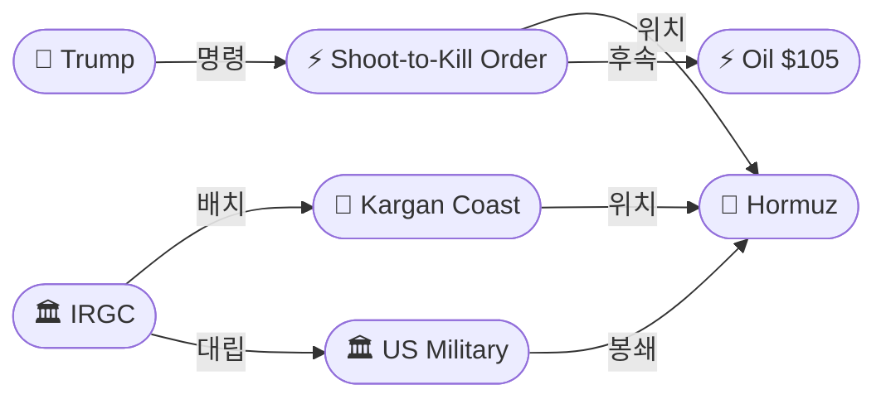
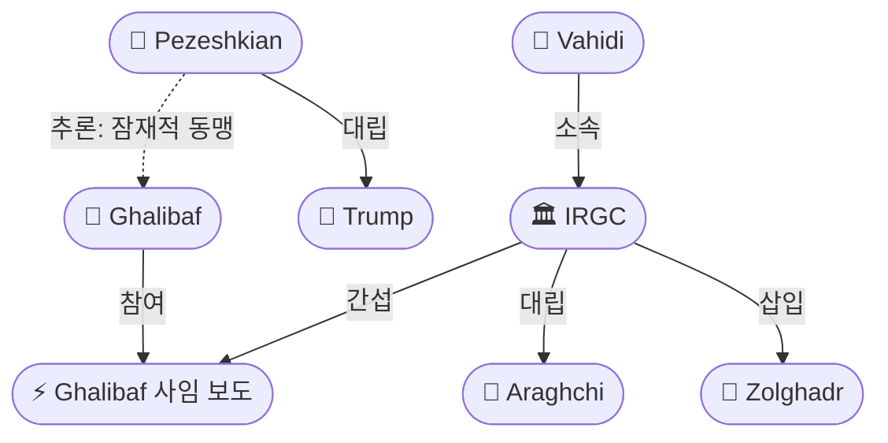
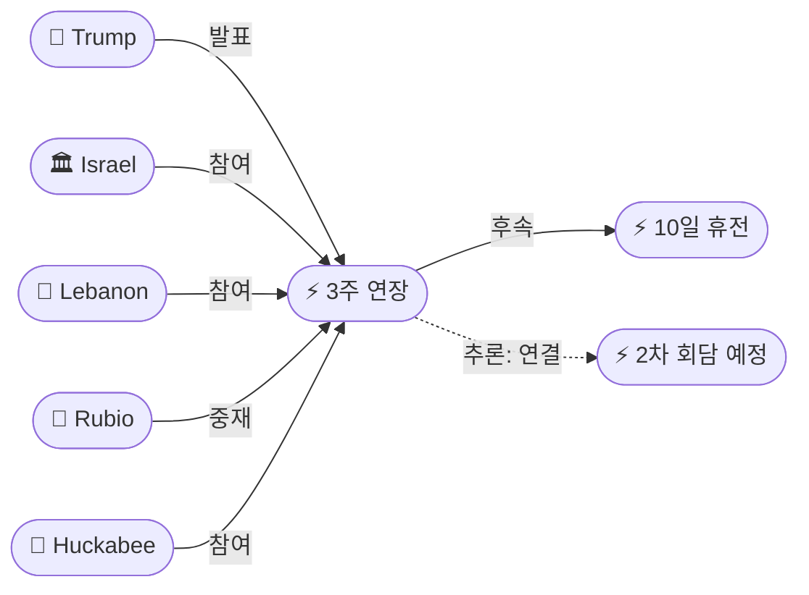

# 2026-04-23 2026 Iran War OSINT 일일 보고서

## 요약

트럼프 대통령이 호르무즈 해협에서 기뢰를 설치하는 모든 선박에 대한 **격침(shoot-to-kill) 명령**을 발동하며 호르무즈 대치를 교전 규칙 변경 수준으로 에스컬레이션했다. 동시에 이스라엘-레바논 간 **휴전이 3주 연장**되어 레바논 전선은 안정화 추세다. 이란 내부에서는 의회의장 **갈리바프가 협상팀에서 사임했다는 보도**(미확인)가 나와 유가가 Brent $107까지 스파이크하며 전쟁 이후 최고치를 기록했다. 위성사진에서 **IRGC 쾌속정 33척**이 호르무즈 인근 Kargan 해안에 배치된 모습이 포착되어, 트럼프의 '이란 해군 격멸' 주장과 충돌한다.

## 주요 뉴스

### 1. 트럼프, 호르무즈 기뢰 설치 선박 격침 명령
- **출처:** [Al Jazeera](https://www.aljazeera.com/news/2026/4/23/us-to-shoot-and-kill-iranian-boats-laying-mines-in-hormuz-trump-says)
- **일시:** 2026-04-23
- **내용:** 트럼프 대통령이 Truth Social을 통해 "호르무즈 해역에 기뢰를 설치하는 모든 선박에 대해 즉시 격침할 것을 미 해군에 명령했다. 주저함이 있어서는 안 된다(There is to be no hesitation)"고 발표했다. 소해정 작전을 3배로 증강하고, 미국이 호르무즈의 "완전한 통제(total control)"를 보유하고 있으며 "이란이 합의할 때까지 철저히 봉쇄(Sealed up Tight)"할 것이라고 선언했다. 또한 이란 해군 159척이 "모두 해저에 있다"고 주장했다.
- **상태:** 신규
- **관련 엔티티:** Donald Trump, US Military, IRGC, Strait of Hormuz

### 2. 트럼프, 이란 전쟁 타임라인에 "Don't rush me"
- **출처:** [CNN](https://www.cnn.com/2026/04/23/world/live-news/iran-war-trump-blockade-israel-lebanon)
- **일시:** 2026-04-23
- **내용:** 트럼프 대통령은 백악관에서 기자들에게 이란 전쟁 종료 시한을 묻는 질문에 "Don't rush me(서두르지 마라)"라고 답했다. "시간 압박이 없다(no time pressure)"며 장기전을 각오하는 메시지를 보냈다. 또한 핵무기를 사용하지 않을 것이며, 미국인들이 "당분간 에너지 가격 상승을 감수해야 한다"고 밝혔다.
- **상태:** 신규
- **관련 엔티티:** Donald Trump, Iran

### 3. 이스라엘-레바논 휴전 3주 연장
- **출처:** [CBS News](https://www.cbsnews.com/live-updates/iran-war-trump-video-strait-of-hormuz-ship-attack-ceasefire-lebanon/)
- **일시:** 2026-04-23
- **내용:** 백악관에서 열린 2차 이스라엘-레바논 직접 회담 후, 트럼프 대통령이 10일 휴전(4월 26일 만료 예정)의 3주 연장을 발표했다. 루비오 국무장관이 미국 측 대표로 허커비(주이스라엘 대사), 이사(주레바논 대사), 니덤(국무부 고문)이 합류했다. 레바논 측 모아와드 대사는 IDF 철수, 가옥 파괴 중지, 레바논 포로 석방을 요구했다. 트럼프는 네타냐후 총리와 아운 대통령을 "가까운 시일 내" 백악관에 초청한다고 밝혔다.
- **상태:** 신규
- **관련 엔티티:** Israel, Lebanon, Donald Trump, Marco Rubio, Mike Huckabee, Michel Issa, Michael Needham

### 4. 갈리바프 협상팀 사임 보도 — 이란 부인
- **출처:** [Free Press Journal](https://www.freepressjournal.in/world/iran-parliament-speaker-ghalibaf-resigns-from-negotiating-team-after-irgc-intervention-reports)
- **일시:** 2026-04-23
- **내용:** 이스라엘 Channel 12가 이란 의회의장 갈리바프가 IRGC의 간섭으로 미국과의 협상팀에서 사임했다고 보도했다. 갈리바프는 이슬라마바드 협상에서 이란 대표단을 이끌었던 핵심 인물이다. 그러나 이란 측 기자들은 즉각 보도를 부인했다. 이 보도로 Brent유가 $107까지 스파이크하고, 4월 30일 평화 합의 예측시장이 9% YES로 급락했다.
- **상태:** 신규 (미확인)
- **관련 엔티티:** Mohammad Bagher Ghalibaf, IRGC, Abbas Araghchi, Zolghadr

### 5. 유가 Brent $105 — 전쟁 이후 최고가
- **출처:** [CNBC](https://www.cnbc.com/2026/04/23/oil-price-iran-war-strait-hormuz.html)
- **일시:** 2026-04-23
- **내용:** Brent 원유 선물이 3% 상승해 $105.07에 마감했으며, 갈리바프 사임 보도 시 $107까지 스파이크했다. WTI는 3% 상승한 $95.85 마감, 스파이크 시 $98. 트럼프의 기뢰 격침 명령, 갈리바프 사임 보도, 지속적인 호르무즈 교란이 복합 요인으로 작용했다. 7일 연속 대형 변동.
- **상태:** 신규
- **관련 엔티티:** Strait of Hormuz, Mohammad Bagher Ghalibaf

### 6. 위성사진: IRGC 쾌속정 33척 Kargan 해안 배치
- **출처:** [The Week India](https://www.theweek.in/news/middle-east/2026/04/23/satellite-image-captures-unusual-activity-in-strait-of-hormuz-33-irgc-fast-attack-fleet-near-kargan-coast.html)
- **일시:** 2026-04-22 (촬영) / 2026-04-23 (보도)
- **내용:** 유럽 코페르니쿠스(Sentinel-2) 위성이 4월 22일 호르무즈 해협 북쪽 Kargan 해안 인근에서 33척의 IRGC 해군 쾌속정 함대를 포착했다. 'Mosquito Fleet(모기 함대)'로 불리는 이 배치는 이란의 해협 폐쇄 시행을 위한 무력 시위로 분석된다. 트럼프의 "이란 해군 159척이 모두 해저에 있다"는 주장과 직접 모순된다.
- **상태:** 신규
- **관련 엔티티:** IRGC, Strait of Hormuz, Kargan Coast

### 7. IRGC 선박 나포 영상 공개
- **출처:** [Al Jazeera](https://www.aljazeera.com/video/newsfeed/2026/4/23/iran-releases-video-of-irgc-seizing-ship-in-the-strait-of-hormuz)
- **일시:** 2026-04-23
- **내용:** 이란이 4월 22일 호르무즈에서 MSC-Francesca와 Epaminondas를 나포하는 영상을 공개했다. 복면 IRGC 전투원들이 고속정에서 거대한 컨테이너선으로 사다리를 타고 올라가고, 소총을 들고 선내를 수색하는 장면이 담겼다. 필리핀 정부는 나포 선박에 탑승한 선원 15명의 안전을 확인했다.
- **상태:** 업데이트 ← 2026-04-22 IRGC 3척 나포
- **관련 엔티티:** IRGC, Strait of Hormuz

### 8. 페제시키안, 대화 의지 재확인 — 봉쇄가 장애물
- **출처:** [Express Tribune](https://tribune.com.pk/story/2604309/pezeshkian-blames-us-blockade-for-impasse)
- **일시:** 2026-04-23
- **내용:** 이란 대통령 페제시키안이 X(구 트위터)에 "테헤란은 대화와 합의를 원하지만, 약속 위반, 봉쇄, 위협이 진정한 협상의 주요 장애물"이라고 게시했다. IRGC와 갈리바프의 강경 노선('waste of time')과 대조되는 온건 신호를 이어갔으며, 이란 내 민군 분열을 재확인했다.
- **상태:** 업데이트 ← 2026-04-22 페제시키안 "딜 개방" 발언
- **관련 엔티티:** Masoud Pezeshkian, Iran, IRGC

### 9. 파키스탄 중재 지속 — 샤리프, 이란 대사 면담
- **출처:** [Pakistan Today](https://www.pakistantoday.com.pk/2026/04/23/pm-iranian-envoy-discusses-regional-situation-peace-efforts)
- **일시:** 2026-04-23
- **내용:** 샤리프 총리가 이란 주파키스탄 대사 레자 아미리 모그하담과 면담하며 파키스탄의 중재 의지를 재확인했다. 휴전 연장 후 유일한 미-이란 중재 채널로서 파키스탄의 역할이 지속되고 있으나, Quwa Defense 분석에 따르면 IRGC가 실권을 쥔 상황에서 중재의 한계가 드러나고 있다.
- **상태:** 업데이트 ← 2026-04-22 샤리프-모그하담 동향
- **관련 엔티티:** Shehbaz Sharif, Pakistan, Reza Amiri Moghadam

### 10. 주가 하락 — 유가 상승 압박
- **출처:** [Yahoo Finance](https://uk.finance.yahoo.com/news/stock-market-today-thursday-april-23-dow-sp-500-nasdaq-oil-rises-software-233045213.html)
- **일시:** 2026-04-23
- **내용:** S&P 500 -0.41%(7,108.40), Nasdaq -0.89%(24,438.50), Dow -0.36%(49,310.32). 전일 사상 최고가에서 하락 전환. IBM -8%, ServiceNow -18% 등 기술주 중심 하락. 유가 급등과 이란 전쟁 불확실성이 투심을 압박.
- **상태:** 신규
- **관련 엔티티:** Strait of Hormuz

### 11. 미군 중동 증파 계속
- **출처:** [CBS News](https://www.cbsnews.com/live-updates/iran-war-trump-ceasefire-strait-hormuz-ship-attacked-us-military-buildup/)
- **일시:** 2026-04-23
- **내용:** 미군이 중동에 수천 명을 추가 배치 중이다. USS George H.W. Bush 항모전단 6,000명과 Boxer 수륙양용준비단 4,000명 이상이 합류하여 역내 총 병력이 약 60,000명에 달한다. 2003년 이라크 침공 이후 최대 규모이며, 휴전에도 불구하고 전쟁 재개 대비 태세를 유지하고 있다.
- **상태:** 업데이트 ← 기존 미군 배치 보도
- **관련 엔티티:** US Military, CENTCOM

## 지식그래프

### 오늘의 주요 관계
1. **트럼프 → 기뢰 격침 명령**: 호르무즈 교전 규칙을 '봉쇄'에서 '교전'으로 변경. IRGC 쾌속정 작전에 대한 직접 대응.
2. **IRGC → 갈리바프 사임**: IRGC 간섭이 이란 협상팀 해체를 유발(미확인). 외교파 입지 축소.
3. **이스라엘-레바논 3주 연장**: 2차 워싱턴 회담에서 도출. 이란 전쟁의 레바논 전선 안정화에 기여.
4. **기뢰 격침 명령 + 갈리바프 사임 → 유가 $105**: 이중 요인으로 전쟁 이후 최고 유가.

### 호르무즈 대치 그래프

### 이란 내부 분열 그래프

### 레바논 외교 그래프

## 온톨로지 변경

| 변경 유형 | 대상 | 근거 |
|----------|------|------|
| 새 엔티티 | ent-171 기뢰 격침 명령 | 트럼프 shoot-to-kill ROE 발동 |
| 새 엔티티 | ent-172 이-레 3주 연장 | 백악관 2차 회담 후 합의 |
| 새 엔티티 | ent-173 갈리바프 사임 보도 | 이스라엘 CH12 보도, 이란 부인 |
| 새 엔티티 | ent-174 유가 $105 | Brent $105.07 마감, $107 스파이크 |
| 새 엔티티 | ent-175 Michel Issa | 주레바논 미국 대사, 2차 회담 참석 |
| 새 엔티티 | ent-176 Michael Needham | 국무부 고문, 2차 회담 참석 |
| 새 엔티티 | ent-177 Kargan Coast | IRGC 쾌속정 33척 배치 지점 |
| 새 엔티티 | ent-178 Reza Amiri Moghadam | 이란 주파키스탄 대사 |

## 추론 결과

| 추론 | 신뢰도 | 근거 |
|------|--------|------|
| 기뢰 격침 명령 → 유가 $105 | 0.72 | 직접 인과: 교전 규칙 변경 → 호르무즈 위험 프리미엄 상승 |
| IRGC 간섭 → 갈리바프 사임 | 0.75 (잠정) | 졸가르드 삽입 → 위임 초과 보고 → 사임 (미확인) |
| 3주 연장 ↔ 2차 회담 | 0.80 | 예정된 회담이 실행되어 연장으로 이어진 직접 관계 |
| 페제시키안 ↔ 갈리바프 | 0.72 (잠정) | 양자 모두 IRGC에 밀리는 온건파. 잠재적 동맹 관계 |

## 분석 및 평가

**호르무즈: 봉쇄에서 교전으로.** 트럼프의 기뢰 격침 명령은 호르무즈 대치의 성격을 근본적으로 변화시킨다. 기존의 '봉쇄-검문-전환'에서 '기뢰 발견 즉시 격침'으로 교전 규칙이 바뀌면서, 휴전 중에도 무력 충돌 가능성이 급상승했다. 동시에 위성사진에서 포착된 33척의 IRGC 쾌속정은 이란이 여전히 해협에서 작전 능력을 보유하고 있음을 입증하며, 트럼프의 '이란 해군 격멸' 주장에 OSINT 기반으로 반박한다.

**이란 내부: 외교파 해체 진행 중.** 갈리바프 사임 보도는 미확인이나, 사실이라면 이란의 미국과의 협상 의지가 사실상 소멸했음을 의미한다. 4/18 아라그치 '바보' 모욕 → 4/20 졸가르드 삽입 → 4/23 갈리바프 사임으로 이어지는 패턴은 IRGC-바히디 라인이 외교 노선을 체계적으로 해체하고 있음을 시사한다. 페제시키안 대통령의 지속적인 대화 신호는 IRGC에 의해 무력화되고 있다.

**레바논: 외교적 진전, 현장은 불안.** 3주 연장은 이란 전쟁의 레바논 전선을 일시적으로 안정시키는 성과다. 그러나 헤즈볼라는 회담에 참여하지 않으며, 현장에서의 위반(4/21 최초 로켓, 이스라엘 남부 파괴 지속)은 계속된다. 네타냐후-아운 백악관 초청은 정상급 회담으로의 격상 가능성을 열었다.

**시장: 유가 위기 심화.** Brent $105는 전쟁 이후 최고가이며, 갈리바프 스파이크 $107은 협상 전망 악화 시 유가가 얼마나 빠르게 급등할 수 있는지를 보여준다. 7일 연속 대형 변동은 시장이 호르무즈 뉴스에 극도로 민감함을 입증한다.

## 추적 항목

| 항목 | 최초 보고 | 상태 | 최신 업데이트 |
|------|----------|------|-------------|
| 호르무즈 이중 봉쇄 | 2026-04-13 | 에스컬레이션 | 기뢰 격침 명령으로 교전 규칙 변경 |
| 이란 내부 분열 (IRGC vs 외교파) | 2026-04-18 | 심화 | 갈리바프 사임 보도 (미확인) |
| 이스라엘-레바논 휴전 | 2026-04-16 | 3주 연장 | 5월 중순까지 연장. 정상회담 가능성 |
| 이란-미국 협상 교착 | 2026-04-19 | 교착 지속 | 이란 공식 거부 유지. 파키스탄 중재 지속 |
| 유가 변동 | 2026-04-12 | 최고가 경신 | Brent $105.07, 스파이크 $107. 7일 연속 변동 |
| 미군 중동 배치 | 2026-04-15 | 증강 중 | ~60,000명. 전쟁 재개 대비 유지 |
| 갈리바프 사임 확인/부인 | 2026-04-23 | 미확인 | 이스라엘 CH12 보도 vs 이란 부인. 후속 확인 필요 |

## 동향 요약

| 분류 | 상태 | 비고 |
|------|------|------|
| 호르무즈 대치 | 에스컬레이션 | 기뢰 격침 명령 → 교전 규칙 변경. IRGC 33척 배치 확인. |
| 미-이란 협상 | 교착 | 이란 공식 거부 유지. 갈리바프 사임 시 협상 채널 소멸 우려. |
| 이스라엘-레바논 | 안정화 | 3주 연장 합의. 정상회담 가능성. |
| 유가 | 위기 심화 | Brent $105(+3%), $107 스파이크. 7일 연속 변동. |
| 주가 | 하락 전환 | S&P -0.41%, Nasdaq -0.89%. 전일 신기록에서 반전. |
| 파키스탄 중재 | 유지 | 샤리프-모그하담 면담. IRGC 장벽에 한계. |
| 이란 내부 정치 | 외교파 위기 | 갈리바프 사임 보도. IRGC 장악 가속. |

## 출처 목록

1. [US to 'shoot and kill' Iranian boats laying mines in Hormuz, Trump says](https://www.aljazeera.com/news/2026/4/23/us-to-shoot-and-kill-iranian-boats-laying-mines-in-hormuz-trump-says) - Al Jazeera, 2026-04-23
2. [Trump orders Navy to 'shoot and kill any boat' laying mines in Hormuz Strait](https://www.cnbc.com/2026/04/23/trump-hormuz-strait-iran-war.html) - CNBC, 2026-04-23
3. [Trump Orders U.S. Navy to 'Shoot and Kill' Any Boat Laying Mines in Strait of Hormuz](https://time.com/article/2026/04/23/trump-orders-us-navy-shoot-kill-boats-strait-hormuz-iran-war/) - Time, 2026-04-23
4. [Trump orders US military to 'shoot and kill' Iranian small boats choking Strait of Hormuz](https://www.washingtonpost.com/business/2026/04/23/us-iran-war-hormuz-israel-pakistan-ceasefire-april-23-2026/8eac9a60-3f0b-11f1-bb46-ed564688d953_story.html) - Washington Post, 2026-04-23
5. [Live updates: Trump orders U.S. to attack Iran boats mining Strait of Hormuz](https://www.nbcnews.com/world/iran/live-blog/live-updates-trump-iran-hormuz-blockade-ceasefire-talks-lebanon-israel-rcna341571) - NBC News, 2026-04-23
6. [Live updates: Trump declines to give a timeline: 'Don't rush me'](https://www.cnn.com/2026/04/23/world/live-news/iran-war-trump-blockade-israel-lebanon) - CNN, 2026-04-23
7. [Trump: US has 'total control' of Hormuz, 'Sealed up Tight'](https://www.euronews.com/2026/04/23/diplomacy-stalls-as-iran-fires-on-three-ships-in-the-strait-of-hormuz-and-us-maintains-blo) - Euronews, 2026-04-23
8. [Israel-Lebanon ceasefire extended by 3 weeks following WH peace talks](https://www.cbsnews.com/live-updates/iran-war-trump-video-strait-of-hormuz-ship-attack-ceasefire-lebanon/) - CBS News, 2026-04-23
9. [Israel and Lebanon extend ceasefire for three weeks, Trump says](https://www.washingtonpost.com/national-security/2026/04/23/us-israel-lebanon-ceasefire-talks/) - Washington Post, 2026-04-23
10. [Israel-Lebanon ceasefire extended by three weeks, Trump says](https://www.axios.com/2026/04/23/trump-israel-lebanon-ceasefire-extended-talks-us-iran-war) - Axios, 2026-04-23
11. [Lebanon looks to Trump for 'leverage over Israel' in ceasefire talks](https://www.washingtonpost.com/world/2026/04/23/lebanon-israel-ceasefire-talks/) - Washington Post, 2026-04-23
12. [Iran Parliament Speaker Ghalibaf resigns from negotiating team after IRGC intervention](https://www.freepressjournal.in/world/iran-parliament-speaker-ghalibaf-resigns-from-negotiating-team-after-irgc-intervention-reports) - Free Press Journal, 2026-04-23
13. [Uncertainty extends as Iran denies Ghalibaf resigned](https://www.fxstreet.com/news/uncertainty-extends-as-iran-denies-ghalibaf-resigned-to-negotiations-team-202604231834) - FXStreet, 2026-04-23
14. [Brent oil tops $105 on report Iran's top negotiator resigned](https://www.cnbc.com/2026/04/23/oil-price-iran-war-strait-hormuz.html) - CNBC, 2026-04-23
15. [Satellite images capture 33 IRGC fast-attack fleet near Kargan coast](https://www.theweek.in/news/middle-east/2026/04/23/satellite-image-captures-unusual-activity-in-strait-of-hormuz-33-irgc-fast-attack-fleet-near-kargan-coast.html) - The Week India, 2026-04-23
16. [Iran Fast-Boat Swarms Add to Hormuz Threats for Shipping](https://www.algemeiner.com/2026/04/23/iran-fast-boat-swarms-add-hormuz-threats-shipping/) - Algemeiner, 2026-04-23
17. [Iran releases video of IRGC seizing ship in Hormuz](https://www.aljazeera.com/video/newsfeed/2026/4/23/iran-releases-video-of-irgc-seizing-ship-in-the-strait-of-hormuz) - Al Jazeera, 2026-04-23
18. [Video purportedly shows Iranian soldiers seizing ships in Hormuz](https://www.cnn.com/2026/04/23/world/video/iran-strait-of-hormuz-cargo-ships-vrtc) - CNN, 2026-04-23
19. [How Iran raised Hormuz stakes by capturing ships](https://www.aljazeera.com/news/2026/4/23/how-iran-raised-hormuz-stakes-by-capturing-ships) - Al Jazeera, 2026-04-23
20. [Pezeshkian blames US 'blockade' for impasse](https://tribune.com.pk/story/2604309/pezeshkian-blames-us-blockade-for-impasse) - Express Tribune, 2026-04-23
21. [Iran's Araghchi says 'aggressors' responsible for consequences of war](https://english.alarabiya.net/News/middle-east/2026/04/23/iran-s-araghchi-says-aggressors-responsible-for-consequences-of-war) - Al Arabiya, 2026-04-23
22. [Pakistan PM meets Iranian envoy; reaffirms mediation commitment](https://www.pakistantoday.com.pk/2026/04/23/pm-iranian-envoy-discusses-regional-situation-peace-efforts) - Pakistan Today, 2026-04-23
23. [Pakistan's Mediation Crisis: Why the Real Power in Tehran Refuses to Come to the Table](https://quwa.org/pakistan-defence-news/pakistan-iran-mediation-new-irgc-leaders-crisis-04-23-2026/) - Quwa Defense, 2026-04-23
24. [US-Pakistan Diplomacy Review Ahead of Islamabad Talks](https://www.pakistantoday.com.pk/2026/04/23/us-pakistan-review-diplomacy-ahead-of-key-islamabad-talks) - Pakistan Today, 2026-04-23
25. [Stock Market Today: Nasdaq, S&P 500 decline from records](https://uk.finance.yahoo.com/news/stock-market-today-thursday-april-23-dow-sp-500-nasdaq-oil-rises-software-233045213.html) - Yahoo Finance, 2026-04-23
26. [Iran attacks ships in Hormuz as thousands more US forces head for Middle East](https://www.cbsnews.com/live-updates/iran-war-trump-ceasefire-strait-hormuz-ship-attacked-us-military-buildup/) - CBS News, 2026-04-23
27. [트럼프, 호르무즈 완전 봉쇄 초강수…"기뢰 설치 선박 격침하라"](https://www.mt.co.kr/world/2026/04/23/2026042322303669390) - 머니투데이, 2026-04-23
28. [트럼프 "이스라엘-레바논 휴전 3주 연장될 것"](https://www.kmib.co.kr/article/view.asp?arcid=0029726287&code=61131111&sid1=int) - 국민일보, 2026-04-23
29. [트럼프 "이란 전쟁서 핵무기 사용 안 해…당분간 에너지가격 상승 감수해야"](https://www.newspim.com/news/view/20260424000036) - 뉴스핌, 2026-04-23
30. [Iran war live: Trump announces three-week Lebanon ceasefire extension](https://www.aljazeera.com/news/liveblog/2026/4/23/iran-war-live-israel-kills-lebanese-journalist-tehran-us-talks-stalled) - Al Jazeera, 2026-04-23
