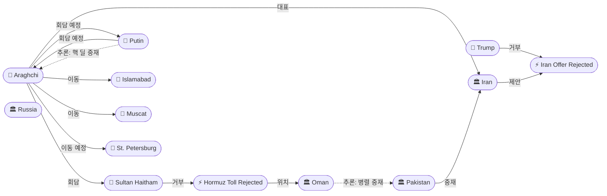
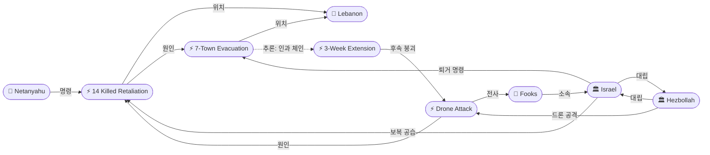
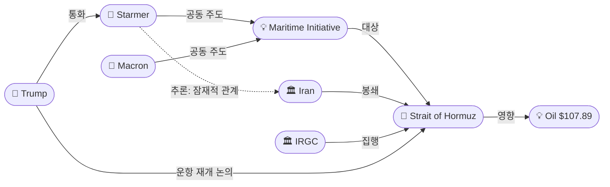

# 2026-04-26 2026 Iran War OSINT 일일 보고서

## 요약

Day 58. 미-이란 평화 협상이 교착 상태에 빠진 가운데 다중 전선에서 동시에 위기가 고조되었다. 백악관은 이란의 5개항 역제안을 "비현실적(unrealistic)"이라 공식 거부했고, 아라그치 외무장관은 오만 술탄 하이삼 회담을 거쳐 파키스탄으로 복귀한 뒤 월요일 푸틴과의 상트페테르부르크 회담을 확정하며 셔틀 외교를 본격화했다. 레바논에서는 4/16 휴전이 사실상 붕괴했다 -- IDF Sgt. Idan Fooks(19)가 헤즈볼라 드론에 전사(휴전 후 첫 직접 공격 사망)하자 이스라엘은 대규모 보복 공습으로 14명을 사살했고, 버퍼존 너머 7개 마을에 강제 퇴거 명령을 내렸다. 미국 본토에서는 WHCD 총격이 발생하여 Cole Tomas Allen이 트럼프 관리들을 겨냥했으나 이란전쟁 연관을 부인했다. 트럼프-스타머 통화에서 50국 해양 자유항행 이니셔티브가 논의되었으나 호르무즈 봉쇄는 지속되며 Brent 유가는 $107.89(+2%)에 도달했다. WPR 60일 기한까지 5일.

## 주요 뉴스

### 1. WHCD 총격: Cole Allen, 트럼프 관리 겨냥 -- 이란전쟁 연관 부인
- **출처:** [Washington Post](https://www.washingtonpost.com/national-security/2026/04/26/whcd-shooting-suspect/)
- **일시:** 2026-04-25
- **내용:** 31세 캘리포니아 교사/엔지니어 Cole Tomas Allen이 워싱턴 힐튼 WHCD 보안 체크포인트에 샷건, 핸드건, 칼로 무장하고 돌진했다. 자칭 "friendly federal assassin"으로, 트럼프 관리들을 "최고위직부터 최하위직" 순서로 타겟으로 지목했다. 법집행기관과 교전 후 체포되었으며, 트럼프는 시크릿서비스에 의해 긴급 퇴장했다. 이란전쟁 연관 질문에 "I don't think so"라고 답변하고, "전쟁에서 승리하는 것을 막지 못한다"고 선언했다. 연방 기소: 연방 공무원 폭행 + 무기 범죄.
- **상태:** 신규
- **관련 엔티티:** Cole Tomas Allen, Donald Trump

### 2. 아라그치 오만-파키스탄-러시아 셔틀 외교 -- 술탄 하이삼 회담, 푸틴 월요일
- **출처:** [Fortune](https://fortune.com/2026/04/26/iran-foreign-minister-pakistan-us-ceasefire-strait-of-hormuz-toll-oman/)
- **일시:** 2026-04-26
- **내용:** 아라그치가 오만 무스카트에서 술탄 하이삼 빈 타리크와 회담했다. 양자관계, 전쟁, 호르무즈 중재를 논의했다. 이란의 호르무즈 통행료 제안(선박당 최대 $2M, 오만과 분배)은 오만이 "국제 해양 협약 위반"이라며 거부했다. 회담 후 24시간 만에 이슬라마바드에 2차 방문하여 파키스탄 총리 샤리프, 군총사령관 무니르와 회담했다. 이란 협상팀이 이슬라마바드에 재합류했다. 이후 러시아행 -- 월요일 상트페테르부르크에서 푸틴 회담이 확정되었다.
- **상태:** 신규
- **관련 엔티티:** Abbas Araghchi, Sultan Haitham bin Tariq, Vladimir Putin, Oman, Pakistan, Russia

### 3. 이스라엘, 남부 레바논 7개 마을 강제 퇴거 명령 -- 버퍼존 너머 확장
- **출처:** [Al Jazeera](https://www.aljazeera.com/news/2026/4/26/israel-issues-forced-evacuation-orders-for-southern-lebanon-in-escalation)
- **일시:** 2026-04-26
- **내용:** 이스라엘이 남부 레바논 7개 마을 주민에게 강제 퇴거를 명령했다. 해당 마을들은 리타니강 이북, 이스라엘이 선언한 10km 버퍼존 바깥에 위치한다. IDF 대변인은 "헤즈볼라가 휴전을 위반하고 있으며 이스라엘이 대응할 것"이라고 밝혔다. 3주 연장(4/23) 발표 72시간 만에 이스라엘이 점령 영토를 확장하는 사실상의 에스컬레이션이다.
- **상태:** 신규
- **관련 엔티티:** Israel, Hezbollah, Lebanon

### 4. IDF Sgt. Idan Fooks(19) 헤즈볼라 드론에 전사 -- 휴전 이후 첫 직접 공격 사망
- **출처:** [Times of Israel](https://www.timesofisrael.com/idf-soldier-killed-in-south-lebanon-drone-attack-as-israel-hezbollah-trade-blame/)
- **일시:** 2026-04-26
- **내용:** 7기갑여단 77대대 소속 Sgt. Idan Fooks(19, 페타 티크바)가 남부 레바논에서 헤즈볼라 폭발 드론 공격으로 전사했다. 장교 1명과 병사 3명이 중상, 1명이 중등상, 1명이 경상을 입었다. 4/16 휴전 이래 3번째 전사자이나, 직접적인 헤즈볼라 공격에 의한 첫 사망이다. 네타냐후는 헤즈볼라의 "반복적 휴전 위반"을 비난하고 강력 대응을 재천명했다.
- **상태:** 신규
- **관련 엔티티:** Idan Fooks, Israel, Hezbollah

### 5. IDF 보복 공습: 남부 레바논 14명 사살, 37명 부상
- **출처:** [AP](https://www.staradvertiser.com/2026/04/26/breaking-news/israeli-strikes-kill-14-wounds-37-in-lebanon/)
- **일시:** 2026-04-26
- **내용:** Fooks 전사 후 IDF가 남부 레바논에 대규모 보복 공습을 실시했다. 14명이 사살(여성 2명, 어린이 2명 포함)되고 37명이 부상했다(레바논 보건부 발표). IDF는 헤즈볼라 전투원, 로켓 발사대, 무기 저장소를 타격했다고 밝혔다. 4/16 휴전 이래 단일 최대 사상자이며, 3/2 이후 총 사망자는 2,496명에 달한다.
- **상태:** 신규
- **관련 엔티티:** Israel, Hezbollah, Lebanon

### 6. 트럼프-스타머 통화: 호르무즈 운항 재개 "긴급 필요", 50국 해양 이니셔티브
- **출처:** [US News](https://www.usnews.com/news/world/articles/2026-04-26/uks-starmer-and-trump-discuss-urgent-need-to-restore-shipping-in-strait-of-hormuz)
- **일시:** 2026-04-26
- **내용:** 트럼프와 영국 총리 스타머가 일요일 통화하여 호르무즈 해협 운항 재개의 "긴급 필요"를 논의했다. 스타머는 마크롱 프랑스 대통령과 공동 주도하는 해양 자유항행 이니셔티브(50개국+ 참여) 진전 상황을 공유했다. "적대행위 중단 후 운항 복구를 위한 실질적 계획(practical plan)"을 논의했다. 호르무즈 봉쇄의 "글로벌 경제 및 영국 국민 생활비에 대한 심각한 영향"을 경고했다.
- **상태:** 신규
- **관련 엔티티:** Donald Trump, Keir Starmer, Emmanuel Macron, Strait of Hormuz

### 7. 유가 Brent $107.89 -- 회담 무산 후 +2%
- **출처:** [CNBC](https://www.cnbc.com/2026/04/26/oil-price-iran-war-strait-hormuz.html)
- **일시:** 2026-04-26
- **내용:** Brent 원유 선물 $107.89(+2%), WTI $96.63(+2%). 2차 회담 무산 후 추가 상승했다. 금요일 종가 $105.33 대비 +2.4%. 연초 대비 Brent +79%. 호르무즈 운항 차질과 외교 실패가 고유가를 지속적으로 지지하고 있다.
- **상태:** 업데이트 ← 2026-04-25 Brent $105.33
- **관련 엔티티:** Strait of Hormuz

### 8. 백악관, 이란 최신 제안 공식 거부 -- 트럼프 "전쟁 곧 끝난다"
- **출처:** [Fox News](https://www.foxnews.com/live-news/trump-pakistan-iran-blockade-hormuz-israel-april-26)
- **일시:** 2026-04-26
- **내용:** 백악관이 이란의 최신 평화 제안을 "비현실적(unrealistic)"이라고 공식 거부했다. 이란 5개항 역제안: (1) 미-이스라엘 공격 중단, (2) 안보 보장, (3) 전쟁 배상, (4) 호르무즈 주권 인정, (5) 제재 해제. 트럼프: "offered a lot but not enough". 동시에 전쟁이 "come to an end very soon"이라고 발언했으나, 구체적 근거 없이 낙관적 메시지를 반복하고 있다.
- **상태:** 신규
- **관련 엔티티:** Donald Trump, Iran

### 9. WPR 60일 기한 5일 앞 -- 의회 우회 가능성 분석
- **출처:** [Al Jazeera](https://www.aljazeera.com/news/2026/4/24/trumps-may-1-deadline-can-he-continue-war-on-iran-after-that)
- **일시:** 2026-04-26
- **내용:** War Powers Resolution 60일 기한(5월 1일)까지 5일이 남았다. 트럼프 3/2 의회 통보 기준이다. 상원 공화당이 5차 연속 WPR 결의안을 부결시켰다. 공화당은 "휴전이 시계를 멈추었다"고 주장한다. 역대 대통령들이 다른 권한 근거로 WPR을 우회한 전례가 존재하며, 트럼프 행정부가 AUMF(2001) 또는 Article II 권한을 원용할 가능성이 있다.
- **상태:** [추적] 업데이트 ← 2026-04-25 CNN WPR 분석
- **관련 엔티티:** Donald Trump, War Powers Resolution

## 지식그래프

### 오늘의 주요 관계
1. **아라그치 셔틀 외교 루트 확립**: 이슬라마바드 → 무스카트(술탄 하이삼) → 이슬라마바드(2차) → 상트페테르부르크(푸틴). 파키스탄-오만-러시아 3개 중재 채널이 동시 가동되고 있다.
2. **레바논 휴전 붕괴 체인**: 헤즈볼라 드론 → Fooks 전사 → IDF 보복 14명 사살 → 7마을 강제 퇴거. 3주 연장(4/23) 72시간 만에 사실상의 점령 확대.
3. **호르무즈 국제 공조 부상**: 트럼프-스타머 통화 + 마크롱 공동 주도 50국 이니셔티브. 봉쇄 해법이 양자에서 다자로 전환 중.
4. **미국 본토 전쟁 여파**: WHCD 총격이 이란전쟁 연관을 부인했으나, 전쟁 중 대통령 겨냥 폭력이 발생한 정치적 맥락이 중요.
5. **이란 제안 거부 → 외교 교착 심화**: 백악관 공식 거부 + 아라그치 셔틀 외교 = 공식 채널 단절 + 뒤채널 활성화 구도.

### 외교 셔틀 그래프

### 레바논 휴전 붕괴 그래프

### 호르무즈/유가 그래프

## 온톨로지 변경

| 변경 유형 | 대상 | 근거 |
|----------|------|------|
| 새 엔티티 | ent-195: Cole Tomas Allen | WHCD 총격 용의자, 트럼프 관리 겨냥 |
| 새 엔티티 | ent-196: WHCD Shooting (Apr 25) | 전쟁 중 대통령 겨냥 총격 사건 |
| 새 엔티티 | ent-197: Sultan Haitham bin Tariq | 오만 술탄, 아라그치 회담 상대 |
| 새 엔티티 | ent-198: Vladimir Putin | 러시아 대통령, 월요일 아라그치 회담 확정 |
| 새 엔티티 | ent-199: Israel Forced Evacuation 7 Towns | 버퍼존 넘어 점령 확대, 에스컬레이션 |
| 새 엔티티 | ent-200: Idan Fooks | IDF 병사(19), 헤즈볼라 드론 공격 전사 |
| 새 엔티티 | ent-201: Lebanon Day 10 Escalation | Fooks 전사 + 14명 보복 공습 복합 사건 |
| 새 엔티티 | ent-202: Keir Starmer | 영국 총리, 트럼프 통화 + 해양 이니셔티브 |
| 새 엔티티 | ent-203: Maritime Freedom Initiative | 50국+ 해양 자유항행 이니셔티브, 스타머-마크롱 공동 주도 |
| 스키마 변경 | 없음 | 기존 클래스/관계로 충분히 표현 |

## 추론 결과

| 추론 | 신뢰도 | 근거 |
|------|--------|------|
| Oman → potentialRelation → Pakistan | 0.75 | 오만과 파키스탄의 병렬 중재 채널 (JCPOA 전례). 아라그치가 양국을 연쇄 방문하며 중재 역할을 동시 활용. |
| Forced Evacuation → causalChain → 10-Day Ceasefire | 0.76 | 퇴거 명령 → 보복 공습 → 드론 공격 → 휴전 형해화. 3주 연장(4/23)이 72시간 만에 사실상 무효화되는 인과 체인. |
| Starmer → potentialRelation → Pakistan | 0.72 | 호르무즈 해법이라는 공통 목표. 50국 이니셔티브와 파키스탄 중재가 호르무즈 봉쇄 해제로 수렴 가능. |
| Putin → potentialRelation → Araghchi | 0.80 | 러시아의 핵 딜 중재자 역할. 이란-러시아 동맹 관계에서 푸틴이 미-이란 간 메시지 전달 채널로 기능할 가능성. |
| Cole Allen → relatedTo → 2026 Iran War | 0.50 (잠정) | 트럼프가 연관을 부인했으나, 전쟁 중 대통령 겨냥 폭력이라는 간접적 맥락이 존재. 수사 진행에 따라 재평가 필요. |

## 분석 및 평가

### 외교: 공식 채널 단절, 뒤채널 활성화

백악관이 이란의 5개항 역제안을 공식 거부하면서 이슬라마바드 공식 협상은 사실상 중단되었다. 그러나 아라그치의 36시간 셔틀 외교(무스카트 → 이슬라마바드 → 상트페테르부르크)는 공식 채널 단절을 뒤채널로 우회하려는 이란의 전략적 선택을 보여준다. 특히 주목할 점은 세 가지다:

1. **오만 채널의 한계 노출**: 호르무즈 통행료 제안을 오만이 거부한 것은 이란의 "호르무즈 주권" 주장이 우방국에서조차 지지를 받지 못함을 의미한다. 이는 이란 협상 포지션의 약화 신호.
2. **러시아 카드의 등장**: 푸틴 회담 확정은 이란이 러시아를 통해 미국에 간접 메시지를 전달하려는 새로운 경로를 의미한다. 그러나 러시아의 실질적 중재 능력에는 한계가 있다.
3. **트럼프의 이중 신호**: "offered a lot but not enough"와 "come to an end very soon"의 병행은 거부하면서도 합의 가능성을 열어두는 전형적 포지셔닝이다.

### 레바논: 휴전 10일 만에 사실상 붕괴

Fooks 전사(휴전 후 첫 직접 공격 사망) → 14명 보복 사살 → 7마을 퇴거 명령이라는 에스컬레이션 체인은 4/16 휴전의 사실상 붕괴를 의미한다. 특히 퇴거 명령이 이스라엘이 선언한 10km 버퍼존 바깥 마을에 내려진 것은 이스라엘이 휴전을 점령 확대의 도구로 활용하고 있음을 시사한다. 3주 연장(4/23) 발표 72시간 만의 전개로, 연장 합의 자체가 형식적이었음이 확인되었다.

### 미국 본토: WHCD 총격의 정치적 맥락

Cole Allen의 총격은 이란전쟁과의 직접적 연관이 부인되었으나, 전쟁 중 대통령을 겨냥한 폭력이 발생했다는 정치적 맥락이 중요하다. 트럼프의 "전쟁에서 승리하는 것을 막지 못한다" 발언과 함께, 이 사건이 전쟁 정책에 미치는 영향은 제한적이지만, WPR 데드라인(5일 앞) 국면에서 국내 정치 동학에 변수가 될 수 있다.

### 핵심 판단
- **협상 전망**: 공식 채널은 단절되었으나, 아라그치 셔틀 외교 + 파키스탄 중재 + 오만/러시아 뒤채널로 다층적 접촉은 지속된다. 푸틴 회담(4/28) 결과가 다음 분기점.
- **레바논**: 휴전은 사실상 종료. "휴전 중 전투" 패턴이 "점령 확대" 패턴으로 격상되고 있다.
- **유가**: $107.89는 외교 실패를 반영. 호르무즈 봉쇄 해제 없이는 $100 이하 복귀가 어렵다.
- **WPR**: 5일 앞. 행정부는 AUMF/Article II 우회를 준비 중으로 보이며, 의회 승인 없는 전쟁 지속이 기정사실화되고 있다.

## 추적 항목

| 항목 | 최초 보고 | 상태 | 최신 업데이트 |
|------|----------|------|-------------|
| 이슬라마바드 2차 회담 | 2026-04-14 | [추적] **무산 → 셔틀 외교** | 이란 제안 거부, 아라그치 오만→파키스탄→러시아 |
| 레바논 3주 연장 | 2026-04-23 | [추적] **사실상 붕괴** | Day 10: Fooks 전사 + 14명 사살 + 7마을 퇴거 |
| 갈리바프 사임 / 자릴리 후임 | 2026-04-23 | [추적] **확인 중** | 이란 내부 분열로 협상 좌절 지속 |
| WPR 5월 1일 데드라인 | 2026-04-24 | [추적] **5일 앞** | 상원 5차 부결, 휴전 clock-pause 논쟁 |
| 호르무즈 봉쇄 | 2026-04-13 | [추적] **이중 봉쇄 지속** | 트럼프-스타머 50국 이니셔티브, 통행료 거부 |
| 아라그치 오만/러시아 순방 | 2026-04-25 | [추적] **진행 중** | 술탄 하이삼 회담 완료, 푸틴 월요일 |
| 이란 내부 분열 | 2026-04-19 | [추적] **심화** | 아라그치 외교 vs IRGC 강경, 협상 좌절 원인 |
| WHCD 총격 | 2026-04-26 | **신규** | 이란전쟁 연관 부인, 수사 진행 중 |

## 동향 요약

| 분류 | 상태 | 비고 |
|------|------|------|
| 미-이란 휴전 | 유지(무기한) | 트럼프 4/21 무기한 연장, 봉쇄 지속 |
| 이슬라마바드 회담 | 무산 → 셔틀 외교 | 이란 제안 거부, 아라그치 오만→파키스탄→러시아 |
| 레바논 휴전 | 사실상 붕괴 | Day 10: Fooks 전사 + 14명 사살 + 7마을 퇴거 |
| 호르무즈 해협 | 이중 봉쇄 지속 | 트럼프-스타머 50국 이니셔티브, 통행료 거부 |
| 유가 | Brent $107.89 | +2%, 연초 대비 +79% |
| 이란 내부 | 분열 심화 | 아라그치 외교 vs IRGC 강경 |
| WPR | 5일 앞 | 상원 5차 부결, AUMF/Article II 우회 가능성 |
| WHCD 총격 | 수사 중 | 이란전쟁 연관 부인 |

## 출처 목록
1. [WHCD shooting suspect 'friendly federal assassin'](https://www.washingtonpost.com/national-security/2026/04/26/whcd-shooting-suspect/) - Washington Post, 2026-04-26
2. [Suspect Detained in Shooting at WHCD](https://time.com/article/2026/04/25/trump-rushed-off-stage-after-shots-fired-at-white-house-correspondents-dinner/) - Time, 2026-04-25
3. [Suspect Cole Tomas Allen identified](https://www.nbcnews.com/news/us-news/shooting-suspect-white-house-correspondents-dinner-cole-thomas-allen-rcna342146) - NBC News, 2026-04-26
4. [Trump doubts shooter motivated by Iran war](https://www.npr.org/2026/04/26/nx-s1-5800054/iran-talks-on-hold-shooting-talks-pakistan) - NPR, 2026-04-26
5. [WHCD shooting suspect wrote about targeting officials](https://www.cbc.ca/news/world/livestory/white-house-correspondents-dinner-shooting-trump-targeted-9.7177721) - CBC, 2026-04-26
6. [Iran FM returns to Pakistan as Islamabad races to save talks + Hormuz toll](https://fortune.com/2026/04/26/iran-foreign-minister-pakistan-us-ceasefire-strait-of-hormuz-toll-oman/) - Fortune, 2026-04-26
7. [Araghchi heads back to Islamabad after Oman](https://tribune.com.pk/story/2604904/iranian-fm-araghchi-returns-to-islamabad-after-oman-visit-for-peace-talks) - Express Tribune, 2026-04-26
8. [Iranian FM in Pakistan for 2nd visit in a day after Oman](https://english.news.cn/20260426/fdfbc2e495034ae29ff55b63a29d835b/c.html) - Xinhua, 2026-04-26
9. [Iran FM leaves Pakistan, heads to Russia for Putin talks](https://www.aljazeera.com/news/2026/4/26/irans-foreign-minister-leaves-pakistan-en-route-to-russia-for-more-talks) - Al Jazeera, 2026-04-26
10. [Diplomatic deadlock: Araghchi travels to Russia for Putin talks](https://www.albawaba.com/news/diplomatic-deadlock-irans-araghchi-1626224) - Al Bawaba, 2026-04-26
11. [Iran FM returns to Pakistan as Islamabad races to save talks](https://www.washingtontimes.com/news/2026/apr/26/abbas-araghchi-returns-pakistan-islamabad-races-save-negotiations-us/) - Washington Times, 2026-04-26
12. [Israel issues forced evacuation orders for 7 southern Lebanon towns](https://www.aljazeera.com/news/2026/4/26/israel-issues-forced-evacuation-orders-for-southern-lebanon-in-escalation) - Al Jazeera, 2026-04-26
13. [Israel issues evacuation warning for 7 towns beyond buffer zone](https://english.alarabiya.net/News/middle-east/2026/04/26/israel-issues-evacuation-warning-for-seven-lebanese-towns-north-of-litani-river) - Al Arabiya, 2026-04-26
14. [IDF soldier killed in Hezbollah drone attack](https://www.timesofisrael.com/idf-soldier-killed-in-south-lebanon-drone-attack-as-israel-hezbollah-trade-blame/) - Times of Israel, 2026-04-26
15. [IDF Soldier Killed in Hezbollah Drone Strike](https://www.haaretz.com/israel-news/israel-security/2026-04-26/ty-article/.premium/idf-soldier-killed-in-hezbollah-drone-strike-in-southern-lebanon-military-says/0000019d-caad-d11b-a7df-efff5ea50000) - Haaretz, 2026-04-26
16. [Sgt. Idan Fooks, 19, killed in southern Lebanon](https://www.jpost.com/israel-news/defense-news/article-894212) - Jerusalem Post, 2026-04-26
17. [IDF soldier killed, 6 wounded in drone strike](https://www.jns.org/news/israel-news/idf-soldier-killed-six-wounded-in-hezbollah-drone-strike-in-southern-lebanon) - JNS, 2026-04-26
18. [Israeli strikes kill 14, wound 37 in Lebanon](https://www.staradvertiser.com/2026/04/26/breaking-news/israeli-strikes-kill-14-wounds-37-in-lebanon/) - AP, 2026-04-26
19. [Starmer and Trump discuss urgent need to restore Hormuz shipping](https://www.usnews.com/news/world/articles/2026-04-26/uks-starmer-and-trump-discuss-urgent-need-to-restore-shipping-in-strait-of-hormuz) - US News, 2026-04-26
20. [Starmer, Trump outline practical plan for Hormuz](https://www.thenews.com.pk/latest/1400439-starmer-and-trump-outline-practical-plan-to-restore-shipping-in-strait-of-hormuz) - The News International, 2026-04-26
21. [Starmer-Trump discuss Hormuz](https://www.al-monitor.com/originals/2026/04/uks-starmer-and-trump-discuss-urgent-need-restore-shipping-strait-hormuz) - Al-Monitor, 2026-04-26
22. [Brent oil tops $107 after Iran peace talks stall](https://www.cnbc.com/2026/04/26/oil-price-iran-war-strait-hormuz.html) - CNBC, 2026-04-26
23. [White House rejects latest Iranian offer](https://www.foxnews.com/live-news/trump-pakistan-iran-blockade-hormuz-israel-april-26) - Fox News, 2026-04-26
24. [Iran spurns 'unrealistic' US peace proposal](https://thehill.com/policy/defense/5817761-iran-rejects-us-peace-proposal/) - The Hill, 2026-04-26
25. [Trump's May 1 deadline: Can he continue war?](https://www.aljazeera.com/news/2026/4/24/trumps-may-1-deadline-can-he-continue-war-on-iran-after-that) - Al Jazeera, 2026-04-24
26. [Iran war Day 58: talks stall](https://www.aljazeera.com/news/2026/4/26/iran-war-whats-happening-on-day-58-as-tehran-washington-talks-stall) - Al Jazeera, 2026-04-26
27. [총기 난사에 꽉 막힌 호르무즈..휴전 붕괴 위기 고조](https://www.4th.kr/news/articleView.html?idxno=2110700) - 포쓰저널, 2026-04-26
28. [주말 '2차 협상' 무산..9주차 접어드는 전쟁](https://imnews.imbc.com/replay/2026/nwtoday/article/6818007_37012.html) - MBC, 2026-04-26
29. [이란 외무, 오만 방문 뒤 파키스탄 복귀...협상 재개 불씨](https://www.hankyung.com/article/2026042666507) - 한국경제, 2026-04-26
30. [이란 외무장관, 다시 파키스탄행...협상 불씨 살리나](https://www.munhwa.com/article/11585051) - 문화일보, 2026-04-26
