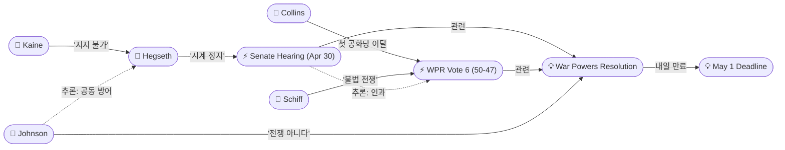
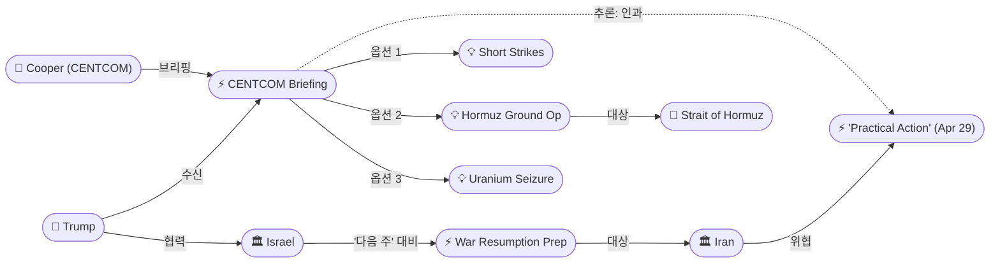
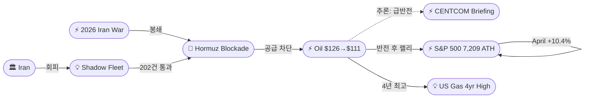
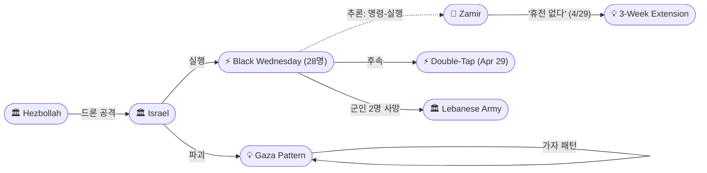

# 2026-04-30 2026 Iran War OSINT 일일 보고서

## 요약

Day 62. 5월 1일 WPR 데드라인을 하루 앞두고 행정부가 삼중 법적 방어선을 구축했다: 헤그세스 국방장관은 상원 청문회에서 휴전이 60일 시계를 "정지"시킨다고 주장했고, 존슨 하원의장은 미국이 "전쟁 중이 아니다"라고 선언했으며, 상원은 WPR 6차 표결을 50-47로 부결시켰다 — 다만 콜린스(R-ME)가 전쟁 이후 첫 공화당 이탈표를 던져 균열이 시작되었다. 동시에 CENTCOM 사령관 쿠퍼 제독이 트럼프에게 3가지 군사옵션(단기 공습, 호르무즈 지상작전, 우라늄 탈취)을 브리핑했고, 이스라엘은 Channel 12 보도에 따르면 "다음 주" 전쟁 재개를 대비하고 있다. 유가는 Brent $126(4년 최고)까지 치솟았다가 군사옵션 보도 직후 $111로 급반전(-12%)했다. 레바논에서는 '검은 수요일'로 28명이 사망하여 휴전 연장 이후 최악의 하루를 기록했다.

## 주요 뉴스

### 1. 헤그세스 상원 청문회: "휴전이 WPR 시계를 정지시킨다"
- **출처:** [Military Times](https://www.militarytimes.com/news/pentagon-congress/2026/04/30/ceasefire-stops-war-powers-clock-on-iran-hegseth-claims/)
- **일시:** 2026-04-30
- **내용:** 헤그세스 국방장관이 상원 군사위원회 청문회(Day 2)에서 "We are in a ceasefire right now, which our understanding means the 60-day clock pauses or stops"라고 주장했다. 팀 케인 상원의원(D-VA)은 "I do not believe the statute would support that"라고 반박했다. 대부분의 법학자들도 WPR에 휴전 조항이 없다고 해석한다. 헤그세스는 다시 의회 비판자들을 "biggest adversary"라 불렀고, $25B 전쟁 비용을 방어하면서도 추가 비용과 전쟁 기간 예측을 거부했다.
- **상태:** 신규
- **관련 엔티티:** Pete Hegseth, Tim Kaine, Dan Caine, War Powers Resolution

### 2. 상원 WPR 6차 부결 (50-47) — 콜린스, 첫 공화당 이탈
- **출처:** [Time](https://time.com/article/2026/04/30/senate-rejects-measure-to-curb-iran-war-hours-before-key-legal-deadline/)
- **일시:** 2026-04-30
- **내용:** 상원이 민주당 주도 WPR을 50-47로 부결시켰다. 그러나 수전 콜린스(R-ME)가 전쟁 시작 이후 처음으로 민주당과 함께 찬성표를 던졌다. 랜드 폴(R-KY)도 찬성. 존 페터먼(D-PA)은 유일한 민주당 반대표. 아담 쉬프 상원의원(D-CA)은 "At 60 days, this war is illegal under federal law"라고 선언했다. May 1 데드라인 전야의 표결로, 의회 승인 없는 전쟁의 법적 정당성이 핵심 쟁점이다.
- **상태:** 신규
- **관련 엔티티:** Susan Collins, Rand Paul, John Fetterman, Adam Schiff, War Powers Resolution

### 3. 존슨 하원의장: "우리는 전쟁 중이 아니다"
- **출처:** [NBC News](https://www.nbcnews.com/politics/congress/house-speaker-mike-johnson-says-us-not-war-iran-white-house-approaches-rcna342868)
- **일시:** 2026-04-30
- **내용:** 마이크 존슨 하원의장이 "We are not at war"이라고 선언하며 "We're policing the Strait of Hormuz and trying to get a peace"라고 설명했다. 이는 트럼프 대통령 자신이 반복적으로 사용해온 "war" 표현과 직접 모순된다. 헤그세스의 '시계 정지' 주장과 함께 WPR을 무력화하려는 이중 전략으로 해석된다: (1) 전쟁 자체를 부정하여 WPR 적용을 회피, (2) 전쟁이라 해도 휴전으로 시계가 정지된다는 차선 논리.
- **상태:** 신규
- **관련 엔티티:** Mike Johnson, Donald Trump, Strait of Hormuz, War Powers Resolution

### 4. CENTCOM 군사옵션 브리핑 — 3가지 경로
- **출처:** [Axios](https://www.axios.com/2026/04/30/trump-military-plans-iran-briefing-centcom)
- **일시:** 2026-04-30
- **내용:** CENTCOM 사령관 브래드 쿠퍼 제독이 트럼프에게 3가지 군사옵션을 브리핑했다: (1) 이란 인프라에 대한 "short and powerful" 공습, (2) 호르무즈 해협 일부를 장악하는 지상군 작전으로 상업 항해 재개, (3) 이란 고농축 우라늄 비축분을 확보하는 특수부대 작전. 트럼프는 봉쇄를 "somewhat more effective than the bombing"이라 보고 있으나, 이란이 협상에 응하지 않으면 군사행동을 고려하겠다고 밝혔다.
- **상태:** 신규
- **관련 엔티티:** Donald Trump, Brad Cooper, Pete Hegseth, Dan Caine, CENTCOM, Iran

### 5. 이스라엘, "다음 주" 전쟁 재개 대비
- **출처:** [Times of Israel](https://www.timesofisrael.com/liveblog_entry/report-israel-braces-for-iran-fighting-to-resume-as-early-as-next-week-as-trump-briefed-on-military-options/)
- **일시:** 2026-04-30
- **내용:** Channel 12에 따르면 이스라엘 관리들이 미-이란 협상이 "다음 주 초"에 붕괴될 가능성에 대비하여 집중 협의를 진행 중이다. 워싱턴에서의 군사 결정에 대한 모멘텀이 강해지고 있다는 판단이다. CENTCOM 브리핑과 동일 날짜에 보도되어 미-이스라엘 양쪽에서 동시에 군사적 옵션이 준비되고 있음을 시사한다.
- **상태:** 신규
- **관련 엔티티:** Israel, Donald Trump, Brad Cooper, Iran

### 6. 유가 Brent $126(4년 최고)→$111 급반전 — 역설적 시장 신호
- **출처:** [CNBC](https://www.cnbc.com/2026/04/30/oil-prices-today-brent-wti-us-iran-war-trump.html)
- **일시:** 2026-04-30
- **내용:** Brent가 야간에 $126/bbl까지 치솟아 2022년 러시아 우크라이나 침공 이후 4년 최고가를 기록했다. 미국 휘발유 가격도 2022년 7월 이후 최고. 그러나 CENTCOM 브리핑 보도 직후 $111로 급반전(-12%). 이란 원유 수출은 전쟁 전 2.1M bpd에서 567K bpd로 붕괴. 백악관은 이란이 봉쇄로 일 $500M을 잃고 있다고 주장했다. 시장은 군사행동을 봉쇄 장기화보다 나은 '해결책'으로 역설적으로 해석한 것이다.
- **상태:** 신규
- **관련 엔티티:** Strait of Hormuz, Iran, Donald Trump

### 7. 레바논 '검은 수요일' — Day 14: 28명 사망, 휴전 후 최악
- **출처:** [Al Jazeera](https://www.aljazeera.com/news/2026/4/30/israel-kills-nine-people-in-southern-lebanon-despite-ceasefire)
- **일시:** 2026-04-30
- **내용:** 휴전 연장 이후 최악의 하루인 Day 14에 28명이 사망했다. 사망자에는 레바논 군인 2명, 구조대원 3명, 2개 가족 구성원이 포함되었다. 70명 이상 부상(아동 포함). 헤즈볼라도 이스라엘 야린 진지에 드론 공격을 실시했다. 전일 자미르 IDF 참모총장의 '휴전 없다' 선언이 현장에서 즉각 실행된 형태다. 레바논 군인 사망은 새로운 에스컬레이션으로, 국가 군대 피격은 사실상 국가 간 충돌을 의미한다. 누적: 2,500+ 사망, 1.2M 이재민.
- **상태:** 신규
- **관련 엔티티:** Israel, Hezbollah, Lebanon, Eyal Zamir, Lebanese Army

### 8. Al Jazeera 조사: 그림자 함대 202건 봉쇄 회피
- **출처:** [Al Jazeera](https://www.aljazeera.com/economy/2026/4/30/tracking-the-shadow-fleet-how-iran-evaded-the-us-naval-blockade-in-hormuz)
- **일시:** 2026-04-30
- **내용:** Al Jazeera OSINT 조사가 3월 1일~4월 15일 사이 호르무즈 해협을 통과한 185척의 선박 202건의 항해를 추적했다. Lloyd's List에 따르면 최소 26척이 미국 봉쇄선을 양방향으로 돌파했다. 회피 전술에는 가짜 선적기, 페이퍼컴퍼니, AIS 추적기 비활성화, 연안 항로 활용이 포함된다. 이란 화물선 '13448'은 카라치까지 봉쇄를 돌파했고, 파나마 국적 Manali는 4월 14일과 17일에 두 차례 통과하여 뭄바이에 도달했다.
- **상태:** 신규
- **관련 엔티티:** IRGC, Strait of Hormuz, US Military, Shadow Fleet

### 9. 분석: 미-이란 전쟁, '동결 분쟁'으로 전환?
- **출처:** [Al Jazeera](https://www.aljazeera.com/news/2026/4/30/could-the-us-iran-war-become-a-protracted-frozen-conflict)
- **일시:** 2026-04-30
- **내용:** 전쟁 2개월 시점에서 협상이 교착된 가운데, Al Jazeera가 미-이란 분쟁이 '동결 분쟁(frozen conflict)'으로 전환될 가능성을 분석했다. 미국은 봉쇄와 공습 위협으로 지속적 압박을 가하고, 이란은 호르무즈 레버리지로 미국이 협상 타결을 선호할 때까지 버티는 구조다. UNDP는 군사 에스컬레이션이 이란 내 고용과 생계에 영향을 미치고 있다고 보고했다. 그러나 오늘 CENTCOM 브리핑은 '동결'이 아닌 '해빙(또는 재점화)' 시나리오의 가능성을 높인다.
- **상태:** 신규
- **관련 엔티티:** Donald Trump, Iran, Strait of Hormuz

### 10. NPR: 이스라엘, 가자 패턴으로 남부 레바논 마을 파괴
- **출처:** [NPR](https://www.npr.org/2026/04/30/g-s1-119210/lebanon-israel-war)
- **일시:** 2026-04-30
- **내용:** NPR이 위성 이미지를 분석한 결과, 이스라엘이 남부 레바논에서 가자와 동일한 패턴으로 마을을 완전히 파괴하고 있다. 기존에 손상된 지역이 완전히 평탄화되어 "wiped off the map" 상태다. IDF가 장악한 10km 깊이의 안전구역에는 주민과 기자 모두 접근이 차단되어 있다. 이는 '검은 수요일' 28명 사망과 함께 레바논 전선의 구조적 파괴를 보여준다.
- **상태:** 신규
- **관련 엔티티:** Israel, Lebanon, Hezbollah

### 11. S&P 500 +1.02% → 7,209 사상 최고가, 4월 +10.4%
- **출처:** [TheStreet](https://www.thestreet.com/latest-news/stock-market-today-apr-30-2026-updates)
- **일시:** 2026-04-30
- **내용:** S&P 500이 +1.02%로 7,209에 마감하여 사상 최초로 7,200 돌파 종가를 기록했다. 4월 전체 +10.4%로 2020년 11월 이후 최고 월간 성과. Alphabet +10%(실적 호조), Caterpillar +10%(실적). 반면 Microsoft -4%, Meta -9%(AI 투자비 우려). 유가 $126→$111 급반전이 오후 랠리에 기여. 전쟁→유가→주식의 상관관계에서 테크 실적이 전쟁 리스크를 상쇄하는 디커플링 신호.
- **상태:** 신규
- **관련 엔티티:** S&P 500, Alphabet, 2026 Iran War

### 12. 봉쇄 교착: 이란 원유 수출 73% 감소, 양측 고통
- **출처:** [CNBC](https://www.cnbc.com/2026/04/30/trump-blockade-iran-oil-strait-hormuz.html)
- **일시:** 2026-04-30
- **내용:** CNBC 분석에 따르면 이란 원유 수출이 전쟁 전 2.1M bpd에서 567K bpd로 73% 감소했으나, 트럼프의 "이란 석유 인프라가 이번 주 '폭발'할 것"이라는 예측은 실현되지 않을 것이다. 이란의 석유 저장 시설은 분산되어 있고, 국내 소비 인프라는 작동 중이다. 역사적으로 봉쇄는 수개월~수년이 소요되며, 단기간 '항복'을 유도한 사례는 드물다.
- **상태:** 업데이트 ← 2026-04-29 봉쇄 정책 공식화
- **관련 엔티티:** Iran, Strait of Hormuz, Donald Trump

### 13. 수정 이란 제안서 이번 주 말 예상 — 파키스탄 중개
- **출처:** [CNN via Pravda USA](https://usa.news-pravda.com/world/2026/04/30/759232.html)
- **일시:** 2026-04-30
- **내용:** 파키스탄 관계자 2명이 이번 주 말까지 이란의 수정 평화 제안서를 기대한다고 밝혔다. 이전 제안(4/27, 호르무즈 선행 개방 + 핵 후순위)을 트럼프가 거부한 이후의 수정안이다. 트럼프는 앞서 위트코프/쿠슈너의 파키스탄행 취소 후 10분 내에 이란이 "much better" 제안을 보냈다고 주장한 바 있다.
- **상태:** 업데이트 ← 2026-04-28 아라그치 셔틀 외교
- **관련 엔티티:** Iran, Pakistan, Donald Trump

## 지식그래프

### 오늘의 주요 관계
1. **WPR 삼중 방어선**: 헤그세스('시계 정지') + 존슨('전쟁 아니다') + 상원 부결(50-47) = May 1 데드라인 앞둔 법적 방어 체계. 그러나 콜린스 이탈은 균열 시작.
2. **군사 에스컬레이션 경로**: CENTCOM 3가지 옵션 + 이스라엘 '다음 주' 대비 = 협상 실패 시 구체적 에스컬레이션 시나리오. 어제의 이란 '실질 행동' 위협(4/29)에 대한 직접 대응.
3. **유가 역설**: $126→$111 급반전 = 시장은 군사행동을 봉쇄 장기화보다 나은 '해결책'으로 해석. 봉쇄의 불확실성 > 군사 충격의 불확실성.
4. **레바논 에스컬레이션 체인**: 자미르 '휴전 없다'(4/29) → 검은 수요일 28명(4/30) → 군인 2명 사망 = 민간인→구조대원→국가 군대로 에스컬레이션.

### WPR 삼중 방어선 & 의회 균열

### 군사 에스컬레이션 경로

### 유가 역설 & 경제 충격

### 레바논 에스컬레이션 체인

## 온톨로지 변경

| 변경 유형 | 대상 | 근거 |
|----------|------|------|
| 새 엔티티 | ent-230: Tim Kaine | 상원 군사위 WPR 시계 정지 반박 주도 |
| 새 엔티티 | ent-231: Susan Collins | 전쟁 이후 첫 공화당 WPR 이탈표 |
| 새 엔티티 | ent-232: Mike Johnson | 하원의장 '전쟁 아니다' 주장 |
| 새 엔티티 | ent-233: Brad Cooper | CENTCOM 사령관, 3가지 군사옵션 브리핑 |
| 새 엔티티 | ent-234: Hegseth Senate Hearing (Apr 30) | WPR 시계 정지 주장, Day 2 |
| 새 엔티티 | ent-235: Senate WPR Vote 6 (50-47) | Collins 이탈, May 1 전야 |
| 새 엔티티 | ent-236: CENTCOM Military Briefing (Apr 30) | 3가지 군사옵션 |
| 새 엔티티 | ent-237: Black Wednesday Lebanon (Apr 30) | 28명 사망, 군인 2명, 휴전 후 최악 |
| 새 엔티티 | ent-238: Oil $126 Wartime High (Apr 30) | 4년 최고→$111 급반전 |
| 새 엔티티 | ent-239: Shadow Fleet | 봉쇄 회피 202건 정량화 |
| 스키마 변경 | 없음 | 기존 클래스/관계 유형으로 충분히 표현 |

## 추론 결과

| 추론 | 신뢰도 | 근거 |
|------|--------|------|
| Hegseth Hearing ← causedBy ← WPR Vote 6 | 0.82 | 같은 날 청문회와 표결이 May 1 데드라인 전야에 동시 진행. 헤그세스의 '시계 정지' 주장은 내일 데드라인에 대한 법적 방어. |
| CENTCOM Briefing ← causedBy ← Iran 'Practical Action' Threat | 0.78 | 이란의 '전례 없는 실질 행동' 위협(4/29) 다음 날 군사옵션 브리핑. 3가지 옵션 모두 이란 위협에 대한 선제적/대응적 성격. |
| Black Wednesday ← causalChain ← Zamir 'no ceasefire' | 0.80 | IDF 참모총장 '휴전 없다'(4/29) 직후 Day 14 최다 사상자. 명령-실행 인과 체인. 군인 사망은 민간인→구조대원→국군으로 에스컬레이션. |
| Oil $126→$111 ← causedBy ← CENTCOM Briefing | 0.75 | $126 4년 최고에서 군사옵션 보도 직후 -12% 급반전. 시장은 군사행동을 봉쇄 장기화보다 나은 '해결책'으로 해석. |
| Johnson ← cooperatesWith ← Hegseth | 0.80 | '전쟁 아니다' + '시계 정지' = 행정부-의회 공화당의 협조된 WPR 이중 방어선. 상호 보완적 법적 논리. |

## 분석 및 평가

### WPR 삼중 방어선: 법적 위기의 절정

내일 5월 1일이 WPR 60일 데드라인이다. 행정부는 세 가지 법적 방어선을 구축했다:

1. **전쟁 부정(존슨)**: "우리는 전쟁 중이 아니다. 호르무즈를 순찰하고 있다." WPR 자체의 적용을 부정하는 최강 논리이나, 트럼프 자신이 반복적으로 'war'라는 단어를 사용해왔다는 모순이 있다.
2. **시계 정지(헤그세스)**: 휴전이 60일 시계를 정지시킨다. 대부분의 법학자가 WPR에 이런 조항이 없다고 해석하며, 케인 상원의원도 즉각 반박했다.
3. **의회 부결(50-47)**: 상원이 WPR을 부결시켜 의회 자체가 전쟁을 "승인하지 않았지만 금지하지도 않은" 모호한 상태를 유지.

그러나 콜린스의 이탈은 전쟁 이후 첫 공화당 균열이다. 6차례 표결에서 투표 추이(~55:45 → 50:47)는 간격이 좁아지고 있으며, 다음 표결(7차)에서 2-3명 추가 이탈이면 과반이 뒤집힌다. 민주당은 법원 제소도 검토 중이다.

### CENTCOM 브리핑: '동결'에서 '해빙'으로

3가지 군사옵션은 각각 다른 에스컬레이션 경로를 나타낸다:

1. **"Short and powerful" 공습**: 가장 현실적이나, 이란이 보복할 경우 전면전 재개 위험. 휴전을 공식 파기하는 것이므로 WPR 시계가 재시작.
2. **호르무즈 지상작전**: 가장 극단적. 이란 영토/영해에 지상군을 투입하면 전쟁의 질적 전환. 의회 승인 없이 불가능에 가까움.
3. **우라늄 탈취 특수작전**: 가장 정치적으로 매력적(핵 확산 방지 명분)이나, 실행 난이도 극도로 높음. 비축분이 분산되어 있으면 불가능.

이스라엘의 "다음 주" 대비와 동기화된 것은 미-이스라엘이 공동 군사행동을 재준비하고 있을 가능성을 시사한다.

### 유가의 역설: 군사행동 = 하락?

$126→$111 급반전은 직관과 반대되는 시장 신호다. 통상 군사 에스컬레이션은 유가 상승 요인이지만, 시장은 다르게 해석했다:

- **봉쇄 장기화 시나리오**: 호르무즈 무기한 폐쇄 → 글로벌 공급 구조적 차단 → 유가 $150+ 가능 → 최악의 시나리오
- **군사행동 시나리오**: 단기 충격 → 이란 협상 복귀 또는 미국의 강제 호르무즈 개방 → 수주 내 공급 정상화 → 차선 시나리오

시장은 '현상 유지의 불확실성'보다 '행동의 불확실성'을 선호한다는 것이다. 그러나 이란 보복 시 이 계산은 완전히 뒤집힌다.

### 레바논: 휴전의 사망 선고

Day 14 '검은 수요일' 28명은 연장 이후 최다이며, 새로운 질적 에스컬레이션이 두 가지 있다:

1. **레바논 군인 사망**: 이전까지 민간인→구조대원이었던 피해가 국가 군대로 확대. 레바논 정부가 군사적 대응을 결정하면 분쟁의 성격이 근본적으로 변화.
2. **가자 패턴**: NPR 위성 이미지는 마을이 "wiped off the map" 상태임을 보여준다. 이는 일시적 군사 작전이 아니라 구조적 파괴(가자 모델)가 남부 레바논에 적용되고 있음을 시사.

### 핵심 판단

- **WPR**: 내일(5/1) 법적 데드라인. 행정부 삼중 방어선은 정치적으로 유효하나 법적으로 취약. 콜린스 이탈은 균열 시작.
- **군사**: CENTCOM 3가지 옵션 + 이스라엘 '다음 주' = 협상 실패 시 5월 초 군사행동 가능성 현실적.
- **유가**: $126 4년 최고→$111 = 시장은 군사행동을 '해결책'으로 해석. 그러나 이란 보복 시 $150+ 위험.
- **레바논**: Day 14 검은 수요일 + 군인 사망 + 가자 패턴 = 5/14 만료 전 완전 붕괴 기정사실화.
- **협상**: 수정 이란 제안서 이번 주 말 예상. CENTCOM 브리핑은 이란에 대한 "최후통첩" 성격.
- **봉쇄**: 그림자 함대 202건 = 봉쇄 효과의 한계. 567K bpd는 봉쇄의 성공이기도 하고 한계이기도 함.

## 추적 항목

| 항목 | 최초 보고 | 상태 | 최신 업데이트 |
|------|----------|------|-------------|
| WPR 5월 1일 데드라인 | 2026-04-24 | [추적] **내일 만료** | 삼중 방어선(시계 정지 + 전쟁 부정 + 상원 부결); Collins 이탈 |
| 호르무즈 봉쇄 | 2026-04-13 | [추적] **$126→$111** | 봉쇄 효과(567K bpd) vs 한계(202건 회피); 군사옵션 대안 |
| CENTCOM 군사옵션 | 2026-04-30 | **신규** | 3가지 옵션(공습, 지상작전, 우라늄 탈취); 트럼프 결정 대기 |
| 이스라엘 전쟁 재개 | 2026-04-30 | **신규** | Channel 12: '다음 주' 대비; CENTCOM 브리핑과 동기화 |
| 이란 '실질 행동' 위협 | 2026-04-29 | [추적] **CENTCOM 대응** | 위협 후 24시간 내 군사옵션 브리핑; 행동 미실행 |
| 레바논 3주 연장 | 2026-04-23 | [추적] **검은 수요일** | Day 14: 28명 사망(최다), 군인 2명, 가자 패턴 |
| 이란 수정 제안서 | 2026-04-30 | **신규** | 파키스탄 통해 이번 주 말 예상 |
| 헤그세스 청문회 | 2026-04-29 | [추적] **Day 2 상원** | '시계 정지' 주장; Day 1(하원) + Day 2(상원) |
| Fed 분열 | 2026-04-29 | [추적] **유지** | 8-4 분열 후 $126 유가 = 인플레 압력 지속 |
| UAE OPEC 탈퇴 | 2026-04-28 | [추적] **D+2** | 유가 $126에 상쇄, 장기 가격 영향 미지수 |
| 아라그치 셔틀 외교 | 2026-04-25 | [추적] **수정안 준비** | 이번 주 말 제안서 기대 |
| 이란 내부 분열 | 2026-04-19 | [추적] **교착** | '실질 행동' 미실행 = 외교파/군부 갈등 지속 |
| 의회 소송 | 2026-04-29 | [추적] **5/1 이후** | 블루먼솔 등 소송 검토; WPR 부결로 법원 경로 강화 |
| 그림자 함대 | 2026-04-30 | **신규** | 202건/185척 봉쇄 회피; 봉쇄 효과 논쟁 데이터 |

## 동향 요약

| 분류 | 상태 | 비고 |
|------|------|------|
| WPR/법적 | **내일 만료** | 삼중 방어선 + Collins 이탈; 5/1 이후 법적 대결 |
| 미-이란 교착 | **군사옵션 부상** | CENTCOM 3가지 + 이스라엘 '다음 주'; 협상 실패 시 에스컬레이션 |
| 이란 제안 | 수정안 준비 | 이번 주 말 파키스탄 통해 전달 예상 |
| 레바논 휴전 | **검은 수요일** | Day 14: 28명 최다; 군인 사망; 가자 패턴 |
| 호르무즈 해협 | 이중 봉쇄 유지 | 567K bpd + 202건 회피; 그림자 함대 |
| 유가 | **Brent $126→$111** | 4년 최고→군사옵션 보도 후 급반전 |
| 주식 | **S&P 500 7,209 ATH** | +1.02%; 4월 +10.4%; 테크 실적 |
| 의회 | WPR 6차 부결 (50-47) | Collins 첫 이탈; 간격 축소 |
| 이란 내부 | '실질 행동' 미실행 | 위협 후 24시간 — 행동 대기 |
| 전쟁 성격 | '동결 분쟁' 프레이밍 | 그러나 CENTCOM 옵션은 '해빙' 시나리오 |

## 출처 목록
1. [Ceasefire 'stops' War Powers clock on Iran, Hegseth claims](https://www.militarytimes.com/news/pentagon-congress/2026/04/30/ceasefire-stops-war-powers-clock-on-iran-hegseth-claims/) - Military Times, 2026-04-30
2. [Hegseth argues Iran ceasefire 'pauses' deadline for Congress's approval](https://www.washingtonpost.com/national-security/2026/04/30/hegseth-senate-hearing/) - Washington Post, 2026-04-30
3. [Hegseth says War Powers deadline doesn't apply because of ceasefire with Iran](https://abcnews.com/Politics/hegseth-doubles-attacking-dissenters-iran-war-biggest-adversary/story?id=132518427) - ABC News, 2026-04-30
4. [Hegseth: U.S.-Iran Cease-Fire Stops 60-Day War Powers Clock](https://foreignpolicy.com/2026/04/30/hegseth-senate-testimony-iran-war-60-days-war-powers-resolution/) - Foreign Policy, 2026-04-30
5. [Hegseth testifies on Iran war before Senate committee: Key takeaways](https://www.aljazeera.com/news/2026/4/30/hegseth-testifies-on-iran-war-before-senate-committee-key-takeaways) - Al Jazeera, 2026-04-30
6. [Hegseth clashes for a second day with Democrats in Congress over the Iran war](https://www.washingtontimes.com/news/2026/apr/30/pete-hegseth-clashes-second-day-democrats-congress-iran-war/) - Washington Times, 2026-04-30
7. [Congress presses Hegseth on Iran war justification, spending, and conduct](https://www.csmonitor.com/USA/Politics/2026/0430/hegseth-iran-war-congress-deadline) - CS Monitor, 2026-04-30
8. [Hegseth, Caine testify on Pentagon spending, Iran war as Hormuz blockade shakes oil markets](https://www.foxnews.com/live-news/pentagon-senate-iran-war-hormuz-blockade-oil-prices-april-30) - Fox News, 2026-04-30
9. [Senate Rejects Measure to Restrict Iran War Hours Before Key Legal Deadline](https://time.com/article/2026/04/30/senate-rejects-measure-to-curb-iran-war-hours-before-key-legal-deadline/) - Time, 2026-04-30
10. [Senate rejects Democrats' 6th Iran war powers resolution ahead of 60-day deadline](http://www.cbsnews.com/news/senate-iran-war-powers-democrats/) - CBS News, 2026-04-30
11. [Sen. Schiff, Leader Schumer to Force Vote on War Powers Resolution](https://www.schiff.senate.gov/news/press-releases/news-at-60-days-of-iran-war-sen-schiff-leader-schumer-to-force-vote-on-war-powers-resolution-to-block-trumps-illegal-iran-war/) - Sen. Schiff Office, 2026-04-30
12. [House Speaker Mike Johnson says the U.S. is 'not at war' with Iran](https://www.nbcnews.com/politics/congress/house-speaker-mike-johnson-says-us-not-war-iran-white-house-approaches-rcna342868) - NBC News, 2026-04-30
13. [Mike Johnson Claims US Not at War With Iran Before Deadline](https://www.mediaite.com/media/news/mike-johnson-claims-us-not-at-war-with-iran-ahead-of-key-deadline/) - Mediaite, 2026-04-30
14. [Mike Johnson says 'we're not at war' with Iran as clock nears 60 days](https://thehill.com/homenews/house/5858446-war-powers-resolution-iran/) - The Hill, 2026-04-30
15. [Trump to be briefed on new Iran military options Thursday](https://www.axios.com/2026/04/30/trump-military-plans-iran-briefing-centcom) - Axios, 2026-04-30
16. [Trump to get briefed on potential Iran strikes before war hits key 60-day deadline](https://www.cnbc.com/2026/04/30/trump-iran-war-centcom-hormuz-congress.html) - CNBC, 2026-04-30
17. [Israel braces for Iran war to resume as early as next week](https://www.timesofisrael.com/liveblog_entry/report-israel-braces-for-iran-fighting-to-resume-as-early-as-next-week-as-trump-briefed-on-military-options/) - Times of Israel, 2026-04-30
18. [Brent oil pulls back after climbing to $126 per barrel on U.S.-Iran escalation fears](https://www.cnbc.com/2026/04/30/oil-prices-today-brent-wti-us-iran-war-trump.html) - CNBC, 2026-04-30
19. [Oil briefly touches $126, its highest price in four years](https://www.cnn.com/2026/04/30/energy/oil-prices-iran-war-wartime-high-blockade-hnk) - CNN, 2026-04-30
20. [Brent crude surges over US$120 a barrel on Iran war worries](https://www.bnnbloomberg.ca/markets/oil/2026/04/30/brent-crude-surges-over-us120-a-barrel-on-iran-war-worries-while-world-stocks-are-mixed/) - BNN Bloomberg, 2026-04-30
21. [Oil prices hit wartime peak, pushing U.S. gas to highest since July 2022](https://www.cbsnews.com/news/brent-crude-oil-price-wartime-high-gasoline-highest-since-july-2022/) - CBS News, 2026-04-30
22. [Israeli attacks kill 28 people in southern Lebanon despite ceasefire](https://www.aljazeera.com/news/2026/4/30/israel-kills-nine-people-in-southern-lebanon-despite-ceasefire) - Al Jazeera, 2026-04-30
23. [Civilians or Hezbollah: Who did Israel hit on Lebanon's 'Black Wednesday'?](https://www.aljazeera.com/news/2026/4/30/civilians-or-hezbollah-who-did-israel-hit-on-lebanons-black-wednesday) - Al Jazeera, 2026-04-30
24. [Israeli attacks kill nine in southern Lebanon despite ceasefire](https://www.thenationalnews.com/news/mena/2026/04/30/israeli-attacks-kill-nine-in-southern-lebanon-despite-ceasefire/) - The National, 2026-04-30
25. [Mirroring Gaza, Israel is destroying towns and villages in southern Lebanon](https://www.npr.org/2026/04/30/g-s1-119210/lebanon-israel-war) - NPR, 2026-04-30
26. [Tracking the shadow fleet: How Iran evaded the US naval blockade in Hormuz](https://www.aljazeera.com/economy/2026/4/30/tracking-the-shadow-fleet-how-iran-evaded-the-us-naval-blockade-in-hormuz) - Al Jazeera, 2026-04-30
27. [Could the US-Iran war become a protracted 'frozen' conflict?](https://www.aljazeera.com/news/2026/4/30/could-the-us-iran-war-become-a-protracted-frozen-conflict) - Al Jazeera, 2026-04-30
28. [Trump, Iran locked in high-stakes standoff as economic pain mounts](https://www.washingtonpost.com/politics/2026/04/30/trump-iran-standoff-strait-hormuz/) - Washington Post, 2026-04-30
29. [Analysis: Trump is betting his blockade will defy history and break Iran](https://www.cnn.com/2026/04/30/politics/trump-iran-war-strait-of-hormuz-blockade-analysis) - CNN, 2026-04-30
30. [Trump said his blockade would cause Iran's oil to 'explode'. Why that won't happen](https://www.cnbc.com/2026/04/30/trump-blockade-iran-oil-strait-hormuz.html) - CNBC, 2026-04-30
31. [S&P 500 +1.02% to 7,209 new ATH; Alphabet +10% on earnings](https://www.thestreet.com/latest-news/stock-market-today-apr-30-2026-updates) - TheStreet, 2026-04-30
32. [Stock Market: U.S. Markets Surge Higher on Mixed Big Tech Earnings](https://www.fool.com/coverage/stock-market-today/2026/04/30/stock-market-today-april-30-u-s-markets-surge-higher-despite-a-mixed-bag-of-earnings-from-big-tech/) - Motley Fool, 2026-04-30
33. [S&P 500 Rides Tech Earnings Wave Despite Inflation Warning Shot](https://247wallst.com/investing/2026/04/30/sp-500-rides-tech-earnings-wave-despite-inflation-warning-shot/) - 24/7 Wall St, 2026-04-30
34. [Revised Iranian proposal expected via Pakistan by end of week](https://usa.news-pravda.com/world/2026/04/30/759232.html) - Pravda USA / CNN, 2026-04-30
35. [Iran war live: Trump doesn't rule out resuming attacks](https://www.aljazeera.com/news/liveblog/2026/4/30/iran-war-live-trump-urges-tehran-to-just-give-up-as-oil-prices-surge) - Al Jazeera, 2026-04-30
36. [Iran war: What's happening on day 62](https://www.aljazeera.com/news/2026/4/30/iran-war-whats-happening-on-day-62-as-trump-asks-iran-to-give-up) - Al Jazeera, 2026-04-30
37. [헤그세스 "휴전 기간, 60일 시한 제외"…미 의원들 "오만은 전략 아냐" 직격](https://www.newspim.com/news/view/20260501000010) - 뉴스핌, 2026-04-30
38. [美 정부, 이란 전쟁 기한 임박하자 "휴전으로 60일 제약 멈춰"](https://www.fnnews.com/news/202605010521200161) - 파이낸셜뉴스, 2026-04-30
39. [Caterpillar earnings fuel Dow surge; S&P 500 record](https://finance.yahoo.com/markets/stocks/articles/stock-market-today-april-30-170835147.html) - Yahoo Finance, 2026-04-30
40. [Trump to be briefed on options for Iran as energy prices soar to 4-year high](https://www.nbcnews.com/world/iran/iran-trump-blockade-doomed-fail-oil-price-high-military-options-hormuz-rcna342831) - NBC News, 2026-04-30
