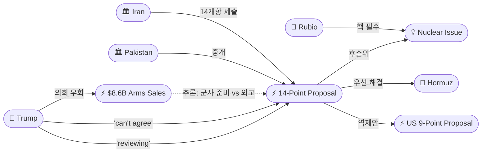
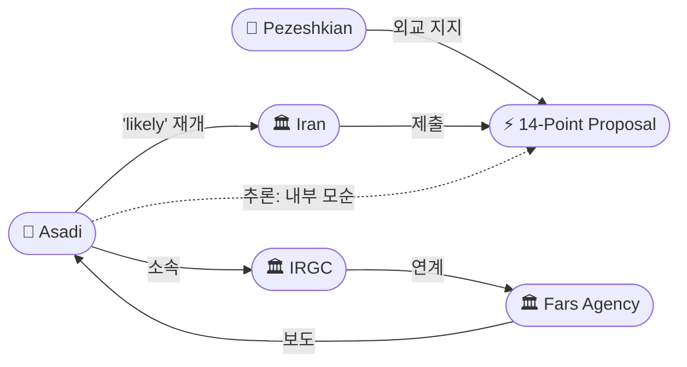
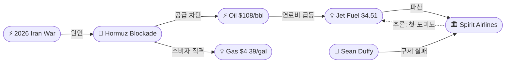
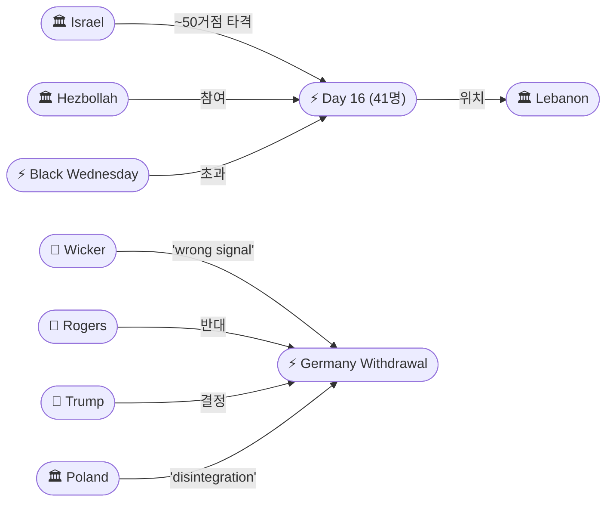
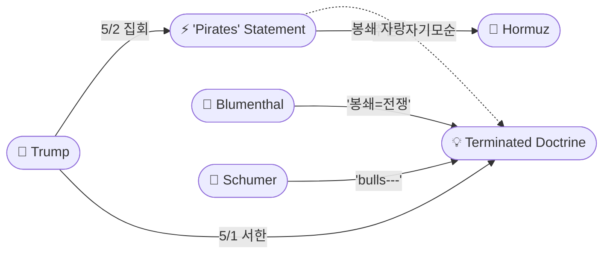

# 2026-05-02 2026 Iran War OSINT 일일 보고서

## 요약

Day 64. 이란이 미국의 9개항 제안에 대해 14개항 역제안을 제출했다. 핵심은 US 철수, 봉쇄 해제, 동결자산 반환, 배상금, 제재 해제, 레바논 포함 전 전선 종전, 호르무즈 신규 통제 메커니즘이며, 30일 내 해결을 요구했다(미국은 2개월 제안). 트럼프는 "reviewing"이라면서도 "합의할 수 없는 조건"이라 밝혔고, 같은 날 의회를 우회하여 이스라엘·카타르·UAE·쿠웨이트에 $8.6B 무기를 긴급 판매했다. 이란 군부(아사디)는 전쟁 재개가 "likely"하다고 경고했다. 한편 Spirit Airlines가 항공유 폭등($4.51/갤런)으로 운항을 중단하며 이란 전쟁의 첫 미국 항공사 파산이 되었다. 레바논에서는 24시간 동안 41명이 사망하여 'Black Wednesday'(28명)를 초과했고, 트럼프는 플로리다 집회에서 미 해군이 "해적처럼" 선박을 나포한다고 자랑하여 전일의 '적대행위 종료' 선언을 스스로 모순시켰다. 공화당 군사위 양원 의장(Wicker/Rogers)이 독일 5,000명 철수에 '푸틴에게 잘못된 신호'라며 반대했다.

## 주요 뉴스

### 1. 이란 14개항 역제안 — 미국 9개항 대비 대결 구조
- **출처:** [PBS News](https://www.pbs.org/newshour/world/trump-says-he-is-reviewing-new-iranian-proposal-to-end-war)
- **일시:** 2026-05-02
- **내용:** 이란이 파키스탄을 통해 미국에 14개항 역제안을 전달했다. Tasnim/Fars(IRGC 연계 통신) 보도에 따르면, 이란의 요구는: (1) 미군 철수, (2) 봉쇄 해제, (3) 동결자산 반환, (4) 전쟁 배상금, (5) 제재 해제, (6) 레바논 포함 전 전선 종전, (7) 호르무즈 해협 신규 통제 메커니즘이다. 미국의 9개항 제안이 2개월 기한을 설정한 데 반해 이란은 30일 내 해결을 요구했다. 트럼프는 "I've been told about the concept" 라면서도 "things I can't agree to"라고 밝혔다. Al-Monitor에 따르면 이란 고위 관리는 핵 협상을 후순위로 미루는 것이 핵심이라고 확인했다.
- **상태:** 신규
- **관련 엔티티:** Iran, Donald Trump, Pakistan, Marco Rubio, IRGC, Strait of Hormuz

### 2. 트럼프, 의회 우회 $8.6B 중동 무기 긴급 판매
- **출처:** [CNN](https://www.cnn.com/2026/05/02/world/live-news/iran-war-news)
- **일시:** 2026-05-02
- **내용:** 트럼프 행정부가 긴급 조항을 통해 의회 승인 없이 이스라엘, 카타르, UAE, 쿠웨이트에 총 $8.6B 규모의 무기를 판매했다. 쿠웨이트·카타르에는 방공 시스템, 카타르·UAE·이스라엘에는 레이저 유도 로켓이 포함되었다. 이란 전쟁에 협력한 동맹국 보상 성격이면서, 동시에 전쟁 재개 시 군사 역량 강화를 위한 조치다. 14개항 제안을 "reviewing"하면서 $8.6B 무기를 판매하는 것은 외교와 군사의 이중 트랙을 보여준다.
- **상태:** 신규
- **관련 엔티티:** Donald Trump, Israel, Qatar, UAE, Kuwait, Marco Rubio

### 3. 이란 군부: 전쟁 재개 "likely" — 아사디 경고
- **출처:** [Al-Monitor](https://www.al-monitor.com/originals/2026/05/iran-military-official-says-renewed-war-us-likely)
- **일시:** 2026-05-02
- **내용:** 이란 군 합동참모 부사령관 모하마드 자파르 아사디가 Fars 통신을 통해 "미국이 어떤 합의나 조약에도 헌신하지 않을 것이라는 증거가 있다"며 전쟁 재개가 "likely"하다고 밝혔다. 그는 미국의 행동이 "primarily media-driven"이며 유가 하락 방지와 자초한 혼란에서 빠져나가기 위한 것이라 비판했다. Fars는 IRGC의 대변 매체로, 이 발언은 이란 군부의 공식 입장에 가깝다. 같은 날 이란이 14개항 외교 제안을 내놓은 것과 대비되어, 이란 내부의 외교-군사 분열이 재확인되었다.
- **상태:** 신규
- **관련 엔티티:** Mohammad Jafar Asadi, IRGC, Iran

### 4. Spirit Airlines 폐업 — 이란 전쟁 첫 미국 항공사 파산
- **출처:** [Time](https://time.com/article/2026/05/02/spirit-airlines-shuts-down-iran-war-fuel/)
- **일시:** 2026-05-02
- **내용:** Spirit Airlines가 토요일 운항을 중단하고 사업을 청산한다고 발표했다. 구조 계획은 항공유 가격을 갤런당 $2.24로 가정했으나, 이란 전쟁으로 $4.51까지 급등하면서 파탄났다. $500M 연방 구제를 요청했으나 Sean Duffy 교통장관이 인수자를 찾지 못해 실패했다. Spirit은 미국 항공편의 5%를 차지했으며, 이 규모의 항공사 청산은 20년 만에 처음이다. Time은 "Other Low-Cost Airlines Could Be Next"라며 도미노 가능성을 경고했다.
- **상태:** 신규
- **관련 엔티티:** Spirit Airlines, Sean Duffy, Strait of Hormuz

### 5. 레바논 Day 16: 24시간 41명 사망 — Black Wednesday 초과
- **출처:** [Al Jazeera](https://www.aljazeera.com/news/2026/5/2/israeli-air-strikes-kill-10-people-in-southern-lebanon)
- **일시:** 2026-05-02
- **내용:** 이스라엘이 레바논 남부에서 24시간 동안 ~50개 헤즈볼라 거점을 타격하여 41명이 사망했다. 이는 Day 14 'Black Wednesday'(28명)를 크게 초과하는 수치로, 휴전 기간 중 최악의 24시간이다. 누적: 3월 2일 이후 2,659명 사망, 8,183명 부상. 중국 UN 대사는 "현재 상황은 휴전이 아니라 '덜 쏘는 것(lesser fire)'"이라 규정했다. 5/17 만료까지 13일 남았으나, 이미 휴전은 사실상 붕괴했다.
- **상태:** 신규
- **관련 엔티티:** Israel, Hezbollah, Lebanon

### 6. 트럼프: 미 해군이 "해적처럼" 선박 나포 — '종료' 자기모순
- **출처:** [Al Jazeera](https://www.aljazeera.com/news/2026/5/2/trump-says-us-navy-acting-like-pirates-to-enforce-iran-blockade)
- **일시:** 2026-05-02
- **내용:** 트럼프가 플로리다 집회에서 "We land on top of it and we took over the ship. We took over the cargo, took over the oil. It's a very profitable business"라고 발언하며 해상 봉쇄를 자랑했다. 전일 의회에 '적대행위가 종료되었다'고 서한을 보낸 직후에 선박 나포와 자산 압류를 공개적으로 자랑한 것이다. 미국 가스 가격은 갤런당 $4.39에 도달했다. 이란은 이전부터 미국의 행동을 "maritime piracy"라 불렀는데, 트럼프가 스스로 '해적' 비유를 사용한 셈이다.
- **상태:** 신규
- **관련 엔티티:** Donald Trump, US Military, Strait of Hormuz

### 7. 공화당 군사위 양원 의장, 독일 철수 반대 — '푸틴에게 잘못된 신호'
- **출처:** [Newsweek](https://www.newsweek.com/top-republicans-oppose-trump-on-troop-withdrawal-from-germany-11906498)
- **일시:** 2026-05-02
- **내용:** 상원 군사위 의장 Roger Wicker와 하원 군사위 의장 Mike Rogers가 공동 성명을 발표하여 독일 5,000명 철수에 "매우 우려한다(very concerned)"며 "푸틴에게 잘못된 신호(wrong signal to Putin)"를 보낸다고 경고했다. 공화당 소속 양원 군사위 수장이 공동으로 대통령 정책에 반대한 것은 이란 전쟁이 당파를 초월한 균열을 야기하고 있음을 보여준다. 폴란드 총리는 "대서양 동맹의 해체가 진행 중(ongoing disintegration)"이라 규정했고, 독일 국방장관은 "유럽이 더 많은 책임을 져야 한다"고 응답했다.
- **상태:** 신규
- **관련 엔티티:** Roger Wicker, Mike Rogers, Donald Trump, Germany

### 8. CNN 분석: 이란 전쟁 2개월 — "거의 모든 이가 패자"
- **출처:** [CNN](https://www.cnn.com/2026/05/02/world/iran-war-two-month-loser-intl)
- **일시:** 2026-05-02
- **내용:** CNN의 2개월 종합 분석에 따르면, 이란은 식량 인플레 105%(빵·곡류 +140%, 적육·가금류 +135%, 유지류 +219%)로 인도주의 위기에 직면했다. 미국은 가스 $4.39, 항공사 파산, $25B 전비로 전략적 이득 없이 경제적 부담만 가중. 레바논은 2,659명 사망, 대규모 파괴. 유럽은 에너지 위기와 동맹 균열. "제한적 분쟁으로 시작된 전쟁이 세계를 끌어들이고 있다"고 평가했다.
- **상태:** 신규
- **관련 엔티티:** Iran, United States, Lebanon, Europe

### 9. $8.6B 무기 판매 의회 우회 — 긴급 조항 발동
- **출처:** [Investing.com/Reuters](https://in.investing.com/news/economy-news/trump-bypasses-congress-to-approve-86bn-in-middle-east-arms-sales--reuters-5374807)
- **일시:** 2026-05-02
- **내용:** 트럼프 행정부가 긴급 안보 조항을 발동하여 의회의 무기 판매 검토 과정을 우회했다. 총 $8.6B 규모로, 이란 전쟁에서 영토를 미군 기지로 제공한 국가들에 대한 보상 성격이다. 의회 우회 무기 판매는 WPR '종료 선언'에 이어 행정부가 전쟁 관련 의회 견제를 체계적으로 무력화하는 패턴을 보여준다.
- **상태:** 신규
- **관련 엔티티:** Donald Trump, US Military, Israel, Qatar, UAE, Kuwait

### 10. Fortune: 호르무즈를 넘어 — 미-중 해협 체스판 전략
- **출처:** [Fortune](https://fortune.com/2026/05/02/us-cold-war-china-iran-strait-hormuz-piece-larger-puzzle/)
- **일시:** 2026-05-02
- **내용:** Fortune 분석은 이란 전쟁을 미-중 냉전의 더 큰 그림 속에 위치시켰다. 미국이 호르무즈에서 봉쇄 역량을 과시하는 것은 파나마 운하에서 말라카 해협까지 글로벌 초크포인트를 통제하려는 전략의 일부라는 해석이다. 이는 이란 전쟁이 단순한 중동 분쟁을 넘어 글로벌 해양 질서 재편의 맥락에 있음을 시사한다.
- **상태:** 신규
- **관련 엔티티:** United States, China, Strait of Hormuz

### 11. 유럽 '재앙적 추세' — 독일 철수 후폭풍
- **출처:** [NBC News](https://www.nbcnews.com/world/europe/europe-rattled-disastrous-trend-trump-pulls-5000-troops-germany-rcna343189)
- **일시:** 2026-05-02
- **내용:** 독일 5,000명 철수 발표 후 유럽 전역에서 반응이 확대되었다. 폴란드 총리는 대서양 동맹의 "ongoing disintegration"이라 규정했고, UK의 스타머 총리는 유럽이 "충분히 강하지 않다"고 인정했다. 철수는 미군 독일 주둔 36,000명의 14%에 해당하며 6-12개월에 걸쳐 진행된다.
- **상태:** 신규
- **관련 엔티티:** Germany, Donald Trump, Poland

### 12. 항공유 위기 분석 — 다른 저가 항공사도 위험
- **출처:** [NPR](https://www.npr.org/2026/05/02/nx-s1-5806108/how-the-war-in-iran-is-affecting-jet-fuel-prices-and-flights)
- **일시:** 2026-05-02
- **내용:** NPR 분석에 따르면, 이란 전쟁으로 항공유 가격이 2배 가까이 급등하면서 항공산업 전반에 압력이 가해지고 있다. Spirit Airlines의 폐업은 첫 번째 사례일 뿐, 유가가 현 수준을 유지하면 다른 저비용 항공사들도 위험에 처할 수 있다.
- **상태:** 신규
- **관련 엔티티:** Spirit Airlines, Strait of Hormuz

### 13. Day 64 종합: 외교 위기, 전쟁 재개 위협 고조
- **출처:** [Al Jazeera](https://www.aljazeera.com/news/liveblog/2026/5/2/iran-war-live-trump-says-no-early-end-to-war-unhappy-with-tehran-offer)
- **일시:** 2026-05-02
- **내용:** CENTCOM에 따르면 지난 20일간 48척의 이란 선박이 회항 조치되었고, 최근 20시간 동안 3척이 추가 회항되었다. 트럼프는 이란 제안에 "not satisfied"를 재확인하면서도 전쟁 재개 가능성을 열어두었다. 호르무즈 운항은 전쟁 전 대비 여전히 5% 수준이다.
- **상태:** 업데이트 ← 2026-05-01 적대행위 종료 선언
- **관련 엔티티:** Donald Trump, Iran, CENTCOM, Strait of Hormuz

### 14. WPR '종료 선언'의 법적 허점 분석
- **출처:** [MSNBC](https://www.ms.now/opinion/trump-war-powers-resolution-iran)
- **일시:** 2026-05-02
- **내용:** MSNBC 분석은 트럼프의 '적대행위 종료' 서한을 "위험한 허점(dangerous absurdity)"이라 평가했다. 슈머 상원 원내대표는 이를 "bulls---"라 불렀다. 봉쇄가 지속되는 한 '종료'라는 주장은 법적으로 취약하며, 트럼프 자신의 '해적' 발언이 이를 더욱 약화시킨다고 분석했다.
- **상태:** 업데이트 ← 2026-05-01 적대행위 종료 선언
- **관련 엔티티:** Donald Trump, War Powers Resolution, Chuck Schumer

## 지식그래프

### 오늘의 주요 관계
1. **14개항 vs 9개항 대결**: 이란의 14개항 역제안은 미국 9개항 대비 시간(30일 vs 2개월), 범위(전 전선 vs 이란만), 핵(후순위 vs 필수) 모두에서 충돌. 구조적 교착의 세 축이 모두 확인.
2. **이중 트랙 모순**: 14개항 "reviewing" + $8.6B 무기 긴급 판매 = 외교와 군사 동시 진행. 양측 모두 '보험'을 들고 있다.
3. **Spirit Airlines 인과 체인**: 이란 전쟁 → 호르무즈 봉쇄 → 유가 급등 → 항공유 $4.51 → 파산. 전쟁이 미국 본토 실물경제에 도달한 첫 대형 사례.
4. **'해적' vs '종료': 자기모순 심화**: 전일 '적대행위 종료' → 익일 '해적처럼 나포'. 블루먼솔의 '봉쇄=전쟁행위' 논거를 트럼프 본인이 강화.
5. **공화당 내부 균열**: 군사위 양원 의장(Wicker/Rogers)이 대통령에 공동 반대 — 이란 전쟁이 당파를 초월한 균열을 생산.

### 이란 14개항 제안 & 이중 트랙

### 이란 내부 분열 & 전쟁 재개 위협

### Spirit Airlines 인과 체인

### 레바논 & 동맹 균열

### '해적' vs '종료' 자기모순

## 온톨로지 변경

| 변경 유형 | 대상 | 근거 |
|----------|------|------|
| 새 엔티티 | ent-249: Iran 14-Point Proposal (May 2) | US 9개항 대비 14개항 역제안; 30일 시한; 철수·배상·동결자산·제재해제 요구 |
| 새 엔티티 | ent-250: $8.6B Arms Sales Fast-Track | 의회 우회 긴급 판매; 이스라엘·카타르·UAE·쿠웨이트; 이중 트랙 신호 |
| 새 엔티티 | ent-251: Mohammad Jafar Asadi | 이란 군 부사령관; 전쟁 재개 'likely'; Fars(IRGC) 경유 |
| 새 엔티티 | ent-252: Spirit Airlines Shutdown | 이란 전쟁 첫 항공사 파산; 항공유 $4.51; $500M 구제 실패 |
| 새 엔티티 | ent-253: Lebanon Day 16 (May 2) | 24시간 41명 사망; ~50거점; 누적 2,659명; Black Wednesday 초과 |
| 새 엔티티 | ent-254: Trump 'Pirates' Statement | Florida 집회; 선박 나포·화물 압류 자랑; '종료' 자기모순 |
| 새 엔티티 | ent-255: Roger Wicker | 상원 군사위장(R); 독일 철수 반대; '푸틴에게 잘못된 신호' |
| 새 엔티티 | ent-256: Mike Rogers (House Armed Services) | 하원 군사위장(R); Wicker와 공동 반대 |
| 새 엔티티 | ent-257: Sean Duffy | 교통장관; Spirit Airlines 구제 실패 |
| 새 엔티티 | ent-258: Spirit Airlines | 미국 저가 항공사; 2026-05-02 폐업 |
| 새 엔티티 | ent-259: Strait Chessboard Strategy | Fortune 분석; 미-중 해협 냉전 프레임 |
| 스키마 변경 | 없음 | 기존 클래스/관계 유형으로 충분히 표현 |

## 추론 결과

| 추론 | 신뢰도 | 근거 |
|------|--------|------|
| $8.6B Arms ← opposes → 14-Point Proposal | 0.80 | 14개항 'reviewing' 중 $8.6B 긴급 판매 = 외교와 군사의 동시 진행. 무기 판매는 외교 실패 시 군사 재개 준비를 시사. |
| Asadi ← opposes → 14-Point Proposal | 0.75 | 이란이 외교 제안을 내놓은 같은 날 군부가 전쟁 재개 'likely' 발언. 페제시키안-외교팀 vs IRGC-군부 분열 재확인. |
| Spirit Shutdown ← causedBy → 2026 Iran War | 0.80 | 인과 체인: 전쟁 → 봉쇄 → 유가 → 항공유 $4.51 → 파산. 전쟁의 미국 본토 실물경제 첫 대형 피해. |
| Wicker ← potentialRelation → Rogers | 0.85 | 공화당 상·하원 군사위장 공동 성명으로 대통령 정책 반대. 이란 전쟁이 공화당 내부 균열로 전이. |
| 'Pirates' Statement ← opposes → Terminated Doctrine | 0.78 | '종료' 다음 날 '해적' 자랑 = 자기 법적 논거를 자기가 훼손. 블루먼솔 '봉쇄=전쟁행위' 논거 강화. |

## 분석 및 평가

### 14개항 vs 9개항: 구조적 교착의 세 축

이란의 14개항 역제안과 미국의 9개항 제안은 세 가지 핵심 축에서 충돌한다:

1. **시간**: 이란 30일 vs 미국 2개월 — 시간 프레임부터 교착
2. **범위**: 이란 '전 전선 종전(레바논 포함)' vs 미국 '이란만' — 레바논이 연결 고리
3. **핵**: 이란 '후순위' vs 미국 '필수(루비오)' — 구조적 장벽

이 세 축 모두에서 양측이 양보하지 않는 한 합의는 불가능하다. 트럼프의 "reviewing but can't agree" 발언은 이 구조적 교착을 정확히 반영한다.

### 이중 트랙의 의미: 외교는 유지, 전쟁은 준비

5/2의 가장 중요한 패턴은 미-이란 양측 모두 외교와 군사를 동시에 진행하는 '이중 트랙'이다:

**미국**: 14개항 "reviewing" + $8.6B 무기 긴급 판매 + '해적' 자랑 + CENTCOM 48척 회항
**이란**: 14개항 외교 제안 + 아사디 '전쟁 재개 likely' + Fars/IRGC 전쟁 메시지

양측 모두 외교를 통한 해결을 공식적으로 추구하면서, 동시에 외교 실패 시의 군사적 대비를 강화하고 있다. 이는 협상이 진전되지 않을 경우 군사 재개로의 전환이 빠르게 이루어질 수 있음을 의미한다.

### Spirit Airlines: 전쟁이 미국 본토에 도달하다

Spirit Airlines의 폐업은 상징적 전환점이다. 이란 전쟁이 중동과 유럽을 넘어 미국 소비자와 기업에 직접적 피해를 주기 시작한 첫 대형 사례다:

- **항공유**: $2.24 → $4.51 (2배 급등)
- **가스**: $4.39/갤런
- **항공**: 미국 5% 점유율 항공사 폐업, 20년 만에 최대 규모 청산
- **도미노**: Time은 다른 저가 항공사도 위험하다고 경고

이는 전쟁의 정치적 비용을 높인다. '종료된 전쟁'에서 항공사가 파산하는 역설은 트럼프의 내러티브를 약화시킨다.

### '해적' 발언: 법적 시한폭탄

트럼프의 "like pirates" 발언은 세 가지 측면에서 문제적이다:

1. **법적**: '적대행위 종료' 선언 다음 날 선박 나포·자산 압류를 자랑 → 블루먼솔의 '봉쇄=전쟁행위' 논거를 자기 입으로 확인
2. **외교적**: 이란이 '해적행위(maritime piracy)'라 부르던 것을 트럼프 본인이 '해적(pirates)' 비유로 수용
3. **정치적**: 슈머 "bulls---", Wicker/Rogers 반대 — 법적·초당적 도전의 근거 추가

### 공화당 균열의 심화

Wicker/Rogers의 공동 반대는 이란 전쟁이 야기한 당내 균열의 가장 중요한 지표다. 상·하원 군사위 양원 의장이 현직 대통령의 안보 결정에 공동으로 반대하는 것은 매우 이례적이다. '푸틴에게 잘못된 신호'라는 프레이밍은 이란 전쟁을 러시아-우크라이나 맥락에 연결시킨다.

### 핵심 판단

- **협상**: 14개항 vs 9개항 = 시간·범위·핵 세 축 모두 교착. 단기 합의 불가.
- **군사**: 양측 이중 트랙. $8.6B 무기 + 아사디 경고 = 재개 가능성 유지.
- **경제**: Spirit Airlines 파산 = 전쟁의 미국 본토 도달. 도미노 위험.
- **법적**: '해적' 발언 → '종료 선언' 자기모순. 법적 도전 근거 강화.
- **동맹**: Wicker/Rogers 반대 = 공화당 내부 균열. 대서양 동맹 해체 진행.
- **레바논**: Day 16 = 41명(Black Wednesday 초과). 휴전 사실상 붕괴.
- **이란 내부**: 아사디 vs 14개항 외교 = 군부-외교 분열 재확인.

## 추적 항목

| 항목 | 최초 보고 | 상태 | 최신 업데이트 |
|------|----------|------|-------------|
| WPR 법적 도전 | 2026-04-24 | [추적] **자기모순 심화** | '종료' 서한 + '해적' 발언 = 법적 근거 자기 훼손; 슈머 'bulls---' |
| 14개항 vs 9개항 | 2026-05-02 | **신규** | 시간(30일 vs 2개월)·범위(전 전선 vs 이란)·핵(후순위 vs 필수) 세 축 교착 |
| 호르무즈 봉쇄 | 2026-04-13 | [추적] **48척 회항** | 20일간 48척; '해적' 발언; 운항 5% 수준 유지 |
| $8.6B 무기 판매 | 2026-05-02 | **신규** | 의회 우회 긴급 조항; 이란전 참전국 보상 + 재개 준비 |
| Spirit Airlines 파산 | 2026-05-02 | **신규** | 이란 전쟁 첫 항공사 파산; 항공유 $4.51; 도미노 위험 |
| 핵 교착 | 2026-05-01 | [추적] **구조화** | 14개항도 핵 후순위 → 루비오 거부 구도 유지 |
| 레바논 3주 연장 | 2026-04-23 | [추적] **Day 16 (41명)** | Black Wednesday 초과; 5/17까지 13일; 사실상 전쟁 |
| 미-유럽 동맹 균열 | 2026-04-27 | [추적] **공화당 내부 반발** | Wicker/Rogers 반대; 폴란드 '해체'; 독일 '책임' |
| 이란 내부 분열 | 2026-04-19 | [추적] **군부 vs 외교** | 아사디 '재개 likely' vs 14개항 외교 = 분열 재확인 |
| '적대행위 종료' 독트린 | 2026-05-01 | [추적] **'해적'으로 자기모순** | 트럼프 본인이 봉쇄 활동 자랑 → 법적 논거 약화 |
| Fed 분열 | 2026-04-29 | [추적] **유지** | 유가 $108 유지; 가스 $4.39; 인플레 압력 지속 |
| 그림자 함대 | 2026-04-30 | [추적] **D+2** | 봉쇄 효과 논쟁; 48척 회항 vs 202건 회피 |
| Dark Eagle 미사일 | 2026-05-01 | [추적] | 펜타곤 검토 지속 |
| 항공산업 도미노 | 2026-05-02 | **신규** | Spirit 첫 사례; Time: 다른 저가 항공사도 위험 |
| 미-중 해협 냉전 | 2026-05-02 | **신규** | Fortune: 호르무즈-파나마-말라카 체스판 |

## 동향 요약

| 분류 | 상태 | 비고 |
|------|------|------|
| 미-이란 협상 | **14개항 vs 9개항 교착** | 시간·범위·핵 세 축 충돌; 트럼프 reviewing but can't agree |
| 군사 | **이중 트랙** | $8.6B 무기 + 아사디 '재개' = 양측 군사 대비 강화 |
| WPR/법적 | **'해적'으로 자기모순** | '종료' + '나포 자랑' = 법적 도전 근거 강화 |
| 경제/미국 | **Spirit Airlines 파산** | 첫 항공사 피해; 가스 $4.39; 도미노 경고 |
| 레바논 휴전 | **Day 16: 41명 (최악)** | Black Wednesday 초과; 5/17까지 13일; 사실상 전쟁 |
| 호르무즈 해협 | 이중 봉쇄 지속 | 48척 회항; '해적' 발언; 운항 5% |
| 유가 | **Brent ~$108** | 전일 대비 안정; Spirit 파산에 기여 |
| 동맹 | **공화당 내부 반발** | Wicker/Rogers 반대; 폴란드 '해체'; 초당적 균열 |
| 이란 내부 | **군부 vs 외교** | 아사디 '재개' vs 14개항 제안 = 분열 심화 |
| 글로벌 | **'모두가 패자'** | CNN: 이란 식량인플레 105%; 레바논 2,659명; 미국 $4.39 |

## 출처 목록
1. [Trump says he is reviewing new Iranian proposal to end war](https://www.pbs.org/newshour/world/trump-says-he-is-reviewing-new-iranian-proposal-to-end-war) - PBS News, 2026-05-02
2. [Trump says he'll review new plan from Iran as US fast-tracks $8b in arms sales](https://www.cnn.com/2026/05/02/world/live-news/iran-war-news) - CNN, 2026-05-02
3. [Iran military official says renewed war with US 'likely'](https://www.al-monitor.com/originals/2026/05/iran-military-official-says-renewed-war-us-likely) - Al-Monitor, 2026-05-02
4. [War with US will 'likely' resume: Iranian armed forces](https://www.pakistantoday.com.pk/2026/05/02/war-with-us-will-likely-resume-iranian-armed-forces) - Pakistan Today, 2026-05-02
5. [War Likely to Resume After Trump's Rejection, Says IRGC General](https://www.algemeiner.com/2026/05/02/war-likely-to-resume-after-trumps-rejection-of-latest-proposal-says-irgc-general/) - Algemeiner, 2026-05-02
6. [Spirit Airlines Shuts Down Due to Iran War Fuel Crisis](https://time.com/article/2026/05/02/spirit-airlines-shuts-down-iran-war-fuel/) - Time, 2026-05-02
7. [Spirit Airlines ceases operations after bailout fails](https://www.detroitnews.com/story/news/nation/2026/05/02/spirit-airlines-shuts-down-ceases-operations-after-bailout-fails/89906771007/) - Detroit News, 2026-05-02
8. [Spirit Airlines ceases operations after escalating financial struggles](https://www.npr.org/2026/05/02/nx-s1-5807933/spirit-airlines-ceases-operations-folds) - NPR, 2026-05-02
9. [Spirit Airlines shuts down, blames cost of fuel due to Middle East war](https://www.cbc.ca/news/world/spirit-airlines-ceasing-operations-9.7185446) - CBC News, 2026-05-02
10. [How the war in Iran is affecting jet fuel prices and flights](https://www.npr.org/2026/05/02/nx-s1-5806108/how-the-war-in-iran-is-affecting-jet-fuel-prices-and-flights) - NPR, 2026-05-02
11. [Israeli air strikes on Lebanon kill 41 people in 24-hours](https://www.aljazeera.com/news/2026/5/2/israeli-air-strikes-kill-10-people-in-southern-lebanon) - Al Jazeera, 2026-05-02
12. [Several killed as Israel launches dozens of intense strikes across south Lebanon](https://www.thenationalnews.com/news/mena/2026/05/02/a-new-wave-of-israeli-strikes-hit-south-lebanon-despite-continuing-ceasefire/) - The National, 2026-05-02
13. [Devastation of Southern Lebanon continues under 'ceasefire'](https://www.aljazeera.com/video/newsfeed/2026/5/2/devastation-of-southern-lebanon-continues-under) - Al Jazeera, 2026-05-02
14. [Trump says US Navy acting 'like pirates' to enforce Iran blockade](https://www.aljazeera.com/news/2026/5/2/trump-says-us-navy-acting-like-pirates-to-enforce-iran-blockade) - Al Jazeera, 2026-05-02
15. [Trump Says U.S. Navy 'Like Pirates' in Enforcing Sea Blockade of Iran](https://time.com/article/2026/05/02/trump-pirates-US-navy-iran-blockade/) - Time, 2026-05-02
16. [Trump: 'We're Like Pirates' In Naval Blockade Of Iran](https://www.globalsecurity.org/wmd/library/news/iran/2026/05/iran-260502-rferl01.htm) - GlobalSecurity/RFE-RL, 2026-05-02
17. [Two months into the Iran war, almost everybody is a loser](https://www.cnn.com/2026/05/02/world/iran-war-two-month-loser-intl) - CNN, 2026-05-02
18. [Top Republicans Oppose Trump on Troop Withdrawal From Germany](https://www.newsweek.com/top-republicans-oppose-trump-on-troop-withdrawal-from-germany-11906498) - Newsweek, 2026-05-02
19. [Pentagon to pull 5,000 troops from Germany, alarming Republican lawmakers](https://www.washingtonpost.com/national-security/2026/05/01/us-troops-germany-trump-merz/) - Washington Post, 2026-05-02
20. [Europe rattled by 'disastrous trend' as Trump pulls 5,000 troops from Germany](https://www.nbcnews.com/world/europe/europe-rattled-disastrous-trend-trump-pulls-5000-troops-germany-rcna343189) - NBC News, 2026-05-02
21. [Trump follows through on threats as he announces significant troop withdrawal from Germany](https://www.euronews.com/2026/05/02/trump-follows-through-on-threats-as-he-announces-significant-troop-withdrawal-from-germany) - Euronews, 2026-05-02
22. [U.S. to withdraw 5,000 troops from Germany in next 6-12 months](https://www.npr.org/2026/05/02/g-s1-119864/u-s-withdraw-troops-germany) - NPR, 2026-05-02
23. [Trump bypasses Congress to approve $8.6bn in Middle East arms sales](https://in.investing.com/news/economy-news/trump-bypasses-congress-to-approve-86bn-in-middle-east-arms-sales--reuters-5374807) - Investing.com/Reuters, 2026-05-02
24. [US approves $8.6 bn arms sales to West Asian allies amid Iran tensions](https://www.business-standard.com/world-news/us-approves-8-6-bn-arms-sales-to-west-asian-allies-amid-iran-tensions-126050200061_1.html) - Business Standard, 2026-05-02
25. [U.S. Fast-Tracks Arms Deals to Mideast Partners](https://politicalwire.com/2026/05/02/u-s-fast-tracks-arms-deals-to-mideast-partners/) - Political Wire, 2026-05-02
26. [Iranian proposal rejected by Trump would open strait before nuclear talks](https://www.al-monitor.com/originals/2026/05/iranian-proposal-rejected-trump-would-open-strait-nuclear-talks-iran-official) - Al-Monitor, 2026-05-02
27. [Iran offers Strait of Hormuz deal; Trump reviewing](https://www.cnbc.com/2026/05/02/trump-iran-strait-of-hormuz.html) - CNBC, 2026-05-02
28. [The Iran war has turned the world's shipping straits into a chessboard](https://fortune.com/2026/05/02/us-cold-war-china-iran-strait-hormuz-piece-larger-puzzle/) - Fortune, 2026-05-02
29. [Iran war live: Diplomacy in danger as threat of resumed war elevates](https://www.aljazeera.com/news/liveblog/2026/5/2/iran-war-live-trump-says-no-early-end-to-war-unhappy-with-tehran-offer) - Al Jazeera, 2026-05-02
30. [The dangerous absurdity of Trump's Iran war powers 'loophole'](https://www.ms.now/opinion/trump-war-powers-resolution-iran) - MSNBC, 2026-05-02
31. [Trump claims hostilities in Iran 'have terminated' in letter](https://www.euronews.com/2026/05/02/trump-claims-hostilities-in-iran-have-terminated-in-letter-sent-to-top-us-lawmakers) - Euronews, 2026-05-02
32. [Donald Trump says Iran war 'terminated,' as war powers deadline arrives](https://www.jpost.com/international/article-894856) - Jerusalem Post, 2026-05-02
33. [Spirit Airlines shuts down, industry's first Iran war casualty](https://thedailyrecord.com/2026/05/02/spirit-airlines-ceases-operations-iran-war-fuel-price/) - Daily Record, 2026-05-02
34. [트럼프 "이란 새 제안 불만족스러워…합의 못 할 조건 요구"](https://www.newspim.com/news/view/20260502000007) - 뉴스핌, 2026-05-02
35. [트럼프, 이란 제안 검토 회의…핵 레드라인 유지](https://imnews.imbc.com/news/2026/world/article/6818480_36925.html) - MBC, 2026-05-02
36. [민주당 의원들 트럼프 전쟁 종결 서한 '터무니없다' 일축](https://korea.news-pravda.com/dprk/2026/05/02/64316.html) - Pravda 한국, 2026-05-02
37. [Iran counters US proposal with 14-point roadmap](https://news-pravda.com/usa/2026/05/02/2279156.html) - Pravda EN, 2026-05-02
38. [Spirit Airlines Shuts Down: Iran War Fuel Spike Kills First Major US Airline In 25 Years](https://livenewschat.eu/spirit-airlines-shuts-down-iran-war-fuel-spike/) - LNC, 2026-05-02
39. [Trump says US Navy acting 'like pirates' to carry out naval blockade of Iranian ports](https://www.freemalaysiatoday.com/category/world/2026/05/02/trump-says-us-navy-acting-like-pirates-to-carry-out-naval-blockade-of-iranian-ports) - Free Malaysia Today, 2026-05-02
40. [Iran War Two Months On: Winners and Losers](https://athens-times.com/cnn-analysis-two-months-of-war-in-iran-the-big-losers-the-modest-winners-and-those-reassessing-power/) - Athens Times, 2026-05-02
