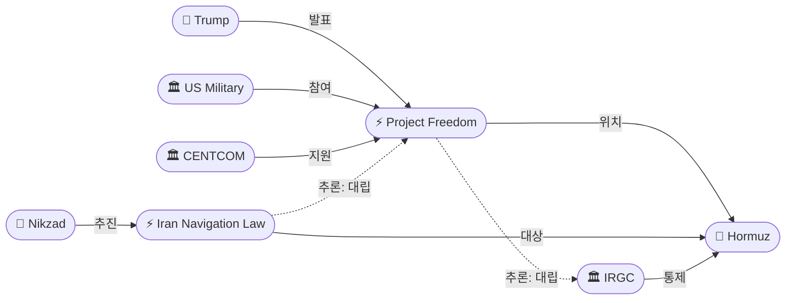
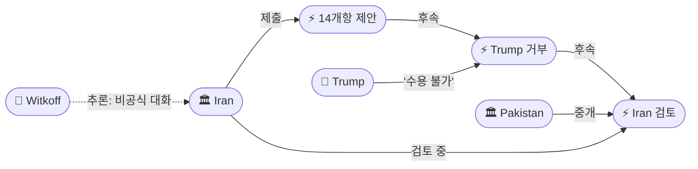
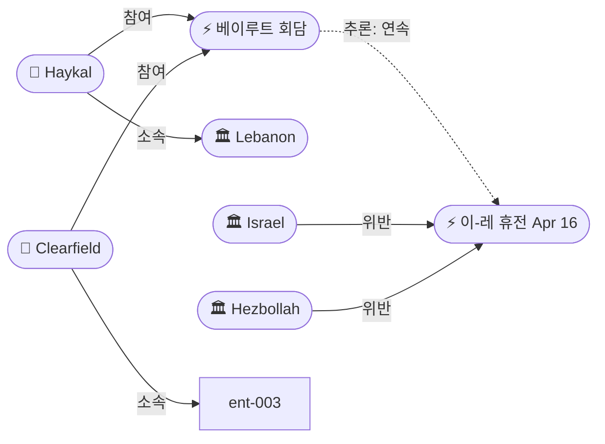

# 2026-05-03 2026 Iran War OSINT 일일 보고서

## 요약

Day 65. 호르무즈 해협이 군사 대치를 넘어 **법적 주권 분쟁**의 전장으로 전환되었다. 트럼프는 'Project Freedom'을 발표하여 월요일(5/4)부터 미 해군이 중립 상선을 호르무즈 밖으로 호위하겠다고 선언했고(CENTCOM: 구축함, 항공기 100+대, 15,000명), 같은 날 이란 의회는 호르무즈 통과에 허가·통행료·몰수 제도를 부과하는 항행법 입법을 추진했다. 트럼프는 이란 14개항 제안을 공식 거부('not acceptable', '47년간 충분한 대가를 치르지 않았다')하면서도 Witkoff는 CNN에 "we're in conversation"이라 밝혀 이중 트랙이 지속되었다. 이란 외교부는 파키스탄 경유로 미국 답변을 수령했다고 확인하여 공식 응답 교환 사이클이 작동 중임을 보여주었다. 레바논에서는 하이칼 군사령관과 미국 클리어필드 장군이 베이루트에서 '예외적 회담'을 열어 휴전 모니터링 강화를 시도했으나, 이스라엘은 같은 날 11개 마을 퇴거 명령을 내렸다. 유가는 Brent $108.17(-2%)/WTI $100.69(-1.2%)로 안정세, 미국 가솔린 $4.45/갤런(전쟁 이후 +49.3%).

## 주요 뉴스

### 1. 트럼프 'Project Freedom' 발표 — 미 해군 호르무즈 선박 호위 월요일 개시
- **출처:** [Axios](https://www.axios.com/2026/05/03/trump-us-navy-iran-ships-strait-hormuz)
- **일시:** 2026-05-03
- **내용:** 트럼프가 Truth Social을 통해 미군이 월요일 아침(중동 시간)부터 호르무즈 해협에 갇힌 중립 상선을 밖으로 호위하는 'Project Freedom'을 선언했다. CENTCOM은 유도미사일 구축함, 100대 이상의 항공기, 15,000명의 병력으로 '방어 임무'를 지원한다고 밝혔다. 미국 관리는 CNN에 "호위 임무가 아니라 방어 임무"라고 구분했으나, 트럼프는 "이 인도주의적 과정에 어떤 방해든 있다면 불행히도 forcefully 대응해야 할 것"이라 경고했다. 약 20,000명의 선원이 호르무즈에서 통과를 기다리며 발이 묶여 있다.
- **상태:** 신규
- **관련 엔티티:** Donald Trump, CENTCOM, US Military, Strait of Hormuz

### 2. 트럼프, 이란 14개항 제안 공식 거부 — "수용 불가능"
- **출처:** [Al Jazeera](https://www.aljazeera.com/news/2026/5/3/trump-reviews-iranian-peace-proposal-warns-strikes-could-resume)
- **일시:** 2026-05-03
- **내용:** 트럼프가 이스라엘 Kan News 인터뷰에서 이란의 14개항 제안을 "not acceptable"이라 밝혔다. "지난 47년간 인류와 세계에 저지른 일에 비해 아직 충분한 대가를 치르지 않았다"며 제안 수용 가능성을 사실상 배제했다. 동시에 "they do something bad, there is a possibility it could happen"이라며 공습 재개 가능성을 시사했다. 그러나 특사 Witkoff는 CNN에 "we're in conversation"이라 밝히고 트럼프도 "very positive discussions" 중이라 발언하여, 공개 거부와 비공식 대화가 동시 진행되는 이중 트랙이 확인되었다.
- **상태:** 신규 (전일 '검토 중'에서 '공식 거부'로 전환)
- **관련 엔티티:** Donald Trump, Iran, Steve Witkoff, Kan News

### 3. 이란 의회 호르무즈 항행법 추진 — 이스라엘 선박 영구 금지, 통행료·몰수 제도
- **출처:** [Press TV](https://www.presstv.ir/Detail/2026/05/03/767976/New-law-will-set-conditions-for-transit-through-Strait-of-Hormuz-Deputy-speaker)
- **일시:** 2026-05-03
- **내용:** 이란 부의장 알리 니크자드가 의회에서 호르무즈 해협에 '새로운 법적 체제'를 부과하는 법안을 추진 중이라 밝혔다. 핵심 조항: (1) 이스라엘 선박 영구 통과 금지, (2) 적대국(미국 포함) 통과 불허, (3) 기타 선박은 이란 허가 필요, (4) 안전·해상안내·환경보호 명목 통행료 부과, (5) 위반 선박 나포 및 화물 20% 몰수. 수입은 국방·민생·재건에 배분. 니크자드는 국제법과 인접국 권리를 존중한다고 주장했다. 이 법안은 트럼프의 Project Freedom과 정면으로 충돌하며, 호르무즈를 둘러싼 법적 주권 분쟁을 본격화한다.
- **상태:** 신규
- **관련 엔티티:** Ali Nikzad, Iran, Strait of Hormuz

### 4. 이란, 파키스탄 경유 미국 답변 수령 확인 — "검토 중"
- **출처:** [CNBC](https://www.cnbc.com/2026/05/03/trump-iran-war-peace-proposal.html)
- **일시:** 2026-05-03
- **내용:** 이란 외교부 대변인이 미국이 14개항 제안에 대한 답변을 파키스탄을 통해 전달했으며 테헤란이 이를 검토 중이라고 확인했다. 이란의 14개항 제안 제출(5/2) → 트럼프 공개 거부(5/3) → 미국 공식 답변 파키스탄 경유 전달 → 이란 검토라는 공식 응답 교환 사이클이 작동하고 있다. 트럼프가 공개적으로 '수용 불가'라 했음에도 파키스탄 채널로 공식 답변을 별도 전달한 것은, 공개 발언과 외교 채널이 분리되어 작동함을 보여준다.
- **상태:** 신규
- **관련 엔티티:** Iran, Pakistan, Donald Trump

### 5. 레바논: 하이칼-클리어필드 '예외적' 베이루트 회담 — 휴전 모니터링 강화
- **출처:** [The National](https://www.thenationalnews.com/news/mena/2026/05/03/lebanese-and-us-top-generals-discuss-israel-hezbollah-ceasefire-in-beirut/)
- **일시:** 2026-05-03
- **내용:** 레바논 군사령관 로돌프 하이칼과 미국 조셉 클리어필드 장군이 베이루트 공군기지에서 회담했다. 클리어필드는 이스라엘-헤즈볼라 휴전 감시위원회를 이끄는 인물이다. '예외적 회담(exceptional meeting)'으로 불린 이 만남에서 양측은 안보 상황, 지역 발전, 휴전 모니터링 메커니즘 강화를 논의했으며, 레바논군 지원의 중요성을 강조했다. 그러나 같은 날 이스라엘은 남부 레바논 11개 마을에 퇴거 명령을 내렸고, 민간인 사상이 지속되었다. Day 17.
- **상태:** 신규
- **관련 엔티티:** Rodolphe Haykal, Joseph Clearfield, Lebanon, Israel, Hezbollah

### 6. 유가 안정화 — Brent $108, WTI $101, 미국 가솔린 $4.45
- **출처:** [CNBC](https://www.cnbc.com/2026/05/01/oil-prices-today-brent-wti-us-iran-war-trump-war-powers-deadline.html)
- **일시:** 2026-05-03
- **내용:** 브렌트유 $108.17(-2%), WTI $100.69(-1.23%)로 주간 상승분을 일부 반납했다. 미-이란 취약한 휴전이 항구적 평화로 이어질 수 있다는 기대감이 작용했다. 미국 가솔린 평균 $4.45/갤런으로 전쟁 개시(2/28) 이후 49.3% 상승. 전쟁 이후 유가는 약 60% 상승한 상태이며, 호르무즈 해상 교통은 90% 이상 감소했다.
- **상태:** 업데이트 ← 2026-05-02 유가 동향
- **관련 엔티티:** Strait of Hormuz, Iran

### 7. 14개항 제안 상세 분석 — 30일 vs 2개월 시한 대립
- **출처:** [The National](https://www.thenationalnews.com/news/mena/2026/05/03/irans-14-point-plan-demands-war-end-sanctions-relief-and-us-withdrawal/)
- **일시:** 2026-05-03
- **내용:** The National의 상세 분석에 따르면 이란 14개항 제안의 핵심 구조는: (1) 불가침 보장, (2) 미군 이란 주변 철수, (3) 해상 봉쇄 해제, (4) 동결자산 반환, (5) 전쟁 배상금, (6) 제재 해제, (7) 레바논 포함 전 전선 종전, (8) 호르무즈 신규 메커니즘, (9-14) 재건 지원·외교 정상화 등이다. 미국의 2개월 휴전 제안에 대해 이란은 30일 내 해결을 요구했으며, 핵 협상을 후순위로 미루는 것이 이란의 핵심 전략이다.
- **상태:** 신규 (분석 기사)
- **관련 엔티티:** Iran, Donald Trump, Strait of Hormuz, Lebanon

## 지식그래프

### 오늘의 주요 관계
1. **Project Freedom ↔ IRGC:** 미국 호위 작전과 IRGC 호르무즈 통제가 직접 충돌하는 구도. 월요일 군사적 긴장 불가피.
2. **Project Freedom ↔ Iran Navigation Law:** 동일 수역에 대한 경쟁적 법적/군사적 프레임워크. 호르무즈가 '법적 전쟁'의 전장으로 전환.
3. **Trump Rejects → Iran Reviews:** 공개 거부에도 파키스탄 경유 공식 답변 교환 — 'negotiation by rejection' 패턴 지속.
4. **Haykal ↔ Clearfield:** 레바논 휴전 모니터링 강화 시도이나, 이스라엘의 11개 마을 퇴거 명령과 동시 진행.

### 호르무즈 경쟁 구도

### 외교 사이클

### 레바논 휴전

## 온톨로지 변경
| 변경 유형 | 대상 | 근거 |
|----------|------|------|
| 새 엔티티 | ent-260: Project Freedom | 호르무즈 호위 작전 (src-754) |
| 새 엔티티 | ent-261: Ali Nikzad | 이란 부의장, 항행법 추진 (src-756) |
| 새 엔티티 | ent-262: Iran Hormuz Navigation Law | 의회 입법 추진 (src-756) |
| 새 엔티티 | ent-263: Rodolphe Haykal | 레바논 군사령관 (src-758) |
| 새 엔티티 | ent-264: Joseph Clearfield | 미국 장군, 휴전 감시위 (src-758) |
| 새 엔티티 | ent-265: Trump Rejects 14-Point | 공식 거부 선언 (src-755) |
| 새 엔티티 | ent-266: Iran Reviews US Response | 파키스탄 경유 답변 교환 (src-757) |
| 새 엔티티 | ent-267: Haykal-Clearfield Meeting | 베이루트 휴전 회담 (src-758) |

## 추론 결과
| 추론 | 신뢰도 | 근거 |
|------|--------|------|
| Project Freedom ↔ IRGC 군사 대치 | 0.80 | 동일 수역(Hormuz) 양측 군사 통제 주장 |
| Iran Navigation Law ↔ Project Freedom 법적 대립 | 0.85 | 경쟁적 법적/군사적 프레임워크 동시 구축 |
| Trump 거부 → 14개항 제안 (이벤트 체인) | 0.90 | 5/2 제출 → 5/3 공식 거부 |
| Iran 검토 → 거부 후속 (채널 유지) | 0.85 | 공개 거부에도 파키스탄 경유 공식 답변 교환 |
| Haykal-Clearfield → 이-레 휴전 모니터링 | 0.80 | 4/16 휴전 이후 Day 17 모니터링 강화 시도 |

## 분석 및 평가

**호르무즈 법적 전쟁 개시.** 5월 3일의 핵심은 호르무즈 해협을 둘러싼 미-이란 대치가 군사적 봉쇄를 넘어 **법적 주권 분쟁**으로 전환되었다는 점이다. 미국은 'Project Freedom'이라는 군사 호위 작전으로 '항행의 자유'를 물리적으로 관철하려 하고, 이란은 의회 입법으로 호르무즈 통과에 대한 '합법적 주권'을 법제화하려 한다. 양측 모두 국제법적 근거를 주장하며 동일한 수역에 경쟁적 체제를 구축하고 있다.

**월요일(5/4)이 분수령.** Project Freedom 시행 시 IRGC와의 직접 조우가 불가피하다. 이란 의회 항행법은 아직 통과 전이지만, IRGC는 이미 사실상 허가제를 시행 중이다. 호위 선단이 IRGC 검문에 직면하는 순간이 이 전쟁의 다음 임계점이 될 수 있다.

**외교의 이중 트랙.** 트럼프의 '47년간 충분한 대가를 치르지 않았다'는 발언은 극도로 강경하지만, Witkoff의 "we're in conversation"과 파키스탄 경유 공식 답변 교환은 대화 채널이 여전히 열려 있음을 보여준다. 이는 트럼프의 'negotiation by rejection' — 공개적으로 극단적 입장을 취한 뒤 비공개로 협상하는 패턴의 반복이다.

**레바논: 형식과 실질의 괴리.** 하이칼-클리어필드 '예외적 회담'은 휴전 모니터링 메커니즘의 형식적 강화이나, 이스라엘의 11개 마을 퇴거 명령과 민간인 사상 지속은 휴전의 실질적 붕괴를 보여준다. 5/17 만료까지 14일.

## 추적 항목
| 항목 | 최초 보고 | 상태 | 최신 업데이트 |
|------|----------|------|-------------|
| 미-이란 휴전/협상 | 2026-04-08 | 교착 | 14개항 정식 거부, 파키스탄 경유 답변 교환 지속 |
| 호르무즈 이중 봉쇄 | 2026-04-13 | 확대 | Project Freedom vs Iran Navigation Law — 법적 전쟁 전환 |
| 이스라엘-레바논 휴전 | 2026-04-16 | 유명무실 | Day 17, Haykal-Clearfield 회담, 11개 마을 퇴거 |
| WPR 법적 공방 | 2026-04-30 | 교착 | '종료 선언' 유효성 미확정, 의회 교착 지속 |
| 유가/경제 영향 | 2026-04-07 | 안정화 | Brent $108, WTI $101, US gas $4.45 |
| 이란 내부 분열 (IRGC vs 외교) | 2026-04-17 | 지속 | 의회 항행법(강경) vs 외교부 답변 교환(실용) |

## 동향 요약
| 분류 | 상태 | 비고 |
|------|------|------|
| 미-이란 협상 | 🔴 교착 | 14개항 공식 거부, 비공식 채널만 작동 |
| 호르무즈 해협 | 🔴 긴장 | Project Freedom vs Navigation Law — 월요일 분수령 |
| 이-레 휴전 | 🟡 유명무실 | Day 17, 모니터링 강화 시도 vs 퇴거 명령 |
| 유가 | 🟡 안정화 | Brent $108 (-2%), 주간 상승분 반납 |
| 미국 내정 | 🟡 분열 | WPR 교착, 가솔린 $4.45 |

## 출처 목록
1. [Trump says U.S. Navy will escort ships out of the Strait of Hormuz from Monday](https://www.axios.com/2026/05/03/trump-us-navy-iran-ships-strait-hormuz) - Axios, 2026-05-03
2. [Trump expresses doubt that Iran's peace proposal is 'acceptable'](https://www.aljazeera.com/news/2026/5/3/trump-reviews-iranian-peace-proposal-warns-strikes-could-resume) - Al Jazeera, 2026-05-03
3. [New law will set conditions for transit through Strait of Hormuz: Deputy speaker](https://www.presstv.ir/Detail/2026/05/03/767976/New-law-will-set-conditions-for-transit-through-Strait-of-Hormuz-Deputy-speaker) - Press TV, 2026-05-03
4. [Iran says it has received U.S. response to its latest offer for peace talks](https://www.cnbc.com/2026/05/03/trump-iran-war-peace-proposal.html) - CNBC, 2026-05-03
5. [Lebanese and US top generals discuss Israel-Hezbollah ceasefire in Beirut](https://www.thenationalnews.com/news/mena/2026/05/03/lebanese-and-us-top-generals-discuss-israel-hezbollah-ceasefire-in-beirut/) - The National, 2026-05-03
6. [Iran war: What's happening on day 65 as Trump reviews new plan to end war?](https://www.aljazeera.com/news/2026/5/3/iran-war-whats-happening-on-day-65-as-trump-reviews-new-plan-to-end-war) - Al Jazeera, 2026-05-03
7. [Iran demands peace deal in 30 days in 14-point proposal to Trump](https://www.thenationalnews.com/news/mena/2026/05/03/irans-14-point-plan-demands-war-end-sanctions-relief-and-us-withdrawal/) - The National, 2026-05-03
8. [Strait of Hormuz blockade and other major naval sieges in modern times](https://www.aljazeera.com/news/2026/5/3/strait-of-hormuz-blockade-and-other-major-naval-sieges-in-modern-times) - Al Jazeera, 2026-05-03
9. [Iran prepares law to manage Strait of Hormuz](https://www.dawn.com/news/1996982/iran-prepares-law-to-manage-strait-of-hormuz) - Dawn, 2026-05-03
10. [이란 종전안에 트럼프 '수용 상상하기 어려워'…쳇바퀴 도는 종전 협상](https://www.kmib.co.kr/article/view.asp?arcid=0029767462&code=61131111&stg=wm_rank) - 국민일보, 2026-05-03
11. [Trump says US will start guiding ships through Strait of Hormuz — CNN live](https://www.cnn.com/2026/05/03/world/live-news/iran-war-news) - CNN, 2026-05-03
12. [Donald Trump rejects Iran's peace proposal calling for end to war in 30 days](https://www.jpost.com/middle-east/iran-news/article-894984) - Jerusalem Post, 2026-05-03
13. [Iran war live: Trump announces plan to escort ships stuck in Hormuz Strait](https://www.aljazeera.com/news/liveblog/2026/5/3/iran-war-live-trump-says-reviewing-14-point-plan-israel-pounds-lebanon) - Al Jazeera, 2026-05-03
14. [이란 14개항 제안에 美 답변…트럼프 '받아들일 수 없다'](https://www.fnnews.com/news/202605040655237961) - 파이낸셜뉴스, 2026-05-03
15. [트럼프 '이란 새 제안 거부'…이란 '美 답변 검토 중'](https://www.mt.co.kr/world/2026/05/04/2026050405320155942) - 머니투데이, 2026-05-03
16. [트럼프 '4일부터 호르무즈 갇힌 선박 통과시키려 노력'](https://edaily.co.kr/News/Read?mediaCodeNo=257&newsId=01177526645445640) - 이데일리, 2026-05-03
17. [Trump Vows US Escort for Trapped Ships in Strait of Hormuz](https://www.newsweek.com/trump-vows-us-escort-for-trapped-ships-in-strait-of-hormuz-11908634) - Newsweek, 2026-05-03
18. [Trump says US will escort stranded ships out of Hormuz](https://www.thenationalnews.com/news/us/2026/05/03/trump-says-us-will-escort-stranded-ships-out-of-hormuz/) - The National, 2026-05-03
19. [Trump says U.S. will begin guiding ships through Strait of Hormuz](https://www.nbcnews.com/politics/donald-trump/trump-says-us-will-begin-escorting-ships-strait-hormuz-rcna343364) - NBC News, 2026-05-03
20. ['Exceptional meeting' between Generals Haykal and Clearfield at Beirut air base](https://today.lorientlejour.com/article/1505582/exceptional-meeting-between-generals-haykal-and-clearfield-at-beirut-air-base.html) - L'Orient Today, 2026-05-03
21. [Iranian media reveal some details on proposal sent to US via Pakistan](http://www.china.org.cn/2026-05/03/content_118475046.html) - Xinhua/China.org.cn, 2026-05-03
22. [Iran Says US Responded to 14-Point Proposal via Pakistan](https://www.pakistantoday.com.pk/2026/05/04/iran-says-us-response-to-14-point-proposal-received-through-pakistan-under-review) - Pakistan Today, 2026-05-03
23. [이란, 14개 협의안 제시‥트럼프 '수용 불가' 압박 지속](https://imnews.imbc.com/replay/2026/nwdesk/article/6819713_37004.html) - MBC, 2026-05-03
24. [Oil prices fall after Iran sends updated peace proposal](https://www.cnbc.com/2026/05/01/oil-prices-today-brent-wti-us-iran-war-trump-war-powers-deadline.html) - CNBC, 2026-05-01
