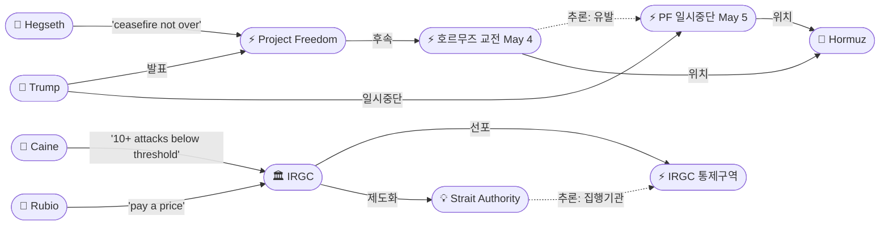
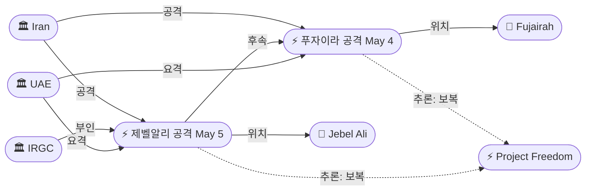

# 2026-05-05 2026 Iran War OSINT 일일 보고서

## 요약

Day 67. 트럼프가 **Project Freedom을 24시간 만에 일시중단**하며 이란과의 딜에 "Great Progress"가 있다고 주장했다. 봉쇄는 유지하되 호송은 중단한 것으로, Day 1 교전(7척 격침, 미사일 교환)의 군사적 비용이 정치적 계산을 변경한 것으로 보인다. 이란은 UAE를 **2일 연속 미사일·드론으로 공격**했고 표적이 푸자이라에서 **제벨알리 항구**(중동 최대)로 확대되었으나, IRGC는 공격을 공식 부인했다. 사우디·카타르·독일·프랑스·영국·EU·인도 등 **4/8 이후 최대 규모의 국제 공동 규탄**이 이어졌다. 아라그치 이란 외무장관은 전쟁 이후 최초로 **베이징을 방문**하여 왕이 외교부장과 회담하고, 이란은 호르무즈 **'Strait Authority'** 통과허가 메커니즘을 발표했다. 펜타곤 브리핑에서 헤그세스는 "ceasefire is not over"라고 선언했고, 케인 합참의장은 이란이 휴전 이후 미군을 10회 이상 공격했으나 "major combat operations 재개 임계값 이하"라고 밝혔다. 유가는 헤그세스 발언에 ~4% 하락(Brent $109.87/WTI $102.27)하여 전일 4년 최고가에서 반락했다.

## 주요 뉴스

### 1. 트럼프, Project Freedom 24시간 만에 일시중단 — "이란 딜 Great Progress", 봉쇄는 유지
- **출처:** [CNBC](https://www.cnbc.com/2026/05/05/trump-iran-deal-project-freedom-hormuz-strait.html)
- **일시:** 2026-05-05
- **내용:** 트럼프가 Truth Social에 "While the Blockade will remain in full force and effect, Project Freedom will be paused for a short period of time to see whether or not the Agreement can be finalized and signed"라고 게시했다. 이란과의 "Complete and Final Agreement"에 "Great Progress"가 있다고 주장했다. 5/3 발표, 5/4 시행, 5/5 일시중단으로 24시간 만에 방향이 전환된 것이다. 약 23,000명의 선원과 87개국 선박이 페르시아만에 여전히 발이 묶여 있다. 봉쇄를 유지하면서 호송만 중단한 것은, Day 1 교전의 군사적 비용(7척 격침·미사일 교환·UAE 공격)을 감수하면서도 외교적 레버리지를 잃지 않으려는 계산으로 해석된다.
- **상태:** 신규
- **관련 엔티티:** Donald Trump, Project Freedom, Project Freedom Pause, Strait of Hormuz, Iran, CENTCOM

### 2. 헤그세스 "휴전은 끝나지 않았다" — 케인: 이란 10회+ 공격, 임계값 이하
- **출처:** [CNBC](https://www.cnbc.com/2026/05/05/iran-war-hegseth-trump-ceasefire-hormuz-strait.html)
- **일시:** 2026-05-05
- **내용:** 피트 헤그세스 국방장관이 펜타곤 기자회견에서 "The ceasefire is not over"라고 선언했다. 댄 케인 합참의장은 4/8 휴전 이후 이란이 상선을 9회 사격하고 컨테이너선 2척을 나포했으며 미군을 10회 이상 공격했으나, 이 모든 것이 "below the threshold of restarting major combat operations"라고 밝혔다. 미 해군은 이란 쾌속정 총 7척을 격침했다. Project Freedom에 약 15,000명의 미군이 투입되었으며, 헤그세스는 작전이 "defensive in nature, focused in scope, and temporary in duration"이라고 정의하고 이후 동맹국에 이관할 것이라고 밝혔다. 민간 선원 10명이 호르무즈 분쟁으로 사망했다. 전쟁 개시 이후 미군 사망 13명, 부상 402명.
- **상태:** 신규
- **관련 엔티티:** Pete Hegseth, Dan Caine, IRGC, US Military, CENTCOM, Project Freedom, Strait of Hormuz, Marco Rubio

### 3. 이란, UAE 2일 연속 공격 — 제벨알리 항구 표적, IRGC "전면 부인"
- **출처:** [Al Jazeera](https://www.aljazeera.com/news/2026/5/5/uae-intercepts-missiles-and-drones-for-second-day)
- **일시:** 2026-05-05
- **내용:** UAE 국방부가 이란으로부터의 미사일·드론 공격이 2일 연속 이어지고 있다고 확인했다. 두바이 주민들이 제벨알리 항구 방향에서 폭발음을 보고했다. 제벨알리는 중동 최대·최다 물동량 항구로, 전일 푸자이라(ADCOP 우회 경로 종점)에 이어 핵심 물류 거점이 표적이 되었다. IRGC는 "have not carried out any missile or drone operations against the UAE in recent days"라며 공격을 공식 부인하고 "absolutely denied and devoid of any truth"이라고 일축했다. 5/5 공격의 구체적 사상자는 확인되지 않았다. UAE 전국 학교의 원격수업은 금요일까지 계속된다.
- **상태:** 신규
- **관련 엔티티:** UAE, Iran, IRGC, Jebel Ali Port, Jebel Ali Attack May 5, Fujairah Drone Attack May 4

### 4. 국제 공동 규탄 — 사우디·카타르·독일·프랑스·영국·EU·인도 등 4/8 이후 최대 대응
- **출처:** [Al Jazeera](https://www.aljazeera.com/news/2026/5/5/dangerous-escalation-world-condemns-iran-after-attacks-on-uae)
- **일시:** 2026-05-05
- **내용:** 이란의 UAE 공격에 대한 국제 규탄이 이어졌다. **사우디:** "가장 강한 용어로 규탄, UAE와 연대 확인." **카타르:** "주권의 명백한 침해, 지역 안보에 대한 심각한 위협." **쿠웨이트:** "혐오스러운 침략, 항행 자유 원칙의 명백한 위반." **바레인:** "위험한 에스컬레이션, UNSC 조치 촉구." **독일 메르츠:** "테헤란은 협상 테이블로 돌아와야." **프랑스 마크롱:** "정당화할 수 없고 수용 불가." **영국 스타머:** "이란은 협상에 진정성 있게 참여해야." **EU 폰데어라이엔:** "수용 불가, 주권과 국제법의 명백한 위반." **인도 모디:** "UAE 공격을 강력히 규탄" (인도인 3명 부상). **캐나다·이슬람세계연맹(MWL)** 등도 규탄에 가세했다.
- **상태:** 신규
- **관련 엔티티:** Iran, UAE, Friedrich Merz, Emmanuel Macron, Keir Starmer, Ursula von der Leyen, Narendra Modi, GCC, Muhammad bin Salman

### 5. 이란 'Strait Authority' 발표 — 호르무즈 통과허가 메커니즘 제도화
- **출처:** [The National](https://www.thenationalnews.com/news/mena/2026/05/05/iran-seeks-chinas-backing-as-hormuz-clashes-push-ceasefire-to-brink/)
- **일시:** 2026-05-05
- **내용:** 이란이 호르무즈 해협 통행을 관리하는 새로운 'Strait Authority'를 발표했다. 선박은 이메일로 이란의 '통행 규정' 통보를 받은 뒤, 프레임워크에 맞춰 통과허가(transit permit)를 발급받아야 한다. 이는 5/3 의회 항행법 → 5/4 IRGC 해상통제구역 → 5/5 Strait Authority로 이어지는 **입법→군사→행정 3단계 제도화의 완결**이다. 아라그치 외무장관은 Project Freedom을 "Project Deadlock"이라 조롱하고, "Events in Hormuz make clear that there's no military solution to a political crisis"라고 밝혔다.
- **상태:** 신규
- **관련 엔티티:** Iran, Iran Strait Authority, Abbas Araghchi, Strait of Hormuz, Project Freedom, IRGC Hormuz Maritime Control Zone

### 6. 아라그치, 전쟁 이후 최초 베이징 방문 — 왕이와 회담, UNSC·제재 지원 요청
- **출처:** [Washington Times](https://www.washingtontimes.com/news/2026/may/5/irans-foreign-minister-travel-china-strait-hormuz-tensions-simmer/)
- **일시:** 2026-05-05
- **내용:** 아라그치 이란 외무장관이 2/28 전쟁 개시 이후 최초로 베이징을 방문하여 왕이 중국 외교부장과 회담했다. 이란은 중국에 (1) 미국의 새 제재에 대한 반대, (2) 긴급 UNSC 회의 소집 지지를 요청했다. 미국은 UNSC 회의 차단 의사를 밝혔다. 중국의 역할은 이란-중국 25년 협력 협정(에너지·인프라·국방) 때문에 핵심적이다. 아라그치의 순방 경로는 러시아(4/27 상트페테르부르크) → 중국(5/5 베이징)으로, 이란의 대미 외교전에서 러시아·중국이라는 **두 개의 UNSC 거부권 축**이 완성되었다.
- **상태:** 신규
- **관련 엔티티:** Abbas Araghchi, Wang Yi, Iran, China, Strait of Hormuz

### 7. 유가 ~4% 하락 — Brent $109.87, WTI $102.27, 헤그세스 발언에 반락
- **출처:** [CNBC](https://www.cnbc.com/2026/05/05/oil-prices-today-wti-brent-iran-war-trump-hormuz.html)
- **일시:** 2026-05-05
- **내용:** 브렌트유가 약 4% 하락하여 $109.87/bbl로 마감, WTI도 약 4% 하락하여 $102.27/bbl. 헤그세스의 "ceasefire is not over" 발언이 전면전 복귀 우려를 완화하며 전일 4년 최고가($114.44/$106.42)에서 반락했다. 그러나 여전히 전쟁 개시(2/28) 대비 약 55% 높은 수준이다. UAE 2차 공격 보도에 장중 $112를 잠시 돌파했으나 펜타곤 브리핑 이후 하락 반전했다.
- **상태:** 신규
- **관련 엔티티:** Strait of Hormuz, Pete Hegseth, Iran, UAE

### 8. Project Freedom 상세 — 15,000명 투입, 민간 선원 10명 사망, 동맹 이관 계획
- **출처:** [Military.com](https://www.military.com/blockade-showdown-us-warships-force-hormuz-open-as-iran-strikes)
- **일시:** 2026-05-05
- **내용:** 펜타곤에 따르면 Project Freedom에 약 15,000명의 미군이 배치되었으며, 지휘관들은 공중·해상 영역에서 위협을 실시간으로 탐지·추적·무력화할 수 있다. 호르무즈 분쟁으로 민간 선원 10명이 사망했다. 헤그세스는 작전을 "방어적, 범위 한정적, 시한부"로 정의하고 이후 다른 국가들에 이관할 것이라고 밝혔으나 구체적 국가를 특정하지 않았다. 한국 동참에 대한 "강력한 희망"도 표명했다.
- **상태:** 신규
- **관련 엔티티:** Project Freedom, Pete Hegseth, US Military, CENTCOM, IRGC, Strait of Hormuz

### 9. 루비오 "이란은 대가를 치러야" + 한국 동참 요청
- **출처:** [Al Jazeera](https://www.aljazeera.com/news/liveblog/2026/5/5/iran-war-live-washington-tehran-trade-threats-over-strait-of-hormuz)
- **일시:** 2026-05-05
- **내용:** 마르코 루비오 국무장관은 이란이 호르무즈 해협을 폐쇄한 것에 "pay a price"를 해야 한다고 경고하고, Operation Epic Fury가 "목표를 달성했다"고 평가했다. 헤그세스는 한국이 Project Freedom 연합에 참여하기를 "강력히 희망한다"고 밝혔다. 이는 Project Freedom을 미국 단독에서 다국적 연합으로 확대하려는 의도를 시사한다.
- **상태:** 신규
- **관련 엔티티:** Marco Rubio, Pete Hegseth, Iran, Project Freedom, Strait of Hormuz

## 지식그래프

### 오늘의 주요 관계
1. **Project Freedom Pause ← 호르무즈 교전:** Day 1 교전의 군사적 비용이 24시간 만에 정치적 계산을 변경.
2. **제벨알리 공격 ← Project Freedom:** 푸자이라→제벨알리 표적 확대, 이란의 UAE 보복 패턴 확립.
3. **Strait Authority ← 이란 항행법 + IRGC 통제구역:** 입법→군사→행정 3단계 호르무즈 제도화 완결.
4. **아라그치-왕이:** 러시아(4/27)→중국(5/5), 이란의 UNSC 거부권 2축 외교 완성.
5. **국제 규탄 → 이란 고립:** 걸프+서방+아시아 동시 규탄으로 이란의 외교적 공간 축소.

### 호르무즈 — 교전에서 일시중단으로



### UAE 전선 — 표적 확대



### 외교 — 이란의 UNSC 거부권 2축

```mermaid
graph LR
    ent-042(["👤 Araghchi"])
    ent-002(["🏛 Iran"])
    ent-280(["👤 Wang Yi"])
    ent-286(["🏛 China"])
    ent-009(["🏛 Russia"])
    ent-211(["👤 Putin"])
    ent-210(["👤 Merz"])
    ent-282(["👤 Macron"])
    ent-283(["👤 Starmer"])
    ent-284(["👤 von der Leyen"])
    ent-285(["👤 Modi"])
    ent-275(["🏛 UAE"])

    ent-042 -->|회담(5/5)| ent-280
    ent-280 -->|소속| ent-286
    ent-042 -->|회담(4/27)| ent-211
    ent-211 -->|소속| ent-009
    ent-002 -->|협력| ent-286
    ent-002 -->|협력| ent-009
    ent-286 -.->|추론: 잠재적 관계| ent-009
    ent-210 -->|규탄| ent-002
    ent-282 -->|규탄| ent-002
    ent-283 -->|규탄| ent-002
    ent-284 -->|규탄| ent-002
    ent-285 -->|규탄| ent-002
```

## 온톨로지 변경
| 변경 유형 | 대상 | 근거 |
|----------|------|------|
| 새 엔티티 | ent-277: Project Freedom Pause | 24시간 만의 방향 전환, 'Great Progress' 시사 (src-827) |
| 새 엔티티 | ent-278: Jebel Ali Attack May 5 | UAE 2차 공격, 표적 확대 (src-829) |
| 새 엔티티 | ent-279: Iran Strait Authority | 호르무즈 통과허가 메커니즘, 입법-군사-행정 3단계 (src-831) |
| 새 엔티티 | ent-280: Wang Yi | 중국 외교부장, 아라그치 회담 (src-832) |
| 새 엔티티 | ent-281: Jebel Ali Port | 중동 최대 항구, 5/5 공격 표적 (src-829) |
| 새 엔티티 | ent-282: Emmanuel Macron | 프랑스 대통령, '정당화 불가' 규탄 (src-830) |
| 새 엔티티 | ent-283: Keir Starmer | 영국 총리, '진정성 있는 참여' 촉구 (src-830) |
| 새 엔티티 | ent-284: Ursula von der Leyen | EU 집행위원장, '주권 위반' 규탄 (src-830) |
| 새 엔티티 | ent-285: Narendra Modi | 인도 총리, '강력히 규탄' (src-830) |
| 새 엔티티 | ent-286: China | 이란 외교 파트너, 25년 협력 협정, UNSC 거부권 (src-832) |

## 추론 결과
| 추론 | 신뢰도 | 근거 |
|------|--------|------|
| PF 일시중단 ← 호르무즈 교전 (인과) | 0.80 | Day 1 교전 강도가 정치적 계산 변경 |
| 제벨알리 공격 ← Project Freedom (보복) | 0.80 | 5/4 푸자이라→5/5 제벨알리, 표적 확대 패턴 |
| Strait Authority ← 이란 항행법 (3단계 완결) | 0.85 | 입법(5/3)→통제구역(5/4)→집행기관(5/5) |
| 중국-러시아 잠재적 이란 지원 동맹 | 0.75 | 양국 모두 UNSC 거부권 + 아라그치 순방 목적지 |
| UAE-US Military 암시적 방위 동맹 | 0.80 | 동일 적(IRGC) 대응, 국제 규탄에서 동일 진영 |

## 분석 및 평가

**"24시간 반전"의 의미.** Day 67의 핵심은 Trump의 Project Freedom 일시중단이다. 5/3 발표→5/4 시행→5/5 중단은 사실상 호르무즈 교전이 트럼프의 예상을 초과했음을 시사한다. 7척 격침과 미사일 교환은 'guide, not escort'라는 제한된 목표에도 본격적 군사 충돌로 격상했고, UAE 2차 공격(제벨알리)은 이란이 호르무즈와 걸프 전역에서 동시 보복할 수 있음을 입증했다. 봉쇄 유지+호송 중단이라는 '절반의 후퇴'는 군사적 비용을 줄이면서 외교적 레버리지(봉쇄)를 유지하려는 계산이다.

**'임계값(threshold)' 개념의 위험성.** 케인 합참의장이 공개한 통계(미군 10회+ 공격, 상선 9회 사격, 2척 나포)는 4/8 이후 '휴전'의 실체를 수치로 보여준다. 그러나 이를 "임계값 이하"로 규정하는 것은 주관적 판단에 의존하며, 이란이 이를 점진적으로 시험할 유인을 제공한다. 민간 선원 10명 사망이라는 인적 비용은 '임계값' 논쟁에서 거의 언급되지 않았다.

**UAE 전선 확대: 푸자이라→제벨알리.** 이란의 공격 표적이 24시간 만에 ADCOP 우회경로 종점(푸자이라)에서 중동 최대 물류허브(제벨알리)로 확대되었다. IRGC의 공식 부인은 "플로시블 디나이어빌리티(plausible deniability)" 전략이거나, 실제로 이란 정규군이 아닌 비공식 행위자가 관여했을 가능성을 모두 내포한다. 어느 쪽이든 이란 정부의 통제력에 대한 의문을 제기한다.

**이란의 3단계 호르무즈 제도화.** 5/3 의회 항행법 → 5/4 IRGC 해상통제구역 → 5/5 Strait Authority라는 입법·군사·행정 3단계가 72시간 만에 완결되었다. 이란은 호르무즈에 대한 주권적 통제를 국내법과 집행기관으로 기정사실화하려 한다. 이는 전후 협상에서 호르무즈 통행권이 핵심 협상 카드가 될 것임을 예고한다.

**이란의 UNSC 거부권 2축 외교.** 아라그치의 러시아(4/27)→중국(5/5) 순방은 UNSC에서 이란을 보호할 두 거부권 국가와의 조율을 완료한 것으로 보인다. 미국이 UNSC 회의 차단을 예고한 상황에서 이란은 중·러를 통해 국제 제재 강화를 저지하고, 국제 규탄의 법적 효력을 무력화하려 한다.

## 추적 항목
| 항목 | 최초 보고 | 상태 | 최신 업데이트 |
|------|----------|------|-------------|
| 미-이란 휴전/협상 | 2026-04-08 | 모순적 존속 | PF 일시중단. 헤그세스 '휴전 유지'. 케인: 10회+ 공격 '임계값 이하'. |
| 호르무즈 이중 봉쇄 | 2026-04-13 | 일시중단/제도화 | PF Day 1 교전→Day 2 중단. Strait Authority 발표. 봉쇄 유지. |
| 이스라엘-레바논 휴전 | 2026-04-16 | 유명무실 | Day 19. 5/17 만료 12일. 베리 협상 거부 유지. |
| UAE 전선 | 2026-05-04 | 확대 | 2차 공격(제벨알리). IRGC 부인. 학교 원격수업 지속. 국제 공동 규탄. |
| WPR 법적 공방 | 2026-04-30 | 교착 | 교전→일시중단 cycle이 WPR 논쟁 복잡화. |
| 유가/경제 영향 | 2026-04-07 | 반락 | Brent $109.87(-4%)/WTI $102.27(-4%). 전일 4년 최고가서 반락. |
| 이란 내부 분열 | 2026-04-17 | 혼재 | Strait Authority 제도화(강경). 아라그치 '군사적 해법 없다'(외교). IRGC UAE 공격 부인. |
| 이란 외교전 | 2026-04-27 | 2축 완성 | 러시아(4/27)→중국(5/5) 순방 완료. UNSC 거부권 조율. |

## 동향 요약
| 분류 | 상태 | 비고 |
|------|------|------|
| 미-이란 협상 | 🟡 모순적 존속 | PF 일시중단 + '딜 진전' 주장. 교전하면서 '임계값 이하'. |
| 호르무즈 해협 | 🟡 일시중단 | PF Day 2 중단. 봉쇄 유지. Strait Authority 제도화. |
| UAE 전선 | 🔴 확대 | 2차 공격(제벨알리). IRGC 부인. 국제 공동 규탄. |
| 이-레 휴전 | 🟡 유명무실 | Day 19. 5/17 만료 12일. |
| 유가 | 🟡 반락 | Brent $109.87(-4%). 휴전 유지 발언에 하락. |
| 국제 외교 | 🔴 양극화 | 국제 규탄(이란 고립) vs 이란 중·러 축 확보. |

## 출처 목록
1. [Trump pauses 'Project Freedom' in Strait of Hormuz, cites Iran deal progress](https://www.cnbc.com/2026/05/05/trump-iran-deal-project-freedom-hormuz-strait.html) - CNBC, 2026-05-05
2. [Hegseth says 'the ceasefire is not over' after U.S., Iran exchange fire](https://www.cnbc.com/2026/05/05/iran-war-hegseth-trump-ceasefire-hormuz-strait.html) - CNBC, 2026-05-05
3. [UAE comes under Iranian attacks for second consecutive day](https://www.aljazeera.com/news/2026/5/5/uae-intercepts-missiles-and-drones-for-second-day) - Al Jazeera, 2026-05-05
4. ['Dangerous escalation': World condemns Iran after attacks on UAE](https://www.aljazeera.com/news/2026/5/5/dangerous-escalation-world-condemns-iran-after-attacks-on-uae) - Al Jazeera, 2026-05-05
5. [Iran says new 'Strait Authority' will manage Hormuz shipping](https://www.thenationalnews.com/news/mena/2026/05/05/iran-seeks-chinas-backing-as-hormuz-clashes-push-ceasefire-to-brink/) - The National, 2026-05-05
6. [Iran's foreign minister to travel to China as Strait of Hormuz tensions simmer](https://www.washingtontimes.com/news/2026/may/5/irans-foreign-minister-travel-china-strait-hormuz-tensions-simmer/) - Washington Times, 2026-05-05
7. [Oil prices fall after U.S. says Iran ceasefire remains in place](https://www.cnbc.com/2026/05/05/oil-prices-today-wti-brent-iran-war-trump-hormuz.html) - CNBC, 2026-05-05
8. [Pentagon Officials Give 'Project Freedom' Update in Strait of Hormuz](https://www.military.com/blockade-showdown-us-warships-force-hormuz-open-as-iran-strikes) - Military.com, 2026-05-05
9. [Iran war live: US says offensive phase over, Tehran won't control Hormuz](https://www.aljazeera.com/news/liveblog/2026/5/5/iran-war-live-washington-tehran-trade-threats-over-strait-of-hormuz) - Al Jazeera, 2026-05-05
10. [Live updates: Trump to pause US effort to guide ships through Strait of Hormuz](https://www.cnn.com/2026/05/05/world/live-news/iran-war-news) - CNN, 2026-05-05
11. [U.S. says the Iran ceasefire holds despite attacks in Hormuz and UAE](https://www.npr.org/2026/05/05/nx-s1-5811770/iran-war-updates) - NPR, 2026-05-05
12. [Iran ceasefire holding for now, Hegseth says (CBS live updates)](https://www.cbsnews.com/live-updates/iran-war-trump-strait-of-hormuz-ships-uae-attacked/) - CBS News, 2026-05-05
13. [UAE on alert; what residents need to know on May 5](https://gulfnews.com/uae/usiran-tensions-escalate-what-uae-residents-need-to-know-on-may-5-1.500529261) - Gulf News, 2026-05-05
14. [Trump pauses 'Project Freedom', citing progress on Iran deal](https://www.nbcnews.com/world/iran/us-iran-war-trump-open-hormuz-attacks-ships-ceasefire-rcna343604) - NBC News, 2026-05-05
15. [Trump Says US to Pause Guiding Ships While Seeking Iran Deal](https://www.bloomberg.com/news/articles/2026-05-05/trump-says-he-will-pause-project-freedom-for-short-period) - Bloomberg, 2026-05-05
16. [Project Freedom paused as Trump cites 'great progress'](https://www.foxnews.com/live-news/trump-iran-project-freedom-strait-hormuz-may-5) - Fox News, 2026-05-05
17. [Trump suspends Hormuz operation, claims progress on Iran deal](https://www.axios.com/2026/05/05/iran-war-trump-hormuz-ships-peace-talks) - Axios, 2026-05-05
18. [US-Iran ceasefire holds despite Hormuz standoff: Pentagon chief Hegseth](https://www.aljazeera.com/news/2026/5/5/us-iran-ceasefire-holds-despite-hormuz-standoff-pentagon-chief-hegseth) - Al Jazeera, 2026-05-05
19. [Pentagon chief Hegseth says ceasefire with Iran holding despite attacks](https://www.washingtontimes.com/news/2026/may/5/pete-hegseth-pentagon-chief-says-ceasefire-iran-holding-despite/) - Washington Times, 2026-05-05
20. ['We have not even begun': Iran warns US after Hormuz attacks](https://time.com/article/2026/05/05/-we-have-not-even-begun-iran-warns-us-after-attacks-in-the-strait-of-hormuz/) - Time, 2026-05-05
21. [US, Iran launch new attacks as they wrestle for control of Gulf waters](https://www.militarytimes.com/news/pentagon-congress/2026/05/05/us-iran-launch-new-attacks-as-they-wrestle-for-control-of-gulf-waters/) - Military Times, 2026-05-05
22. [Iranian Missile and Drone Strikes Target UAE Oil Infrastructure for Second Day](https://legalinsurrection.com/2026/05/iranian-missile-and-drone-strikes-target-uae-oil-infrastructure-for-second-day/) - Legal Insurrection, 2026-05-05
23. [Iran fires missiles and drones at UAE – Gulf strike](https://www.israelhayom.com/2026/05/05/ran-missiles-drones-uae-gulf-ceasefire) - Israel Hayom, 2026-05-05
24. [World condemns Iranian terrorist attacks on UAE](https://www.gulftoday.ae/news/2026/05/05/world-condemns-iranian-terrorist-attacks-on-uae) - Gulf Today, 2026-05-05
25. [Oil pulls back after hitting a 2026 high on day one of Trump's plan](https://www.cnn.com/2026/05/05/energy/oil-price-highest-in-2026-intl-hnk) - CNN, 2026-05-05
26. [U.S. mission to reopen Strait of Hormuz will be temporary, Hegseth says](https://www.washingtonpost.com/world/2026/05/05/hegseth-briefing-iran-strait-hormuz-ceasefire/) - Washington Post, 2026-05-05
27. [US Army says 'Project Freedom' in blockaded Hormuz has 'just begun'](https://www.aljazeera.com/news/2026/5/5/centcom-says-project-freedom-has-just-2) - Al Jazeera, 2026-05-05
28. [호르무즈 교전에 '휴전 붕괴' 위기…美·이란 긴장 다시 악화](https://www.newspim.com/news/view/20260505000055) - 뉴스핌, 2026-05-05
29. [美 국방 "韓, 호르무즈 '프로젝트 프리덤' 동참 강력 희망"](https://www.news1.kr/world/usa-canada/6157459) - 뉴스1, 2026-05-05
30. [트럼프 '프로젝트 프리덤'에 소규모 교전 재개…27일 만에 휴전 깨질 위기](https://www.huffingtonpost.kr/article/256998) - 허프포스트, 2026-05-05
31. [중동긴장 다시 악화…美·이란 호르무즈 교전에 휴전 붕괴 위기](https://www.fnnews.com/news/202605050934273286) - 파이낸셜뉴스, 2026-05-05
32. [휴전 붕괴 위기 속 이란 외무 '군사적 해결책 없어' 美에 경고](https://www.fnnews.com/news/202605050928583592) - 파이낸셜뉴스, 2026-05-05
33. [美 '이란과 휴전 계속'…트럼프도 '끝나면 알려주겠다'](https://www.fnnews.com/news/202605060427305057) - 파이낸셜뉴스, 2026-05-05
